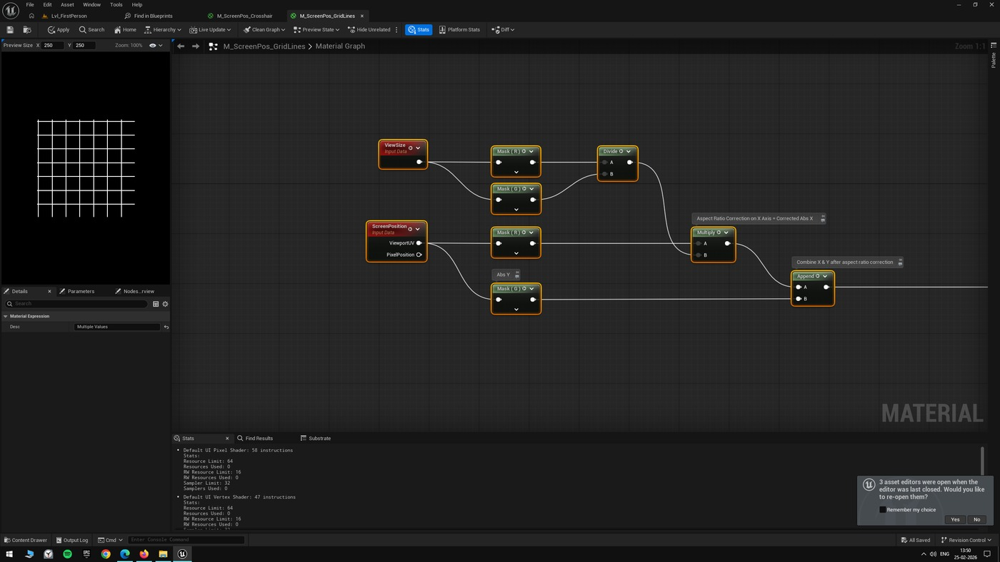
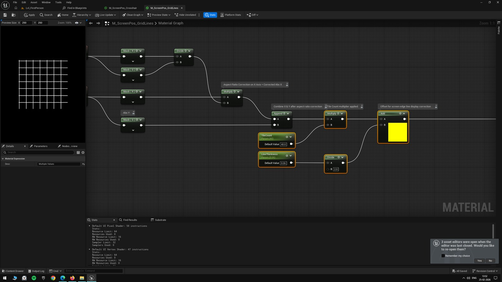
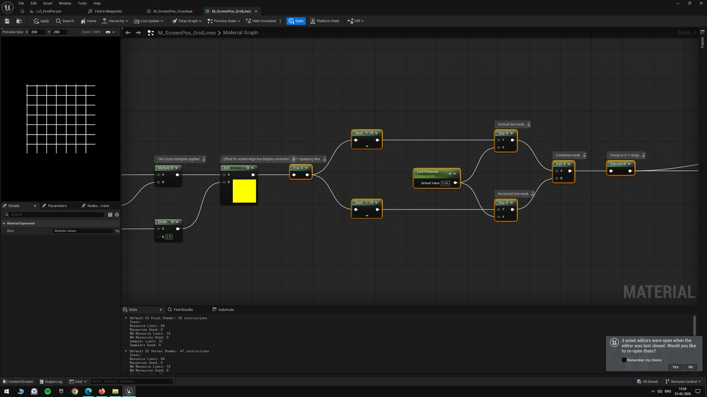
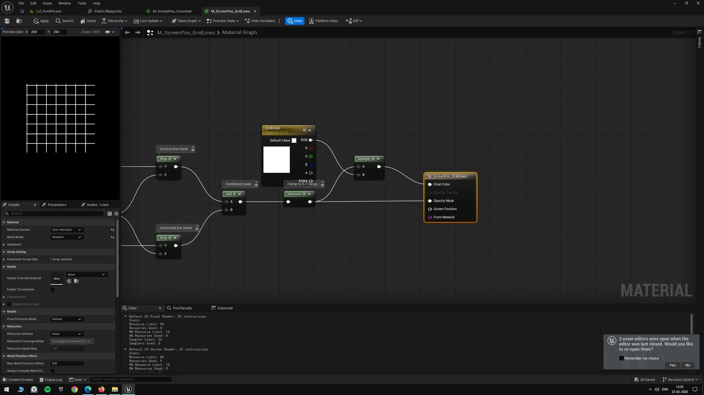
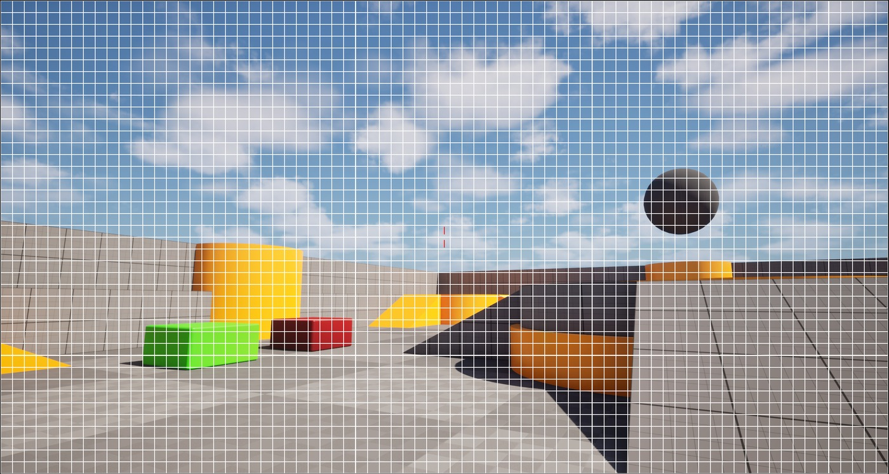

# 虚幻引擎教程：在不使用纹理的情况下在屏幕空间上创建网格线图案

## 来源与状态

- 原始 URL：https://dev.epicgames.com/community/learning/tutorials/M4Kq/unreal-engine-tutorial-creating-a-grid-lines-pattern-on-screen-space-without-using-textures

## 运行时分类

- 类型：图文教程
- 判断：运行时未识别到核心视频信号，可整理正文约 2270 字符。

## 摘要

使用虚幻引擎中的材质在屏幕空间上创建网格线图案的教程

## 中文整理

### 概览

继续屏幕位置实验，此实验探索完全通过材质图创建全屏网格图案，而不使用任何纹理。

网格是通过平铺屏幕空间并定期绘制线条来构建的。

该材料通过 UMG 小部件显示为全屏覆盖。

我们首先获取屏幕位置视口 UV 并应用纵横比校正。

ViewSize 节点为我们提供了屏幕宽度和高度，我们将其除以得到宽高比。

然后，我们将屏幕位置的 X 分量乘以该比率，以确保网格图块保持正方形而不是矩形。

校正后的 X 和 Y 分量被组合并乘以 TileCount 参数。

这扩展了 0-1 屏幕范围，因此可以将其分为重复部分。

在应用平铺操作之前，我们添加一半的线粗以稍微移动整个网格。

这可以防止边缘线在屏幕边界处被切断，从而保持它们完全可见。

Frac 节点仅返回值的小数部分，丢弃整数。

这会将每个整数的图案重置为 0，从而在屏幕上创建重复的平铺图案。

对于垂直线，我们在平铺的 X 值上使用 Step 节点。

当该值小于线条粗细时，Step 返回 1，在每个图块的开头绘制一条垂直线。

水平线对平铺的 Y 值使用相同的逻辑，在每个平铺的开头绘制一条水平线。

我们将两个线条蒙版添加在一起并进行“饱和”以将值限制在 0-1 范围内，将它们组合成最终的网格图案。

网格蒙版与颜色参数相乘并连接到自发光颜色，而蒙版本身则连接到不透明蒙版。

由于我们通过 UI 显示网格，因此材质域设置为“用户界面”，混合模式设置为“蒙版”。

我们将此材质分配给 HUD 中充满整个屏幕的图像小部件。

结果是一个干净的网格覆盖，可以通过 TileCount 和 LineThickness 参数进行调整，如下面的屏幕截图所示。

此实验和其他屏幕位置实验的项目文件可在 Github 上找到：https://github.com/RohitKotiveetil/UnrealEngine--ScreenPositionExperiments - 材料

## 相关链接

- [https://github.com/RohitKotiveetil/UnrealEngine--ScreenPositionExperiments](https://github.com/RohitKotiveetil/UnrealEngine--ScreenPositionExperiments)

