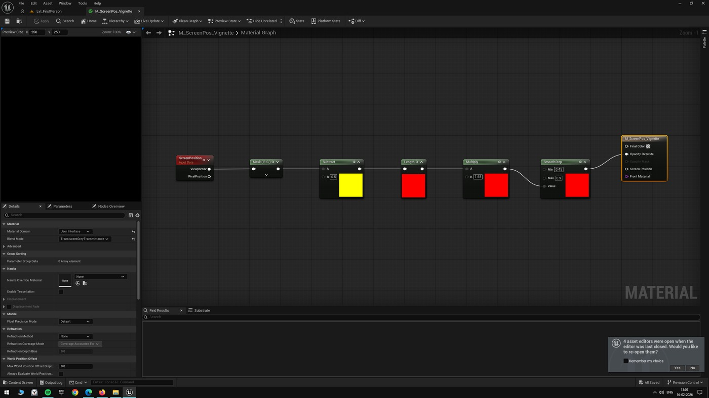
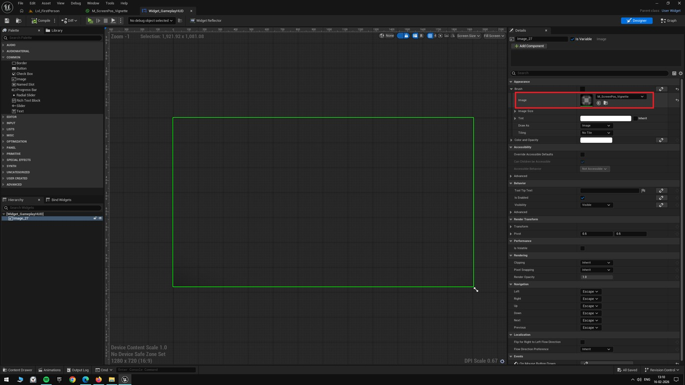
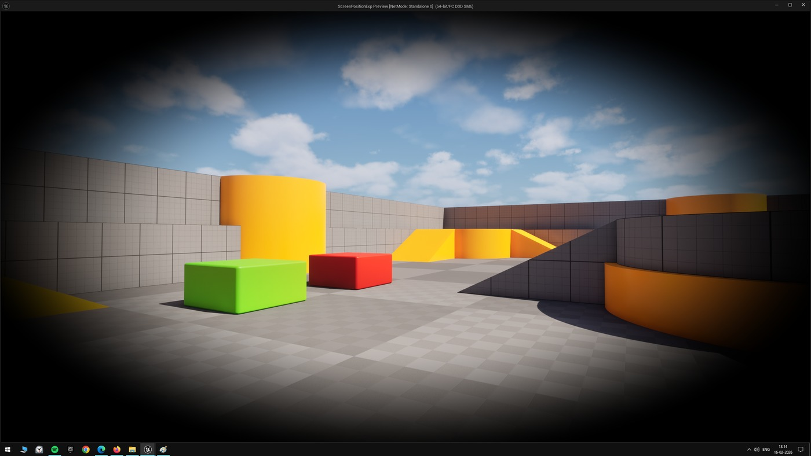

# 虚幻引擎教程：创建晕影效果材质

## 来源与状态

- 原始 URL：https://dev.epicgames.com/community/learning/tutorials/0549/unreal-engine-tutorial-creating-a-vignette-effect-material

## 运行时分类

- 类型：图文教程
- 判断：运行时未识别到核心视频信号，可整理正文约 1706 字符。

## 摘要

创建晕影效果材质的教程

## 中文整理

### 概览

我一直在通过围绕屏幕位置节点构建一组小实验来学习它。

目标是了解它的工作原理，同时探索屏幕空间效果可以创建的可能性。

我将实验保留在一个项目中，并将随着新想法的出现而扩展它。

项目文件位于 Github 上，任何感兴趣的人都可以使用。

https://github.com/RohitKotiveetil/UnrealEngine--ScreenPositionExperiments 屏幕位置节点提供屏幕上当前像素的位置作为标准化坐标。

它的作用就像一个始终与视口匹配的 2D 网格，因此无论世界上发生什么，相同的材质逻辑都会一致地工作。

晕影是一种向边缘变强、向中心变弱的值。

在屏幕空间中，我们从屏幕位置开始，将其移动以使中心变为零，然后向外测量距离。

要在材质中创建此效果，屏幕位置节点将通过遮罩 R、G 来隔离视口坐标。

然后我们从两个分量中减去 0.5 以将其居中，这样屏幕的中间就变成了 (0, 0)。

取该结果的长度给出径向渐变，其中值在中心较小而在拐角处较大。

然后，渐变会被乘以调整晕影从中心延伸的距离，并通过 Smoothstep 来控制淡入淡出的开始位置以及过渡的柔和程度。

由于我们通过 UMG 图像小部件驱动晕影效果，因此材质域设置为用户界面，混合模式设置为 TranslucentGreyTransmittance。

最后，我们将此材质分配给游戏 HUD 中的图像小部件以创建晕影效果。

- 材料

## 相关链接

- [https://github.com/RohitKotiveetil/UnrealEngine--ScreenPositionExperiments](https://github.com/RohitKotiveetil/UnrealEngine--ScreenPositionExperiments)

