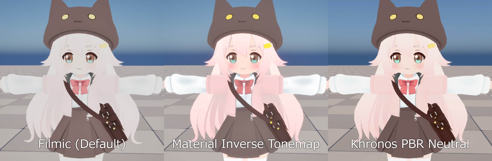
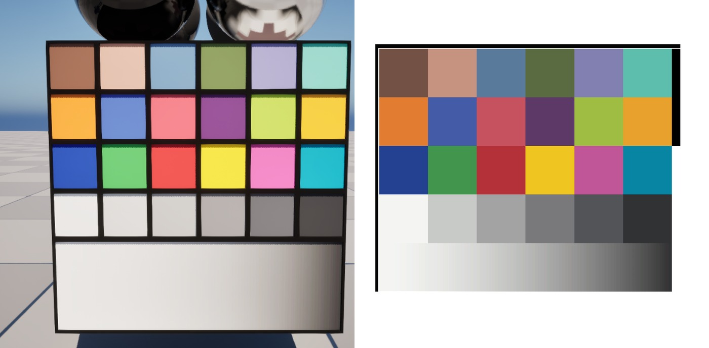
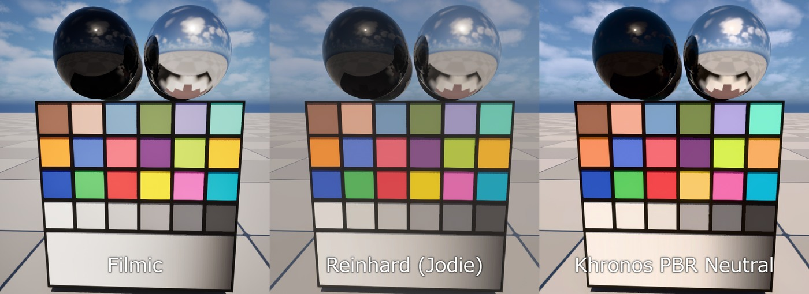
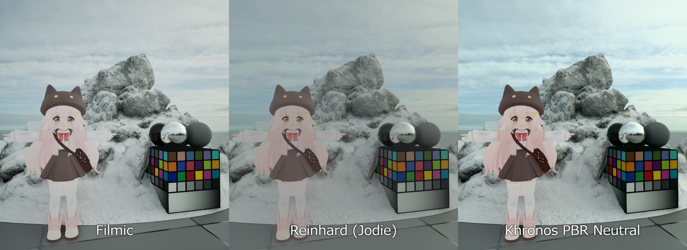

# 在 UE5 中使用 Khronos PBR Neutral 作为自定义替换色调映射器

## 来源与状态

- 原始 URL：https://dev.epicgames.com/community/learning/tutorials/pYEM/unreal-engine-using-khronos-pbr-neutral-as-a-custom-replace-tonemapper-in-ue5
- 原始文件：unreal-engine-using-khronos-pbr-neutral-as-a-custom-replace-tonemapper-in-ue5.origin.md
- 分段：第 1/4 段

- 原始 URL：https://dev.epicgames.com/community/learning/tutorials/pYEM/unreal-engine-using-khronos-pbr-neutral-as-a-custom-replace-tonemapper-in-ue5

## 运行时分类

- 类型：图文教程
- 判断：运行时未识别到核心视频信号，可整理正文约 14206 字符。

## 摘要

本教程展示了一个仅节点 UE5 后期处理材质，它用 Khronos PBR Neutral 替换了默认的 Filmic 色调映射器。它针对的是项目...

## 中文整理

### 概览

这是一个非官方教程，用于在虚幻引擎 5 中使用后处理材质并替换色调映射器来实现 Khronos PBR 中性色调映射器。

### 本教程涵盖的内容

本教程解释： - 1. 为什么我在 UE5 中尝试 Khronos PBR Neutral 1. 为什么我在 UE5 中尝试 Khronos PBR Neutral - 2. 它与 Unreal 的默认 Filmic 色调映射器如何比较 2. 它与 Unreal 的默认 Filmic 色调映射器如何比较 - 3. 它与材质级逆色调映射方法如何比较 3. 它与材质级逆色调映射方法如何比较 - 4.使用 Replace Tonemapper 时发生的变化 4. 使用 Replace Tonemapper 时发生的变化 - 5. 如何手动处理 Bloom、Exposure 和 sRGB 输出 5. 如何手动处理 Bloom、Exposure 和 sRGB 输出 - 6. 当前不起作用的内容，例如正常颜色分级路径 6. 当前不起作用的内容，例如正常颜色分级路径 - 7. 如何仅使用材质编辑器节点设置图形 7. 如何设置仅使用材质编辑器节点绘制图表

### 为什么要使用另一个色调映射器？

虚幻引擎的默认电影色调映射器专为电影图像响应而设计。它对于现实场景非常有用，因为它可以压缩 HDR 值，优雅地处理明亮的高光，并赋予图像摄影般的外观。 Epic 的文档将色调映射描述为将 HDR 场景颜色映射到显示器可以输出的较低动态范围的过程。然而，这种电影响应并不总是适合风格化渲染。当使用动漫风格或卡通着色资源时，艺术家通常希望颜色保持接近创作的纹理或材质颜色。使用默认的 Filmic 色调映射器，饱和的颜色可能会变得不那么鲜艳，而明亮的颜色往往会趋向于白色。这种行为对于真实的相机响应来说可能是理想的，但它也可能使风格化的资产感觉被冲淡或与预期的调色板不同。

### 为什么 Khronos PBR 中立？

Khronos PBR Neutral 是专为 PBR 颜色准确性而设计的色调映射器。 Khronos 存储库将其描述为色调映射器，旨在生成在灰度照明下尽可能忠实地匹配输入 sRGB 基色的 sRGB 输出颜色，特别是对于产品摄影风格用例。 https://github.com/KhronosGroup/ToneMapping 官方规范使用一小组固定参数，包括 F90 = 0.04、高光压缩从 0.8 - F90 左右开始，以及高光去饱和度术语。输出仍然是线性 Rec.709，但压缩到 [0, 1] 范围内。在实践中，这意味着： - 更加电影化 更加电影化 - 更强的高光滚降 更强的高光滚降 - 更多颜色变化 更多颜色变化 - 饱和颜色可能会变得不太饱和或趋向白色 饱和颜色可能会变得不太饱和或趋向白色 Reinhard： - 简单且风格化友好 简单且风格化友好 - 通常适合平面/动漫般的颜色 通常适合平面/动漫般的颜色 - 但对于 PBR 背景和镜面高光来说可能感觉太简单 但也感觉太简单简单，适用于 PBR 背景和镜面高光 Khronos PBR 中性： - 比 Filmic 更保色 比 Filmic 更保色 - 比非常简单的 Reinhard 曲线更加 PBR 友好 比非常简单的 Reinhard 曲线更加 PBR 友好 - 当风格化角色和 PBR 环境需要共存时有用

当风格化角色和 PBR 环境需要共存时有用

### 为什么这对于动漫风格的角色 + PBR 背景很有用

许多风格化的项目并不是纯粹的平面阴影。常见的目标外观是： - 动漫风格角色 动漫风格角色 - 干净的创作色彩 干净的创作色彩 - PBR 背景 PBR 背景 - 物理照明 物理照明 - 天空、反射、光晕和镜面高光 天空、反射、光晕和镜面高光 对于此类场景，两个目标之间存在紧张关系。您希望角色颜色保持干净且有意为之，但您也希望环境与 PBR 照明保持兼容。一个非常简单的色调映射器可以帮助角色，但可能会使 PBR 背景感觉不太自然。默认的 Filmic 色调映射器可以使背景看起来不错，但可能会过度改变角色颜色。 Khronos PBR Neutral 是一个很好的中间立场。它不会产生与 Filmic 相同的电影图像，但它使颜色更接近创作的材质值，同时仍然压缩 HDR 高光。

### 与材质级逆色调贴图方法的比较

在替换色调映射器之前，风格化材质的常见解决方法是在材质内使用反向色调映射函数。这个想法很简单： - 材质颜色被预先补偿 材质颜色被预先补偿 - 仍然应用虚幻的默认色调映射器 仍然应用虚幻的默认色调映射器 - 最终显示的颜色变得更接近所需的颜色 最终显示的颜色变得更接近所需的颜色 这非常有用，特别是对于单个风格化的对象或角色。然而，它解决了与替换色调映射器不同的问题。

### 材质中的反向色调贴图

当您想要保留特定资源的颜色同时保持虚幻的正常后处理流程时，材质级反向色调贴图方法通常是最佳选择。 Good points: - Works per material Works per material - Keeps Unreal’s normal tonemapper Keeps Unreal’s normal tonemapper - Bloom, exposure, color grading, and post-process settings can remain available Bloom, exposure, color grading, and post-process settings can remain available - Easy to apply only to stylized characters or UI-like materials Easy to apply only to stylized characters or UI-like materials - Does not require replacing the whole scene tonemapper Does not require replacing the whole scene色调映射器局限性： - 这是一种补偿技巧，而不是新的全局显示变换 这是一种补偿技巧，
