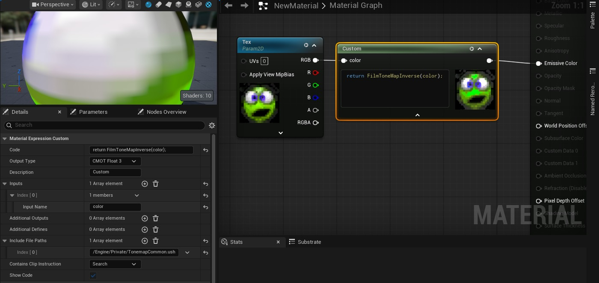
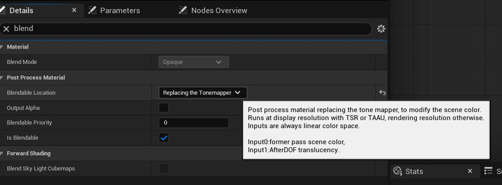
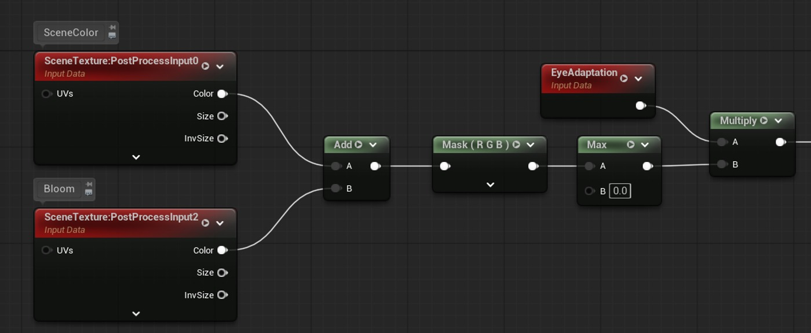
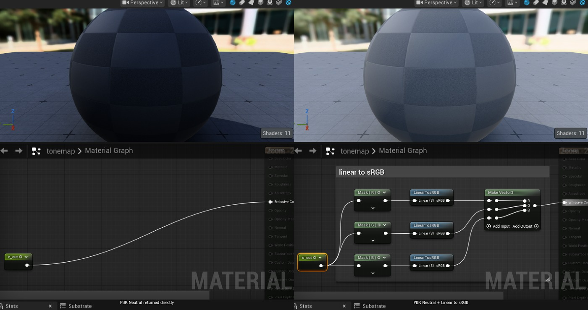

# 在 UE5 中使用 Khronos PBR Neutral 作为自定义替换色调映射器（续 2）

## 来源与状态

- 原始 URL：https://dev.epicgames.com/community/learning/tutorials/pYEM/unreal-engine-using-khronos-pbr-neutral-as-a-custom-replace-tonemapper-in-ue5
- 原始文件：unreal-engine-using-khronos-pbr-neutral-as-a-custom-replace-tonemapper-in-ue5.origin.md
- 分段：第 2/4 段

而不是新的全局显示变换 - 跨多种材质的管理可能会变得更加困难 跨多种材质的管理可能会变得更加困难 - 它可能与物理照明的 PBR 表面表现不一致 它可能与物理照明的 PBR 表面表现不一致 - 很难与反射、光晕、雾、半透明和背景保持平衡 很难与反射、光晕、雾、半透明和背景保持平衡 -整个场景最终仍由 Filmic 塑造 整个场景最终仍由 Filmic 塑造

### Khronos PBR Neutral 作为替换色调映射器

本教程中的 PBR 中性方法有所不同。

我们没有在默认的 Filmic 色调映射器之前校正单个材质，而是替换了整个场景的色调映射器。

这意味着整个渲染场景使用相同的显示变换。

- 整个场景使用一个一致的色调映射器 整个场景使用一个一致的色调映射器 - 风格化资源和 PBR 背景一起评估 风格化资源和 PBR 背景一起评估 - 无需向每种材质添加反向色调映射校正 无需向每种材质添加反向色调映射校正 - 比色图表和创作调色板更可预测的颜色行为 比色图表和创作调色板更可预测的颜色行为 - 比非常简单的纯风格化色调映射器更好的 PBR 兼容性 更好PBR 兼容性比非常简单的仅风格化色调映射器 - 您必须手动处理曝光 您必须手动处理曝光 - 您必须手动处理光溢出 您必须手动处理光溢出 - 正常 UE 颜色分级不再以通常方式可用 正常 UE 颜色分级不再以通常方式可用 - 结果将与虚幻的默认电影外观不匹配 结果将与虚幻的默认电影外观不匹配 - 项目范围采用需要测试 项目范围采用需要测试 方法 |最适合 |主要优势 |主要缺点 默认电影 |电影 PBR 场景 |强烈的摄影效果|可以改变风格化颜色材质逆色调图 |特定风格化材料 |保持正常的UE后期处理|每种材质的解决方法 Reinhard/简单色调贴图 |平面/风格化渲染 |轻松、柔和的响应 |对于 PBR 背景通常较弱 Khronos PBR Neutral Replace Tonemapper |风格化+PBR混合场景|保色且 PBR 友好

|高光溢出/曝光/sRGB 必须手动处理 最佳效果 主要优点 主要缺点 默认电影电影 PBR 场景 强烈的摄影效果 可以移动测针

zed 颜色 材质 逆色调图 特定风格化材质 保持正常的 UE 后期处理 每个材质的解决方法 Reinhard/简单色调图 平面/风格化渲染 简单、柔和的响应 PBR 背景通常很弱 Khronos PBR 中性 替换色调映射器 风格化 + PBR 混合场景 颜色保留和 PBR 友好 Bloom/曝光/sRGB 必须手动处理

### UE5 后处理材质设置

创建一个新材质并设置： - 材质域：后处理 材质域：后处理 - 可混合位置：替换色调映射器 可混合位置：替换色调映射器 - 输出：自发光颜色 输出：自发光颜色 对于此可混合位置，PostProcessInput0 提供 HDR 场景颜色，PostProcessInput2 提供光晕输入。 https://dev.epicgames.com/documentation/unreal-engine/post-process-materials-in-unreal-engine

### 重要警告：您替换的不仅仅是曲线

当使用替换色调映射器时，材质并不是简单地添加到正常的虚幻色调映射器之后。您对最终图像的形成负责。这意味着必须手动处理以下内容： - 曝光 曝光 - 最终 sRGB 输出转换 最终 sRGB 输出转换 - 可选饱和度/对比度控制 可选饱和度/对比度控制 - 可选自定义颜色分级 可选自定义颜色分级 - 可选色温 可选色温 以下内容不应正常工作： - 默认胶片颜色分级 默认胶片颜色分级 - 默认胶片控制 默认胶片控制 - 局部曝光 局部曝光 - 后期处理体积颜色分级 LUT 行为 后期处理体积颜色对 LUT 行为进行分级

### Khronos PBR 中性节点实施

Khronos PBR Neutral 实施非常紧凑。官方自述文件提供了完整的数学定义，并且可以直接将其复制为材质编辑器节点。 https://github.com/KhronosGroup/ToneMapping/blob/main/PBR_Neutral/README.md 节点图概述：

### 绽放处理

更换色调映射器后，光晕不会以与默认路径相同的方式自动出现在最终图像中。使用：PostProcessInput2 = Bloom 应在色调映射之前添加绽放：SceneColor + Bloom * BloomStrength → 曝光 → PBR Neutral 不要在色调映射器之后添加绽放。色调映射是非线性的，因此顺序很重要。

### 曝光处理

曝光也需要手动处理。使用 EyeAdaptation 材质节点并将其与 PBR Neutral 之前的 HDR 颜色相乘。推荐节点流程：

### sRGB 输出处理

这是很容易错过的一步。 Khronos PBR Neutral 输出在 [0, 1] 范围内是线性 Rec.709。在此 UE5 Replace Tonemapper 材质中，结果看起来不正确，直到我在最后添加了 Linear 到 sRGB 转换。如果没有此步骤，图像可能看起来太暗，并且可能类似于简单的莱因哈德式结果。最终流程：PBR Neutral 输出 → 线性到 sRGB 节点组 → Emissive Color

### 颜色分级限制

当将此材质用作替换色调映射器时，通常的虚幻颜色分级路径不应正常工作。默认颜色分级和电影色调映射器是虚幻正常后处理图像形成路径的一部分。当色调映射器被替换时，自定义材质将负责最终的图像输出。在此设置中，如果您需要颜色分级，您应该在 PBR Neutral 之后自行实现。

### 关于 Engine.FilmWhitePoint、Engine.FilmSaturation 和 Engine.FilmContrast
