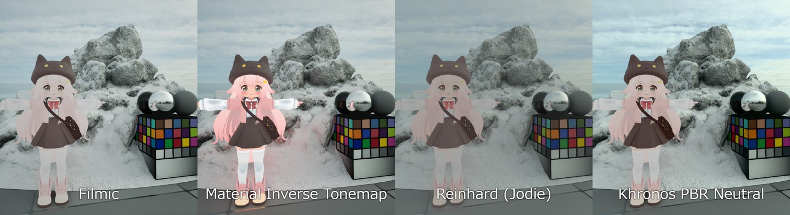

# 在 UE5 中使用 Khronos PBR Neutral 作为自定义替换色调映射器（续 3）

## 来源与状态

- 原始 URL：https://dev.epicgames.com/community/learning/tutorials/pYEM/unreal-engine-using-khronos-pbr-neutral-as-a-custom-replace-tonemapper-in-ue5
- 原始文件：unreal-engine-using-khronos-pbr-neutral-as-a-custom-replace-tonemapper-in-ue5.origin.md
- 分段：第 3/4 段

一些虚幻文档仍然提到替换色调映射器路径的特殊参数： Engine.FilmWhitePoint Engine.FilmSaturation Engine.FilmContrast 这些在 UE4.27 时代 BL_REPLACING_TONEMAPPER 的 API 文档中也可见，其中 Input2 被描述为 BloomOutput，Engine.FilmWhitePoint、Engine.FilmSaturation 和 Engine.FilmContrast 列为参数。 https://dev.epicgames.com/documentation/unreal-engine/post-process-materials-in-unreal-engine 但是，在我的 UE5.7 测试环境中，我无法按照文档暗示的方式从后期处理材质访问这些参数。因此，本教程不依赖它们。

### 实际比较：我应该使用哪种方法？

在以下情况下使用材质逆色调贴图： - 您只需修复特定的风格化材质。您只需要修复特定的风格化材料。 - 您想要保留虚幻引擎的默认电影色调映射器。您想要保留虚幻引擎的默认电影色调映射器。 - 您仍然需要正常的颜色分级和后期处理控制。您仍然需要正常的颜色分级和后期处理控制。 - 您不想替换整个场景色调映射器。您不想替换整个场景色调映射器。 - 您主要处理角色、类似 UI 的材质或独立的风格化资产。您主要处理角色、类似 UI 的材质或独立的风格化资产。在以下情况下使用 Khronos PBR Neutral Replace Tonemapper： - 您希望整个场景使用更中性的色调响应。您希望整个场景使用更中性的色调响应。 - 您想要比 Filmic 更少的色彩偏移。您想要比 Filmic 更少的色偏。 - 您正在将风格化的角色与 PBR 背景混合在一起。您正在将风格化的角色与 PBR 背景混合在一起。 - 您想要比非常简单的莱因哈德式曲线更好的 PBR 行为。您想要比非常简单的莱因哈德式曲线更好的 PBR 行为。 - 您愿意手动处理光溢出、曝光和输出转换。您愿意手动处理光溢出、曝光和输出转换。

### 结果

使用默认的电影色调映射器，场景往往看起来更具电影感，但风格化的颜色可能会发生变化或失去饱和度。通过材质级反向色调贴图，特定材质可以保持其预期颜色，而场景的其余部分继续使用虚幻的普通电影管道。使用 Khronos PBR Neutral 作为替换色调映射器，整个场景使用更中性、保色的色调响应。这非常适合结合动漫风格角色、创作调色板和 PBR 环境的项目。代价是此方法需要更多责任： - 您必须处理Bloom。你必须处理绽放。 - 你必须处理暴露问题。你必须处理曝光问题。 - 您必须处理 sRGB 输出。您必须处理 sRGB 输出。 ...

### 许可说明

### 制作人员

## 相关链接
