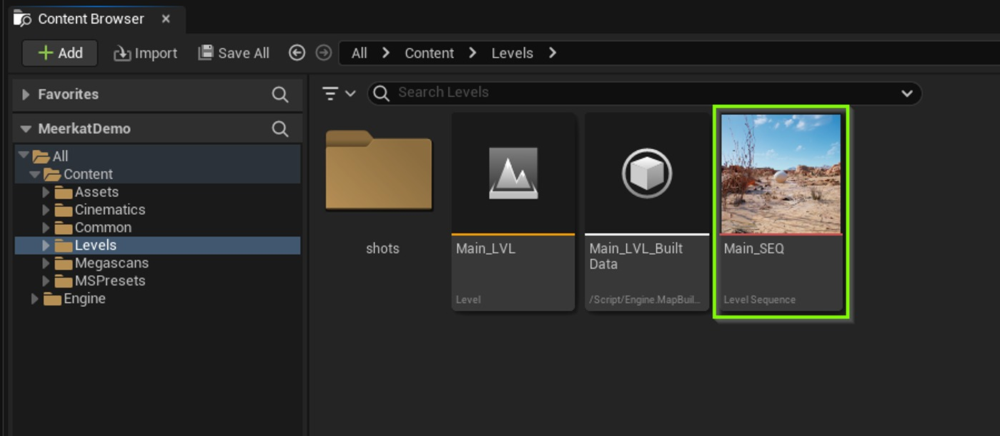
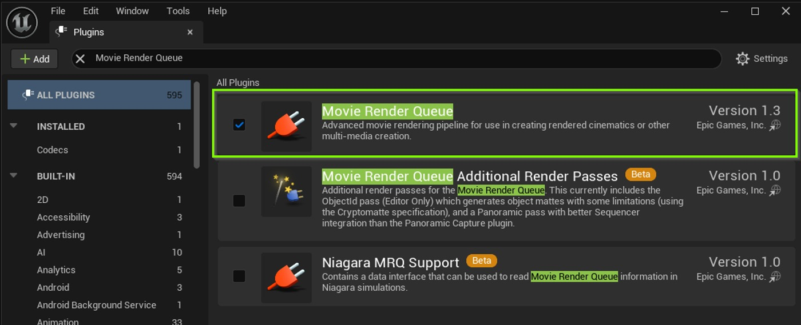
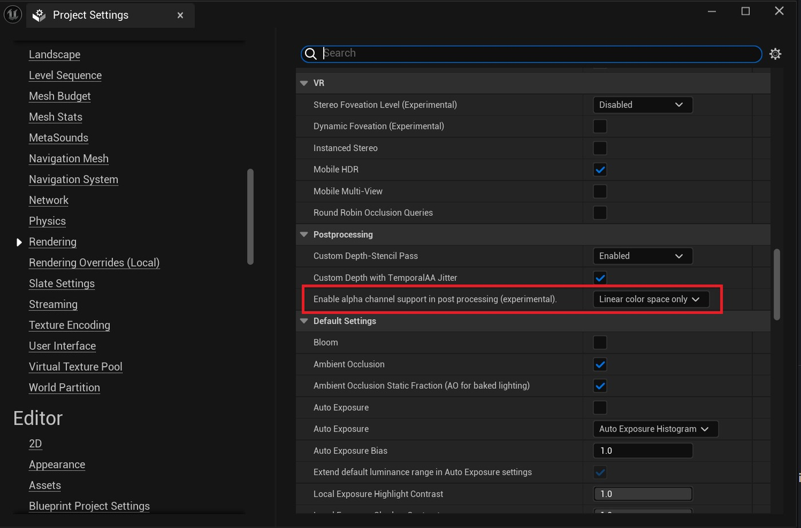
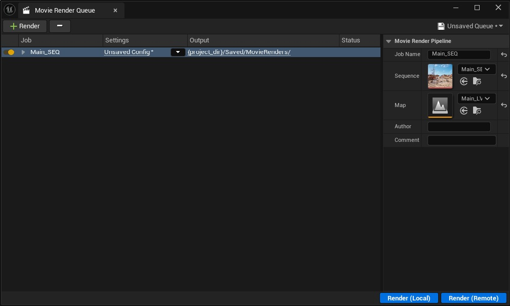
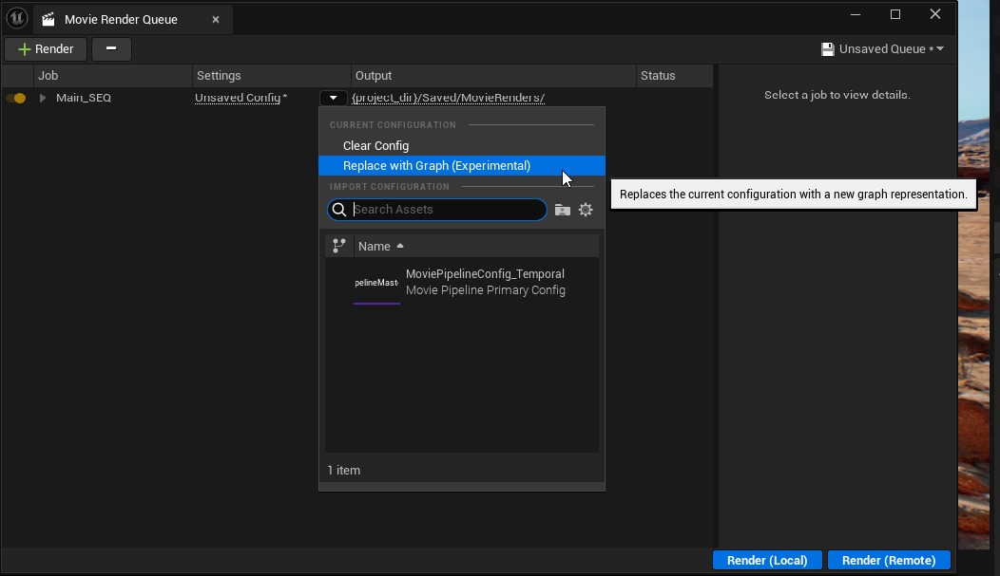
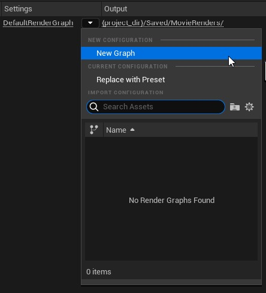
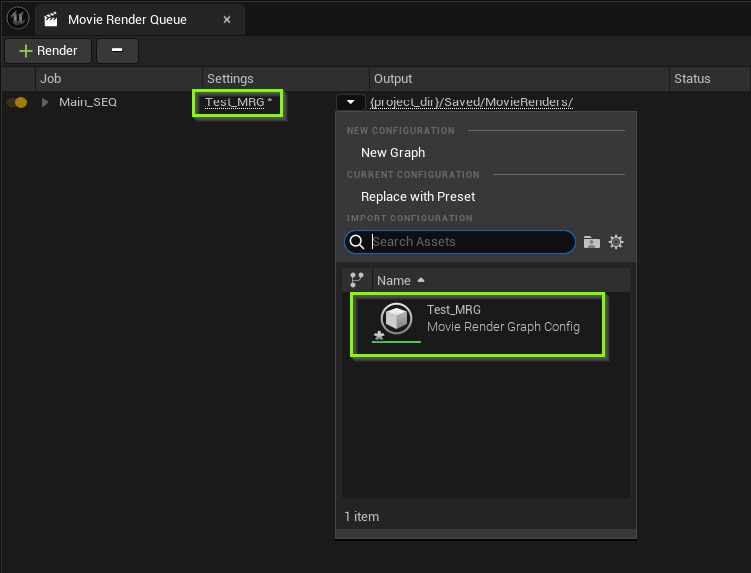
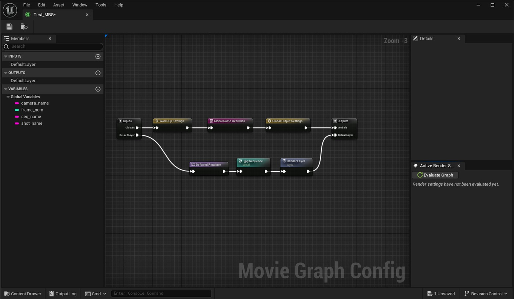

# 使用影片渲染图

## 来源与状态

- 原始 URL：https://dev.epicgames.com/community/learning/courses/5JE/unreal-engine-using-movie-render-graph

## 运行时分类

- 类型：图文教程
- 判断：运行时未识别到核心视频信号，可整理正文约 2724 字符。

## 摘要

了解虚幻引擎中新的影片渲染图功能。

## 中文整理

### MRG：简介

探索 5.4 中新的电影渲染图。创建电影渲染图 (MRG) 的目的是为用户提供基于节点的系统来管理渲染设置，同时使用电影渲染队列 (MRQ) 创建高质量的图像序列和电影渲染。这些图表可以根据需要简单或复杂，以满足小型和大型团队的需求。这些图表可以设置为渲染单个镜头，也可以设计为在复杂的多镜头工作流程中横向扩展。这些图表可以修改并保存为可重复使用的资产，从而为生产管道带来更大的灵活性。 MRQ 的旧预设系统可以与新的 MRG 互换使用。

### 先决条件

- 在继续操作之前，建议先熟悉这两个影片渲染队列文档页面： 影片渲染队列 渲染设置 在继续操作之前，建议先熟悉这两个影片渲染队列文档页面： - 影片渲染队列 影片渲染队列 - 渲染设置 渲染设置 - 具有要渲染的关卡序列的项目。 Meerkat Demo 中的 Main_Seq Level Sequence 可以作为示例。具有要渲染的关卡序列的项目。 Meerkat Demo 中的 Main_Seq Level Sequence 可以作为示例。

### 插件和设置

### 电影渲染队列插件

启用影片渲染队列插件（编辑 > 插件 > 影片渲染队列）。重新启动编辑器。

### Alpha 通道项目支持

在“项目设置”中，通常建议将“在后处理中启用 alpha 通道支持”设置为“仅线性色彩空间”，但您应该选择最适合您的项目的选项。但是，当使用可见性和保留修改器参数时，无法禁用渲染层在输出图像中具有 Alpha 通道。

### 打开影片渲染图

影片渲染图可通过影片渲染队列访问，可以通过两种不同的方式打开。 - 通过虚幻引擎主工具栏，导航至“窗口”>“电影学”>“影片渲染队列”。通过虚幻引擎主工具栏，导航至“窗口”>“电影学”>“影片渲染队列”。 - 通过 Sequencer，使用“渲染影片”图标旁边的垂直省略号来展开“渲染影片选项”。选择“影片渲染队列”，然后单击“渲染影片”按钮。通过 Sequencer，使用“渲染影片”图标旁边的垂直省略号来展开“渲染影片选项”。选择“影片渲染队列”，然后单击“渲染影片”按钮。这将打开“影片渲染队列”窗口。单击“设置”列中的箭头，然后选择“替换为图表”（实验）。再次单击箭头并选择“新建图表”。在出现的“资源另存为”窗口中命名并保存图形。它现在将显示在“影片渲染队列设置”列中并列为图形资源。单击“设置”列中的图表将其打开。 - 渲染 - 虚拟制作 - 电影渲染图

## 相关链接

- 未识别到明确相关链接。

