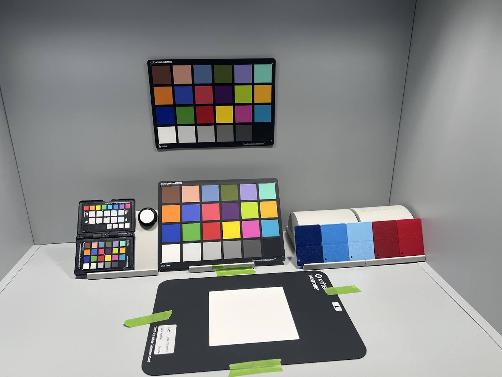
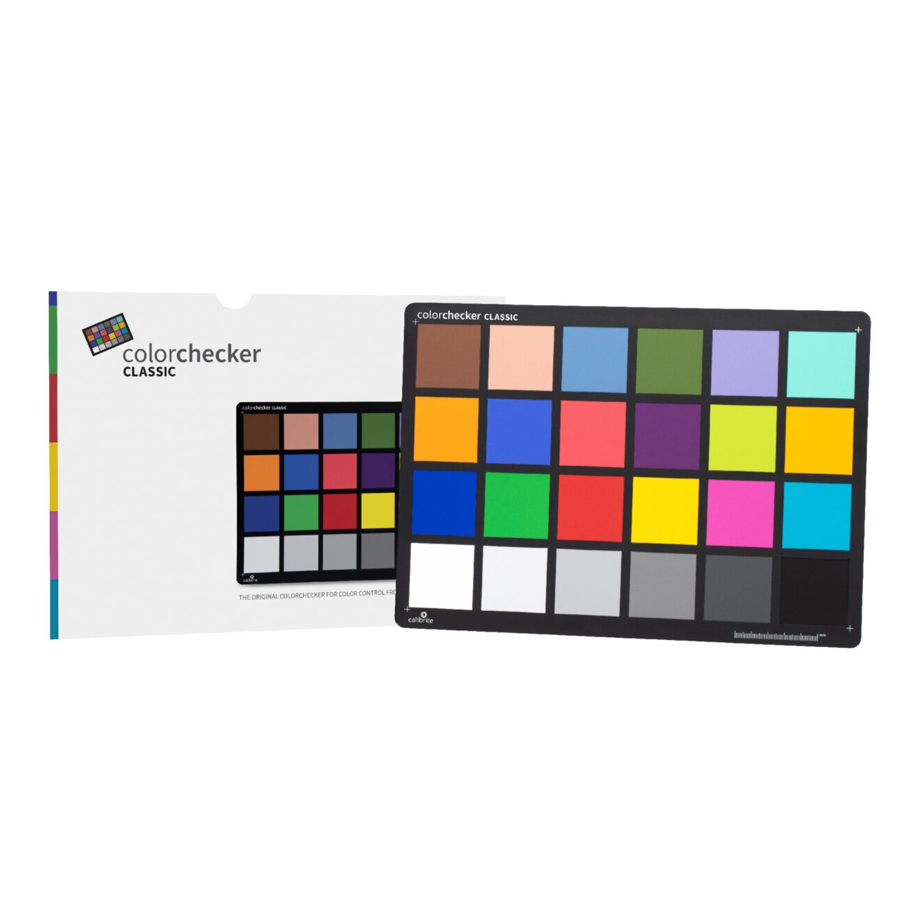
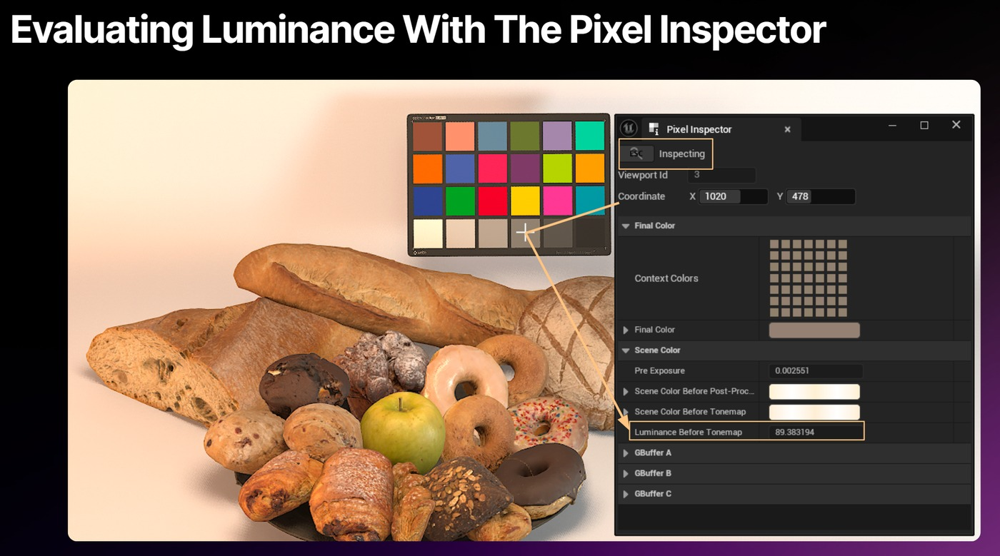
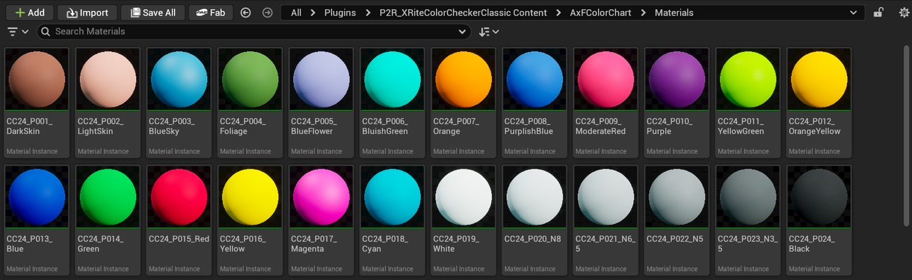
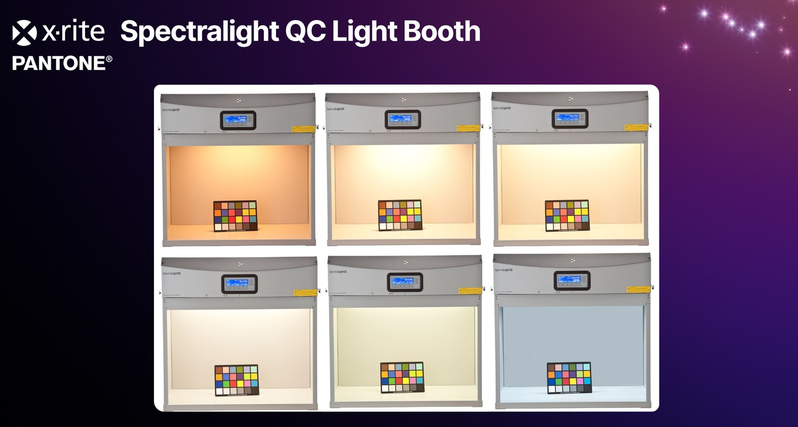
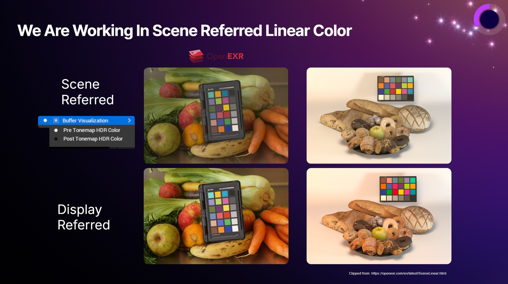
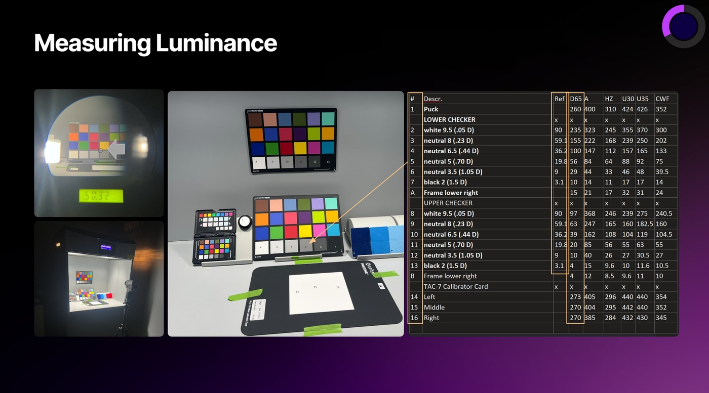

# 在 Unreal 中使用 X-Rite ColorChecker Classic - 验证光线和颜色

## 来源与状态

- 原始 URL：https://dev.epicgames.com/community/learning/tutorials/b2Xn/unreal-engine-using-the-x-rite-colorchecker-classic-in-unreal-validating-light-and-color
- 原始文件：unreal-engine-using-the-x-rite-colorchecker-classic-in-unreal-validating-light-and-color.origin.md
- 分段：第 1/3 段

- 原始 URL：https://dev.epicgames.com/community/learning/tutorials/b2Xn/unreal-engine-using-the-x-rite-colorchecker-classic-in-unreal-validating-light-and-color

## 运行时分类

- 类型：图文教程
- 判断：运行时未识别到核心视频信号，可整理正文约 9641 字符。

## 摘要

本文以 Spectralight QC Light Booth 插件为基础，展示 ColorChecker Classic 如何增强 Unreal 内的验证工作流程。一起...

## 中文整理

### 在 Unreal 中使用 X-Rite ColorChecker Classic - 验证光线和颜色

此内容与 Unreal Fest Stockholm 2025 的 Portal to Reality - Fusing Real-World Assets with Unreal Workflows Resources 相关。 - Portal to Reality - Fusing Real-World Assets with Unreal Workflows Resources

### 介绍

在评估视觉质量时，照明和色彩准确度是密不可分的。即使有了完美分类的照明设置，您仍然需要可靠的参考来确认您的场景是否按其应有的方式运行。在世界各地的产品设计实验室和摄影工作室中，该参考通常是 ColorChecker Classic。 ColorChecker 提供了一组 24 个经过科学测量的色块，包括原色、次要色、肤色和中性灰色，作为判断光线和颜色的基线。通过将 ColorChecker 放置在场景中，您可以快速确定照明环境和渲染管道是否提供与现实相符的结果。在虚幻引擎中，我们可以以大致相同的方式使用 ColorChecker 蓝图示例。无论您是在 Spectralight QC Light Booth 插件内工作还是验证开放环境，ColorChecker 都有助于确保您在视口中看到的内容尽可能与现实世界的标准保持一致。本文以 Spectralight QC Light Booth 插件为基础，展示 ColorChecker Classic 如何增强 Unreal 内的验证工作流程。它们共同构成了一个实用的工具包，适合任何想要使用物理上准确的照明和颜色的人。 X-Rite ColorChecker Classic 包含在 P2R_XRiteColorCheckerClassic 插件中，作为虚幻引擎 5.6.1+ 中的可信参考。

### ColorChecker 提供什么

经典 24 色块目标不仅仅是一个熟悉的摄影工具；这是一个科学定义的数据集。

每个补丁都有已知的光谱反射率值，这使得它对于验证非常有价值。

在 Unreal 中，这转化为： - AxF 扫描基材材质：这些材质基于现实并由 X-Rite 团队提供，消除了猜测。

AxF 扫描基材材料：这些材料基于现实，由 X-Rite 团队提供，消除了猜测。

- 色块基材材料。

- 照明分类：例如，通过比较不同 SpectaLight QC 照明模式（D65、荧光灯、白炽灯等）下的中性色块，您可以确认您的虚拟光源是否与其物理对应物的预期色度和亮度相匹配。

请记住，虚幻引擎不是光谱渲染器，因此它在计算中不使用颜色波长。

照明分类：例如，通过比较不同 SpectaLight QC 照明模式（D65、荧光灯、白炽灯等）下的中性色块，您可以确认您的虚拟光源是否与其物理对应物的预期色度和亮度相匹配。

请记住，虚幻引擎不是光谱渲染器，因此它在计算中不使用颜色波长。

- 2025 年 Portal To Reality 演示中现实世界示例的照明模式。

- 管道验证：使用 ColorChecker 验证您的场景是否在线性、场景引用的空间中工作。

如果您的色块显得对比度过高或偏移，则可能存在需要解决的色调映射或伽玛问题。

管道验证：使用 ColorChecker 验证您的场景是否在线性、场景引用的空间中工作。

如果您的色块显得对比度过高或偏移，则可能存在需要解决的色调映射或伽玛问题。

- 场景与显示参考颜色 - 后期制作检查：ColorChecker 在渲染以供合成或客户审核时充当一致的参考点。

通过根据已知标准检查色块值，您可以纠正分级漂移并确保图像和视频之间的一致性。

使用 Babel Color 等网站或制造商的已知值建立基础和目标。

后期制作检查：ColorChecker 在渲染以供合成或客户审阅时充当一致的参考点。

通过根据已知标准检查色块值，您可以纠正分级漂移并确保图像和视频之间的一致性。

使用 Babel Color 等网站或制造商的已知值建立基础和目标。

- 各种照明场景下的已知亮度。

- Babel Color - 颜色检查器参考页

### 在虚幻中使用 ColorChecker

X-Rite ColorChecker Classic 包含在 P2R_XRiteColorCheckerClassic 插件中，作为虚幻引擎 5.6.1 及更高版本中的可信参考。

该插件包含一个经过校准的 ColorChecker Classic，您可以将其直接放入场景中。

以下是如何充分利用它： - 确保在内容浏览器中设置“显示插件内容”。

导航到插件内容并找到 P2R_XRiteColorCheckerClassic 文件夹。

蓝图 Actor 位于插件的根目录中。

确保在内容浏览器中设置“显示插件内容”。

导航到插件内容并找到 P2R_XRiteColorCheckerClassic 文件夹。

蓝图 Actor 位于插件的根目录中。

- 放置检查器：将 ColorChecker 蓝图 Actor (BP_AxFColorChecker) 拖到您的展位或场景中。

放置它，使其接收与拍摄对象或材料相同的光线。

位置和旋转非常重要，因为光是定向的。

我们正在测量表面的吸收和反射。

放置检查器：将 ColorChecker 蓝图 Actor (BP_AxFColorChecker) 拖到您的展位或场景中。
