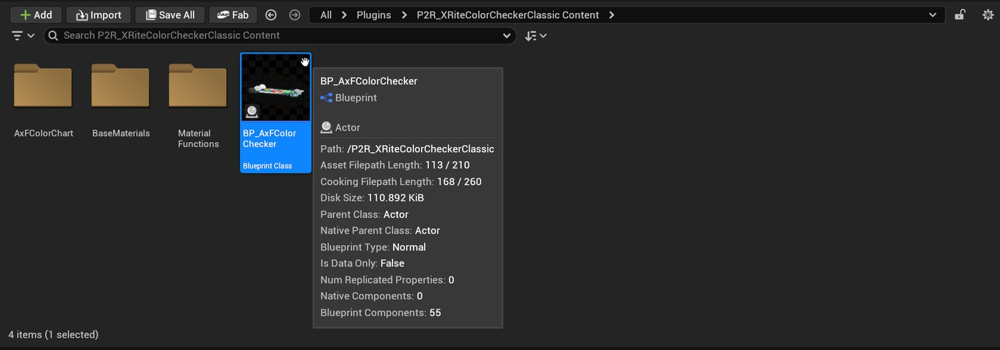
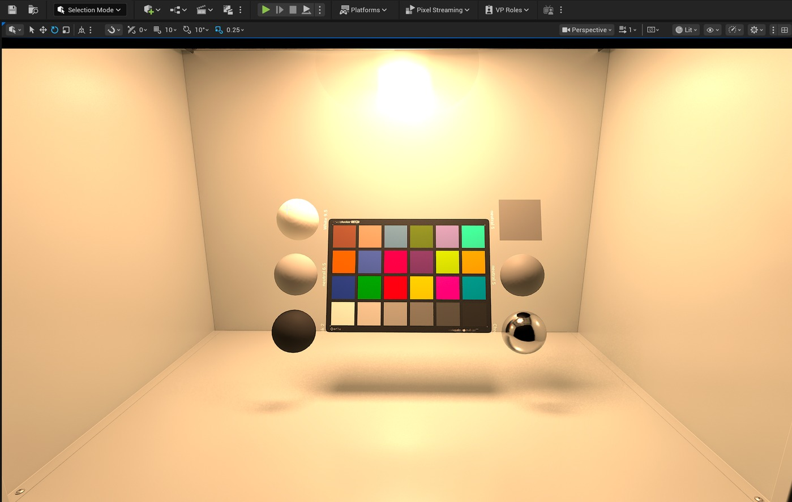
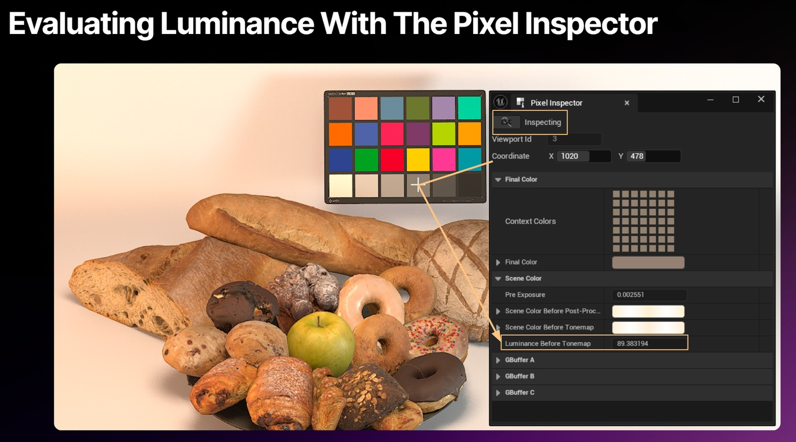

# 在 Unreal 中使用 X-Rite ColorChecker Classic - 验证光线和颜色（续 2）

## 来源与状态

- 原始 URL：https://dev.epicgames.com/community/learning/tutorials/b2Xn/unreal-engine-using-the-x-rite-colorchecker-classic-in-unreal-validating-light-and-color
- 原始文件：unreal-engine-using-the-x-rite-colorchecker-classic-in-unreal-validating-light-and-color.origin.md
- 分段：第 2/3 段

放置它，使其接收与拍摄对象或材料相同的光线。

位置和旋转非常重要，因为光是定向的。

我们正在测量表面的吸收和反射。

- 颜色检查器放置在 SpectraLight QC 中并面向相机。

- 使用像素检查器：打开虚幻的像素检查器并直接从检查器的补丁中采样值。

将这些值与预期参考值进行比较，以确认您的照明环境是否准确。

使用像素检查器：打开虚幻的像素检查器并直接从检查器的补丁中采样值。

将这些值与预期参考值进行比较，以确认您的照明环境是否准确。

- 匹配亮度时，首先检查中性色块：从灰度行开始（中性 2 到中性 8）。

这些色块可以显示您的光源是否平衡以及曝光是否正确。

与所有可视化软件一样，由于光本身的性质，虚幻永远不会完美匹配照片参考。

这可以在后期制作中实现，就像我们处理摄影一样。

匹配亮度时，首先检查中性色块：从灰度行开始（中性 2 到中性 8）。

这些色块可以显示您的光源是否平衡以及曝光是否正确。

与所有可视化软件一样，由于光本身的性质，虚幻永远不会完美匹配照片参考。

这可以在后期制作中实现，就像我们处理摄影一样。

- 扩展到肤色和色块：确认中性平衡后，查看肤色、原色和次色。

这些将显示您的颜色管道是否正确处理饱和度和色调。

扩展到肤色和色块：确认中性平衡后，查看肤色、原色和次色。

这些将显示您的颜色管道是否正确处理饱和度和色调。

### 为什么这很重要

ColorChecker 弥补了测量照明和视觉判断之间的差距。如果没有它，即使是虚幻中经过校准的灯箱也可能会让人产生疑问：环境真的是场景相关的吗？后期制作流程是否会改变价值观？使用 ColorChecker 后，您将获得： - 基于现代基材的参考：虽然虚幻中存在现有的颜色检查器立方体，但这个新示例基于 X-Rite AxF 扫描，这是具有更高质量和保真度的现代基材材料。基于现代 Substrate 的参考：虽然 Unreal 中有一个现有的颜色检查立方体，但这个新示例基于 X-Rite AxF 扫描，这是具有更高质量和保真度的现代 Substrate 材料。 - 对照明环境的信心：照明设置中的每种模式（例如 Spectralight QC 示例）都可以根据中性标准进行检查。对照明环境的信心：照明设置中的每种模式（例如 Spectralight QC 示例）都可以根据中性标准进行检查。 - 后期制作的一致性：渲染输出可以与已知的补丁值进行匹配，确保各个版本的准确性。后期制作的一致性：渲染输出可以与已知的补丁值进行匹配，确保各个版本的准确性。 - 对虚幻可视化的信任：通过使用行业参考验证颜色，您可以强化虚幻可以作为决策平台而不仅仅是可视化工具的想法。对虚幻可视化的信任：通过使用行业参考验证颜色，您可以强化虚幻可以作为决策平台而不仅仅是可视化工具的想法。

### 概括

X-Rite ColorChecker Classic 包含在 P2R_XRiteColorCheckerClassic 插件中，作为虚幻引擎 5.6.1+ 中的可信参考。通过将其与 Pixel Inspector 等工具结合使用，您可以对照明环境进行分类、验证颜色管道并在整个后期制作过程中保持准确性。简而言之，ColorChecker 可确保您的 Unreal 项目不仅在视觉上令人印象深刻，而且具有科学依据、可重复且符合现实世界标准。 - 灯光 - 插件 - 虚拟制作 - 过场动画

## 相关链接
