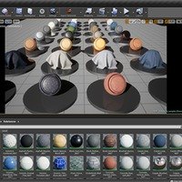
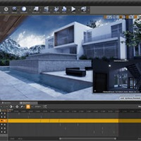
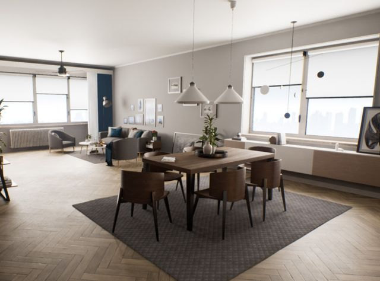

# 欢迎来到建筑可视化

## 来源与状态

- 原始 URL：https://dev.epicgames.com/community/learning/paths/Wb/unreal-engine-welcome-to-architectural-visualization
- 原始文件：unreal-engine-welcome-to-architectural-visualization.origin.md
- 分段：第 1/3 段

- 原始 URL：https://dev.epicgames.com/community/learning/paths/Wb/unreal-engine-welcome-to-architectural-visualization

## 运行时分类

- 类型：图文教程
- 判断：运行时未识别到核心视频信号，可整理正文约 5254 字符。

## 摘要

对于那些希望进入虚幻引擎进行 AEC 的人来说，这是完美的起点，您将学习虚幻引擎的基础知识，然后深入了解核心入门知识...

## 中文整理

### 学习路径内容

- 01 / 07 Introducing Unreal Engine COURSE | 14 模块 Comprehending Projects and File Structure This course dives into the fundamentals of the Epic Games Launcher, such as creating projects and adjusting project settings, as well as providing a tour of important project files.

### 理解项目和文件结构

This course dives into the fundamentals of the Epic Games Launcher, such as creating projects and adjusting project settings, as well as providing a tour of important project files. - 02 / 07 Interiors - Exteriors COURSE | 12 模块 Revit to Unreal Engine Fundamentals Steve Biegun takes you through the steps of leveraging Revit models in Unreal Engine using Datasmith and creating real-time multi-camera images and videos of the design. 03 / 07 资源 Archviz Interior Rendering Sample The Archviz Interior Rendering sample shows off the realistic rendering possibilities of Unreal Engine 4 (UE4). Explore

this small apartment scene that's already been set up to give the best results for a variety of scenarios, so that you can learn the techniques for yourself and even reuse elements in your own work. 04 / 07 COURSE | 32 模块 Creating an Architectural Exterior Real-Time Project This course covers
everything you need to know about creating architectural exteriors in Unreal Engine. Learn the process from start to finish, with special focus on adding terrain, foliage, and other effects. - 02 / 07 Interiors - Exteriors COURSE | 12 模块 Revit to Unreal Engine Fundamentals Steve Biegun takes you through the steps of leveraging Revit models in Unreal Engine using Datasmith and creating real-time multi-camera images and videos of the design.

### Revit 到虚幻引擎基础知识

Steve Biegun takes you through the steps of leveraging Revit models in Unreal Engine using Datasmith and creating real-time multi-camera images and videos of the design. - 03 / 07 资源 Archviz Interior Rendering Sample The Archviz Interior Rendering sample shows off the realistic rendering possibilities of Unreal Engine 4 (UE4). Explore this small apartment scene that's already been set up to give the best results for a variety of scenarios, so that you can learn the techniques for yourself and even reuse elements in your own work.

### Archviz 室内渲染示例

The Archviz Interior Rendering sample shows off the realistic rendering possibilities of Unreal Engine 4 (UE4). Explore this small apartment scene that's already been set up to give the best results for a variety of scenarios, so that you can learn the techniques for yourself and even reuse elements in your own work. - 04 / 07 COURSE | 32 模块 Creating an Architectural Exterior Real-Time Project This course covers everything you need to know about creating architectural exteriors in Unreal Engine. Learn the process from start to finish, with special focus on adding terrain, foliage, and other

effects.
