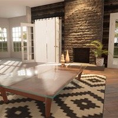
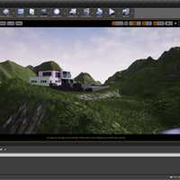
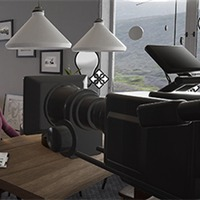

# 欢迎来到建筑可视化（续 2）

## 来源与状态

- 原始 URL：https://dev.epicgames.com/community/learning/paths/Wb/unreal-engine-welcome-to-architectural-visualization
- 原始文件：unreal-engine-welcome-to-architectural-visualization.origin.md
- 分段：第 2/3 段

### 创建建筑外观实时项目

This course covers everything you need to know about creating architectural exteriors in Unreal Engine. Learn the process from start to finish, with special focus on adding terrain, foliage, and other effects. - 05 / 07 More COURSE | 24 模块 Creating PBR Materials This course explains how to create high-quality physically based shaders. Learn about working with material instances at runtime using Blueprints, building material parameter collections, and more. 06 / 07 COURSE | 20 模块 Landscape Essential Concepts In "Landscape Essential Concepts," author Joel Bradley gets you up and running with

using the Terrain tools inside Unreal Engine, explaining how to create outdoor environments for game and architectural visualization pieces. 07 / 07 COURSE | 12 模块 Ray-Traced Cinematic Lighting for Interiors In this course, you’ll explore real-time ray tracing for virtual production cinematography.
Learn how to use ray traced lighting to emulate real-world cinematic lighting principles for interior scenes. - 05 / 07 More COURSE | 24 模块 Creating PBR Materials This course explains how to create high-quality physically based shaders. Learn about working with material instances at runtime using Blueprints, building material parameter collections, and more.

### 创建 PBR 材质

This course explains how to create high-quality physically based shaders. Learn about working with material instances at runtime using Blueprints, building material parameter collections, and more. - 06 / 07 COURSE | 20 模块 Landscape Essential Concepts In "Landscape Essential Concepts," author Joel Bradley gets you up and running with using the Terrain tools inside Unreal Engine, explaining how to create outdoor environments for game and architectural visualization pieces.

### 景观基本概念

In "Landscape Essential Concepts," author Joel Bradley gets you up and running with using the Terrain tools inside Unreal Engine, explaining how to create outdoor environments for game and architectural visualization pieces. - 07 / 07 COURSE | 12 模块 Ray-Traced Cinematic Lighting for Interiors In this course, you’ll explore real-time ray tracing for virtual production cinematography. Learn how to use ray traced lighting to emulate real-world cinematic lighting principles for interior scenes.

### 室内光线追踪电影照明

在本课程中，您将探索虚拟制作电影摄影的实时光线追踪。了解如何使用光线追踪照明来模拟室内场景的真实电影照明原理。 - 照明 - 建筑 - 建筑可视化 - 光线追踪 - interios - 外观

## 相关链接
