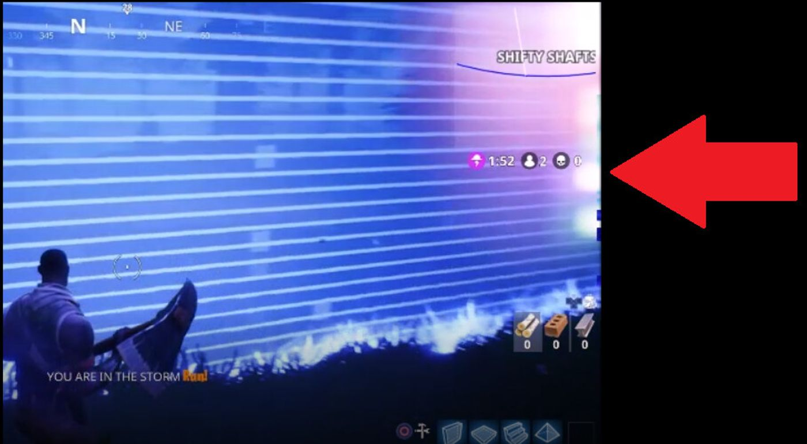
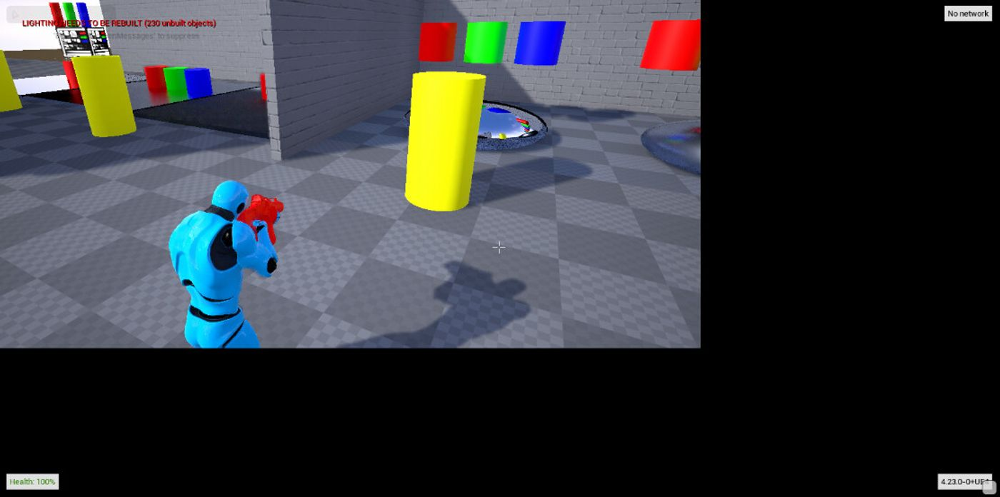
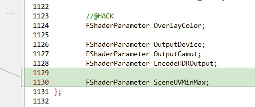
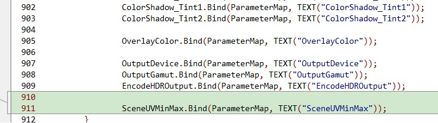
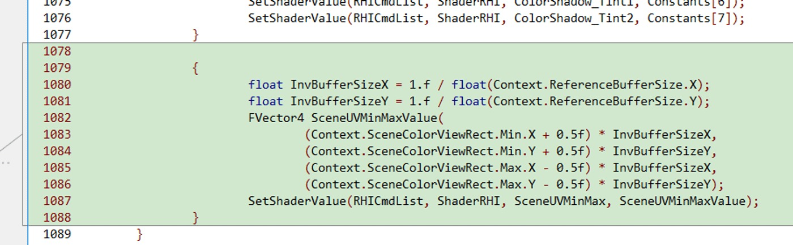
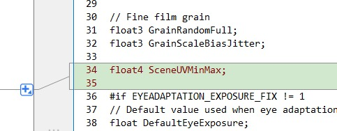
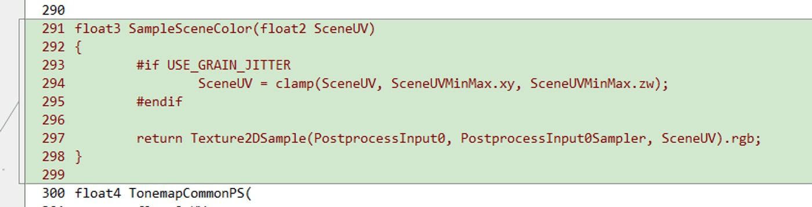
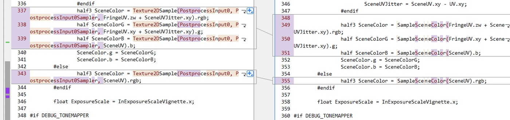

# 动态分辨率伪影的解决方法

## 来源与状态

- 原始 URL：https://dev.epicgames.com/community/learning/knowledge-base/Xdd4/unreal-engine-workaround-for-dynamic-resolution-artefacts

## 运行时分类

- 类型：图文教程
- 判断：运行时未识别到核心视频信号，可整理正文约 2805 字符。

## 摘要

Branden T 撰写的文章。 [错误解决方法] 动态分辨率伪影 有时我们会看到不同着色器中出现的常见错误，其中...

## 中文整理

### 概览

文章作者：布兰登·T.

[错误解决方法] 动态分辨率伪影 有时，我们会看到在不同着色器中弹出的常见错误，其中伪影出现在屏幕边缘，如下例所示： 动态分辨率的工作原理是将任意分辨率的视口缩放为固定大小的渲染目标。

这适用于所有平台，并且避免了经常重新分配渲染目标的 CPU 开销。

这还有一个好处是可以共享分屏渲染的工程工作。

然而，这要求每个渲染算法在视口内正确采样，以避免在外部采样未初始化的数据。

当渲染器的一个通道在屏幕边缘采样未初始化的数据时，可能会在视口内产生像素损坏，这将通过渲染器的剩余通道的其余部分继续进行。

例如，众所周知，Bloom 非常擅长发现这种损坏，因为它可能是由异常明亮的像素产生的。

此错误的最佳解决方案是一种常见的解决方法，其中涉及隔离出现伪影的渲染通道，并限制与 CL3632823 中的更改类似的 UV 值，以确保像素已初始化。

要隔离有问题的渲染通道，需要使用图形调试工具，例如适用于 Windows 和 Linux 的 RenderDoc (https://www.renderdoc.org)、适用于 Windows 的 PIX（下载 - Windows 上的 PIX）或平台制造商提供的任何其他特定于平台的 GPU 调试器，以发现哪个通道在视口内产生损坏。

识别通道后，您需要评估着色器代码并确定哪些纹理提取可以在视口外进行采样。

一旦找到，您就可以将 UV 限制在视口内。

CL CL3632823 是此类修复的一个很好的示例（注意：此错误在任何着色器中都可能出现，并且不一定在 PostProcessTonemap 中，您必须找到导致错误的着色器。）：PostProcessTonemap.cpp 添加新的 float4 着色器参数 SceneUVMinMax 并将其绑定到着色器：计算 SceneUVMinMax 值，该值描述需要钳位的扩展视图区域：请注意，Min 的 +0.5最大需要为 -0.5，以便夹具能够与“最近”纹理采样器以及双线性采样器一起使用。

接下来，在着色器 PostProcessTonemapper.usf 中声明新的着色器变量：添加一个用于将 UV 值限制在当前区域之外的新函数，该函数考虑了 cpp 文件中的计算过程。

这个函数被放置在 SceneUV 计算路径中：希望这能为您提供如何解决突出显示的问题的指导。

如果您还有任何其他问题，请在参考本文的同时在新问题中提出。

- 虚幻引擎

## 相关链接

- [https://www.renderdoc.org](https://www.renderdoc.org/)
- [Download - PIX on Windows](https://blogs.msdn.microsoft.com/pix/download/)

