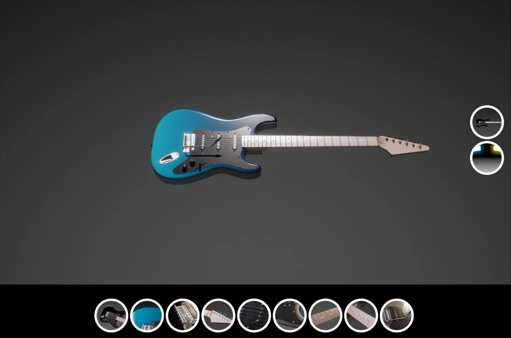
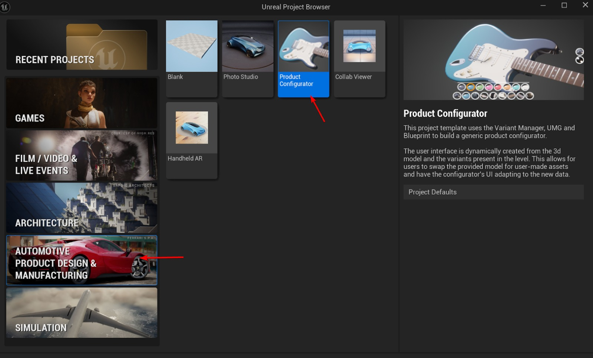
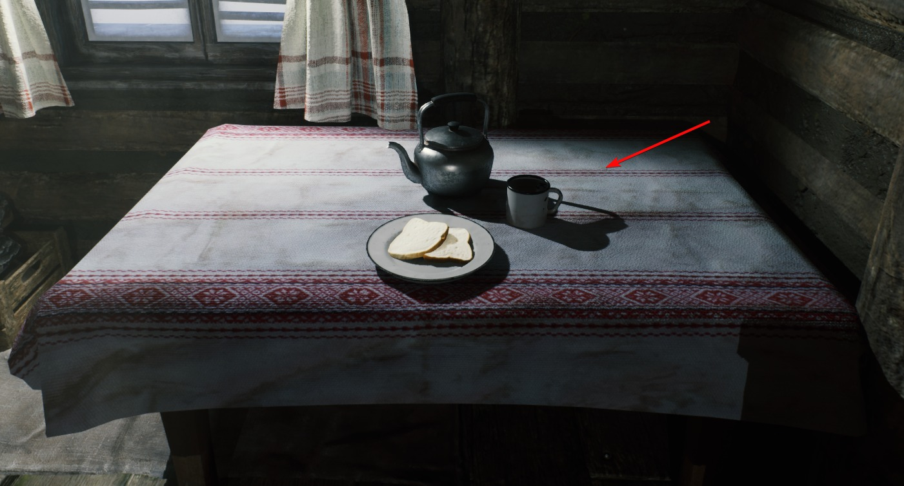
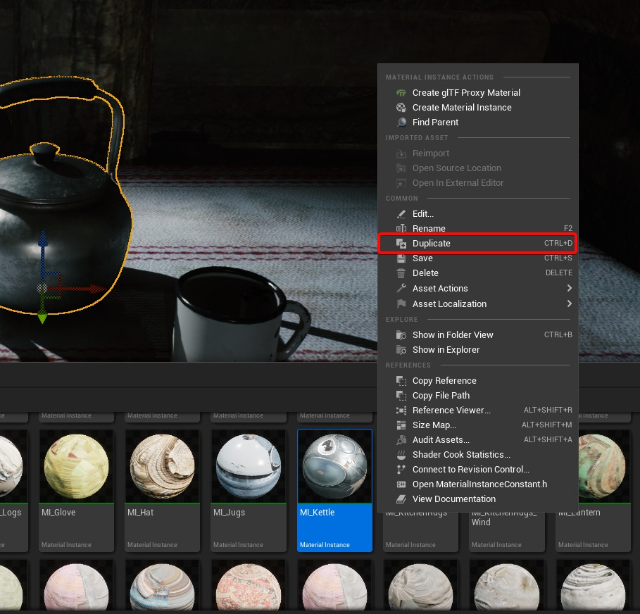
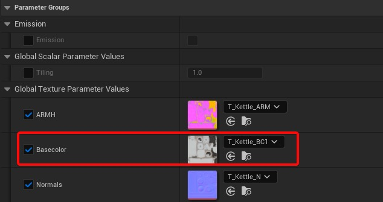
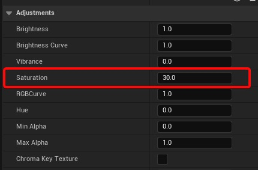
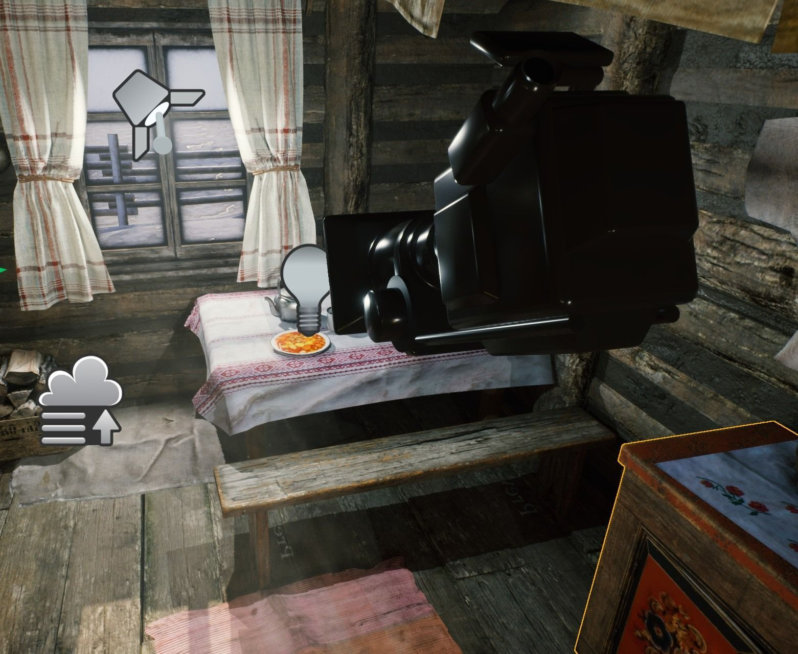
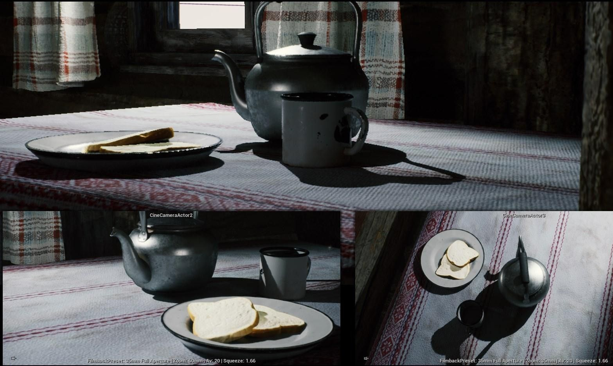
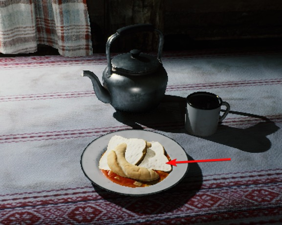
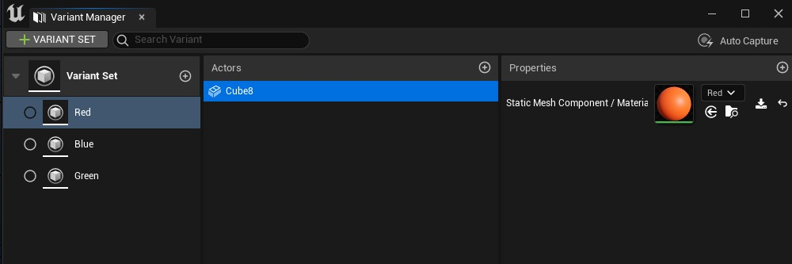

# 虚幻引擎 5.6 中的变体管理器

## 来源与状态

- 原始 URL：https://dev.epicgames.com/community/learning/tutorials/b2W0/variant-manager-in-unreal-engine-5-6
- 原始文件：variant-manager-in-unreal-engine-5-6.origin.md
- 分段：第 1/2 段

- 原始 URL：https://dev.epicgames.com/community/learning/tutorials/b2W0/variant-manager-in-unreal-engine-5-6

## 运行时分类

- 类型：图文教程
- 判断：运行时未识别到核心视频信号，可整理正文约 7284 字符。

## 摘要

在本教程中，您将学习如何使用虚幻引擎的变体管理器来创建交互式视觉配置器。我们将探讨如何切换...

## 中文整理

### 在虚幻引擎 5.6 中使用 Variant Manager 创建交互式产品配置器

在本教程中，您将学习如何使用虚幻引擎的变体管理器来创建交互式视觉配置器。我们将探索如何在相机、材质和对象之间动态切换——非常适合产品可视化或交互式场景设计。在本教程结束时，您将能够： - 了解变体管理器和变体集的作用。了解变体管理器和变体集的作用。 - 配置动态材质、对象和摄像机切换。配置动态材质、对象和相机切换。 - 生成缩略图并将您的设置连接到配置器 UI。生成缩略图并将您的设置连接到配置器 UI。

### 什么是变体管理器？

变体管理器是一个功能强大的工具，可让您定义和组织资产的多种状态，例如材质、网格、照明或相机设置，并在它们之间即时切换，所有这些都在一个统一的场景中进行。将其视为项目视觉选择的控制中心 - 高效、有组织且非常适合实时演示工作流程。此工作流程非常适合创建交互式产品演示、架构预览或需要无缝显示多个设计选项的可视化项目。以下是使用 Variant Manager 创建的简单产品配置器的示例。

### 第一步：创建一个新项目

从项目创建窗口中，选择“汽车产品设计和制造”下的产品配置器模板。为您的项目命名并单击“创建”。

### 第二步：设计材料

下载或使用项目中的现有环境或对象。在此步骤中，我们将演示如何创建由变体管理器控制的材质变体。打开场景中使用的任何材质并将其复制两次。另外，复制相应的纹理文件。如果您的材质使用纹理参数，请将复制的纹理分配给它 - 这可确保每个变体保持独立。通过调整颜色、亮度、粗糙度或金属值来修改每个复制的材质，以创建独特的视觉风格。

### 第三步：放置相机和场景对象

打开大纲视图并删除玩家开始对象 - 本教程不需要角色移动。添加 CineCameraActor 并将其定位到您计划使用变体管理器控制的对象。更改电影摄影机的这些设置。 - 启用注视跟踪（摄像机跟随对象） 启用注视跟踪（摄像机跟随对象） - 将场景对象之一指定为要跟踪的演员（设置焦点目标） 将场景对象之一指定为要跟踪的演员（设置焦点目标） - 将对焦方法设置为跟踪（将焦点保持在目标上） 将焦点方法设置为跟踪（将焦点保持在目标上） - 将胶片背板更改为 35 毫米全光圈（3:2 长宽比）（电影帧尺寸） 更改胶片背板至 35 毫米全光圈（3:2 长宽比）（电影帧尺寸） - 将挤压系数设置为 1.66（更宽的视野） 将挤压系数设置为 1.66（更宽的视野） - 将光圈叶片数设置为 5（平滑散景） 将光圈叶片数设置为 5（平滑散景） - 根据需要调整焦距和光圈（控制变焦和模糊） 调整根据需要设置焦距和光圈（控制缩放和模糊） 为了进行演示，请在场景中至少放置两个不同的网格。例如，可以稍后切换的两种产品模型、家具变体或道具版本。

### 第四步：建立变体集

### 什么是变体集？

变体集是与特定对象相关的预设的集合，可帮助您在单个项目中组织不同的外观或配置。

### 创建和配置变体集

右键单击内容抽屉 → 其他 → 关卡变体集，并为其指定一个描述性名称。如果您找不到此选项，请确保在您的项目中启用了变体管理器插件（默认情况下它包含在产品配置器模板中）。打开新创建的变体集，然后单击 + 变体集三次 - 相机、对象和材质各一次。通过单击 + 按钮在每组中创建三个变体，并清楚地重命名它们（例如，Material_Variant_1、Camera_View_2 等）。

### 配置对象变体

- 对于对象变体集中的每个变体，选择要切换的对象。对于对象变体集中的每个变体，选择要切换的对象。 - 在属性窗口中，选择 Actor，然后将属性设置为 Static Mesh Component / Visible。在属性窗口中，选择 Actor，然后将属性设置为 Static Mesh Component / Visible。 - 添加您想要包含的其他网格，根据需要切换其可见性状态。添加您想要包含的其他网格，根据需要切换其可见性状态。 - 为了加快设置速度，您可以复制已配置的变体集。为了加快设置速度，您可以复制已配置的变体集。通过单击其名称旁边的播放图标来预览每个变体的外观。

### 配置相机型号

添加您的 CineCameraActor，然后定义以下属性： - 场景组件 / 相对位置 场景组件 / 相对位置 - 场景组件 / 相对旋转 场景组件 / 相对旋转 ⚠️ 确保使用场景组件，而不是相机组件。定位相机后，单击“保存相机”图标以存储其变换值。对您想要包含的每个相机型号重复此操作。

### 配置材质变体

- 选择对象作为每个变体的 Actor。选择对象作为每个变体的 Actor。 - 将属性设置为静态网格体组件/材质。将属性设置为静态网格体组件/材质。分配您之前准备的适当材料（例如，Material_Variant_1、Material_Variant_2 等）。完成后，关闭变体管理器窗口。

### 第五步：生成变体的缩略图

您可以为每个变体分配缩略图以供快速视觉参考。选择一个对象并放大以很好地框住它。右键单击其缩略图并选择从视口设置。如果您更喜欢使用自定义图像（例如，在 Photoshop 中创建的图像），请选择从文件设置。对所有材质和对象变体重复此操作。对于摄像机变体，请在设置缩略图之前确保您的活动视图与 CineCameraActor 匹配。

### 第六步：在关卡中设置配置器
