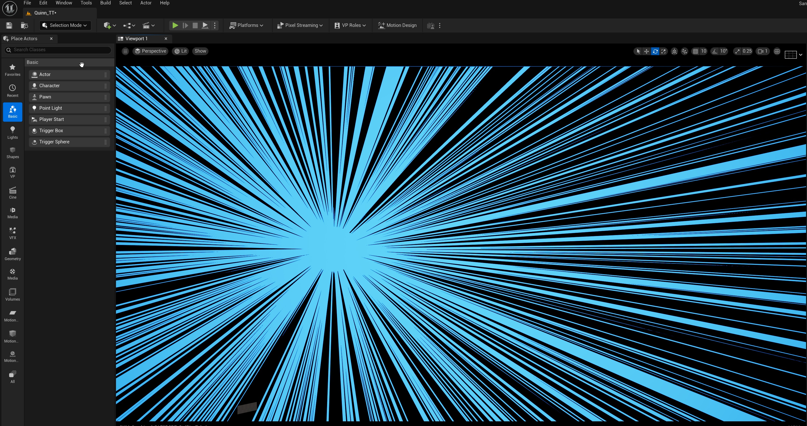
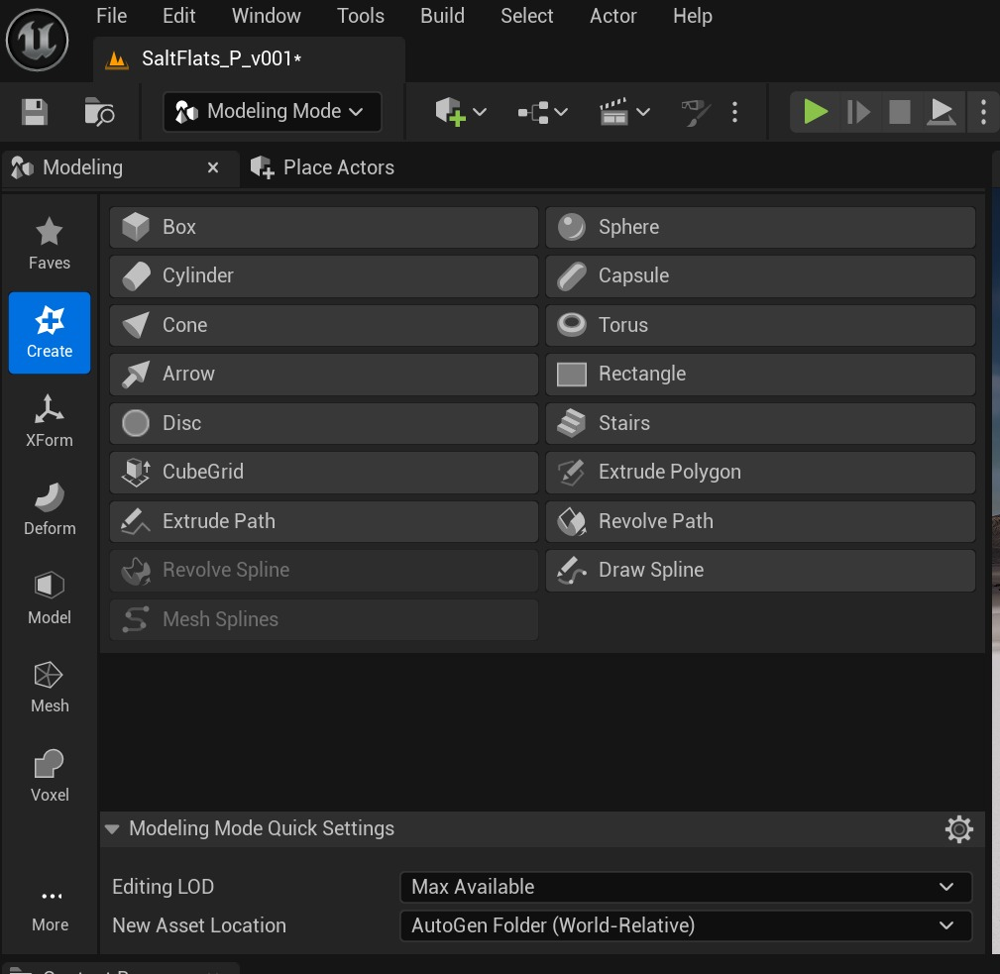
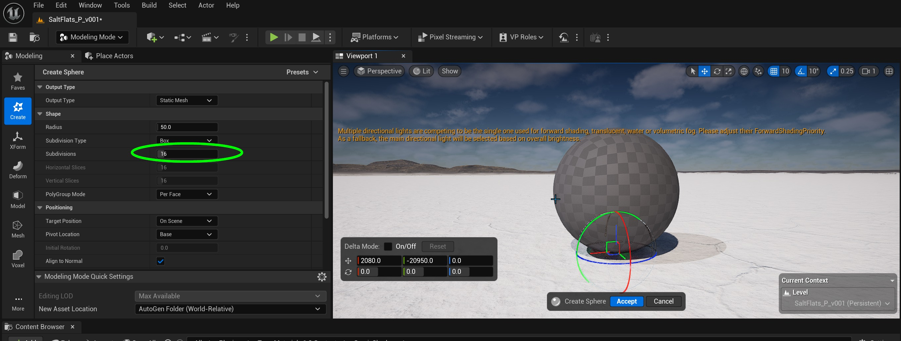
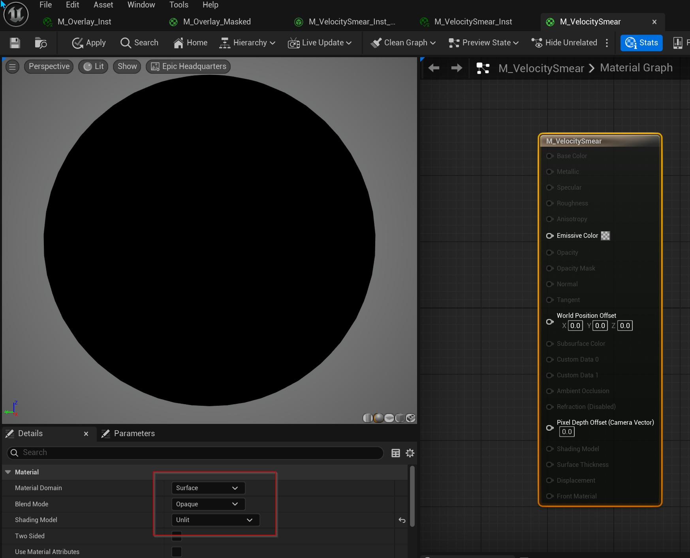
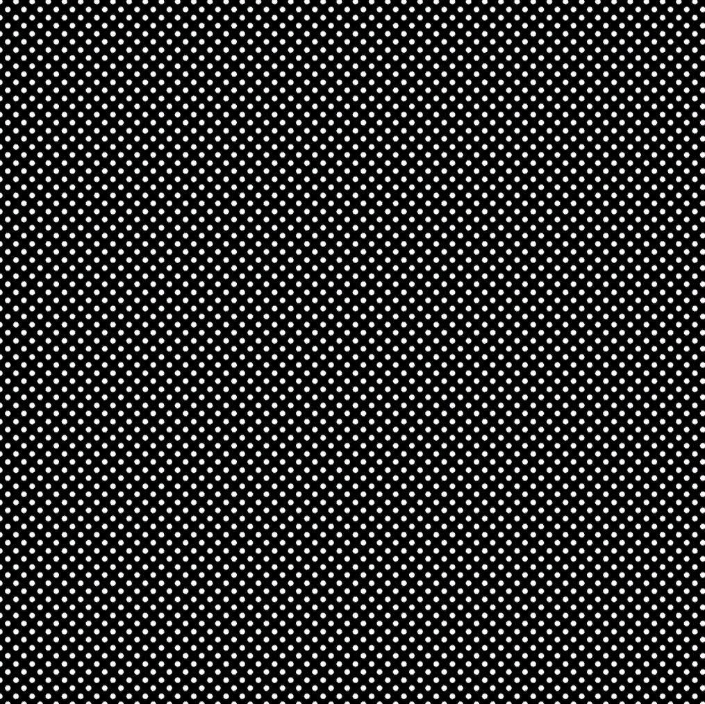
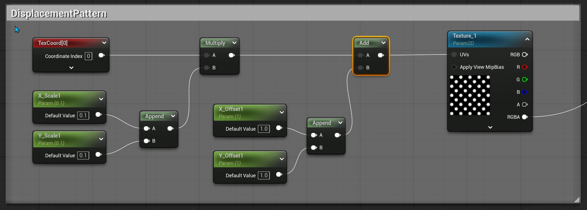
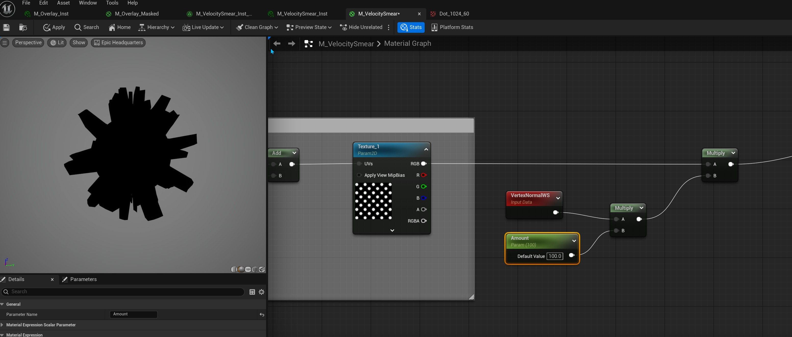
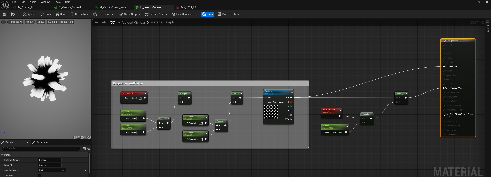
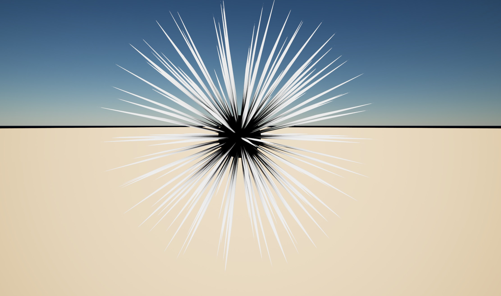
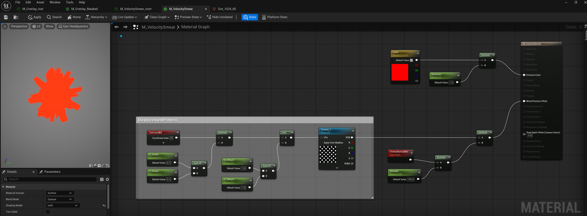

# 在虚幻引擎中创建漫画书启动元素

## 来源与状态

- 原始 URL：https://dev.epicgames.com/community/learning/tutorials/pB46/creating-a-comic-book-splash-element-in-unreal-engine

## 运行时分类

- 类型：图文教程
- 判断：API 未识别到核心视频信号，可整理正文约 3431 字符。

## 摘要

关于在虚幻引擎中为线性内容和动态图形创建 3D 启动图形元素的简短教程

## 中文整理

### 概览

在本教程中，我们为动态、艺术可指导和动画的图形元素创建漫画风格的启动画面。

在建模模式中，选择创建工具。

从那里，我们可以通过单击面板中的“球体”按钮来创建球体。这将生成一个代理球体放置在您的关卡中。在关卡中单击以放置球体。暂时不要单击“接受”按钮。在参数中，将细分设置为 24 或 32。这将生成非常高分辨率的球体，从而对受影响的顶点进行一些控制。

现在，单击接受按钮生成静态网格球体。现在在内容浏览器中，创建一个新材质并将其命名为 Splash。双击资源打开材质编辑器。设置材质属性如下：Material Domain = Surface Blend Mode: Opaque Shading Model: Unlit

现在我们可以开始添加一些节点了！这个想法是让网格的一些顶点向外移动远离表面，而其他顶点则保持在原位。这可以通过使用反转半色调屏幕轻松完成，其中点是白色的，如下图所示。

要正确构建节点，请创建TextureSampler 节点。然后创建一个TextureCoordinate节点。将纹理坐标节点连接到乘数节点。将两个标量参数节点连接到追加向量节点，将它们命名为 X_Scale 和 Y_Scale。这两个参数将用于缩放纹理的 UV。将 Append Vector 节点连接到乘法器节点的另一个输入。从乘法节点中出来，创建一个加法节点。创建另外两个标量参数并将它们连接到新的追加向量节点，然后将其连接到添加节点上的可用引脚。从“添加”节点出来，连接到“TextureSampler”的 UV 引脚。提示：创建标量参数节点的一个简单方法是右键单击“追加向量”节点引脚并选择“创建参数”。

现在我们有了一个很好的模式可以使用，我们现在可以使用这个图来替换顶点。我们可以通过添加 VertexNormalWS 节点来快速测试我们的设置。 WS 代表世界空间。然后，我们使用乘数节点和标量参数来驱动顶点的移动量。最后，我们将其乘以我们的TextureSampler结果。

将TextureSampler节点连接到材质上的Emissive引脚，以获得纹理如何影响每个顶点的世界位置偏移的颜色视图。

要在球体模型上对此进行测试，请创建材质的材质实例，以交互方式拨入所需的外观。

要添加一些颜色，请通过按住 4 键并在图形编辑器中单击左键来创建 Vector 4 参数。右键单击该节点，使其成为可在材质实例中访问的参数。将该节点连接到具有发射强度标量参数的乘法器，并将乘法器节点连接到发射引脚。

最终结果是一个令人惊叹的漫画书风格的飞溅元素，可以进行动画和艺术指导。

### 概括

使用建模工具在虚幻引擎中创建快速模型非常简单，并且能够生成在项目中使用的高质量元素也非常令人满意。自己尝试使用不同的高对比度图像，黑白和灰度值将为您的顶点距离提供不同的长度。最重要的是玩得开心！
