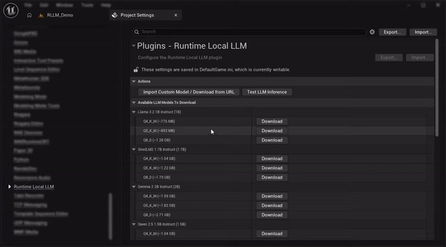
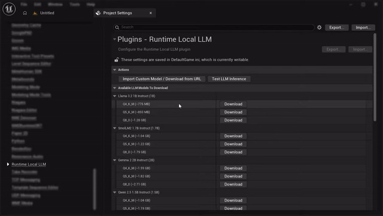
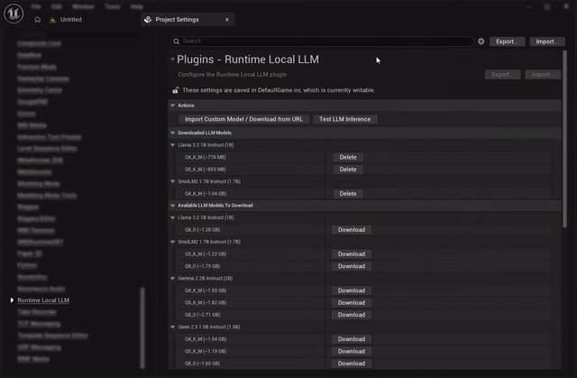
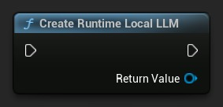
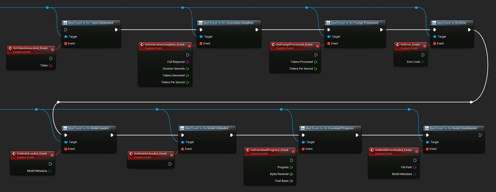
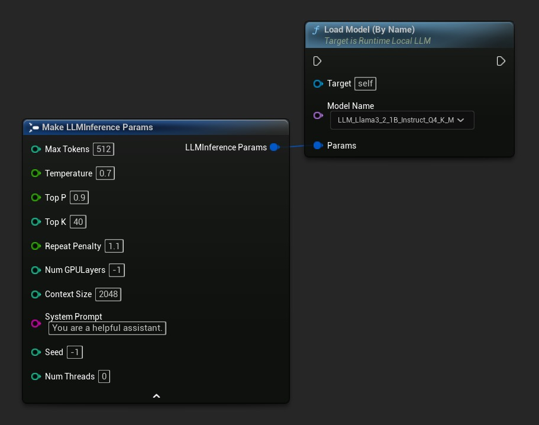
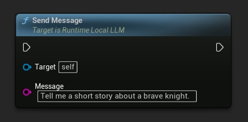
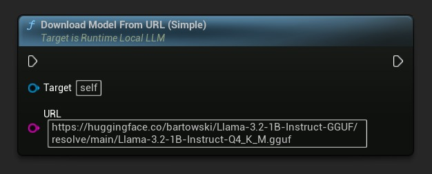
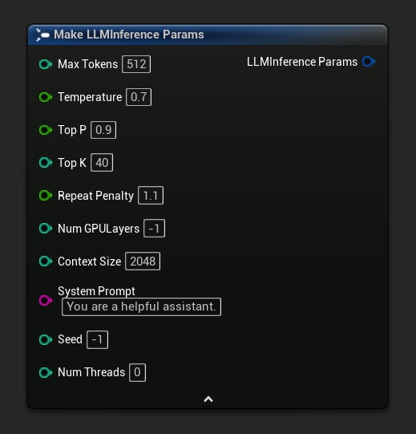
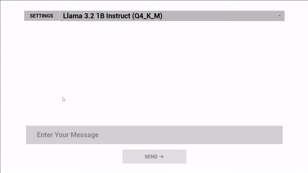

# 在虚幻引擎中离线运行本地 LLM - 运行时本地 LLM 插件教程

## 来源与状态

- 原始 URL：https://dev.epicgames.com/community/learning/tutorials/M45X/fab-running-local-llms-offline-in-unreal-engine-runtime-local-llm-plugin-tutorial

## 运行时分类

- 类型：图文教程
- 判断：API 未识别到核心视频信号，可整理正文约 9842 字符。

## 摘要

了解如何使用运行时本地 LLM 插件在虚幻引擎中完全在设备上运行大型语言模型。本教程将引导您完成在编辑器中下载和管理 GGUF 模型、在运行时在蓝图或 C++ 中加载模型、流式传输逐个令牌响应以及配置推理参数（例如温度、上下文大小和 GPU 层卸载）。该插件由 llama.cpp 提供支持，支持 Windows、Mac、Linux、Android、iOS 和 Meta Quest 上的离线推理，并为聊天系统、NPC 对话、动态内容生成等提供完整的蓝图和 C++ API。运行时不需要云服务或 API 密钥，一切都在玩家设备上本地运行。

## 中文整理

### 介绍

向游戏和交互体验中添加智能对话行为通常意味着依赖基于云的 AI 服务以及 API 密钥、网络延迟和持续成本。 [运行时本地 LLM](https://www.fab.com/listings/47d00943-f8ef-4acf-9861-68a51d478766) 插件采用不同的方法：它完全在设备上运行大型语言模型，运行时不需要互联网连接。该插件由 [llama.cpp](https://github.com/ggerganov/llama.cpp) 提供支持，支持任何 GGUF 格式的模型（Llama、Mistral、Phi、Gemma、Qwen、TinyLlama 等），按令牌流式传输响应，并可在 **Windows、Mac、Linux、Android、iOS 和 Meta Quest** 上运行。推理在后台线程上运行，所有回调都在游戏线程上安全传递，因此您可以直接从生成的令牌驱动 UI、NPC 对话或任何其他游戏逻辑。本教程将引导您完成蓝图中的核心工作流程：在编辑器中管理模型、在运行时加载模型以及发送消息以接收流响应。还提供了 C++ API - 有关详细信息，请参阅[官方文档](https://docs.georgy.dev/runtime-local-llm/how-to-use-the-plugin)。

### 先决条件

在开始之前，请确保您拥有： - **[运行时本地 LLM](https://www.fab.com/listings/47d00943-f8ef-4acf-9861-68a51d478766)** 插件安装在您的项目中 - 考虑到目标平台 - 建议移动和 VR 使用较小的模型（1B–3B 参数），而桌面可以处理 7B 及更大 - 一些可用的磁盘空间、GGUF 模型文件通常范围从几百兆字节到几千兆字节

### 在编辑器中管理模型

该插件包括一个设置面板，您可以在其中浏览、下载、导入、删除和测试模型，而无需编写任何代码。要打开它，请转到 **编辑 → 项目设置 → 插件 → 运行时本地 LLM**。该面板有两个主要部分：**下载的模型**（当前在磁盘上的模型）和**可用模型**（您可以从中下载的内置目录）。

### 从内置目录下载模型

在 **可用型号** 部分中，找到所需的型号系列和变体，然后单击 **下载**。进度条显示状态，完成后模型将移至 **已下载模型** 部分。您可以一次下载多个模型并删除不再需要的模型，以缩小项目规模。

### 导入自定义模型

如果您想要使用不在内置目录中的 GGUF 模型，请单击面板顶部的“**导入自定义模型**”。您可以浏览本地磁盘上的 .gguf 文件，也可以直接粘贴 URL（例如，来自 Hugging Face）。

自定义模型与 Content/RuntimeLocalLLM/Models 中的目录模型一起存储，并自动配置为通过 DirectoriesToAlwaysStageAsNonUFS 随打包版本一起发布 - 无需手动打包设置。

### 在编辑器中测试模型

在将模型集成到游戏逻辑之前，您可以使用 **测试 LLM** 窗口验证其是否有效。单击设置面板顶部的 **测试 LLM**，从下拉列表中选择一个模型，配置推理参数，输入提示，然后实时观看响应流。

有关编辑器工作流程的更多详细信息，请参阅[在编辑器中管理模型](https://docs.georgy.dev/runtime-local-llm/managing-models-in-the-editor)文档页面。

### 在运行时加载模型

现在您已经在磁盘上有了一个模型，让我们从游戏中加载它。流程是： - **创建一个 LLM 实例**并将对其的引用存储在蓝图变量中，这样它就不会被垃圾收集。 - **绑定委托**以进行令牌流、完成、错误和模型加载。 - **按名称、文件路径或 URL 加载模型**。 - **加载模型后发送消息**。

### 创建实例

首先创建一个 LLM 实例并将其存储在变量中：

### 绑定事件

绑定到您关心的事件 - 通常是**生成令牌时**、**生成完成时**、**加载模型时**和**出错时**。所有回调都会在游戏线程上触发，因此您可以直接从它们更新 UI。

### 加载模型

调用**加载模型（按名称）**，它在 UE 5.4+ 中显示磁盘上所有模型的下拉列表 - 只需选择您想要的模型：

如果您更喜欢直接在节点上输出引脚以完成和错误，请改用异步变体 **按名称加载模型（异步）**。

### 发送消息和流响应

一旦 **On Model Loaded** 事件触发，您就可以发送消息。令牌通过**生成令牌时**委托一次到达一个，并且**生成完成时**会触发完整的响应、持续时间、令牌计数和每秒令牌数。

消息之间的对话上下文仍然存在，因此后续问题自然会建立在之前的交流基础上。要开始新的对话，请致电 **重置上下文**。要在完成后释放模型内存，请调用 **卸载模型**。有关具有可复制蓝图节点的完整简单聊天示例，请参阅**[简单聊天文档部分](https://docs.georgy.dev/runtime-local-llm/examples/#simple-chat)**。

### 在运行时下载模型

除了在编辑器中管理模型之外，您还可以在运行时下载它们 - 对于设置菜单、加载屏幕或下载和加载流程非常有用。最简单的变体是 **从 URL 加载模型（简单）**，它下载 GGUF 文件（如果尚未在磁盘上）并自动加载。元数据源自文件名：

如果您只想预缓存模型而不加载模型，请使用 **从 URL 下载 LLM 模型** 并侦听 **下载进度** 和 **下载模型** 事件。 **[预下载模型部分](https://docs.georgy.dev/runtime-local-llm/examples/#pre-download-models)** 提供了可复制的示例。

### 配置推理参数

**LLM Inference Params** 结构控制模型如何加载和生成文本。您可以将其作为负载节点上的结构引脚传递 - 只需破坏该结构即可设置各个值，或者调用 **获取默认推理参数** 以获得合理的起点。

最重要的字段： - **温度** (0.0–2.0) - 随机性；较低是确定性的，较高是创造性的 - **最大令牌** - 响应长度上限 - **上下文大小** - 令牌中的会话内存窗口 - **GPU 层数** - 卸载到 GPU 的层（-1 = 自动，0 = 仅 CPU） - **系统提示** - 塑造模型行为的指令 建议起点： - **移动/VR**：上下文大小 1024–2048，GPU 层数 0，最大令牌数256、小型模型（Q4_K_M 处的 1B–3B） - **桌面**：上下文大小 2048–8192、GPU 层数 -1（自动）、最大令牌 512–2048、7B+ 模型 有关所有参数和特定于平台的建议，请参阅[推理参数](https://docs.georgy.dev/runtime-local-llm/inference-parameters)参考。

### 实际用例

### NPC对话

持久的对话上下文使该插件非常适合 NPC 对话。设置定义角色的系统提示（“你是中世纪村庄中的脾气暴躁的铁匠......”），通过**发送消息**提供玩家输入，并将令牌流式传输到对话小部件中。在遭遇之间使用**重置上下文**可以保持系统提示但清除对话历史记录。完整的示例可在[此处](https://docs.georgy.dev/runtime-local-llm/examples#npc-dialogue)获得。

### 动态内容生成

即时生成项目描述、任务文本或环境风味文本，全部离线，无需按请求付费。

### 语音人工智能管道

与用于语音输入的 [运行时语音识别器](https://www.fab.com/listings/00ffc308-d7f9-4142-ac4c-4aeaa75ab54b) 和用于语音响应的 TTS 解决方案相结合，构建完全在设备上的语音助手或对话角色。

### 演示项目

该插件附带了一个完整的演示，其中包括聊天界面、运行时模型下载和推理参数的设置菜单。要找到它，请在内容浏览器设置中启用 **显示引擎内容** 和 **显示插件内容**，然后导航至 **引擎 → 插件 → 运行时本地 LLM 内容 → 演示** 并打开 RLLM_Demo 级别。

您还可以[下载预构建的 Windows 演示](https://georgy.dev/runtime-local-llm-demo-windows) 来尝试，无需进行任何设置。

### 结论

**[运行时本地 LLM](https://www.fab.com/listings/47d00943-f8ef-4acf-9861-68a51d478766)** 插件可以轻松地将完全离线的设备上语言模型推理添加到虚幻引擎项目中，无需 API 密钥，无需云成本，运行时也无需依赖网络。无论您是构建 NPC 对话、动态内容生成、语音助手还是实验性 AI 游戏，工作流程都保持不变：在编辑器中管理模型、运行时加载和流响应。有关完整的 API 参考（包括 C++ API）、更多示例和高级主题，请访问[官方文档](https://docs.georgy.dev/runtime-local-llm/overview)。您还可以观看 [https://www.youtube.com/watch?v=lVvODaHntBE](https://www.youtube.com/watch?v=lVvODaHntBE)**[视频教程](https://www.youtube.com/watch?v=lVvODaHntBE)** 进行演练。如需团队和组织的其他帮助或自定义开发，请联系 [solutions@georgy.dev](mailto:solutions@georgy.dev) 或加入 [Discord 支持服务器](https://georgy.dev/discord)。
