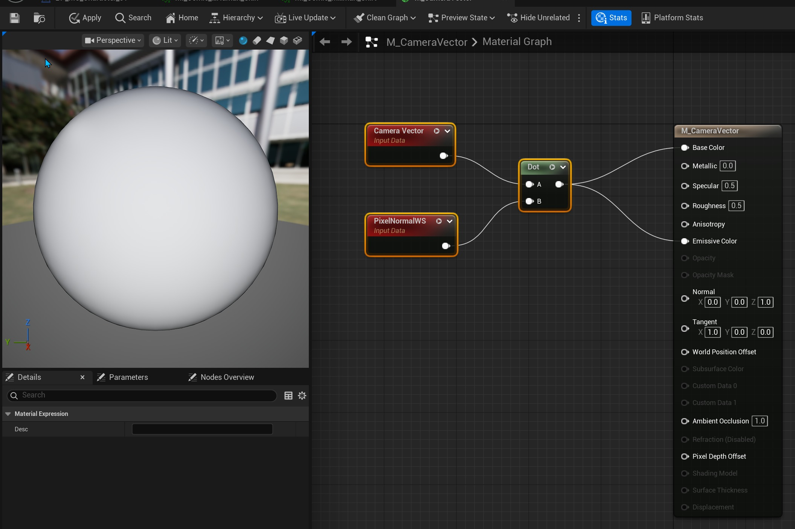
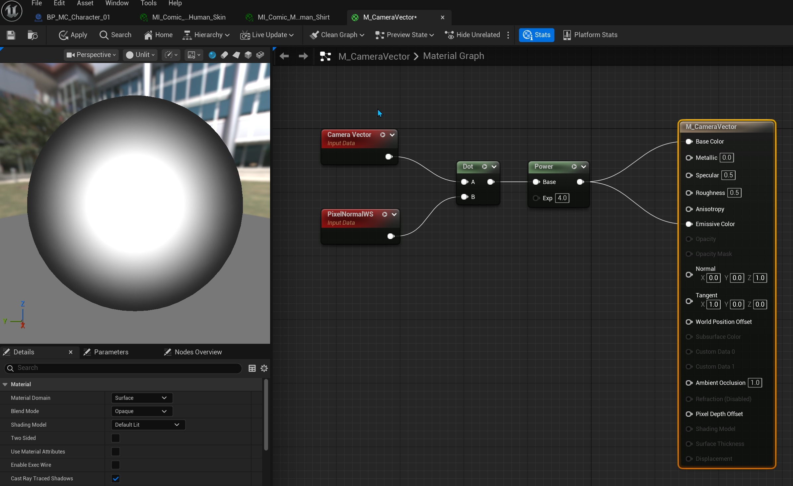
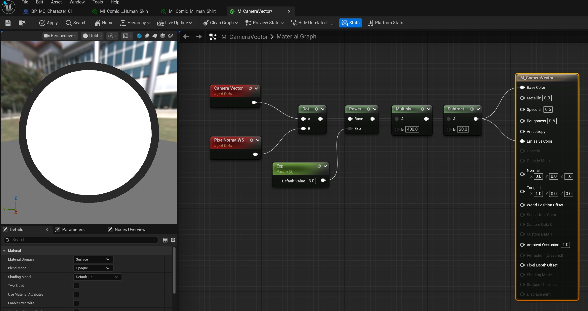
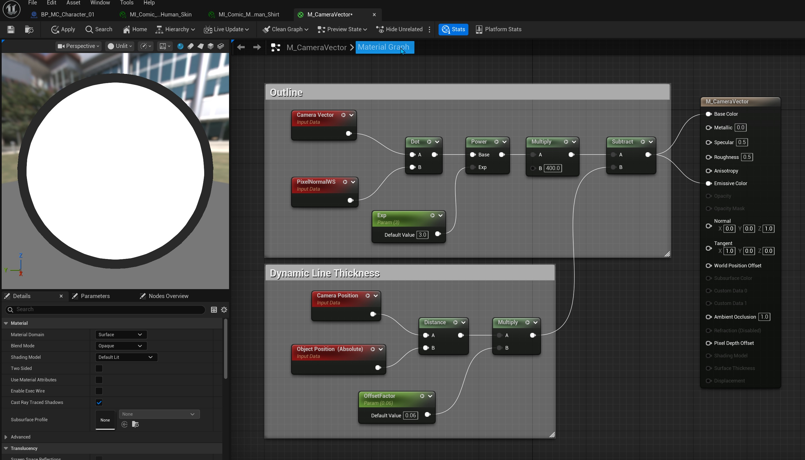
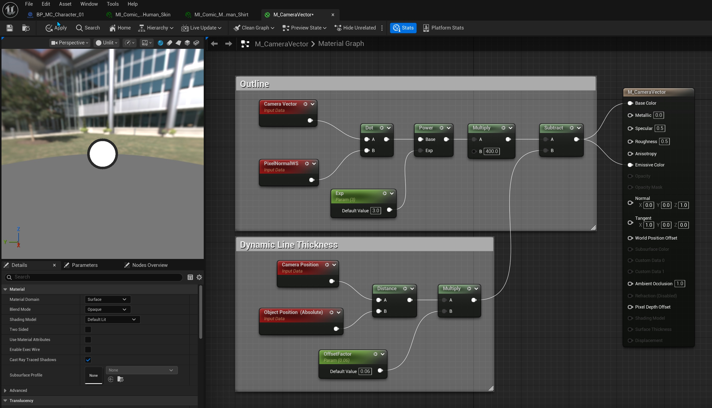
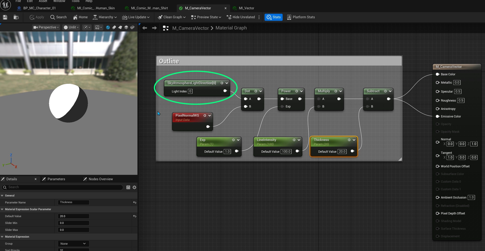
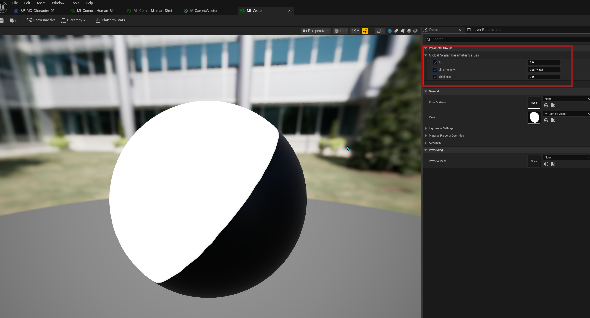
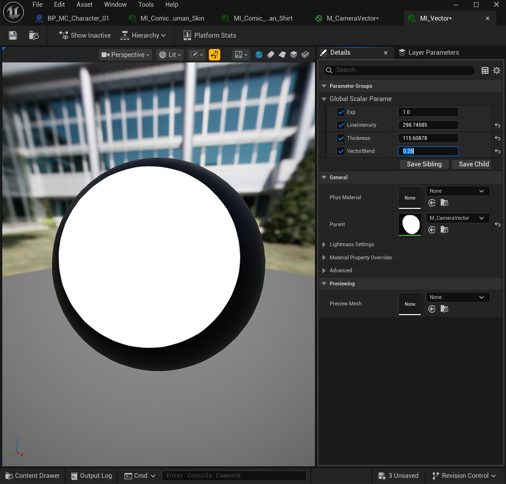
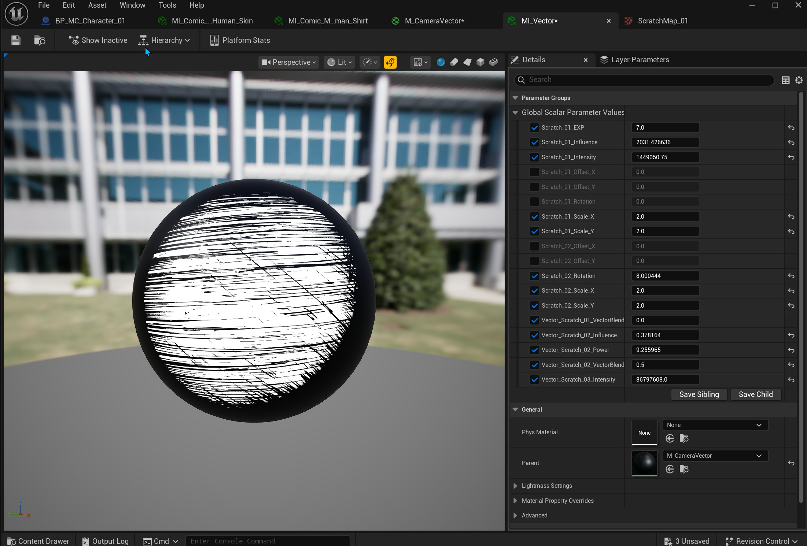
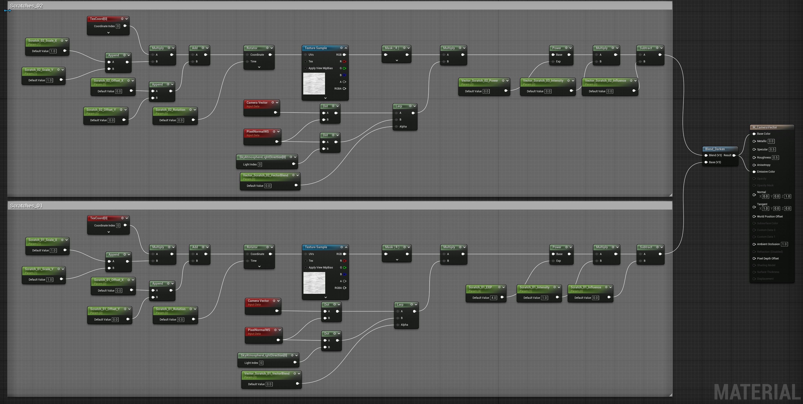

# 在虚幻引擎中利用漫画着色器的方向向量

## 来源与状态

- 原始 URL：https://dev.epicgames.com/community/learning/tutorials/OD2l/leveraging-directional-vectors-for-comic-shaders-in-unreal-engine

## 运行时分类

- 类型：图文教程
- 判断：API 未识别到核心视频信号，可整理正文约 6676 字符。

## 摘要

这是一个关于从相机有利位置和照明以及其他有用技术设置和使用矢量的简短教程。

## 中文整理

### 菲涅尔效应的相机矢量

相机的有利位置是一个强大的工具，我们可以利用它来创建基于边缘的效果。什么是入射角？简单来说，就是光线照射到表面的角度。以球体为例，如果我们通过查看法线来获取表面的入射角，我们可以看到边缘远离相机，因此看起来更暗，或者值小于 1，并且中心与相机矢量密切相关，颜色值更接近 1。要以编程方式执行此操作，我们可以采用相机前向矢量和世界空间中的像素法线，并采用点积，这将使我们在矢量之间进行比较。如果向量相等，则返回 1，如果不相等，则返回较小的值。

有关引擎中使用的数学节点的详细信息可以在这里找到：[https://dev.epicgames.com/documentation/en-us/unreal-engine/math-material-expressions-in-unreal-engine?application_version=5.4#dotproduct](https://dev.epicgames.com/documentation/en-us/unreal-engine/math-material-expressions-in-unreal-engine?application_version=5.4#dotproduct)非常好的工具，可以找到表面的边缘并用它做一些事情。但首先，我们必须采用这些颜色，并以艺术可指导的方式使它们更接近黑色或白色。为此，我们可以使用几个额外的数学节点。第一个是电源节点。 Power 表达式采用两个输入：基值 (Base) 和指数 (Exp)。它将基值求指数次方并输出结果。换句话说，它返回 Base 乘以自身 Exp 次。 （请参阅上述文档）通过将点积连接到 Power 节点并创建指数参数，我们可以复合来自点积节点的值并将它们驱动为更高的对比度值。

进一步深化这个概念，我们可以添加乘法器和减法节点来进一步推动这些值并对外观进行调整。这对于为漫画着色器创建静态网格轮廓非常有用。

额外好处：您可以获取相机和静态网格物体之间的距离，并使用它来保持任何距离处的线宽一致。只需获取世界空间中的相机位置和世界空间中的对象位置，然后使用距离节点，乘以浮点值并将其连接到减去节点。

### 光矢量

利用矢量的另一种方法是获取天窗的前向矢量，并以与之前使用相机方向相同的方式使用它。我还创建了与每个​​数学节点连接的参数。这将在调整材质实例中的参数时提供极大的灵活性和速度。

物质实例。

### 向量之间的混合

有时您可能希望从矢量解决方案中获得更多或更少的效果，或者可能调整表面上的效果。通过设置两种矢量类型并使用线性插值 (Lerp) 节点，您可以做到这一点。

当您开始分层使用不同的技术（例如阴影线）时，此技术尤其有用，您可能希望在较暗的区域中使用交叉阴影线。

### 用于矢量效果的自定义 BP Actor

为了进一步自定义，您可以使用蓝图来驱动自定义矢量对象，并通过材质参数集合在材质中使用这些值。首先，在内容浏览器中，右键单击并选择材质/材质参数集合这将生成一个新的资源。命名后，双击打开资产。在“矢量参数”部分下，单击加号按钮添加新的矢量参数。将其命名为自定义向量。在材质中，我们可以通过将 MPC 资源拖到材质图编辑器面板中来引用材质参数集合。将节点连接到点积节点，并像其他示例一样连接 PixelNormalWorldSpace 节点。其余设置与前面的示例相同。有一件事是，在此阶段您会收到错误，因此必须在详细信息面板中指定要使用集合中的哪个参数。错误应该消失了。接下来是构建蓝图 Actor 来更新材质。在内容浏览器中，右键单击并选择 Blueprint / Blueprint Class，然后选择 Actor。双击并打开蓝图编辑器。在“组件”选项卡的左上角，单击“添加”按钮，然后输入“箭头”以获取箭头组件。切换到 EventGraph 选项卡。添加 LiveLinkController 组件。在该组件的“详细信息”面板中，单击 On LiveLink Updated Plus 按钮。这将在 EventGraph 中创建一个新的事件节点。在变量部分下，添加材质参数集合/对象引用类型的新变量。单击闭上的眼睛使变量公开。这将允许在编辑器中更改变量，而无需稍后返回蓝图。将 Material ParameterCollection 资源拖到变量槽中。接下来是获取箭头的旋转值并使用该信息更新 MPC。因为我们使用的是 OnLiveLinkControllerUpdate，所以材料将不断更新。接下来，将箭头组件拖到图表中。单击其输出引脚并输入“获取世界旋转”。现在将 MPC 变量拖到图形中并拖出输出引脚，选择“设置向量参数值”。将输出执行引脚连接到设置向量参数执行引脚。右键单击“参数名称”引脚，然后创建“名称”变量。单击“编译”按钮以使值可供输入。将 CustomVector（MPC 中的向量参数名称）放入参数名称变量值中。右键单击连接到箭头的“获取世界旋转”节点上的“返回值”引脚，然后选择“分割引脚结构”。这将显示 3 轴。从 Return Value X 引脚拖动，然后输入 Multiply 以生成乘法节点。我们需要反转这些值才能正常工作，因此将 X 值乘以 -1。对 Y 轴和 Z 轴也重复这些步骤。右键单击“Set Vector Parameter Value”节点上的“Parameter Value”引脚，然后选择“Split Struct Pin”。这将显示矢量参数的 4 个值。从将 XYZ 结果连接到 RGB 值的每个值的“乘法”节点中拖动 单击“编译”。现在将 BP_Actor 拖到关卡中。将材质实例分配给球体，并沿 Y 和 Z 方向旋转箭头。你应该看到这样的东西：
