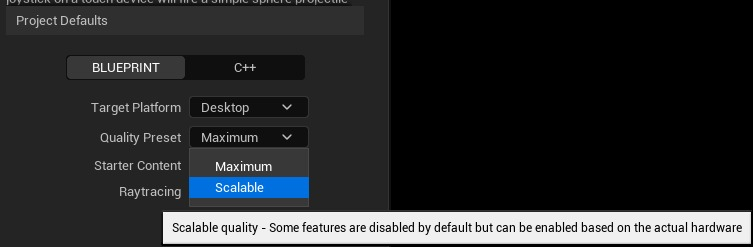
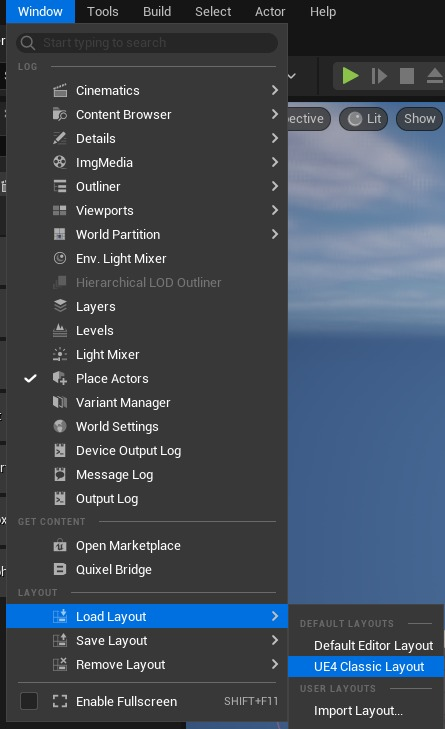
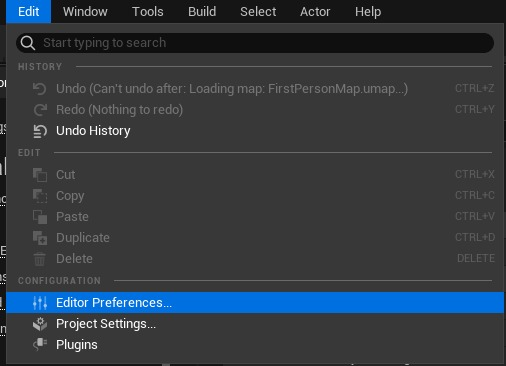
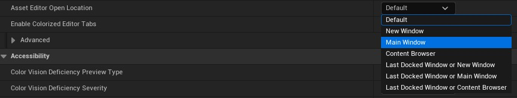
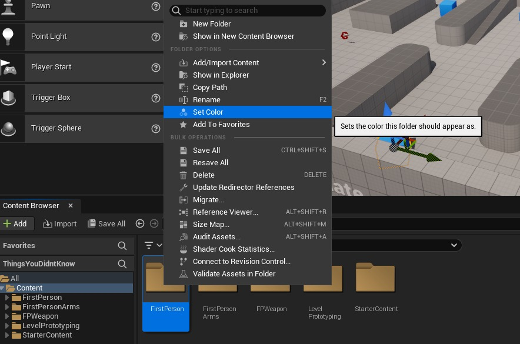
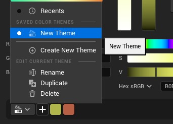
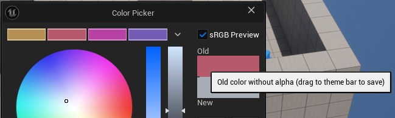
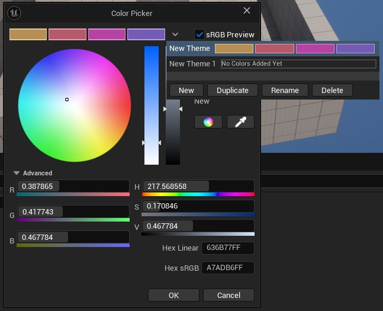
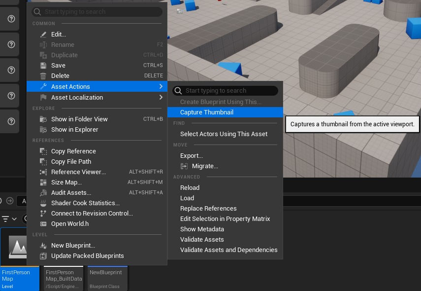
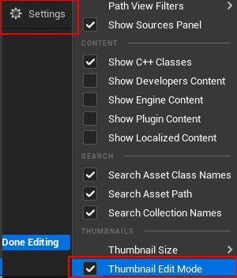

# 虚幻引擎中你不知道的事情（5.7 更新）

## 来源与状态

- 原始 URL：https://dev.epicgames.com/community/learning/tutorials/z0Km/things-you-didn-t-know-inside-of-unreal-engine-5-7-update

## 运行时分类

- 类型：图文教程
- 判断：API 未识别到核心视频信号，可整理正文约 8789 字符。

## 摘要

[开发中] 您认为您对虚幻引擎了解很多吗？再想一想，本教程有望让您了解引擎内部您可能不知道的东西。

## 中文整理

### 你可知道？

作为澳大利亚的虚幻授权讲师和教育者，我自己掌握了一些提示和技巧，然后也看到了学生和其他人在虚幻引擎生态系统中所做的事情。因此，这是一个汇集大量资源来帮助他人的小教程。我希望当我发现新的东西并将它们实现到本教程中时继续更新。在可预见的将来，这将是一个生动的教程。

### 虚幻引擎

### 做一个项目

现在我们开始进入引擎，让我们看看第一步。做一个项目。如果您的计算机稍低端，您可以在“可扩展”质量的基础上开始您的项目。项目开始后，您可以更改质量。在 5.7 中，光线追踪现在是 Lumen 硬件光线追踪的一部分，而不是单独的项目模板选项。



然后，您还可以打开和关闭入门内容和光线追踪（取决于您的硬件和版本）。

### 发动机布局

如果您是虚幻引擎的旧用户并且更喜欢虚幻引擎 4 布局。您无需尝试手动设置，只需单击“窗口”，然后转到“布局”、“加载布局”，然后单击“UE4 经典布局”。您还可以保存和加载自定义布局，特别是如果您以自己喜欢的特定方式使用 UE。保存布局并随身携带，这样您就可以省去每次完美设置的麻烦。



### 编辑器首选项



有几种不同的类型可供选择，因此您可以尝试并选择您想要的。作为一名教育者，我共享我的屏幕，所以我通常会选择“主窗口”



一定要查看与此相关的文档，以执行更多操作，例如更改视口中所选资源的轮廓以添加和更改键盘快捷键：[自定义虚幻引擎|自定义虚幻引擎]虚幻引擎 5.7 文档 | Epic 开发者社区](https://dev.epicgames.com/documentation/en-us/unreal-engine/customizing-unreal-engine)

### 内容浏览器

### 文件夹颜色

您知道吗，您可以将文件夹设置为有颜色？只需右键单击文件夹，然后选择“设置颜色”即可。



### 颜色主题

当它打开时，您会看到一个颜色选择器，从这里您可以做一些很酷的事情。不仅可以选择颜色，还可以制作一个可以重复使用的调色板（主题），以便将来快速轻松地选择不同的颜色。只需左键单击并将颜色从方块中拖动到顶部的下拉栏上，您就会看到它添加越来越多的颜色。在 5.7 中，颜色选择器略有变化，您将看到颜色主题的切换。这将打开和关闭颜色主题可见性。如果打开，您可以通过向下滚动底部并单击主题下拉列表并选择创建新主题来创建新主题。







### 关卡缩略图

您是否曾经厌倦在内容浏览器中查看级别，有时会因为没有遵循良好的命名约定而忘记什么级别是什么？现在我们有一个额外的技巧可以帮助您识别自己的级别，甚至无需查看名称。您知道可以向关卡添加缩略图吗？它会从您所在的关卡中截取视口的屏幕截图并将其应用到该关卡中？此屏幕截图显示了 FirstPersonMap。您必须处于适当的级别才能将屏幕截图添加到该级别的缩略图中。



我们有一个更简单的方法来确定您的水平，而无需阅读。

### 蓝图缩略图

您知道可以旋转蓝图的缩略图吗？在内容浏览器中，单击设置，然后打开“缩略图编辑模式”



要更改缩略图，只需左键单击缩略图，就会出现两个图标。一个用于循环原始形状，另一个用于重置缩略图。现在只需左键单击并拖动缩略图，它就会旋转。如果右键单击它并向上或向下拖动，它将放大或缩小

### 内容浏览器视图类型

现在默认情况下，我们都习惯将内容浏览器中的资源视为图块。你知道你可以改变这个吗？如果您选择内容浏览器右上角的“设置”，您可以更改查看事物的方式。您可以使用传统的图块，也可以使用列表或列。您还可以通过按住“CTRL”并滚动鼠标滚轮来放大或缩小缩略图。或者您可以再次单击内容浏览器上的设置并选择“缩略图大小”并在各种预设大小之间进行选择

### 内容

现在，当我们在此菜单中时，我们还可以更改一些其他内容以包括默认情况下未启用的一些内容。我们可以打开查看开发人员内容、引擎内容、插件内容和本地化内容的能力。这些本身就很有帮助，因为引擎中存在您可能想要使用的东西，而不是自己制作。完成此操作后，您将在内容浏览器中获得一些新文件夹，但现在您可以搜索基于引擎的材质/纹理等内容以在游戏中使用。想要显示一些表示蓝图有错误或您尚未完成设置的内容，您可以做一些有趣的事情，如果您在将 BP 放入场景后尚未选择某些内容（例如您尚未为传送蓝图选择目标演员），则可以让它显示十字。您可以在内容浏览器中的根目录（全部）文件夹中搜索“Bad”，将会出现一个红十字。或者，您已经做了正确的事情并为您的传送器 BP 选择了目标点，您可以搜索“Tick”并使用绿色勾号。

### 功能和内容包

您是否忘记在没有入门内容的情况下开始您的项目？这是一个简单的解决方法。在内容浏览器中，您实际上可以添加 Starter 内容以及其他模板或 C++ 内容。这意味着您可以轻松创建第一人称模板，然后引入第三人称模板以使用默认的第三人称角色来设置 AI。在 UE5.7 中，您不再拥有“内容”选项卡。相反，您可以找到一个较旧的项目，并将起始内容文件夹从其中复制并粘贴到新项目内容文件夹中。

### 视口

浏览视口相当容易，就像玩游戏一样。但是您是否曾经设置过视口来展示一些很酷的东西以便稍后返回，但随后却忘记了它到底在哪里？那么你可以很容易地再次找到它。

### 书签

按住 CTRL + 1 您可以添加书签。您可以对键盘顶部从 1 -> 0 的所有数字执行此操作。

### 视口选择

每次尝试在视口中选择多个内容时都会感到恼火，但你却忘记了这一件事。通过按住 CTRL + ALT 并左键单击并拖动，您可以一次拖动选择多个资源。

### 视口导航

想要快速获得您的正交视图之一？为此，有两种方法。第一种方法： 1. 左 = ALT+K 2. 前 = ALT+H 3. 上 = ALT+J 4. 后 = ALT+SHIFT+H 5. 右 = ALT+SHIFT+K 6. 下 = ALT+SHIFT+J 7. 透视 = ALT + G 第二种方法：按住 CTRL + 鼠标中键并向某个方向拖动。方向决定视野。

### 照明模式

在 5.7 中，这一点略有改变，主要是它的位置。它现在位于右上角，而不是位于视口的左上角。您还可以分别使用 ALT+ 4、3、2、5 和 6 在“亮”、“不亮”、“线框”、“详细照明”和“仅照明”之间快速更改视图模式。

### 视口选项

此外，在 5.7 中，视图模式、视口选项也移至右上角，缺少一些选项，如实时、显示 FPS、显示统计数据等。您还可以在视口选项中看到一些有趣的东西。想要在视口中查看游戏运行的 FPS，您可以在那里执行此操作。从屏幕上删除所有小部件，以便您可以拍摄漂亮的高分辨率屏幕截图，请在此处执行此操作。

### 片段

需要保存您创建的蓝图，以便您可以在另一个项目中再次使用它。只需使用 Epic Dev 网站上的片段即可。这个强大的工具让您只需在虚幻引擎和 Epic 开发站点之间复制并粘贴您的代码和其他代码即可。 [Epic 开发者社区 (epicgames.com) 的代码片段存储库](https://dev.epicgames.com/community/unreal-engine/snippets)

**BP_拾取父级**

```
Begin Object Class=/Script/BlueprintGraph.K2Node_ComponentBoundEvent Name="K2Node_ComponentBoundEvent_0" ExportPath="/Script/BlueprintGraph.K2Node_ComponentBoundEvent'/Game/Lessons/Blueprints/BP_Pickup.BP_Pickup:EventGraph.K2Node_ComponentBoundEvent_0'"
   DelegatePropertyName="OnComponentBeginOverlap"
   DelegateOwnerClass="/Script/CoreUObject.Class'/Script/Engine.PrimitiveComponent'"
   ComponentPropertyName="Sphere"
   EventReference=(MemberParent="/Script/CoreUObject.Package'/Script/Engine'",MemberName="ComponentBeginOverlapSignature__DelegateSignature")
   bInternalEvent=True
   CustomFunctionName="BndEvt__BP_Pickup_Sphere_K2Node_ComponentBoundEvent_0_ComponentBeginOverlapSignature__DelegateSignature"
   NodePosX=-256
   NodePosY=126
   NodeGuid=F1B0B41749B0F15DCEAA4F90399D3350
```

### Epic 游戏启动器

当我在教育机构工作时，我经常遇到虚幻引擎的问题，这些问题仅因我工作的环境而存在。下面概述了其中一些问题以及解决方案。由于代理，Epic Games Launcher 无法登录。没关系，它内置了代理设置，您可以在登录之前从启动器访问此设置：登录后，还有更多可用设置：
