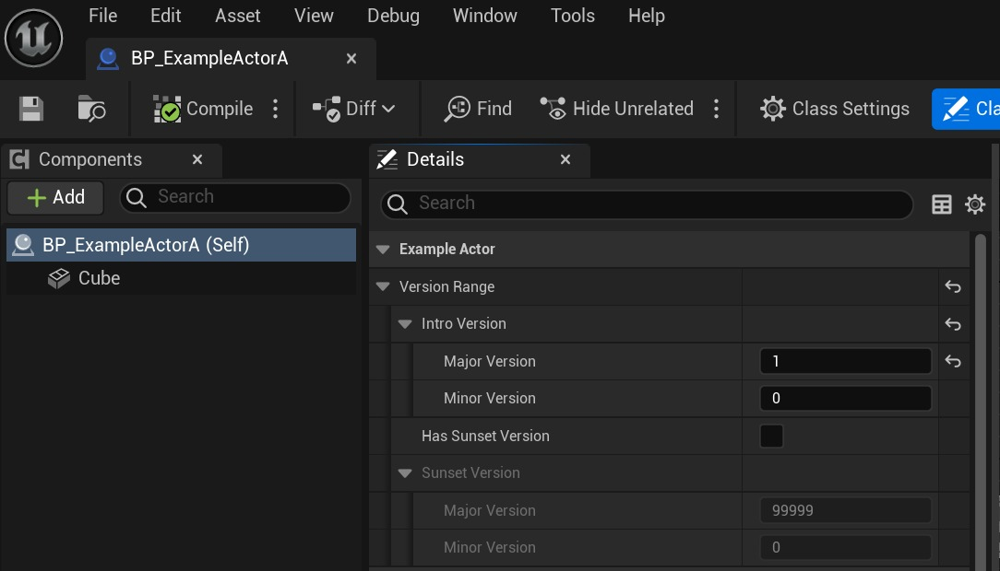
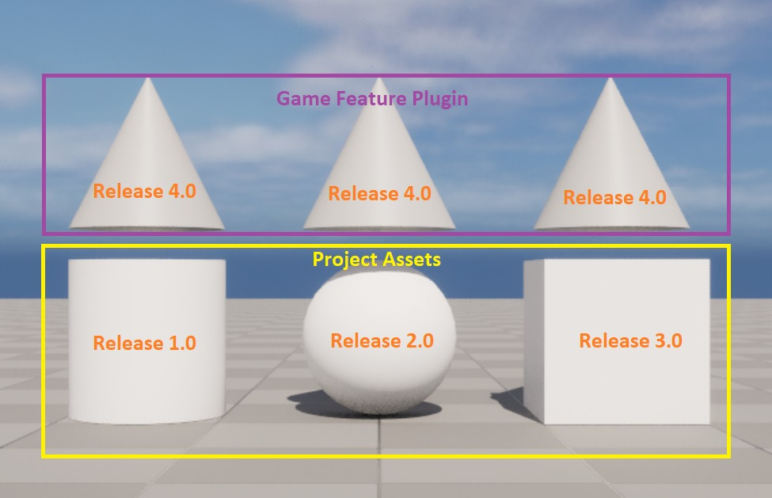
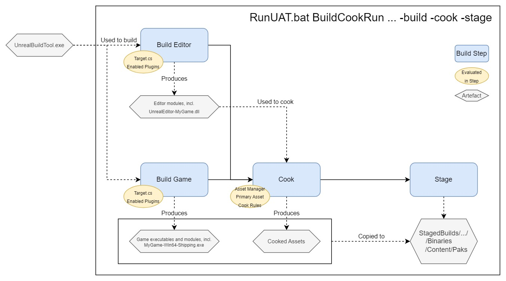

# 构建时资产和插件排除 (Part 1/4)

Source file: `unreal-engine-build-time-asset-and-plugin-exclusion.origin.md`.

This document was split during ue-kb import to keep source chunks buildable.

## 来源与状态

- 原始 URL：https://dev.epicgames.com/community/learning/tutorials/Kp1k/unreal-engine-build-time-asset-and-plugin-exclusion
## 运行时分类

- 类型：图文教程
- 判断：API 未识别到核心视频信号，可整理正文约 36133 字符。
## 摘要

编写代码以在构建和烹饪时决定将哪些主要资产和插件打包到游戏构建中（例如根据版本号），以将开发中和过季的游戏内容与已发布的内容分开，并减少数据挖掘。本教程包含一个示例项目，演示了 Epic 在 Fortnite 中采取的步骤。
## 中文整理
### 概览

本教程在 GitHub [此处](https://github.com/ZKShao-EpicGames/Sample-BuildTimeInclude) 上提供了一个随附的示例项目。
### 一、简介

本教程演示如何编写在构建和烹饪时评估的游戏代码，以实现将 .uassets 和 UE 插件包含在打包构建中的自定义规则。这些规则可能涉及系统环境变量、项目配置值、蓝图属性等。
### 主要和次要资产

当您将游戏分发给玩家时，他们可以访问您项目资产的熟版版本。运行游戏需要许多这些资源：想想蓝图、网格、纹理、动画和声音。在烹饪过程中，资产可以通过多种方式包含： 1. 项目的[资产管理器配置](https://dev.epicgames.com/documentation/en-us/unreal-engine/asset-management-in-unreal-engine#registeringandloadingprimaryassetsfromdisk) 确定考虑哪些资产类型[主要] asset](https://dev.epicgames.com/documentation/en-us/unreal-engine/asset-management-in-unreal-engine#primaryand secondaryassets) 以及要扫描的文件夹。 2. 项目的打包设置可以指定“要烘焙的其他资产目录”：这些文件夹中的资产始终会被烘焙，无论其类型如何。 3. 被另一个包含的资源引用的资源也会被烘焙。这些被称为二级资产。基于文件夹的资产包含 (1+2) 很有用，但您可能需要更精细的控制，例如编写自己的游戏版本检查逻辑来为扫描文件夹 (1) 中的每个主要资产选择是否包含它。同样，您可能希望根据游戏版本包含或排除整个插件（代码和资产）。本文将深入探讨如何实现这一目标。这很大程度上是基于 Epic 在《堡垒之夜》中控制季节性和开发中内容的做法。
### 开始减少数据挖掘

为什么要关心精细控制要打包的内容？原因之一是保持游戏文件较小：当只有 10 GB 与该游戏版本相关时，玩家无需下载 30 GB 的游戏文件。另一个重要原因是减少数据挖掘。当资产无意中包含在游戏发行版中时，玩家会提前了解未来的内容或收集有关该项目的其他信息。对于热门游戏来说，这可以保证分布式资产在每次游戏更新时都会被玩家检查和挑选。由于虚幻引擎发布的游戏数量众多，且引擎源代码的可用性，UE专用数据挖掘工具的存在，进一步加快了玩家对UE游戏进行数据挖掘的速度。数据挖掘是一个深入的主题，不会是本教程的重点，但了解要烹饪和暂存的主要资产和插件是缓解它的良好第一步。
### 2. 前提条件

要完全遵循本教程，您的虚幻引擎游戏项目必须是**代码项目**，并且您**必须从源代码构建虚幻引擎**。具体来说，对于单个主要资产包含，我们将重写 C++ 中的 UAssetManager 虚拟函数，需要一个代码项目。对于通过 UBT 目标文件（即 MyGame.Target.cs）构建时插件包含的演示方法，我们将覆盖需要从源构建 UE 的构建环境设置。了解如何从源代码构建 UE [此处](https://dev.epicgames.com/documentation/en-us/unreal-engine/building-unreal-engine-from-source)。我们不会修改 UE 源代码。建议遵循在 UE 中编写 C++ 的经验。使用 C# 的经验会有所帮助，但不是必需的。虽然您必须从源代码编译虚幻引擎以实现此处讨论的构建时插件包含方法，但您可以考虑其他方法，例如在构建之前使用自定义脚本修改 .uproject 或 .uplugin 文件。这将是预编译的虚幻引擎兼容的，但我们不会在这里介绍它。
### 3. 示例项目

本教程中提供的所有代码都是示例项目的一部分，该项目可在 GitHub [此处](https://github.com/ZKShao-EpicGames/Sample-BuildTimeInclude) 上找到。它针对从源代码构建的 UE 5.3.2，您可以从 GitHub [此处](https://github.com/EpicGames/UnrealEngine/tree/5.3) 获取该源代码。如果您无权访问该页面，请按照[此页面](https://www.unrealengine.com/en-US/ue-on-github)上的步骤访问 GitHub 上的引擎源代码。示例项目中的哪些资产和插件被烘焙和打包是根据项目的 **release version** 值 **X.Y** 确定的。资产和游戏功能插件被分配了应包含在其中的最小和可选的最大发行版本。当插件被排除时，它的代码模块不会被编译，并且它的资产也会被排除在烹饪和暂存之外。



在进行游戏构建时，示例项目首先尝试从环境变量 EXAMPLE_RELEASE_VERSION 中读取构建的发布版本，否则从 DefaultGame.ini 中设置的值 ExampleReleaseVersion 中读取。环境变量优先，以便在构建时轻松覆盖它。

**批处理文件中的发布版本**

```
set EXAMPLE_RELEASE_VERSION=4.0
```

**DefaultGame.ini 中的发布版本**

```
[MyGame]
ExampleReleaseVersion=2.0
```

这些值本身不会执行任何操作，但我们的 UBT Target.cs 文件和游戏代码的自定义 UAssetManager 都会检查这些位置以确定发布版本。然后他们将决定要编译和烹饪哪些内容。在示例项目中，三个蓝图资产、两个数据资产和一个游戏功能插件都是以这种方式管理的。它们都有要包含的最低和可选最高游戏发行版本。尽管示例项目中仅演示了蓝图和数据资产，但您可以对其他资产类型执行相同的操作。当某个 actor 类被排除在烹饪之外时，示例项目演示了如何跳过该 actor 类的映射放置实例的序列化。以下是根据您构建和烹饪的 ExampleReleaseVersion 值打包的内容： - ExampleReleaseVersion 1.0：仅包含 BP_ExampleActorA：圆柱体 actor - ExampleReleaseVersion 2.0：还包括 BP_ExampleActorB：球体 actor - ExampleReleaseVersion 3.0：还包含 BP_ExampleActorC：立方体 actor - ExampleReleaseVersion 4.0：包括一个游戏功能插件，通过“添加组件”游戏功能操作，为基础游戏中的所有上述演员添加“帽子”（锥形网格）。



GameFeature 插件演示了“[添加组件](https://dev.epicgames.com/documentation/de-de/unreal-engine/game-features-and-modular-gameplay-in-unreal-engine#addingcomponents)”游戏功能操作的使用。反过来，它使用 ModularGameplay 框架通过新内容来增强现有的 Actor 类。它确实要求 Actor 类向模块化游戏框架注册自己，请参阅 ComponentManager->AddReceiver(this);在 AExampleActor::BeginPlay() 中。您可以在此[演示文稿](https://www.youtube.com/watch?v=3PBnqC7TxvM&t=334s) 中了解更多相关信息。该示例项目包含一个bat 文件 RunBuildCookStage.bat 。您应该修改它以指向您的虚幻引擎源构建。之后，您可以使用它来方便地构建、烹饪和暂存项目。您也可以在该文件中设置 EXAMPLE_RELEASE_VERSION 环境变量。或者，不指定环境变量并通过 DefaultGame.ini 控制版本。

**运行BuildCookStage.bat**

```cpp
set EXAMPLE_RELEASE_VERSION=4.0
REM Put your UE path here
"U:\UE\5.3R\Engine\Build\BatchFiles\RunUAT.bat" BuildCookRun -project="%cd%/BuildTimeInclude.uproject" -clientconfig=Development -build -cook -stage
```

例如：当构建发布版本为 2.5 的版本时，它将如下图所示，因为剩余的资源和插件被排除在外。您可以在 Saved/StaggedBuilds/Windows/Manifest_UFSFiles_Win64.txt 中检查清单，确认仅生成了预期的文件。成功构建后，尝试 1.0 和 4.0 之间的不同值，然后再次构建以查看效果。本教程的其余部分将介绍如何实现这一点。


### Fortnite 提示：发布版本特殊字符串

尽管此示例项目仅演示了 X.Y 发行版本编号，但在 Fortnite 发行版本中，字符串要么编号为“28.00”，要么编号为“Future”等特殊字符串。所有新创建的资产默认为“未来”版本。当资产指定其第一个相关发布版本是“未来”时，它永远不会包含在面向玩家的发布版本中，尽管我们已经实现了一些构建标志以将它们包含在开发版本中。
### 4. 构建步骤概述

RunBuildCookStage.bat 演示了如何使用 [虚幻自动化工具](https://dev.epicgames.com/documentation/en-us/unreal-engine/unreal-automation-tool-overview-for-unreal-engine) (UAT) 及其 BuildCookRun 命令来进行构建。 UAT 通过链接构建、烹饪和部署步骤来提供帮助。每个步骤的输出都将在下一步中使用。 [构建操作文档页面](https://dev.epicgames.com/documentation/en-us/unreal-engine/build-operations-cooking-packaging-deploying-and-running-projects-in-unreal-engine)提供了各个步骤的定义以及有关 BuildCookRun 的更多信息。在 **构建 ** 步骤中，将评估您的 UBT 目标文件（例如 MyGame.Target.cs 和 MyGameEditor.Target.cs）。您可以向目标文件添加逻辑来评估是否包含其他插件，这同时控制插件的代码是否被编译以及插件的资产是否被考虑用于烹饪。在 **Cook** 步骤期间，编辑器构建的已编译资产管理器将扫描目录以查找主要资产。我们将对哪些主要资产最终被煮熟或被遗漏实施更精细的控制。简而言之：示例项目演示了**构建时**插件包含和**烹饪时**资产包含。至于插件资产：只有在构建时包含其插件时，才会对它们进行烹饪评估。为了实现这一点，构建步骤会生成一个类似于 Binaries/Win64/BuildTimeInclude-Win64-Shipping.target 的清单，该清单在烘焙时读取以列出要烘焙其资产的插件。请注意，烹饪是使用**编辑器构建**完成的。这意味着适用于游戏构建的 C++ 预处理器宏（例如 #if UE_BUILD_SHIPPING、#if PLATFORM_WINDOWS 、 #if UE_SERVER ）不会影响烹饪过程。另一方面， ifWITH_EDITOR 部分内的代码确实适用于 Cook 过程。


### 5. 构建时插件包含

该示例项目具有一个[游戏功能插件](https://dev.epicgames.com/documentation/de-de/unreal-engine/game-features-and-modular-gameplay-in-unreal-engine) (GFP)，但以下内容适用于任何插件。请注意，作为项目一部分的插件的启用/禁用状态（在 .uproject、.uplugin 或 Target.cs 文件中设置）与 GFP 的安装/注册/加载/活动状态不同。后者是启用的 GFP 的运行时状态。该示例项目演示了通过 [UBT 目标文件](https://dev.epicgames.com/documentation/en-us/unreal-engine/unreal-engine-build-tool-target-reference) 在构建时包含插件：MyGame.Target.cs 和 MyGameEditor.Target.cs。这些在多个上下文中进行评估，例如生成项目文件时以及在编译编辑器和游戏代码之前设置构建环境。
