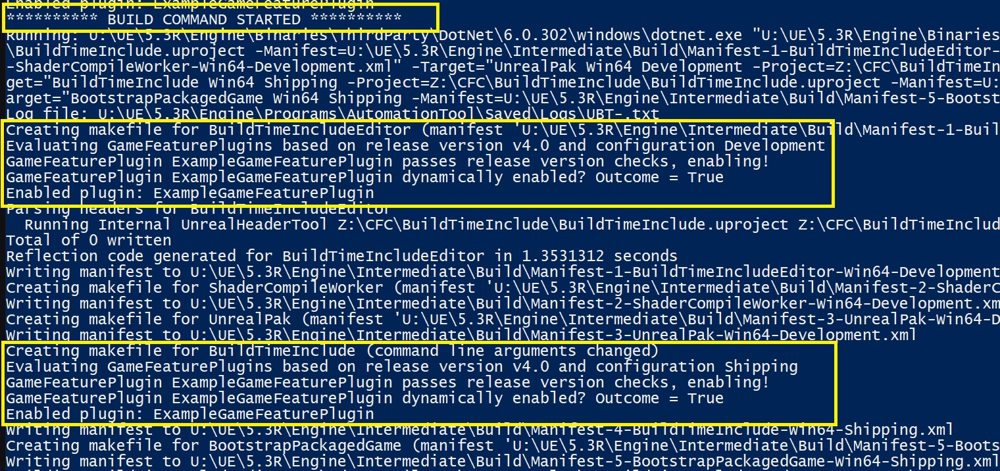
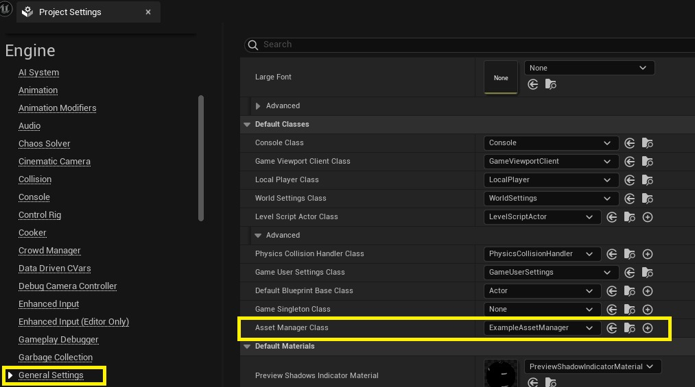
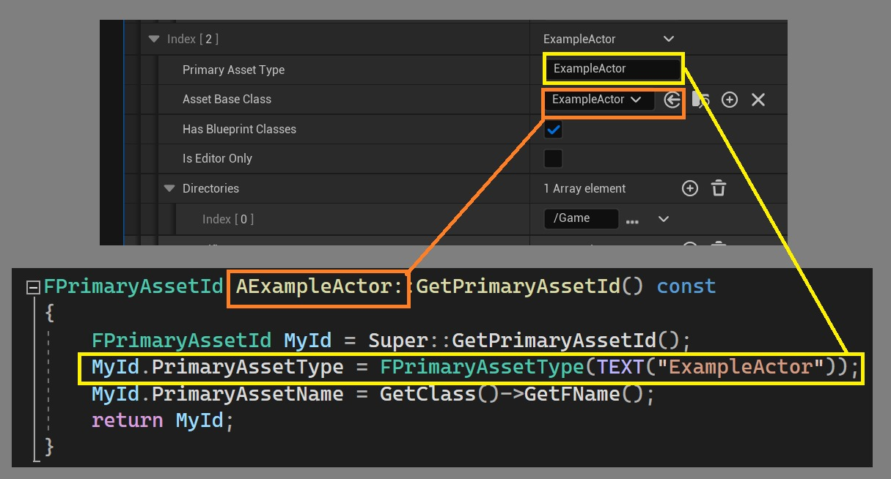

# 构建时资产和插件排除 (Part 2/4)

Source file: `unreal-engine-build-time-asset-and-plugin-exclusion.origin.md`.

This document was split during ue-kb import to keep source chunks buildable.

### 搭建环境

TargetRules 类包含一个 [EnablePlugins](https://dev.epicgames.com/documentation/en-us/unreal-engine/unreal-engine-build-tool-target-reference#read-onlyproperties) 属性，我们可以将插件名称添加到其中作为附加插件进行编译和烹饪。这就是我们要写的内容。使用默认的构建环境设置，添加到 EnablePlugins 的条目将被忽略，并且每当 UBT 运行评估目标文件时写入它都会引发错误：

```
Explicitly enabling and disabling plugins for a target is only supported when using a unique build environment (eg. for monolithic game targets). EnabledPlugins=ExampleGameFeaturePlugin, DisabledPlugins=
```

您必须设置一个允许覆盖构建环境设置的标志或使用唯一的构建环境。在您的游戏和编辑器目标文件中，执行以下任一操作： 1. 设置 bOverrideBuildEnvironment = true；允许覆盖构建环境设置。将从引擎的 Intermediate 文件夹中使用引擎模块。潜在的好处是，在开发多个游戏项目时，不需要重新编译引擎，并且引擎中间产物不会多次占用磁盘空间。缺点是，当您的游戏项目之一具有不同的构建环境设置时，可能需要重新编译引擎。每次您处理具有与上次编译不同的构建环境配置的虚幻项目时，都可能会发生这种情况。 2. 或者，设置 BuildEnvironment = TargetBuildEnvironment.Unique;使用独特的构建环境。引擎模块将在游戏项目的 Intermediate 文件夹中针对游戏项目进行唯一编译。当多个游戏项目具有不同的构建环境设置时，请使用此选项，以避免引擎源代码的过度重新编译。它将要求您为该游戏项目完全编译引擎一次，并将导致更多的磁盘空间使用。重申一下：您必须从源代码编译 UE。将插件名称添加到 Target.cs 文件中的 EnablePlugins 并使用预编译的 UE 进行构建将导致大多数构建环境配置出现构建时错误，但否则会导致在打包游戏中安装插件时出现静默失败。
### 插件枚举

因此，当我们知道插件名称时，我们就知道如何在 MyGame.Target.cs 和 MyGameEditor.Target.cs 文件中启用插件。然而，将插件名称硬编码到目标文件中并不是很好，因为每当我们创建新插件时都需要重新访问该文件。相反，我们将检测所有插件描述符 (.uplugin) 文件并访问这些文件的自定义属性来决定是否包含它们。 UBT 包含一个实用程序类 PluginsBase，它将在某个基目录中查找所有 .uplugin 文件。在示例项目中，我们将在 /Plugins/GameFeatures 目录中找到所有 .uplugin 文件。子文件夹是可选的，GameFeature 插件的使用也是可选的：这适用于任何插件。

**Target.cs 中的插件枚举**

```cpp
DirectoryReference GameFeaturePluginsDir = DirectoryReference.Combine(Target.ProjectFile.Directory, "Plugins", "GameFeatures");
if (DirectoryReference.Exists(GameFeaturePluginsDir))
{
	// Iterate over all plugins in the folder
	foreach (FileReference PluginFile in PluginsBase.EnumeratePlugins(GameFeaturePluginsDir))
	{
		... Processing per plugin
	}
}
```

.uplugin 文件的内容是 Json 格式的，因此我们可以使用 Epic 提供的 JsonObject 类来解析。示例项目的ExampleGameFeaturePlugin.uplugin 文件中的相关值是：

**示例GameFeaturePlugin.uplugin**

```
{
	"FriendlyName": "ExampleGameFeaturePlugin",
	"Description": "Adds hats to ExampleActors",
	...
	"EnabledByDefault": false,
	"IntroVersion": "4.0",
	"HasSunsetVersion": false,
	"SunsetVersion": "123.0"
}
```

以下是我们如何使用 JsonObject 从 uplugin 文件中提取 IntroVersion 值。解析剩余值的方法类似：

**使用 JsonObject 提取 .uplugin 值**

```cpp
// Parse uplugin file as Json object
JsonObject RawObject = JsonObject.Read(PluginFile);

// Get intro version string from uplugin
string IntroVersionStr;
if (!RawObject.TryGetStringField("IntroVersion", out IntroVersionStr))
{
	Logger.LogWarning("GameFeaturePlugin {Arg0}, does not specify an IntroVersion. This is required for GameFeaturePlugins in this project.", PluginName);
	throw new Exception("Missing required IntroVersion field in .uplugin");
}
```
### Fortnite 提示：强制默认禁用插件

在 Fortnite 中，我们要求每个可以在构建时启用的插件的 EnabledByDefault 为 false。我们强制将这些插件配置为 disa...

```cpp
JsonObject RawObject = JsonObject.Read(PluginFile);
PluginDescriptor Descriptor = new PluginDescriptor(RawObject, PluginFile);

// Validate that GameFeaturePlugins are disabled by default
if (!Descriptor.bEnabledByDefault.HasValue || Descriptor.bEnabledByDefault.Value == true)
{
	Logger.LogWarning("GameFeaturePlugin {Arg0}, does not set EnabledByDefault to false. This is required for GameFeaturePlugins in this project.", PluginName);
	throw new Exception("Missing required EnabledByDefault: false in .uplugin");
}
```
### 读取UBT中的目标发布版本

**读取环境变量**

```cpp
// Try to get release version from system environment variables.
// Recommended method to override the DefaultGame.ini value for a single build.
public static bool GetReleaseVersionFromEnvVar(ILogger Logger, out ReleaseVersion Version)
{
	string EnvVar = System.Environment.GetEnvironmentVariable("EXAMPLE_RELEASE_VERSION");
	if (EnvVar != null)
	{
		try
		{
			Version = ReleaseVersion.Parse(EnvVar);
```

**读取配置 INI 值**

```cpp
// Get the release version from DefaultGame.ini
public static bool GetReleaseVersionFromConfig(ILogger Logger, FileReference ProjectFile, out ReleaseVersion Version)
{
	FileReference GameIni = FileReference.Combine(ProjectFile.Directory, "Config", "DefaultGame.ini");
	if (GameIni == null || !FileReference.Exists(GameIni))
	{
		Logger.LogError("DefaultGame.ini was not found in Config.");
		throw new BuildException("Failed in GetReleaseVersionFromConfig()");
	}
```

**将字符串解析为数字**

```cpp
// Parse a string like X.Y into Major and Minor components
public static ReleaseVersion Parse(string Value)
{
    string[] Tokens = Value.Split('.', 2);
    if (Tokens.Length == 2)
    {
        ReleaseVersion Result = new ReleaseVersion(0, 0);
        Result.MajorVersion = int.Parse(Tokens[0]);
        Result.MinorVersion = int.Parse(Tokens[1]);
        return Result;
```

**确定发布版本**

```cpp
// Get the target release version, prioritizing environment var, then Config
public static bool GetTargetReleaseVersion(ILogger Logger, FileReference ProjectFile, out ReleaseVersion Version)
{
    return GetReleaseVersionFromEnvVar(Logger, out Version) || GetReleaseVersionFromConfig(Logger, ProjectFile, out Version);
}
```
### 最终结果：包括一个用于构建和烹饪的插件

**完整的实用功能来检测要启用的插件**

```cpp
public static void ConfigureGameFeaturePlugins(TargetInfo Target, ILogger Logger, FileReference ProjectFile, List<string> OutDisablePlugins, List<string> OutEnablePlugins)
{
    // Parse release version for this build. Command line argument takes precedence, otherwise use DefaultGame.ini ProjectVersion
    ReleaseVersion TargetVersion;
    GetTargetReleaseVersion(Logger, ProjectFile, out TargetVersion);
    Logger.LogInformation("Evaluating GameFeaturePlugins based on release version v{Arg0}.{Arg1} and configuration {Arg2}",
        TargetVersion.MajorVersion, TargetVersion.MinorVersion, Target.Configuration.ToString());

    // We will explore the Plugins/GameFeatures folder
    DirectoryReference GameFeaturePluginsDir = DirectoryReference.Combine(Target.ProjectFile.Directory, "Plugins", "GameFeatures");
```


### 6. 烹饪时资产包含
### 资产管理子类



**或者：在 Config 中设置 Asset Manager 类**

```
[/Script/Engine.Engine]
AssetManagerClassName=/Script/MyProject.ExampleAssetManager
```
### 主要资产枚举

**按类型列出主要资产**

```cpp
#if WITH_EDITOR
void UExampleAssetManager::ApplyPrimaryAssetLabels()
{
	Super::ApplyPrimaryAssetLabels();
	
	// Retrieve list of all primary asset types.
	TArray<FPrimaryAssetTypeInfo> AssetTypeInfoList;
	GetPrimaryAssetTypeInfoList(AssetTypeInfoList);

	// Parse them and update their labels depending on whether we want to include it in this build.
```


