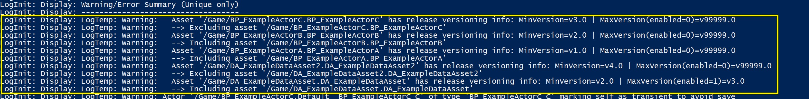
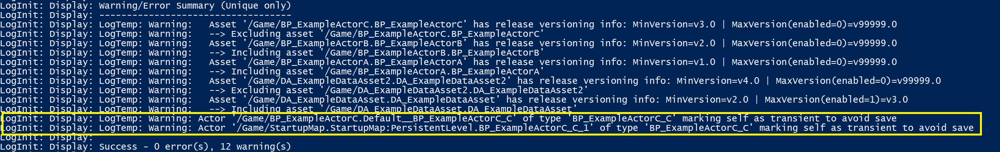

# 构建时资产和插件排除 (Part 3/4)

Source file: `unreal-engine-build-time-asset-and-plugin-exclusion.origin.md`.

This document was split during ue-kb import to keep source chunks buildable.

### 主要资产厨师规则

**控制资产是否已煮熟**

```cpp
const bool bShouldIncludeAsset = ...; // TO DISCUSS

// Override the cook rule based on that decision
FPrimaryAssetRules Rules = GetPrimaryAssetRules(PrimaryAssetId);
Rules.CookRule = bShouldIncludeAsset ? EPrimaryAssetCookRule::AlwaysCook : EPrimaryAssetCookRule::NeverCook;
SetPrimaryAssetRules(PrimaryAssetId, Rules);
```
### 资产注册表标签：类不可知版本控制

**版本控制信息结构**

```cpp
USTRUCT(BlueprintType)
struct BUILDTIMEINCLUDE_API FExampleVersion
{
	GENERATED_USTRUCT_BODY()
	
	// Major component of the version number {Major.Minor}
	UPROPERTY(EditAnywhere, BlueprintReadOnly)
	int32 MajorVersion = 0;
	// Minor component of the version number {Major.Minor}
	UPROPERTY(EditAnywhere, BlueprintReadOnly)
```

**AssetRegistry可搜索属性**

```cpp
UCLASS()
class BUILDTIMEINCLUDE_API AExampleActor : public AActor
{
	GENERATED_BODY()
	...

	// The range of game versions in which this actor should be included.
	UPROPERTY(EditDefaultsOnly, AssetRegistrySearchable)
	FExampleVersionRange VersionRange;
```

```cpp
FString FExampleVersionRange::ToAssetTagValue(const FExampleVersionRange& Range)
{
    // Default struct to string, similar to FStructProperty::ExportText_Internal.
    FString OutVal;
    FExampleVersionRange::StaticStruct()->ExportText(OutVal, &Range, nullptr, nullptr, 0, nullptr, false);
    return OutVal;
}
```

```cpp
FExampleVersionRange AssetVersionRange;
AssetData.GetTagValue<FExampleVersionRange>(FExampleVersionRange::AssetTagName, AssetVersionRange);
```

**LexFromString 实现以促进 GetTagValue**

```cpp
void LexFromString(FExampleVersionRange& OutValue, const TCHAR* Buffer)
{
    FExampleVersionRange::StaticStruct()->ImportText(Buffer, &OutValue, nullptr, 0, nullptr, "");
}
```
### 读取UE中的目标发布版本

**读取环境变量**

```cpp
bool UExampleAssetManager::TryGetReleaseVersionFromEnvVar(FExampleVersion& OutReleaseVersion)
{
	// Try to retrieve the release version from environment variable
	const FString EnvVarValue = FPlatformMisc::GetEnvironmentVariable(TEXT("EXAMPLE_RELEASE_VERSION"));
	if (EnvVarValue.Len() > 0)
	{
		if (TryParseReleaseVersion(EnvVarValue, OutReleaseVersion))
		{
			UE_LOG(LogTemp, Warning, TEXT("Parsed release version %s from environment variable."), *OutReleaseVersion.ToString());
			return true;
```

**从 INI 读取**

```cpp
bool UExampleAssetManager::TryGetReleaseVersionFromConfig(FExampleVersion& OutReleaseVersion)
{
	// Retrieve release version from DefaultGame.ini and treat as release version.
	FString ExampleReleaseVersion;
	if (GConfig->GetString(TEXT("MyGame"), TEXT("ExampleReleaseVersion"), ExampleReleaseVersion, GGameIni))
	{
		if (TryParseReleaseVersion(ExampleReleaseVersion, OutReleaseVersion))
		{
			UE_LOG(LogTemp, Warning, TEXT("Parsed release version %s from Config ExampleReleaseVersion."), *OutReleaseVersion.ToString());
			return true;
```

**将字符串解析为 FExampleVersion**

```cpp
bool UExampleAssetManager::TryParseReleaseVersion(const FString& StringValue, FExampleVersion& OutReleaseVersion)
{
	if (!StringValue.IsEmpty())
	{
		TArray<FString> Tokens;
		StringValue.ParseIntoArray(Tokens, TEXT("."));
		if (Tokens.Num() == 2)
		{
			// Parse the version number
			OutReleaseVersion.MajorVersion = FCString::Atoi(*Tokens[0]);
```

**发布版本可选静态缓存**

```cpp
/** 
 * Public static function so that anyone can retrieve the release version.
 * In general, assets and other systems shouldn't get() this release version,
 * but rely on AssetManager to get their intended version range instead.
 *
 * You can consider moving the getter function to a small code module so that
 * other modules/plugins can import this getter function.
 */
FExampleVersion UExampleAssetManager::GetReleaseVersion()
{
```

**发布版本对比。范围比较。**

```cpp
int8 FExampleVersion::Compare(const FExampleVersion& Reference, const FExampleVersion& Value)
{
    const int8 Sign = FMath::Sign<int8>(Value.MajorVersion - Reference.MajorVersion);
    return Sign != 0 ? Sign : FMath::Sign<int8>(Value.MinorVersion - Reference.MinorVersion);
}

bool FExampleVersionRange::DoesRangeInclude(const FExampleVersion& Version) const
{
    return (FExampleVersion::Compare(IntroVersion, Version) >= 0) && (!bHasSunsetVersion || FExampleVersion::Compare(SunsetVersion, Version) < 0);
}
```
### 最终结果：包括烹饪的主要资产

**结果：基于版本的主要资产烹饪**

```cpp
#if WITH_EDITOR
void UExampleAssetManager::ApplyPrimaryAssetLabels()
{
	Super::ApplyPrimaryAssetLabels();

	// Get target release version
	const FExampleVersion TargetReleaseVersion = GetReleaseVersion();
	UE_LOG(LogTemp, Log, TEXT("UExampleAssetManager::ApplyPrimaryAssetLabels START - Release version = %s"), *TargetReleaseVersion.ToString());

	// Retrieve list of all primary asset types.
```




```
BuildTimeInclude/Content/BP_ExampleActorA.uasset	2024-05-08T23:03:32.793Z
BuildTimeInclude/Content/BP_ExampleActorA.uexp	2024-05-08T23:03:32.794Z
BuildTimeInclude/Content/BP_ExampleActorB.uasset	2024-05-08T23:03:32.890Z
BuildTimeInclude/Content/BP_ExampleActorB.uexp	2024-05-08T23:03:32.891Z
BuildTimeInclude/Content/DA_ExampleDataAsset.uasset	2024-05-08T23:03:29.471Z
BuildTimeInclude/Content/DA_ExampleDataAsset.uexp	2024-05-08T23:03:29.471Z
```
### 特殊情况：基于版本的地图参与者排除

**全局可调用检查任何资产的版本范围**

```cpp
bool UExampleAssetManager::DoesVersionRangeInclude(const FExampleVersionRange& VersionRange)
{
	// Get (possibly cached) target release version
	const FExampleVersion ReleaseVersion = GetReleaseVersion();
	// Check whether the passed in version range includes it
	return VersionRange.DoesRangeInclude(ReleaseVersion);
}
```

**Actor 实例在版本不匹配时将自身标记为瞬态**

```cpp
#if WITH_EDITOR
void AExampleActor::PostLoad()
{
	Super::PostLoad();

	// If cooking and target release version excludes this class, mark self as transient so the object won't be saved.
	// This will apply to blueprint class default objects and map instances. Transient objects are not serialized when
	// their outer package is cooked, see FSaveContext::GetSaveableStatusNoOuter. For example, actor instances that are 
	// transient are not saved when the outer map is cooked.
	if (IsRunningCookCommandlet() && !UExampleAssetManager::DoesVersionRangeInclude(VersionRange))
```



**意外序列化的 Actor 实例出现运行时加载错误**

```cpp
LogStreaming: Warning: Missing Dependency, missing package import 0x600000002 for package /Game/StartupMap
LogStreaming: Error: CreateExport: /Game/StartupMap (0xCABDFE23AA78EF25) /Game/StartupMap (0xCABDFE23AA78EF25) - Could not find class object for BP_ExampleActorC_C_1
LogStreaming: Warning: CreateExport: /Game/StartupMap (0xCABDFE23AA78EF25) /Game/StartupMap (0xCABDFE23AA78EF25) - Skipped failed export BP_ExampleActorC_C_1
```
