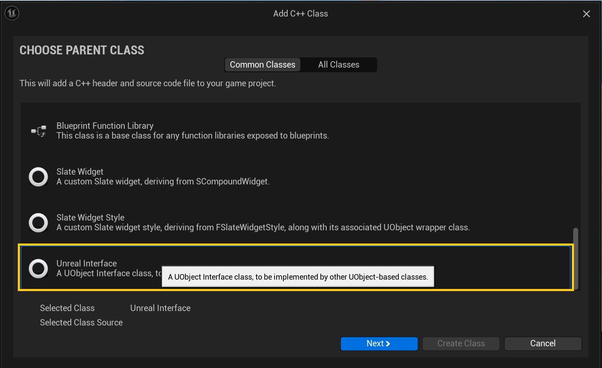
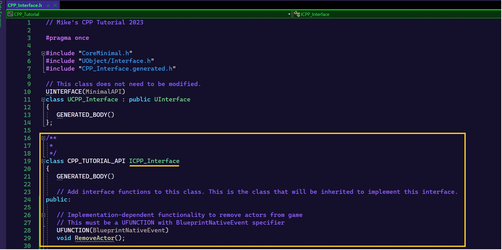
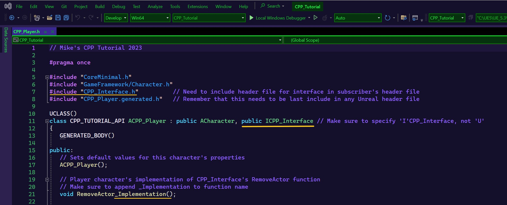
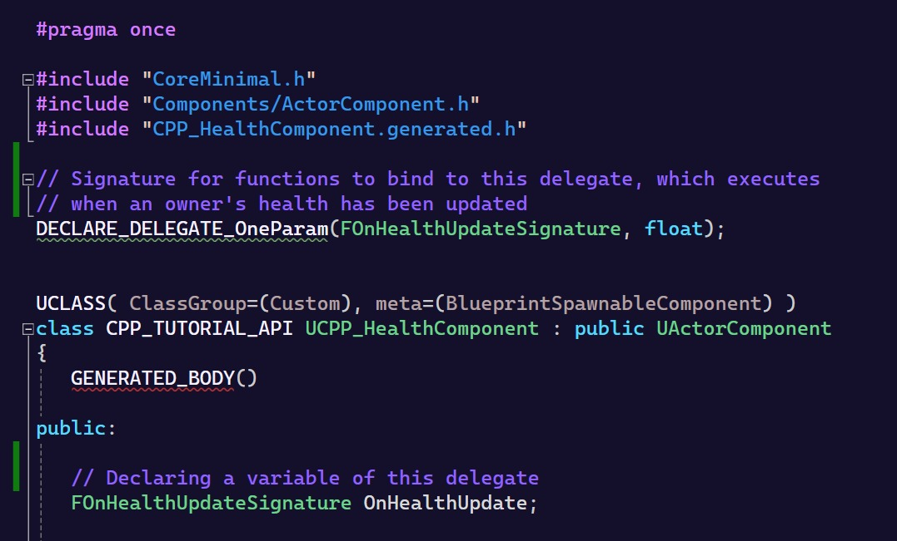
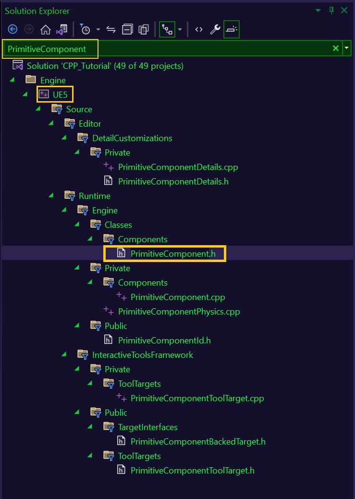
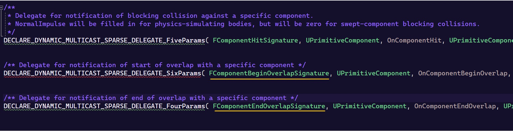
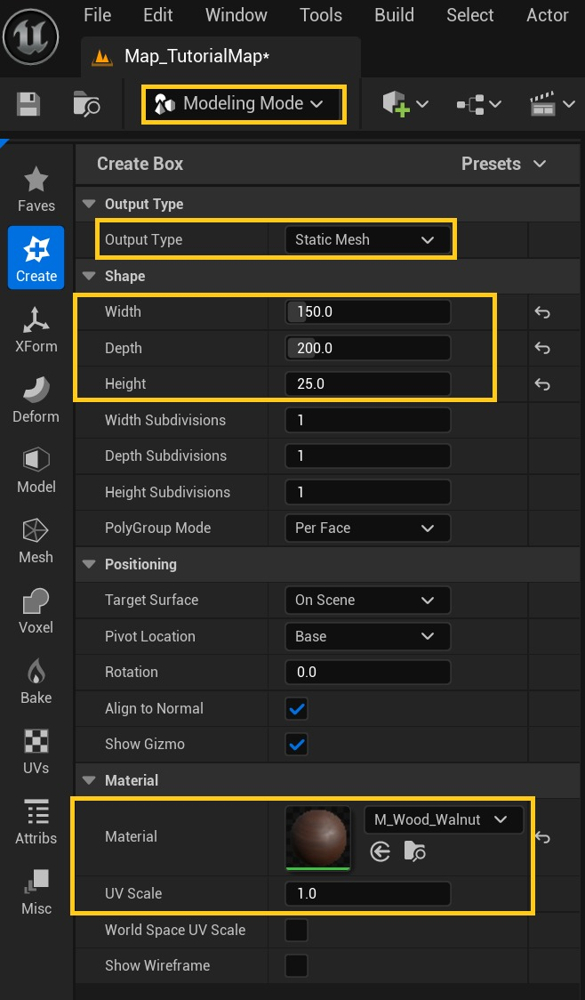
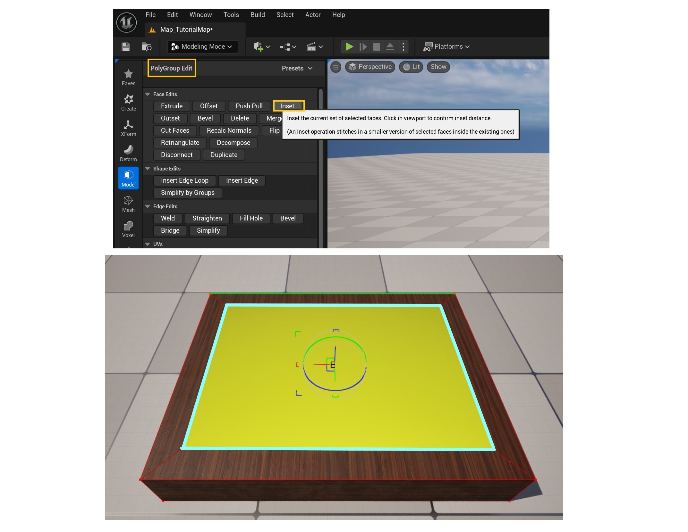
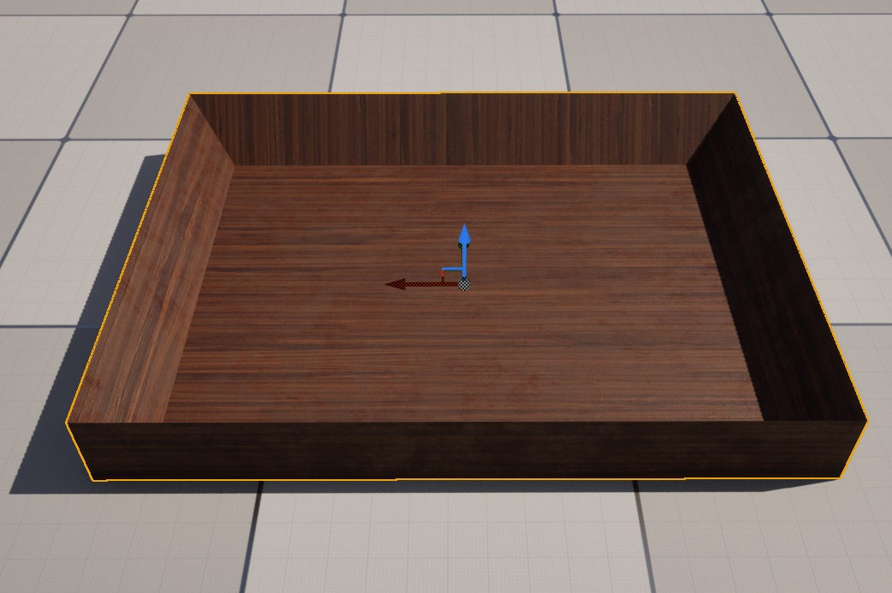
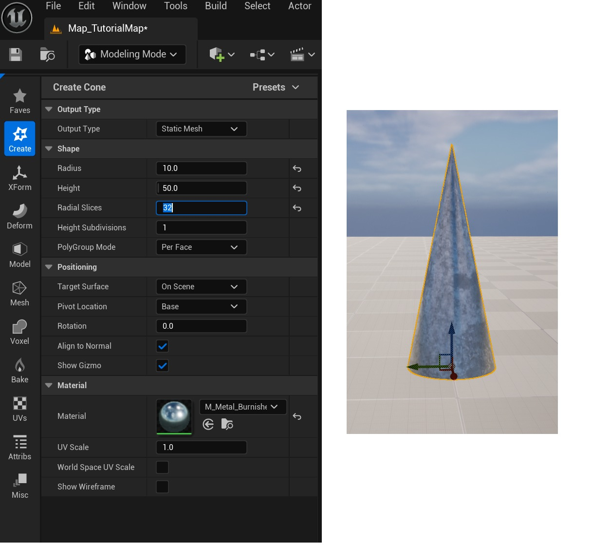

# C++ 捉迷藏教程系列：第二部分 (Part 2/3)

Source file: `unreal-engine-c-hide-and-seek-tutorial-series-part-ii.origin.md`.

This document was split during ue-kb import to keep source chunks buildable.

### CPP_HealthComponent：第一部分

好的！

希望我们现在或多或少都在同一页面上，我们的编辑器打开，准备添加我们的第一个类。

对于那些完成了第一部分的人来说，您已经对其目的有所了解，正如我在上一个教程中提到过一两次一样。

这个类将从**Actor Component**（在“公共类”部分下）派生，我们将命名为**CPP_HealthComponent**，它的工作将是管理它所属的任何所有者的健康相关行为。

在我们回到 IDE 和 **CPP_HealthComponent** 的头文件之前，让我们花一点时间来了解一下 Actor 组件是什么以及它们为何如此有用。

如果您有在虚幻中通过蓝图或 C++ 创建角色的经验，无论您是否意识到，您都已经在使用 actor 组件了！

你可能会问，怎么样？

好吧，朋友，您知道角色移动组件，与我们在第一部分中访问的用于实现冲刺和启用蹲伏的组件相同吗？

我们在查看玩家的蓝图时看到的每个与运动相关的属性都属于角色运动组件的支持，该组件的根源在于演员组件类。

感谢它所提供的所有功能，而不必编写我们自己的逻辑来实现速度、跳跃力、重力影响等。

对于我们希望移动的任何角色，所需要的只是给他们一个角色运动组件，然后该组件将为我们处理繁重的工作（仅供参考，还有一个**投射运动** **组件**，您可以将其附加到任何处理您想要赋予的行为的演员上，您猜对了，投射物）。

我们可以看到，actor 组件通过将各种功能捆绑到一个实体中，为我们节省了无数的时间，该实体可以添加到我们希望为其提供此功能的任何 actor。

结果，我们的代码变得更加模块化，这总是一件好事！

就我们将要创建的健康组件而言，对于我们包含的任何应该具有管理健康等事物的逻辑以及获得或失去它的能力的类，我们不必担心确保为当前健康声明一个变量，定义一个用于更新它的函数等，我们可以简单地向它们附加一个健康组件，并处理它们的行为的这方面。

幸运的是，我已经让您印象深刻，演员组件是多么出色，我们现在可以转到 **CPP_HealthComponent.h** 开始声明我们希望项目的凡人演员拥有的与健康相关的属性。

出于游戏的目的，我们将让事情变得非常简单，让我们从定义一些变量开始。

对于本系列的新手，请注意，在我的所有头文件中，我有一个用于成员函数的部分，分为公共、受保护和私有访问说明符，以及另一个用于成员变量的部分，以相同的方式分解。

因此，每次我们向类添加变量或函数时，我都会让您知道它属于哪个访问说明符，尽管除非我另有说明，否则您可以在您认为合适的任何地方声明和定义事物。

无论如何，我们将声明的第一个变量（在 **私有** 成员变量部分下）将表示拥有该组件的参与者可以拥有的最大生命值。

因此，我们将其称为 **MaxHealth** 并将其设置为 float 类型（我在这里使用 float 以防万一我们可能在某个阶段处理小数值）。

我们将通过添加带有 **EditDefaultsOnly** 说明符的 **UPROPERTY** 宏，将 **MaxHealth** 暴露给 **虚幻属性系统**（以便可以在蓝图中对其进行初始化），并且为了使事情更有组织性，我还为其分配了一个类别“**Owner Properties**”。

继续，我们将声明的下一个变量将是另一个 **私有** 浮点数，它的作用是存储所有者健康状况的当前值。

不出所料，我将其命名为 **CurrentHealth**，并为其指定了自己的 **UPROPERTY** 宏。

我指定它应该具有与 **MaxHealth** 、“**Owner Properties**”相同的类别，但因为我们希望只能通过我们的代码更改此变量，所以我使用 **VisibleAnyWhere** 限制了它在编辑器中的访问。

为了完成我们的变量，让我们再声明一个变量，使其成为 **private** 且类型为 **bool**。

这个变量，让我们遵循 Epic 编码标准来命名布尔值，并将其称为 **bHasHealth**，可以有一个 **UPROPERTY** 宏，看起来就像 **CurrentHealth** 的一样，并且因为我们是善良的游戏开发人员，我们将其初始化为 true，这样我们的演员就不会以僵尸的身份开始游戏。

我们已准备好继续执行我们需要的功能，因为......

第一个我们将调用 **GetMaxHealth**，为了不让任何人感到震惊，它将返回存储在 **MaxHealth** 中的浮点值。

同样，**GetCurrentHealth** 将仅返回 **CurrentHealth**，而 **GetHasHealth** 返回布尔值 **bHasHealth**。

这对于 getter 来说就是这样，所以继续讨论 setter，我们将声明并定义 **SetMaxHealth** 和 **SetHasHealth**。

两者都有一个参数（前者为 float 类型，后者为 bool 类型），并且在每个参数的定义中，设置的任何属性都将存储调用者传递的相应参数的值。

关于 **SetMaxHealth** 函数需要注意的一件重要事情是，在其定义中，我们还将将 **CurrentHealth** 分配给 **MaxHealth** 所包含的任何值。

除了在 **BeginPlay** 中这样做之外，我们还在这里将 **CurrentHealth** 设置为 **MaxHealth**，原因有几个。

因为我们没有在此头文件中初始化 **MaxHealth **，所以如果我们在声明该变量时将其值存储在 **CurrentHealth** 中，它将包含垃圾。

当然，一个简单的解决方法是将 **MaxHealth** 设置为某个合理的数字，例如一百，但因为不同的演员可能有不同的生命储备，所以这可能没有多大意义。

至少就本教程而言，所有这些的结果是，对于我们游戏中具有健康组件的每个角色，为了确保按照我们希望的方式和时间设置其当前和最大健康状况，我们将在所有角色继承的函数 **PostInitializeComponents** 中调用该组件的 **SetMaxHealth** 方法。

到时候我们会更深入地探讨这个功能，但现在我还应该提到，初始化 **CurrentHealth** 和 **MaxHealth** 的另一个原因是，最终我们的游戏将拥有能力提升，其中之一会增加玩家的最大生命值。

通过实现我们所拥有的 **SetMaxHealth** 逻辑，如果获得了此加电，玩家当前的生命值将准确反映增加情况，而无需调用单独的函数...

**CPP_HealthComponent：头文件**

```cpp
CPP_HealthComponent.h

// Member Functions
public:	

   // Returns value of owner's current health
   float GetCurrentHealth() { return CurrentHealth; }

   // Returns value of owner's max health
   float GetMaxHealth() { return MaxHealth; }
```
### CPP_HealthComponent：第二部分

**CPP_HealthComponent：实现文件**

```cpp
// CPP_HealthComponent.cpp

// For use of PRINT macros, don't forget to include:
CPP_Tutorial.h

// Called when the game starts
void UCPP_HealthComponent::BeginPlay()
{
	Super::BeginPlay();
```
### CPP_接口：第一部分


### CPP_接口：第二部分


### CPP_Player：订阅接口



**CPP_播放器**

```cpp
CPP_Player.h

// Don't forget to add:
#include "CPP_Interface.h"

public:

   // Player character's implementation of CPP_Interface's RemoveActor function
   // Make sure to append _Implementation to function name
   void RemoveActor_Implementation();
```
### CPP_HealthComponent：第三部分

**CPP_HealthComponent：实现文件**

```cpp
CPP_HealthComponent.cpp

// Don't forget to add:
#include "CPP_Interface.h"

// Updates value of owner's current health
void UCPP_HealthComponent::UpdateHealth(float UpdateValue)
{
   // Add value to update current health
   CurrentHealth += UpdateValue;
```
### CPP_HealthComponent：第四部分



**CPP_HealthComponent：实现文件**

```cpp
CPP_HealthComponent.cpp

// Updates value of owner's current health
void UCPP_HealthComponent::UpdateHealth(float UpdateValue)
{
   // Add value to update current health
   CurrentHealth += UpdateValue;

   // Make sure health falls within acceptable range
   FMath::Clamp(CurrentHealth, 0, MaxHealth);
```
### CPP_Player：健康组件第一部分

**CPP_Player：头文件**

```cpp
CPP_Player.h

public:

   // Returns players health component if found (null pointer if not)
   class UCPP_HealthComponent* GetPlayerHealthComponent() { return HealthComp ? HealthComp : nullptr; }

private:

    // Initializes component properties after the constructor has executed (and before BeginPlay)
```
### CPP_Player：健康组件第二部分

**CPP_Player：实现文件**

```cpp
CPP_Player.cpp

// Don't forget to add:
#include "CPP_HealthComponent.h"

// Sets default values
ACPP_Player::ACPP_Player()
{
   // Under code from Part I ...
```
### CPP_Hazard：第一部分





**CPP_Hazard 头文件**

```cpp
CPP_Hazard.h

// The UCLASS macro should look like this:
UCLASS(Abstract)

protected:

   // Called before BeginPlay to further initialize components
   virtual void PostInitializeComponents() override;
```
### CPP_Hazard：第二部分

**CPP_Hazard：实施文件**

```cpp
CPP_Hazard.cpp

// Don't forget to add:
#include "CPP_Player.h"
#include "CPP_HealthComponent.h"
#include "Components/BoxComponent.h"

// For our custom PRINT macros:
#include "CPP_Tutorial.h"
```
### 建模模式：尖峰危险网格第 I 部分


### 建模模式：尖峰危险网格第二部分




### 建模模式：尖峰危险网格第 III 部分


### 建模模式：Spike Hazard 第四部分
### CPP_SpikeHazard：第一部分

**CPP_SpikeHazard：实施文件**

```cpp
CPP_SpikeHazard.h

protected:

   // Sets default properties for this class
   ACPP_SpikeHazard();

CPP_SpikeHazard.cpp

// Sets default properties for this class
```
### CPP_SpikeHazard：蓝图
