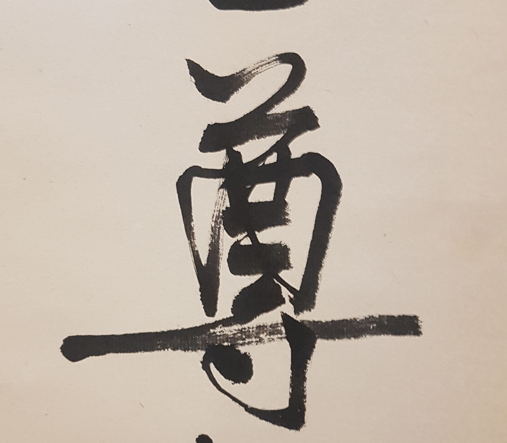
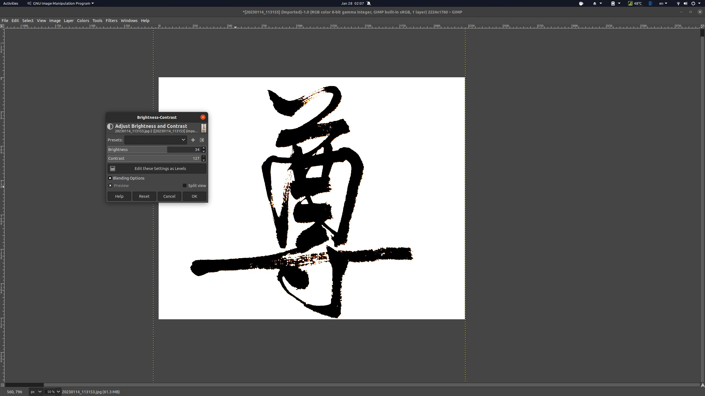
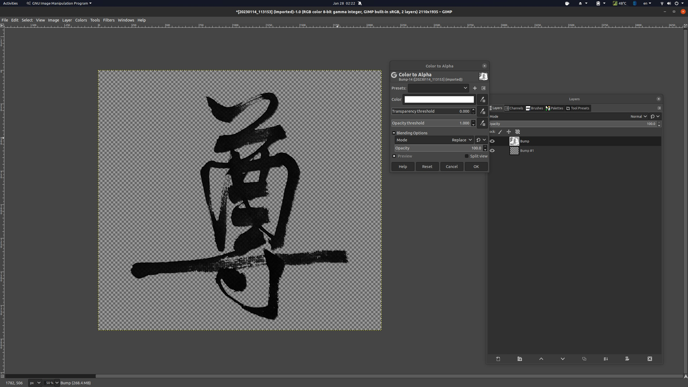
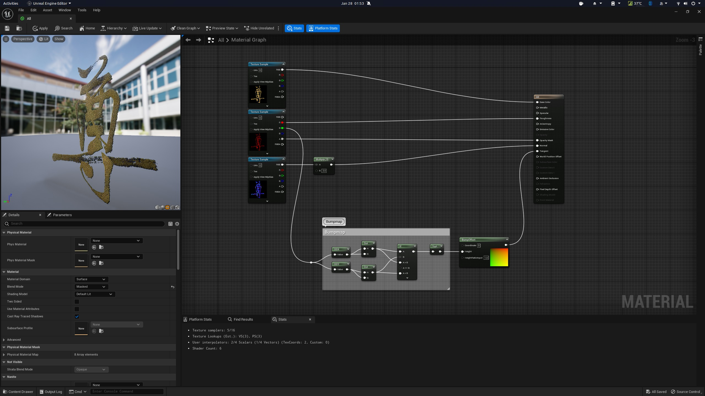
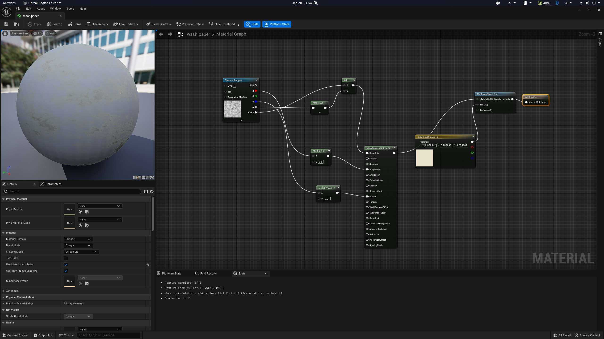
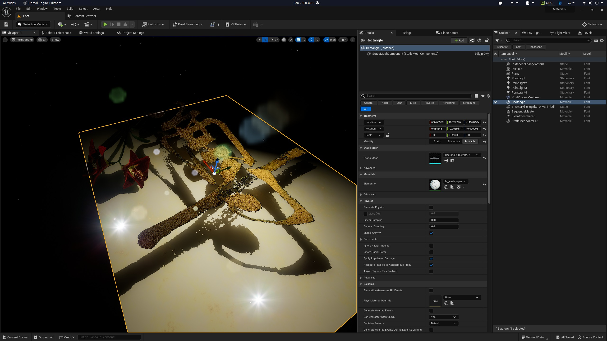

# 3D世界里的书法

## 来源与状态

- 原始 URL：https://dev.epicgames.com/community/learning/tutorials/5w08/unreal-engine-caligraphy-in-3d-world

## 运行时分类

- 类型：图文教程
- 判断：API 未识别到核心视频信号，可整理正文约 367 字符。

## 摘要

手写书法变成 3D。它可以用来创建您的徽标动画。

## 中文整理

### 步骤

1. 将一张书法作品的照片导入到2D工具中 2. 保留画笔处理的触感并擦除背景区域 3. 导入到虚幻引擎中制作材质 4. 用日本资源和颜色进行排列 请参阅以下图片以供参考。









**M_CaligraphyFont**

```
Begin Object Class=/Script/UnrealEd.MaterialGraphNode_Root Name="MaterialGraphNode_Root_0"
   Material=/Script/UnrealEd.PreviewMaterial'"/Engine/Transient.M_bokuju"'
   NodePosX=1696
   NodePosY=144
   NodeGuid=3168867198DC434CB55CBC9B8C1D2FE2
   CustomProperties Pin (PinId=9D725255F80A4427968140FE1D3B1891,PinName="Base Color",PinType.PinCategory="materialinput",PinType.PinSubCategory="5",PinType.PinSubCategoryObject=None,PinType.PinSubCategoryMemberReference=(),PinType.PinValueType=(),PinType.ContainerType=None,PinType.bIsReference=False,PinType.bIsConst=False,PinType.bIsWeakPointer=False,PinType.bIsUObjectWrapper=False,PinType.bSerializeAsSinglePrecisionFloat=False,LinkedTo=(MaterialGraphNode_0 D4A822EF33BB46979E87493A213FEE13,),PersistentGuid=00000000000000000000000000000000,bHidden=False,bNotConnectable=False,bDefaultValueIsReadOnly=False,bDefaultValueIsIgnored=False,bAdvancedView=False,bOrphanedPin=False,)
   CustomProperties Pin (PinId=69EB91A148384232A142B9A913FC3BE7,PinName="Metallic",PinType.PinCategory="materialinput",PinType.PinSubCategory="6",PinType.PinSubCategoryObject=None,PinType.PinSubCategoryMemberReference=(),PinType.PinValueType=(),PinType.ContainerType=None,PinType.bIsReference=False,PinType.bIsConst=False,PinType.bIsWeakPointer=False,PinType.bIsUObjectWrapper=False,PinType.bSerializeAsSinglePrecisionFloat=False,PersistentGuid=00000000000000000000000000000000,bHidden=False,bNotConnectable=False,bDefaultValueIsReadOnly=False,bDefaultValueIsIgnored=False,bAdvancedView=False,bOrphanedPin=False,)
   CustomProperties Pin (PinId=AE9EE46C55624F61BDA80CBBED14DF2E,PinName="Specular",PinType.PinCategory="materialinput",PinType.PinSubCategory="7",PinType.PinSubCategoryObject=None,PinType.PinSubCategoryMemberReference=(),PinType.PinValueType=(),PinType.ContainerType=None,PinType.bIsReference=False,PinType.bIsConst=False,PinType.bIsWeakPointer=False,PinType.bIsUObjectWrapper=False,PinType.bSerializeAsSinglePrecisionFloat=False,PersistentGuid=00000000000000000000000000000000,bHidden=False,bNotConnectable=False,bDefaultValueIsReadOnly=False,bDefaultValueIsIgnored=False,bAdvancedView=False,bOrphanedPin=False,)
   CustomProperties Pin (PinId=6C74D360BAD94BAEA5F2B8BCAF4402FA,PinName="Roughness",PinType.PinCategory="materialinput",PinType.PinSubCategory="8",PinType.PinSubCategoryObject=None,PinType.PinSubCategoryMemberReference=(),PinType.PinValueType=(),PinType.ContainerType=None,PinType.bIsReference=False,PinType.bIsConst=False,PinType.bIsWeakPointer=False,PinType.bIsUObjectWrapper=False,PinType.bSerializeAsSinglePrecisionFloat=False,LinkedTo=(MaterialGraphNode_1 7CF003C1B8FE4ADFB9E420C079571964,),PersistentGuid=00000000000000000000000000000000,bHidden=False,bNotConnectable=False,bDefaultValueIsReadOnly=False,bDefaultValueIsIgnored=False,bAdvancedView=False,bOrphanedPin=False,)
   CustomProperties Pin (PinId=2DCD2BB424D748B497F4DB41AC73A06A,PinName="Anisotropy",PinType.PinCategory="materialinput",PinType.PinSubCategory="9",PinType.PinSubCategoryObject=None,PinType.PinSubCategoryMemberReference=(),PinType.PinValueType=(),PinType.ContainerType=None,PinType.bIsReference=False,PinType.bIsConst=False,PinType.bIsWeakPointer=False,PinType.bIsUObjectWrapper=False,PinType.bSerializeAsSinglePrecisionFloat=False,PersistentGuid=00000000000000000000000000000000,bHidden=False,bNotConnectable=False,bDefaultValueIsReadOnly=False,bDefaultValueIsIgnored=False,bAdvancedView=False,bOrphanedPin=False,)
```



**M_和纸**

```
Begin Object Class=/Script/UnrealEd.MaterialGraphNode_Root Name="MaterialGraphNode_Root_0"
   Material=/Script/UnrealEd.PreviewMaterial'"/Engine/Transient.washipaper"'
   NodePosX=464
   NodePosY=208
   NodeGuid=AD2684DFA9944A92B0889F76922A8485
   CustomProperties Pin (PinId=FEFFBD8166BC4743831CB60BE5804B53,PinName="Base Color",PinType.PinCategory="materialinput",PinType.PinSubCategory="5",PinType.PinSubCategoryObject=None,PinType.PinSubCategoryMemberReference=(),PinType.PinValueType=(),PinType.ContainerType=None,PinType.bIsReference=False,PinType.bIsConst=False,PinType.bIsWeakPointer=False,PinType.bIsUObjectWrapper=False,PinType.bSerializeAsSinglePrecisionFloat=False,PersistentGuid=00000000000000000000000000000000,bHidden=False,bNotConnectable=False,bDefaultValueIsReadOnly=False,bDefaultValueIsIgnored=False,bAdvancedView=False,bOrphanedPin=False,)
   CustomProperties Pin (PinId=27290CEA9B31468BA8E2240115F672A5,PinName="Metallic",PinType.PinCategory="materialinput",PinType.PinSubCategory="6",PinType.PinSubCategoryObject=None,PinType.PinSubCategoryMemberReference=(),PinType.PinValueType=(),PinType.ContainerType=None,PinType.bIsReference=False,PinType.bIsConst=False,PinType.bIsWeakPointer=False,PinType.bIsUObjectWrapper=False,PinType.bSerializeAsSinglePrecisionFloat=False,PersistentGuid=00000000000000000000000000000000,bHidden=False,bNotConnectable=False,bDefaultValueIsReadOnly=False,bDefaultValueIsIgnored=False,bAdvancedView=False,bOrphanedPin=False,)
   CustomProperties Pin (PinId=56689F3CAEEA4D9EA56EECB9C3EC6CC7,PinName="Specular",PinType.PinCategory="materialinput",PinType.PinSubCategory="7",PinType.PinSubCategoryObject=None,PinType.PinSubCategoryMemberReference=(),PinType.PinValueType=(),PinType.ContainerType=None,PinType.bIsReference=False,PinType.bIsConst=False,PinType.bIsWeakPointer=False,PinType.bIsUObjectWrapper=False,PinType.bSerializeAsSinglePrecisionFloat=False,PersistentGuid=00000000000000000000000000000000,bHidden=False,bNotConnectable=False,bDefaultValueIsReadOnly=False,bDefaultValueIsIgnored=False,bAdvancedView=False,bOrphanedPin=False,)
   CustomProperties Pin (PinId=8DFB38B889DD4F23A14F11E30F216954,PinName="Roughness",PinType.PinCategory="materialinput",PinType.PinSubCategory="8",PinType.PinSubCategoryObject=None,PinType.PinSubCategoryMemberReference=(),PinType.PinValueType=(),PinType.ContainerType=None,PinType.bIsReference=False,PinType.bIsConst=False,PinType.bIsWeakPointer=False,PinType.bIsUObjectWrapper=False,PinType.bSerializeAsSinglePrecisionFloat=False,PersistentGuid=00000000000000000000000000000000,bHidden=False,bNotConnectable=False,bDefaultValueIsReadOnly=False,bDefaultValueIsIgnored=False,bAdvancedView=False,bOrphanedPin=False,)
   CustomProperties Pin (PinId=00BA137AC98147CCAD24BE87D12734AA,PinName="Anisotropy",PinType.PinCategory="materialinput",PinType.PinSubCategory="9",PinType.PinSubCategoryObject=None,PinType.PinSubCategoryMemberReference=(),PinType.PinValueType=(),PinType.ContainerType=None,PinType.bIsReference=False,PinType.bIsConst=False,PinType.bIsWeakPointer=False,PinType.bIsUObjectWrapper=False,PinType.bSerializeAsSinglePrecisionFloat=False,PersistentGuid=00000000000000000000000000000000,bHidden=False,bNotConnectable=False,bDefaultValueIsReadOnly=False,bDefaultValueIsIgnored=False,bAdvancedView=False,bOrphanedPin=False,)
```


