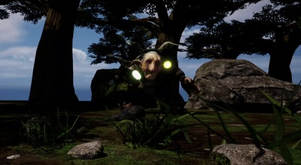
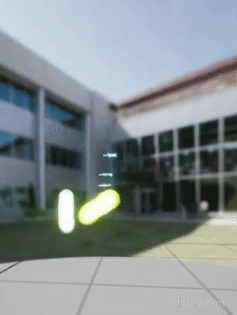
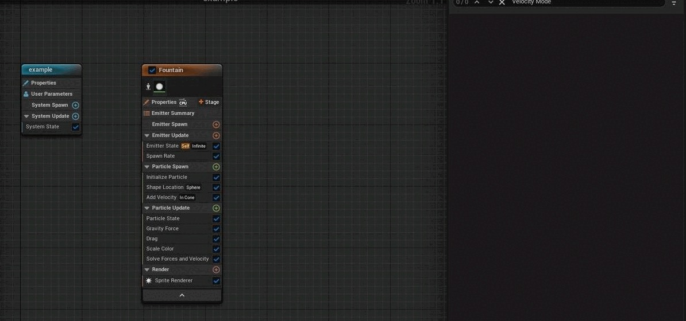
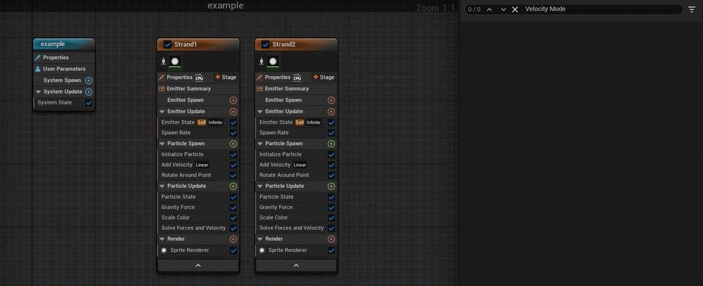
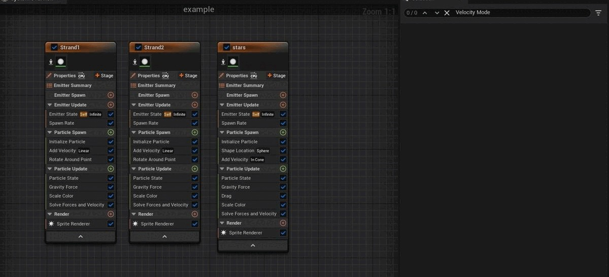
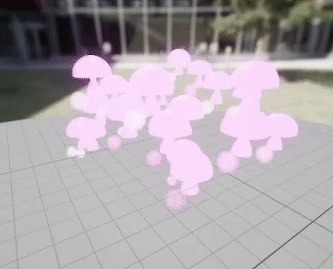
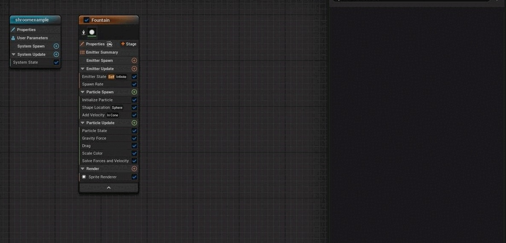
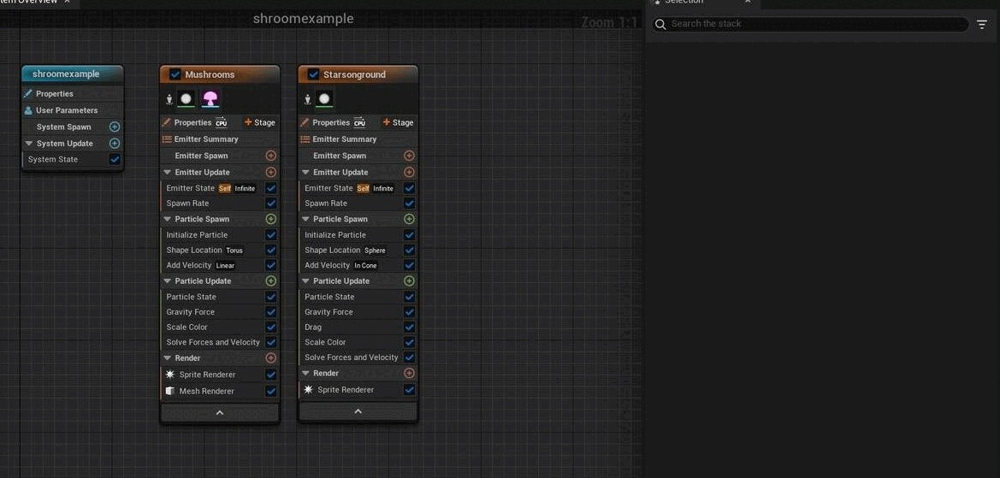
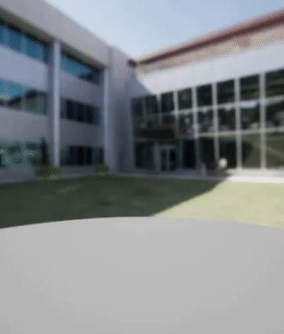
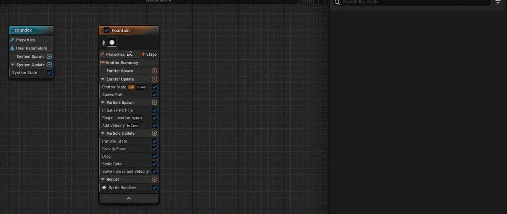

# 创建古怪的粒子

## 来源与状态

- 原始 URL：https://dev.epicgames.com/community/learning/tutorials/pPe6/unreal-engine-creating-wacky-particles

## 运行时分类

- 类型：图文教程
- 判断：API 未识别到核心视频信号，可整理正文约 4830 字符。

## 摘要

随着珠蛋白古怪尖叫的提示，3 个粒子系统发生故障。

## 中文整理

### 粒子系统

### Unreal 的粒子系统与 Unity 的比较

Unreal 和 Unity 都允许创建 2D 和 3D 粒子，并且在用户创建内容方面具有其他相似之处。根据开发人员想要制作的粒子，您可以在 Unreal 中比在 Unity 中更轻松地获得更复杂的粒子。在 Unity 中创建粒子非常简单；这一切都以相同的粒子为基础开始。从那里，开发人员可以控制粒子系统组件中给出的设置参数。在虚幻中创建粒子系统时，开发人员可以使用各种预制粒子作为其所需效果的基础。 Unreal 允许开发人员向其粒子节点添加模块，从而实现更大的设计灵活性。这两个游戏引擎都有很棒的工具来创建粒子。一切都取决于开发人员对他们想要制作的东西的愿景。

### 粒子设计与创建

### 正在制作什么

这些粒子是基于妖精古怪的尖叫声的提示。在设计这些粒子时，我有 3 个要求。它必须显示声音，需要有东西从角色的嘴里出来，而且我希望有东西从地面“生长”。

### 内部有星星的双螺旋

这就是从妖精嘴里说出来的

### 创建螺旋的第一股

1. 关闭或删除以下喷泉发射器： 1. 形状位置 2. 拖动 2. 更改添加速度 1. 速度模式线性 3. 将以下内容添加到发射器 1. 围绕点旋转（添加到粒子生成） 4. 围绕点侧面旋转： 1. 更改旋转相位以具有乘法浮动 2. 在旋转阶段，将“A”更改为引擎时间 3. 在旋转阶段，更改“B”.5 4.将旋转速率更改为 3 5. 将半径更改为 27（或任何看起来适合您正在执行的操作的数字） 5. 在重力中： 1. 将重力：Z 从 -980 更改为 13 6. 在生成速率中：将生成速率更改为 300 7. 在初始化粒子中更改颜色，颜色 1. 将 R 设置为 0.6 2. 将 G 设置为 0.7 3. 将 B 设置为 0

### 创建螺旋的第二条链

1. 复制螺旋的第一股 2. 在绕点旋转中： 1. 在旋转阶段，将“A”重置为默认值，将值更改为 0.5 2. 在旋转阶段，将“B”更改为引擎时间 3. 将旋转速率更改为 10 4. 将半径更改为 25

### 在螺旋内部创建

1. 将喷泉发射器添加到与流相同的系统 2. 关闭或删除形状位置 3. 在生成速率中，将生成速率更改为 26 4. 在添加速度中， 1. 将速度模式更改为线性 2. 将速度中的 z 更改为 240 5. 在重力中 1. 将 z 中的重力更改为 -211 6. 将抖动位置添加到粒子更新 1. 在抖动位置中，将抖动量更改为 3 7. 在渲染中添加网格渲染 8. 在网格渲染中打开，网格下拉列表 1. 在索引（0）中，添加您选择的网格（我添加了导入的星形网格） 9. 在初始化粒子 1. 在颜色中，将 A 更改为 0

### 蘑菇和星星“生长”

### 发芽的蘑菇

1. 创建一个以喷泉发射器为基础的系统 2. 删除或关闭拖动 3. 在生成速率中： 1. 将生成速率更改为 10 4. 形状位置： 1. 将形状基元更改为圆环 2. 将大半径更改为 50 5. 添加速度： 2. 将速度 Z 更改为 30 6. 在重力中： 1. 将重力 Z 更改为 -29 7. 在网格渲染打开时，网格下拉列表 1. 在index(0)，添加您选择的网格（我添加了导入的蘑菇网格） 8. 在初始化粒子中

### 星星出现在地面上

1. 添加进入系统的喷泉 2. 删除或关闭： 1. 添加速度 2. 重力 3. 拖动 4. 缩放颜色 5. 生成速率 3. 将生成突发瞬时添加到发射器更新 4. 在生成生成突发瞬时中 1. 将生成计数更改为 10 5. 将初始网格方向添加到粒子生成 6. 在初始网格方向中： 1. 将网格方向模式更改为矢量 2. 将方向矢量更改为形状位置形状矢量 7. 在形状位置： 2. 将大半径更改为 62 3. 将手柄半径更改为 27

### 看得见的喊叫声

### 创建喊叫粒子

1. 创建一个以喷泉发射器为基础的新系统 2. 关闭或删除： 1. 生成速率 4. 在生成瞬时爆发中： 1. 将生成计数更改为 20 5. 在添加速度 1. 将速度模式更改为从点 6. 在初始化粒子中： 1. 在点属性中 1. 将寿命最小值更改为 0.1 2. 将寿命最大值更改为 0.2 3. 在颜色更改中： 1. R.06 2. G .2 3. B .01 4. 将质量模式更改为“未设置/（1 的质量）” 2. 在精灵属性中，1. 将精灵大小模式更改为“随机非均匀” 2. 将精灵最大大小 Y 更改为 90

### 创建另一个喊叫粒子

1. 复制第一个喊叫发射器 2. 在初始化粒子中： 1. 在精灵属性中，将精灵最大大小 Y 更改为 21
