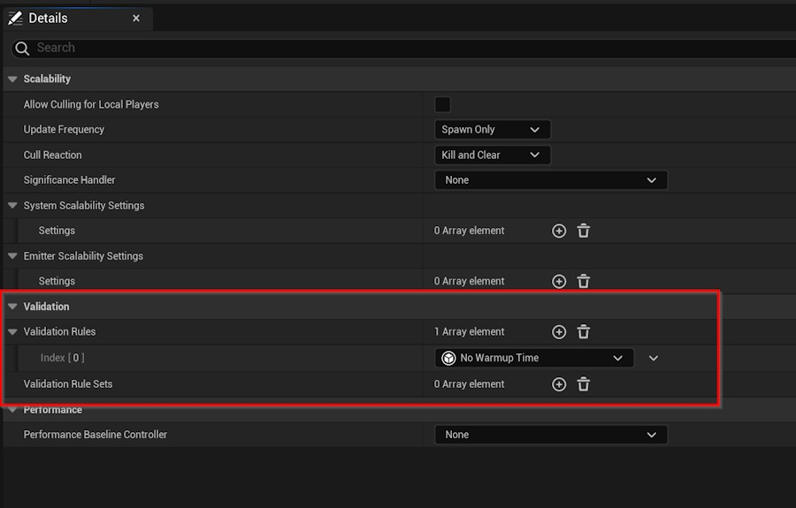
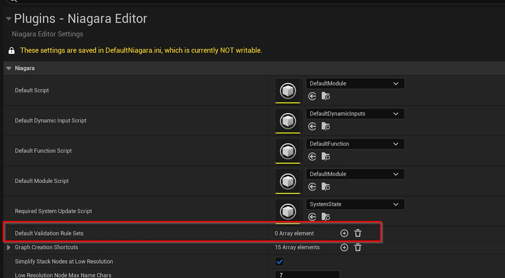
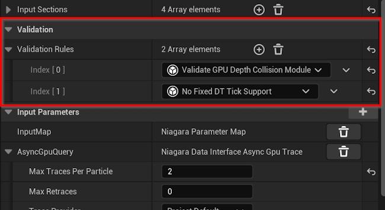
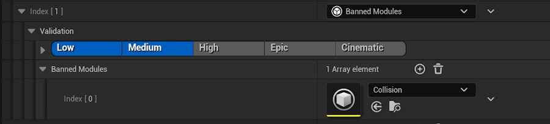

# Niagara 系统的自定义资产验证

## 来源与状态

- 原始 URL：https://dev.epicgames.com/community/learning/tutorials/ZZJP/unreal-engine-custom-asset-validation-for-niagara-systems

## 运行时分类

- 类型：图文教程
- 判断：API 未识别到核心视频信号，可整理正文约 3703 字符。

## 摘要

Niagara 系统可能会变得相当复杂，并且通常必须遵守不同平台上的各种限制。与其给你的技术美术人员一份该做什么和不该做什么的清单，不如在 Niagara 编辑器中向他们提供实时反馈，甚至是一个“立即修复”按钮不是更好吗？这正是验证规则的用途，所以让我们看看如何使用它们以及如何创建自己的规则。

## 中文整理

### 效果类型

使用验证规则的最常见方法是效果类型。您可以通过在内容浏览器中右键单击并使用“FX -> 高级 -> Niagara 效果类型”来创建新的效果类型资源。您可以在此处逐一添加规则，也可以添加包含多个规则的规则集。如果您有一组想要在多种效果类型之间共享的通用基线规则，则规则集会很方便。



验证与效果类型相关，因为通常不同类型的效果（例如环境、玩家效果、武器影响等）都有不同的要求和可扩展性需求。这样您就可以确保廉价的环境效果不会使用昂贵的模块（例如碰撞）或游戏关键模块（例如武器影响）在大世界坐标下正常工作。

### 项目设置

还可以将验证规则配置为应用于项目中的所有系统，而不管每个系统使用的效果类型如何。该选项可以在项目设置 -> Niagara 编辑器 -> 默认验证规则集中找到。



### 模块

验证规则还可以配置为仅用于某些模块脚本。当您打开模块并查看其详细信息面板时，您将看到添加验证规则的选项。请注意，并非所有规则在添加到模块时都会做一些有用的事情，因为它们需要在编写时考虑到模块上下文。一个用例是检查模块是否会在当前系统和项目设置下按预期运行。例如，碰撞模块检查系统是否不使用固定刻度 dt（因为它可以独立于物理系统进行子刻度），并且当粒子材质写入场景深度时不使用深度碰撞（因为粒子会与自身碰撞）。



### 编写自定义规则

要创建您自己的验证规则，请创建一个扩展 UNiagaraValidationRule（在 NiagaraValidationRule.h 中定义）的新 UCLASS。例如，查看 Engine/Plugins/FX/Niagara/Source/NiagaraEditor/Public/NiagaraValidationRules.h 中的现有规则 以下是“无预热”规则的定义：

```cpp
UCLASS(Category = "Validation", DisplayName = "No Warmup Time")
class UNiagaraValidationRule_NoWarmupTime : public UNiagaraValidationRule
{
	GENERATED_BODY()
public:
	virtual void CheckValidity(const FNiagaraValidationContext& Context, TArray<FNiagaraValidationResult>& OutResults) const override;
};
```

FNiagaraValidationContext 使您可以访问系统视图模型，您可以使用它来访问 Niagara 系统和当前堆栈视图以及所有模块及其输入。您返回的结果可以包含有用的消息、警告或错误，这些消息将在堆栈中显示给用户。以下是“无预热”规则的实现：

**“无预热”规则的实施**

```cpp
void UNiagaraValidationRule_NoWarmupTime::CheckValidity(const FNiagaraValidationContext& Context, TArray<FNiagaraValidationResult>& Results)  const
{
	UNiagaraSystem& System = Context.ViewModel->GetSystem();
	if (System.NeedsWarmup())
	{
		UNiagaraStackSystemPropertiesItem* SystemProperties = NiagaraValidation::GetStackEntry<UNiagaraStackSystemPropertiesItem>(Context.ViewModel->GetSystemStackViewModel());
		FNiagaraValidationResult Result(ENiagaraValidationSeverity::Error, LOCTEXT("WarumupSummary", "Warmuptime > 0 is not allowed"), LOCTEXT("WarmupDescription", "Systems with the chosen effect type do not allow warmup time, as it costs too much performance.\nPlease set the warmup time to 0 in the system properties."), SystemProperties);
		Results.Add(Result);
	}
}
```

您的规则还可以声明属性，然后在将规则添加到效果类型或规则集中时显示这些属性。这里值得注意的是 FNiagaraPlatformSet 属性，它将在用户界面中显示可扩展性选择器，因此用户只能在某些平台或可扩展性设置上强制执行规则。 “禁止模块”规则的示例：

```cpp
//Platforms this validation rule will apply to.
UPROPERTY(EditAnywhere, Category=Validation)
FNiagaraPlatformSet Platforms;

UPROPERTY(EditAnywhere, Category = Validation)
TArray<TObjectPtr<UNiagaraScript>> BannedModules;
```


