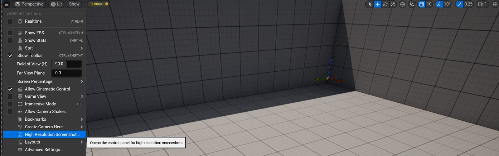
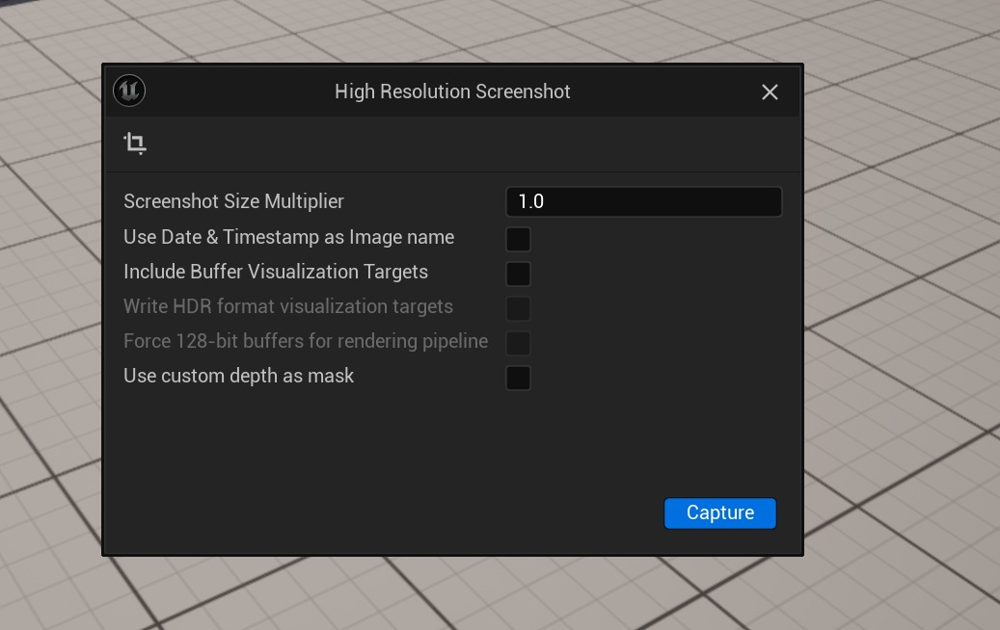
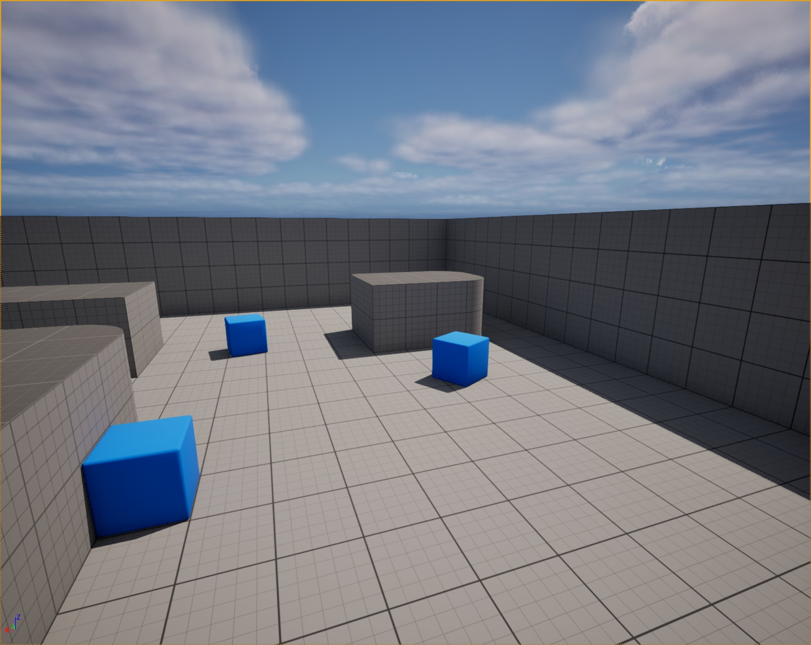
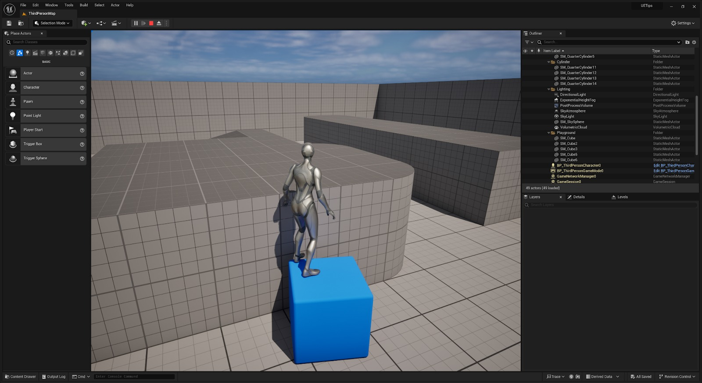
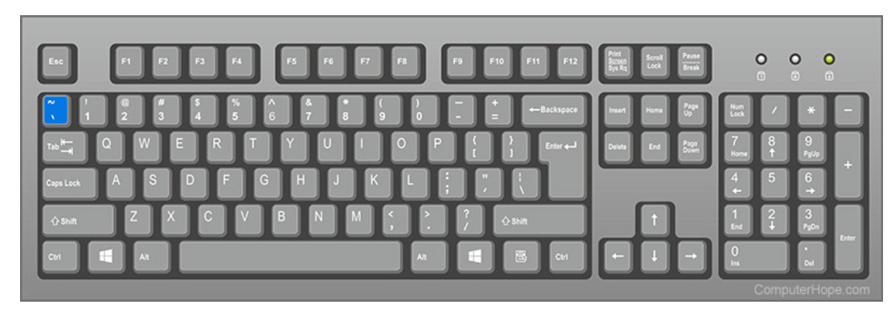
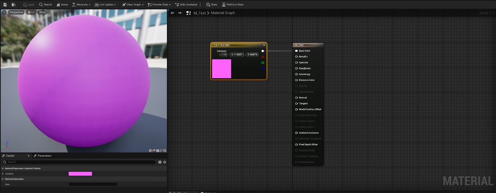
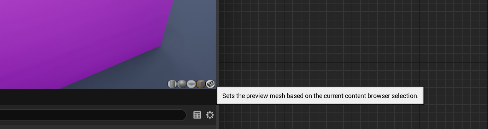
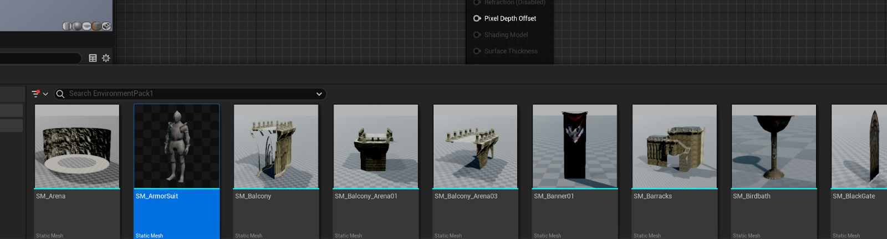
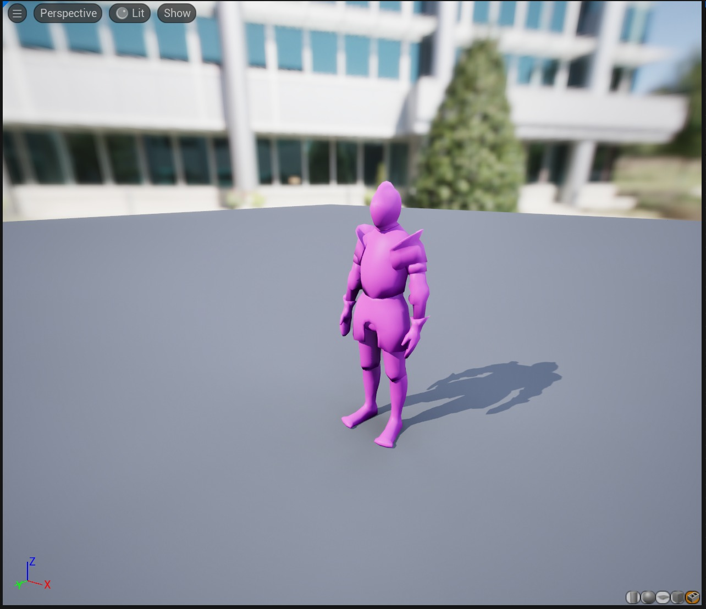
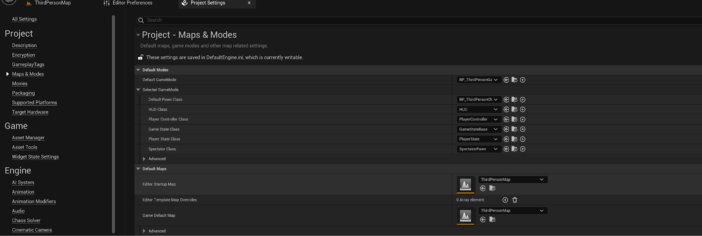

# 虚幻 5 技巧

## 来源与状态

- 原始 URL：https://dev.epicgames.com/community/learning/tutorials/RnL5/unreal-engine-epic-for-indies-unreal-5-tips

## 运行时分类

- 类型：图文教程
- 判断：API 未识别到核心视频信号，可整理正文约 14903 字符。

## 摘要

使用虚幻引擎时经常被遗忘的一系列技巧。

## 中文整理

### 概览

嘿！我是 Rob，一位拥有丰富经验的游戏开发人员，最近成为虚幻授权讲师。在接下来的一年里，我希望与您分享各种内容，帮助人们掌握虚幻引擎。我想我应该从一些我认为经常被遗忘、未知的技巧开始，其中许多技巧将有助于加快您的工作流程。我的许多初始内容将针对那些刚接触 Unreal 的人，但我将很快提供更高级的内容。让我们开始吧。 **1 - 屏幕截图。** 虚幻引擎有一个内置工具可以创建游戏的屏幕截图。您应该注意三种方法。 **方法 1.** 如果您转到屏幕左上角的视口选项并选择“高分辨率屏幕截图”选项。它将打开另一个带有各种选项的框，您可以在其中截取屏幕截图，选择要捕获的区域以及图像的大小。 Epic 已经有一些写得很好的文档了。我会将其链接到本技巧的底部。

**方法2**。按 F9。按 F9 将自动创建屏幕截图。它效果非常好，而且很容易做到！请注意。如果您在编辑器中按 F9 ，它将截取视口的屏幕截图，如果您正在玩关卡并按 F9 ，它将截取整个窗口（包括编辑器）的屏幕截图。

**方法3. **控制台命令。** ** Unreal 5 内部的控制台非常强大，为您提供了很多选项。但这可能是非常压倒性的。要打开控制台，请按潮汐键。您可能也将其称为波形键或旋转键。位于 Esc 键下方和 Tab 键上方。

*（注意，我使用英国键盘。）* 按此键将打开控制台。键入以下 **HighResShot** 您确实需要一些参数才能使其工作。我经常只使用以下内容。 **HighResShot 2** 这将创建双倍分辨率的屏幕截图。现在最重要的是。这些文件保存在哪里？所有这些文件都位于项目的**已保存文件夹**中。 ProjectName\Saved\Screenshots 您应该查看 Unreal 文档以获取更深入的详细信息，但它是一个非常好的工具，但经常被遗忘。 **UE 文档** - https://dev.epicgames.com/documentation/en-us/unreal-engine/take-screenshots-in-unreal-engine **2 - 材质编辑器内的自定义网格物体** *注意，我已导入 Infinity Blade : Castle 资源来展示这一点。这适用于任何网格。材质编辑器的功能非常强大。默认情况下，您将始终受到球体的欢迎。

现在材质编辑器中视口的右下角有很多选项。这允许您将网格更改为圆柱体、球体平面或立方体。然而，最后一个选项允许您设置在内容浏览器中选择的网格。

因此，如果我在内容浏览器中选择一个网格。像这样

然后按材质视口内的最后一个选项。看起来像一块砖！

然后，它将将该网格加载到视口内，以便您可以更好地评估您的材质。关闭材质并重新打开它时，它将回到球体。这不是永久性的改变。 **3 - 启动时加载最后一个级别 ** 启动时加载最后一个级别。 （编辑器首选项）//项目设置。现在，如果您想更改编辑器启动和游戏默认地图的默认级别。您需要转到项目设置、地图和模式，然后在默认地图部分中进行更改。

这太棒了。

但当您从事大型项目或跨大型团队工作时，并不总是理想的。

如果您打开 **编辑器首选项** 并转到“加载和保存”。

您将看到启动时负载级别的选项。

在这里您可以选择 - 加载项目默认值或您上次打开的地图。

请记住，如果您正在努力寻找这个。

编辑器首选项和项目设置的顶部都有一个搜索栏。

**4 - 视口选项** 在视口的右上角，我们有许多选项。

I want to focus on these for the moment.

在第一部分中，我们对选择方法进行了视觉表示。

Select,** Move, Rotate and Scale**.

现在我们可以使用以下命令循环浏览这些内容。

**Q - 选择 ** **W - 移动 ** **E - 旋转 ** **R - 缩放 ** 许多 3D 软件包中的相当标准。

但是，您是否知道只需按 **空格键** 即可循环浏览这些内容？

按空格键将在**移动、旋转和缩放**之间循环。

Next I want to talk about our snapping.

我们当然可以**单击**这些选项来打开或关闭它们。

如果我们选择数字，我们还可以更改快照的大小。

But there is also a shortcut.

按 **[** 减少或** ]** 增加意味着您可以即时更改 **网格捕捉大小**。

按 **Shift + [ 或 ] ** 将更改您的 **旋转 ** 捕捉尺寸。

grid 如果你像我一样想更进一步。

如果您在 **编辑器首选项** 中搜索 **网格捕捉和旋转捕捉**。

您实际上可以设置用于启用或禁用网格捕捉的快捷方式。

我将我的设置为使用** #** 键和** Shift + # **。

这是一个简单的更改，但可以使关卡设计和构建关卡变得更加容易！

**5 - 游戏视图** 游戏视图是一个令人难以置信的选项，但我经常认为它使用得不够。

在视口选项中选择或在编辑器中按 **G** 进行选择。

这将禁用所有编辑器特定元素并像在游戏中一样显示。试一试！

**6 - 收藏夹 ** 当您在虚幻中选择一个对象时，细节平面通常会填充大量与您所选择的内容相关的选项。

有时这可能会让人不知所措，虽然虚幻有多种方法可以通过允许您对各个方面进行分类来保持变量的组织，但它也允许您进行收藏。

如果您选择一个对象并在详细信息面板中查看其详细信息，您将看到一颗星星。

这是你的最爱。

假设您发现自己总是打开或关闭模拟物理。

您可以右键单击该选项，然后将其选择为收藏夹。

Once it's been added to your favourites.

按开始，您将看到您最喜欢的变量。

当您处理具有大量变量的 BP 时，这非常有用。

请记住，这仅适用于单个选项，不适用于类别。

**7 - 快速访问资源。** 如果您选择了一个对象，您可能希望在内容浏览器中访问该资源或对其进行编辑。

选择某个项目后，按以下键将允许您查看内容文件夹中的资源或编辑该项目。

**Ctrl + B** = Browse to asset.

这将打开内容浏览器并将您带到该资产。

Great with large projects.

**Ctrl + E** = Will edit the asset.

这将是相应的窗口，允许您编辑所选项目。

So this will vary depending on what is selected.

您还可以右键单击对象并在子菜单中选择这些选项。

非常有用的工具，特别是在处理大型项目或杂乱的项目时，学生经常遇到这种情况。

**7 - 隐藏和显示。** 不完全是捉迷藏，但有时您会想要隐藏场景中的对象。

Now there are a variety of ways of doing this.

其中一种方法是在选定项目的情况下按 **H**。

This will hide the asset you have selected.

按 **Ctrl + H ** 将显示您隐藏的所有项目。

*重要的是要记住，这将显示隐藏的所有内容。

Ctrl + H* 还有一些其他方法可以实现相同的目标。

在轮廓中，您还可以按选定对象的眼睛图标。

或者，您也可以右键单击并向下查看。

This is a good segway to my next tip.

**8 - 层。** *我安装了 Infinity Blade: Grass Lands 项目来演示这一点。

由于将使用 ElvenRuin 地图来演示它。*图层经常被遗忘，而且我没有看到很多人使用它们。

然而，它们非常强大，并且在处理具有各种组件的大型复杂场景时非常有用。

当您处理少量项目时，可见性选项非常有用。

但如果您处理大量资产。

分层很可能是更好的选择。

要打开图层面板，您需要转到**窗口 - 图层**。

当您单击此按钮时，您可能不会注意到没有任何变化。

但是如果你看一下你的**详细信息面板**在哪里，你会发现实际上已经添加了一个新面板。现在默认情况下，ElevenRuin 地图已经设置了一个名为 Cube 的图层。

这实际上包含了该地图中的所有触发卷。

因此所有触发量都是该层的一部分。

禁用该层的可见性，将从我的视口中隐藏所有触发体积。

要创建新图层，**在图层面板内右键单击**，您将可以选择创建新图层。

如果您创建一个新图层并将其命名为 CastleTowersRuins。

如果您在命名之前按 Enter 键，请记住 F2 是重命名项目的快捷方式。

Now in the outliner search for CaslteTower_Ruin.

确保选择了新图层，然后在大纲视图中选择所有 CastleTower_Ruins。

如果您现在再次右键单击图层面板，您将看到一些新选项。

现在，如果您将选定的 Actor 添加到选定的图层，所有这些资源现在都将成为该图层的一部分，更改该图层的可见性将默认隐藏所有这些 Actor。

就我个人而言，我发现首先选择所有资源并使用已选择的资源创建一个新图层更容易。

现在，在使用图层时，许多人还会忘记，如果您选择了图层，则在面板底部您将看到此选项。

现在按“查看内容”将向您显示属于该层的所有参与者。

然后，您可以从这里选择单个演员、从图层中删除演员等。

要返回，只需按面板左上角的后退按钮即可。

非常类似于图形程序中的图层，对于大比例地图非常有用。

**9 - 玩家生成位置。** 在许多项目中，您将使用 PlayerStart actor，这是您在玩和测试地图时始终生成的位置。

然而，还有另一个选项允许您在您选择的位置生成，并且非常适合进行关卡设计或测试地图的特定部分。

In your toolbar you should see three dots.

Additional options for you to select.

选择此选项将打开一个下拉列表，在此下拉列表中您将找到以下选项 - **默认播放器开始或当前摄像机位置。

** 默认玩家开始将始终导致您的主 PlayerStart Actor 成为玩家的生成位置。

但是，将其更改为当前相机位置，您的角色将在关卡中相机当前所在的位置生成。

一个非常有用的工具！

**10 - Folder Customisation.

** 现在，其中一些技巧集中在组织上，而组织起来确实会带来回报，尤其是在制作游戏或任何数字项目时。

您最不想做的一件事就是花费很长时间才发现您需要的一个文件夹却被某个人依偎着并命名为完全不同的文件夹。

在我们的内容浏览器中，我们有收藏夹选项。

一个前往您可能工作的常规地点的好地方。

要在此处放置文件夹，请右键单击它并添加到收藏夹。

还值得注意的是，您还可以更改文件夹的颜色。

Great for those who like visual representation.

You even get a colour wheel!

Now be default, folder colours are local.

但是，如果您想要这些跨项目，则需要将 **Saved\Config\Windows\EditorPerProjectUserSettings.ini ** 中的 ** [PathColor]** 设置添加到 **GAME_ROOT/Config/DefaultEditorPerProjectUserSettings.ini **，因为此文件夹确实成为存储库的一部分，而 **SAVED** 文件夹被 **忽略**。

在撰写本文时，我知道文件夹颜色保存在本地。

我不确定是否可以将其通过存储库，但发现了一个论坛帖子证实了上述内容。

Thanks to @DamirH for confirming that info.

很高兴知道！

**11 - 视口相机选择。

** 当您第一次打开 Unreal 时，您将看到一个最大化的大窗口。

单击视口中右上角的选项，您可以最小化或最大化所选视口。

（远端盒子里面有四个盒子）点击它会首先打开这个窗口。

它将你的视口分成 4 个。

单击任一视口中的最大化选项将最大化该选项。

但是，您可以使用一些快捷方式快速切换此视口。

最大化透视窗口以返回默认选项。

单击“透视”选项将提供一个子菜单，其中包含您可以选择的所有相机以及这些选项的快捷方式。

这些都很棒，尤其是当您受到显示器和空间的限制时。

不过，还有第三种选择！

按 Ctrl + 鼠标中键并向某个方向拖动将自动切换视口。

如果您短暂拖动，您将直观地看到要更改的选项。

但是，如果您拖动得足够远，它就会自动切换。

**12 - 放置随机对象** 有时，当您制作关卡时，您需要将演员放置在随机位置。

有时感觉真的很被迫。

可以明显感觉到放置。

为了解决这个问题。

将物体移到空中。

打开模拟物理。

转到工具栏，单击三个点并选择 **模拟 **或按 **Alt + S**。然后，您可以在此处再次选择该项目并转到其详细信息。

然后，您可以右键单击该变量并复制它当前显示的值。

停止模拟，然后粘贴这些值。

当你想要那种随机的感觉时非常有用。

**13 - 相机书签 ** 这是我的最爱。

非常适合当您规划关卡并且您正在考虑关卡的组成时。

Unreal 允许您为多个摄像机位置添加书签。

从键盘上的 0 - 9，您可以为多个不同的摄像机位置添加书签。

*请注意，这只适用于键盘字母上方的数字。

它不会为...工作
