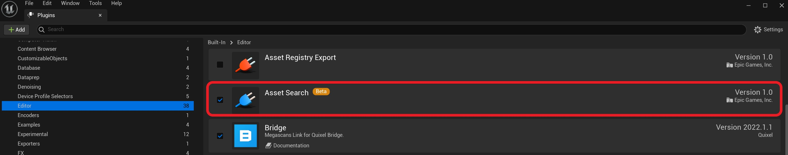
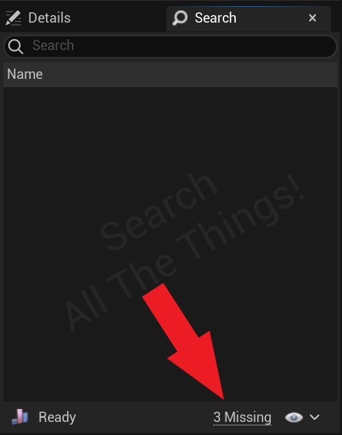
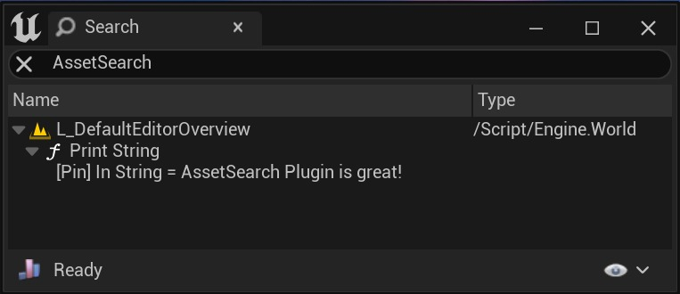
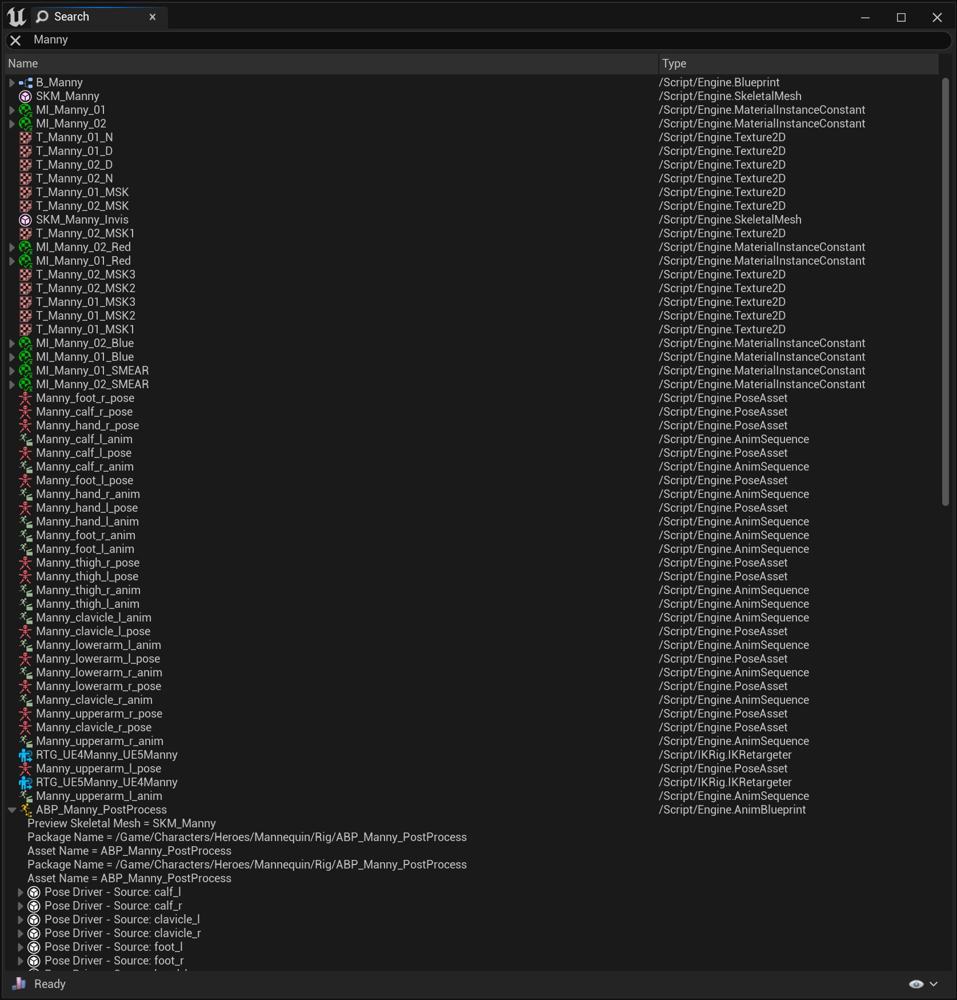

# 使用资产搜索插件查找字符串引用

## 来源与状态

- 原始 URL：https://dev.epicgames.com/community/learning/tutorials/wd1K/unreal-engine-finding-string-references-with-the-asset-search-plugin

## 运行时分类

- 类型：图文教程
- 判断：API 未识别到核心视频信号，可整理正文约 5015 字符。

## 摘要

本教程介绍如何启用和利用资产搜索插件来快速查找整个项目中的字符串引用。

## 中文整理

### 概览

当着手一个新项目时，开发人员通常会不遗余力地想出描述性的资产名称、清晰的命名约定以及一致的拼写。然而，预测未来是很困难的，并且不可避免地有一天，某些字符串*在它出现的任何地方*都需要更改。引擎中有一些选项可用于搜索资产、属性、函数等。但是，由于整个项目中有很多地方可能会写入字符串，因此很难知道您已找到所有出现的字符串。为了帮助实现这一点，我们创建了资产搜索插件。该插件仍处于测试阶段，默认情况下处于禁用状态，但可以通过插件浏览器启用：



启用后，您将在详细信息面板旁边找到一个新的资产搜索面板。请注意，该插件将需要一些时间来索引整个项目，第一次运行它时，您应该单击右下角的链接以允许它打开并扫描所有级别文件并完成数据库：



填充后，您可以在搜索字段中键入任何字符串，窗口将快速填充整个项目中出现的该字符串。此列表包括资产名称、变量名称和值、蓝图函数名称、蓝图节点的硬编码输入等。例如，假设我们的项目*某处*有这个蓝图，并且希望快速找到它，以便我们可以将其删除并在我们在编辑器中玩时停止向我们的视口发送垃圾邮件：

```
Begin Object Class=/Script/BlueprintGraph.K2Node_CallFunction Name="K2Node_CallFunction_0"
   FunctionReference=(MemberParent=/Script/CoreUObject.Class'"/Script/Engine.KismetSystemLibrary"',MemberName="PrintString")
   NodePosX=32
   NodePosY=176
   AdvancedPinDisplay=Hidden
   EnabledState=DevelopmentOnly
   NodeGuid=5B87CC6646A6968E8AEAD3A384EFF264
   CustomProperties Pin (PinId=A6BC214D43C861B30FE5E98B49F36859,PinName="execute",PinToolTip="\nExec",PinType.PinCategory="exec",PinType.PinSubCategory="",PinType.PinSubCategoryObject=None,PinType.PinSubCategoryMemberReference=(),PinType.PinValueType=(),PinType.ContainerType=None,PinType.bIsReference=False,PinType.bIsConst=False,PinType.bIsWeakPointer=False,PinType.bIsUObjectWrapper=False,PinType.bSerializeAsSinglePrecisionFloat=False,LinkedTo=(K2Node_Event_1 3E18D7884436163C17C20A8C66DFA9EC,),PersistentGuid=00000000000000000000000000000000,bHidden=False,bNotConnectable=False,bDefaultValueIsReadOnly=False,bDefaultValueIsIgnored=False,bAdvancedView=False,bOrphanedPin=False,)
   CustomProperties Pin (PinId=C6F7F17E44737ADBC68F849972FE6148,PinName="then",PinToolTip="\nExec",Direction="EGPD_Output",PinType.PinCategory="exec",PinType.PinSubCategory="",PinType.PinSubCategoryObject=None,PinType.PinSubCategoryMemberReference=(),PinType.PinValueType=(),PinType.ContainerType=None,PinType.bIsReference=False,PinType.bIsConst=False,PinType.bIsWeakPointer=False,PinType.bIsUObjectWrapper=False,PinType.bSerializeAsSinglePrecisionFloat=False,PersistentGuid=00000000000000000000000000000000,bHidden=False,bNotConnectable=False,bDefaultValueIsReadOnly=False,bDefaultValueIsIgnored=False,bAdvancedView=False,bOrphanedPin=False,)
   CustomProperties Pin (PinId=D2FF9A4D486E65B53EF0E189DD5D7301,PinName="self",PinFriendlyName=NSLOCTEXT("K2Node", "Target", "Target"),PinToolTip="Target\nKismet System Library Object Reference",PinType.PinCategory="object",PinType.PinSubCategory="",PinType.PinSubCategoryObject=/Script/CoreUObject.Class'"/Script/Engine.KismetSystemLibrary"',PinType.PinSubCategoryMemberReference=(),PinType.PinValueType=(),PinType.ContainerType=None,PinType.bIsReference=False,PinType.bIsConst=False,PinType.bIsWeakPointer=False,PinType.bIsUObjectWrapper=False,PinType.bSerializeAsSinglePrecisionFloat=False,DefaultObject="/Script/Engine.Default__KismetSystemLibrary",PersistentGuid=00000000000000000000000000000000,bHidden=True,bNotConnectable=False,bDefaultValueIsReadOnly=False,bDefaultValueIsIgnored=False,bAdvancedView=False,bOrphanedPin=False,)
```

我们可以在所有蓝图中搜索这个短语，或者我们可以使用资产搜索插件来快速找到它：



现在我们可以双击结果来打开有问题的蓝图并将其删除。这是一个非常基本的案例，但如果我们想做一些更复杂的事情，比如在 Lyra Starter Game 中重命名 Manny，该怎么办？我们可以进行一些不同的搜索来查找具有该名称的所有资产、具有该名称的所有蓝图，并使用这些资产中的不同搜索字段来查找其他引用，但我们不太可能每次在项目中出现短语“Manny”时都进行追踪。相反，这是资产搜索插件的完美用例：



现在，我们可以开始单击列表并找到需要更新字符串、资产名称、函数输入等的所有位置！ - [AssetSearch 插件 API 文档](https://docs.unrealengine.com/4.27/en-US/API/Plugins/AssetSearch)

## 相关链接

- [AssetSearch Plugin API Documentation](https://docs.unrealengine.com/4.27/en-US/API/Plugins/AssetSearch)
