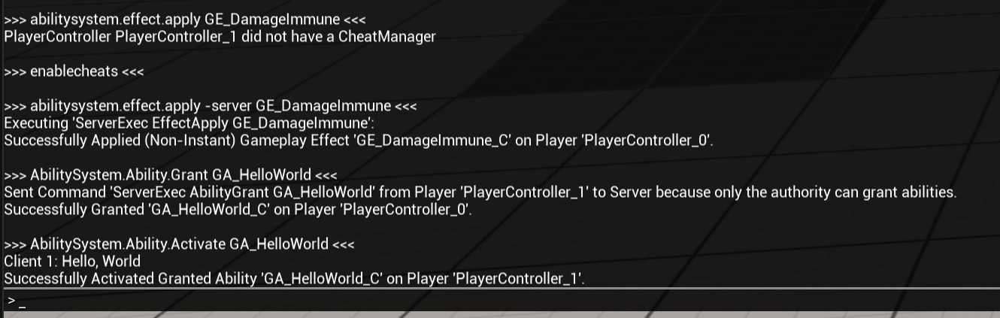
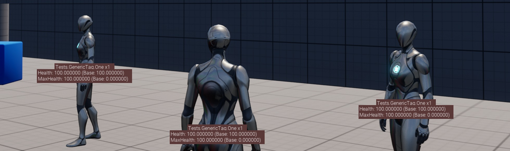
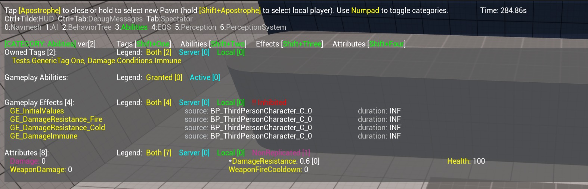
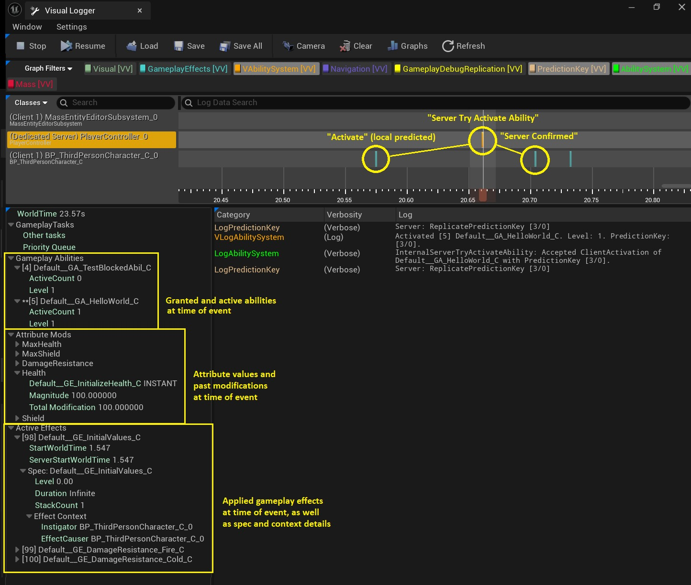
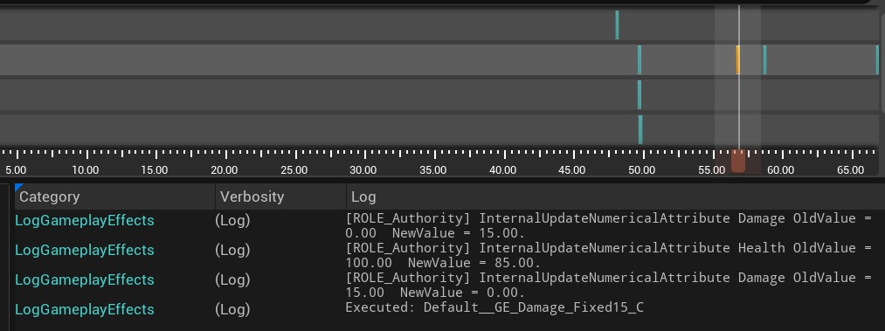
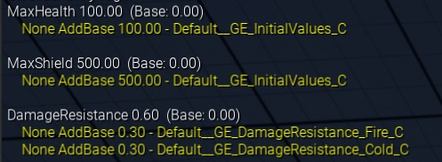
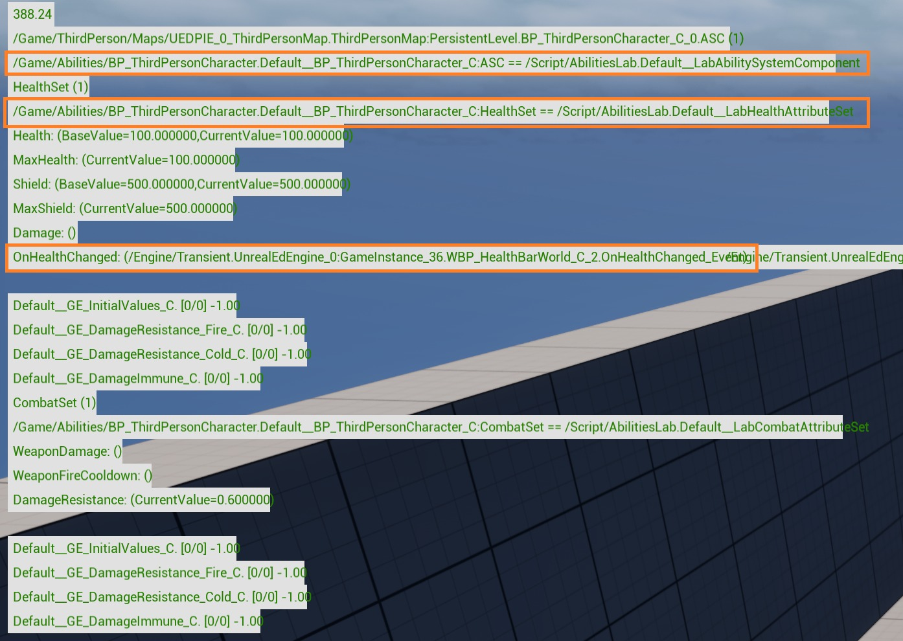

# 游戏能力系统-调试工具

## 来源与状态

- 原始 URL：https://dev.epicgames.com/community/learning/tutorials/Y477/unreal-engine-gameplay-ability-system-debugging-tools

## 运行时分类

- 类型：图文教程
- 判断：API 未识别到核心视频信号，可整理正文约 11948 字符。

## 摘要

虚幻引擎为游戏能力系统（GAS）提供了许多调试工具。本文涵盖游戏调试器、可视化记录器、GAS 控制台命令以及其他调试覆盖层和小部件。

## 中文整理

### 概览

虚幻引擎为游戏能力系统（GAS）提供了许多调试工具。本文涵盖游戏调试器、可视化记录器、GAS 控制台命令以及其他调试覆盖层和小部件。我们还将介绍它们在网络会话和构建中的有用程度。这里列出的功能在 UE 5.5 中可用，其中大多数功能已经存在了更长时间。如果您还没有学习 GAS 的基础知识，请查看[您的前 60 分钟游戏能力系统](https://dev.epicgames.com/community/learning/tutorials/8Xn9/unreal-engine-epic-for-indies-your-first-60-minutes-with-gameplay-ability-system)。

### 控制台命令

可以使用波形符 (~) 打开控制台。键入任何这些命令即可尝试游戏能力 (GA) 和游戏效果 (GE)，而无需提前编写代码。这些命令与您正在使用的 pawn、玩家状态或玩家控制器上的能力系统组件 (ASC) 进行交互，但不能以其他角色为目标。它们适用于多人游戏以及打包版本。当您作为客户端连接时，必须启用作弊才能使这些命令发挥作用。作弊在运输版本中被禁用。在多人 PIE 会话和非发布版本中，您可以通过以下任一方式启用作弊： - 在服务器或客户端上执行 EnableCheats 控制台命令 - 或在服务器上从 C++ 调用 PlayerController->EnableCheats() 使用这些命令时，请密切关注控制台的输出和输出日志。要在控制台命令中使用蓝图 GA 和 GE，它们必须已在运行时加载。请注意，即使在编辑器中播放，也不会加载所有蓝图。为了确保在运行时加载蓝图，您可以让加载的任何蓝图或数据资产引用它们，例如通过存储 GA 类数组。在打包版本中进行调试时，请确保蓝图已打包。一种方法是将所有调试测试功能放入一个文件夹中，然后将该文件夹添加到“项目设置”>“要 Cook 的其他资产目录”中。

- 控制台命令|常规-EnableCheats |在 PIE 和非发布版本中启用作弊。当您作为连接到服务器的客户端时，如果您想使用其他控制台命令，则必须执行此命令。 - 控制台命令|能力|用法示例-AbilitySystem.Ability.Grant [ClassName/AssetName] |赋予自己能力。将始终路由到服务器。 | bilitySystem.Ability.Grant GA_JumpAbility-AbilitySystem.Ability.Activate [-服务器] [TagName/ClassName/AssetName] |激活能力。这可以通过能力的本机类名称、蓝图资产名称或授予的能力激活的任何游戏标签（能力蓝图的 AssetTags）来完成。 / -server 参数控制是从服务器还是客户端尝试激活。请记住该能力的网络执行策略：某些能力只能从服务器或客户端激活。 / 在独立或作为侦听服务器中，如果您尚未拥有该能力，则授予该能力。如果您作为客户端连接并尝试在本地激活某项能力，则必须首先明确授予该能力。 | AbilitySystem.Ability.ActivateCharacterVerbs.Jump（标签）/AbilitySystem.Ability.Activate -Server GA_Respawn（资产）-AbilitySystem.Ability.Cancel [-Server] [AbilityClass] |按其类别取消正在进行的能力。此外：如果该能力是通过AbilitySystem.Ability.Activate 自动授予的，该能力也会被删除。 / -server 参数控制是从服务器还是客户端尝试激活。 | AbilitySystem.Ability.Cancel GA_AimDownSights-AbilitySystem.Ability.ListGranted | GA_AimDownSights列出所有授予的能力及其网络策略。 - 控制台命令|游戏效果|用法示例-AbilitySystem.Effect.Apply [-Server] SkillClass [级别] |将 GameplayEffect 应用于您自己。您也可以提供一个级别。 / -server 参数控制是从服务器还是客户端尝试应用程序。一般来说，您应该在服务器上应用效果。预测应用只能使用有效的预测密钥来完成。如果没有更多的工程设置，您就无法预测应用效果。 | AbilitySystem.Effect.Apply -服务器 GE_DamageImmune/AbilitySystem.Effect.Apply -服务器 GE_FireResistance 5（资产+等级）-AbilitySystem.Effect.Remove [-服务器] |从自己身上移除一层 GameplayEffect。这仅与非即时效果相关。 / -server 参数控制删除是从服务器还是客户端完成。一般来说，您应该只消除对服务器的影响。 / CVarbilitySystem.Fix.AllowPredictiveGEFlags 控制您是否可以（预测性）作为客户端删除效果。 | AbilitySystem.Effect.Remove -服务器 GE_DamageImmune - AbilitySystem.Effect.ListActive [-服务器] |列出对您自己的所有活跃游戏效果。 / -server 参数控制是否打印服务器端或客户端状态。在大多数情况下，这些列表都是相同的，只是由于网络延迟而出现临时差异。如果您预测性地应用或删除客户端的效果，它们可能会有所不同。

### 调试小部件

以下控制台命令切换调试小部件以使用 ASC 在 Actor 顶部渲染世界文本。它们可用于显示属性的本地值和标签的本地计数。对于客户端，这会显示客户端认为的值，即使服务器可能具有不同的值。 - 控制台命令|用法示例-AbilitySystem.DebugAttribute [属性1] [属性2] |使用包含该属性的 AttributeSet 在所有参与者上呈现特定属性的本地值。 |能力系统.调试属性生命值最大生命值武器伤害 - 能力系统.调试能力标签 [标签 1] [标签 2] |使用带有该标签的 SkillSystemComponent 渲染所有参与者的特定标签的本地标签计数。 | AbilitySystem.DebugAbilityTags Damage.Conditions.DamageImmune-AbilitySystem.ClearDebugAttributes |清除所有显示的 DebugAttributes。这是查看相关属性和标签并为所有可见字符显示它们的便捷方法。但是，这些小部件不会显示服务器/客户端不同步。再次执行该命令将切换可见性状态。当传入多个参数时，每个参数都会单独切换。

### 游戏调试器和可视化记录器

GAS 集成到更通用的游戏调试器和可视化记录器工具中是调试 GAS 的最现代方法。 - 控制台命令- 启用GDT |切换游戏调试器的可见性。也可以使用后撇号 (‘) 键打开。按数字键 3 显示 GAS 信息。 - VisLog |在编辑器中切换可视记录器的可见性。也可以通过“工具”>“调试”>“可视化记录器”打开。

### 游戏调试器中的 GAS

您可以在游戏过程中使用撇号 (‘) 键打开 [游戏调试器](https://dev.epicgames.com/documentation/en-us/unreal-engine/using-the-gameplay-debugger-in-unreal-engine)。游戏调试器显示一个角色的调试信息。当您按下 (`) 时，屏幕中央的 AI 或玩家 pawn 将被选中。要始终选择受控 pawn，请使用 Shift + 撇号 (`) 打开游戏调试器。要显示 GAS 调试信息，请在 Num Lock 关闭的情况下按与“功能”相关的数字键盘键。默认情况下，这将为数字 3。游戏调试器的“能力”(GAS) 类别将显示所选 ASC 的游戏标签计数、能力、效果和属性。它的一个主要优点是它可以显示服务器和本地客户端值。这对于检测值何时不同步很有用。此外，游戏调试器可以针对任何可见的 pawn，而不仅仅是您自己的 pawn。与其他选项相比，此视图的缺点是它没有显示所应用的游戏效果的每个属性修饰符的详细信息。不过，您可以看到基础值（永久）和当前值（来自活动 GE）。

### 可视化记录仪中的气体

视觉记录器是一个强大的编辑器内工具，用于记录游戏事件以及参与者和组件状态的快照。在此处阅读有关 [Visual Logger](https://dev.epicgames.com/documentation/en-us/unreal-engine/visual-logger-in-unreal-engine) 的更多信息。您可以通过“工具”>“调试”>“可视化记录器”或通过控制台命令“VisLog”在编辑器中打开它。 GAS 生成可视化记录器事件，并为每个事件提供丰富的AbilitySystemComponent 状态信息。对于每个事件，您可以检查： - 演员拥有哪些能力（已授予且处于活动状态） - 哪些游戏效果在那一刻处于活动状态 - 哪些属性值，以及详细信息： - 活动非即时 GE 的修饰符细分。 - 过去即时 GE 的修改历史。*

此外，选择事件后，相关日志消息也会在可视记录器中可见。

GAS 在以下情况下生成可视记录器事件： - 也通过复制授予和删除能力。 - 效果也可以通过复制来应用和删除。 - 能力激活尝试。成功和失败都会被记录下来。失败的激活尝试还会记录一些有关原因的信息。 - 能力和效果规格发生变化，例如能力级别或效果堆栈。视觉记录器非常有用，因为对于每个事件，您都可以检查演员的能力系统组件的状态。当某项能力由于必需或阻止标签而无法激活时，您可以检查存在哪些标签。这可以帮助您在整个游戏会话中调试 GAS 行为。运行多人 PIE 会话时，视觉记录器分别捕获服务器和客户端时间线。这允许您调试网络游戏代码。例如，当某个功能无法激活时，您可以使用可视记录器事件来检查这是发生在客户端还是服务器端。

### 其他调试覆盖

引擎中仍然存在许多其他 GAS 调试覆盖层，它们是在不同时间开发的。这些工具最近没有像 Gameplay Debugger 或 Visual Logger 那样受到那么多关注，但仍然显示一些其他工具不显示的信息。 - 调试叠加层- ShowDebug Skills System |切换旧能力系统调试覆盖层之一的可见性，该覆盖层对于检查活动 GameplayEffects 的属性修改器故障仍然有用。 - 能力系统.DebugBasicHUD |切换旧能力系统调试覆盖层之一的可见性，该覆盖层对于检索玩家的AbilitySystemComponent、AttributeSets 的路径名称以及列出用户定义的AttributeSet 委托的侦听器非常有用。

### 显示调试能力系统

此调试 UI 的优点在于，它将属性值细分为修改器，以及作为修改器来源的活动游戏效果。这仅适用于非即时 GE，因为即时 GE 直接修改基础值。此 UI 的缺点是它仅针对本地玩家。它还仅显示本地值，而不显示服务器和客户端值，因此它不能用于检测属性值不同步。

### 能力系统.DebugBasicHUD

这是一个非常过时的调试覆盖层，其中的大部分信息可以通过其他覆盖层更好地查看。但是，这仍然很有用，特别是对于列出哪些侦听器绑定到 AttributeSet 委托而言。例如，在下面的屏幕截图中，项目有一个带有 OnHealthChanged 多播委托的 HealthAttributeSet。该叠加层列出了有一个订阅了该委托的 UMG 小部件。

### 创建自定义工具

能力系统组件包含许多虚拟功能，让您有机会输出自己的数据。这对于创建您自己的调试工具很有用。为此目的需要重写的一些好函数是： - OnGiveAbility - OnRemoveAbility - NotifyAbilityActivated - NotifyAbilityCommit - NotifyAbilityEnded - NotifyAbilityFailed - ApplyGameplayEffectSpecToSelf - OnGameplayEffectRemoved - OnTagUpdated
