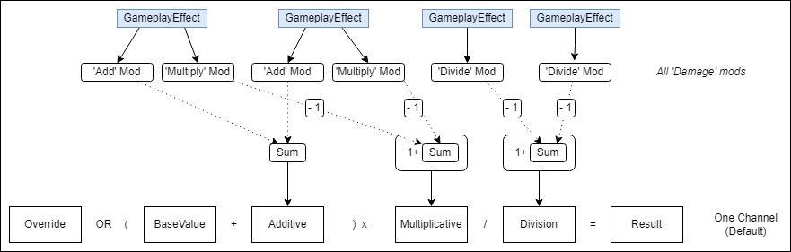
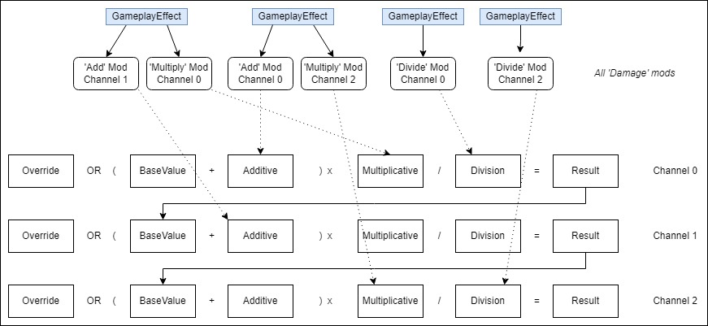
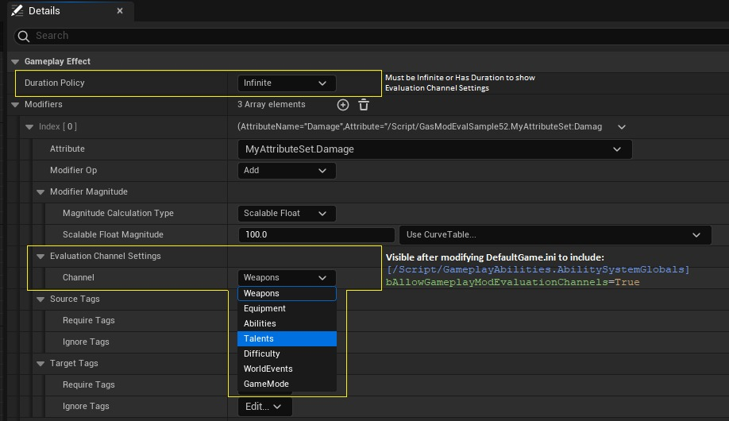

# 游戏能力系统-修改器评估通道

## 来源与状态

- 原始 URL：https://dev.epicgames.com/community/learning/tutorials/JG2a/unreal-engine-gameplay-ability-system-modifier-evaluation-channels

## 运行时分类

- 类型：图文教程
- 判断：API 未识别到核心视频信号，可整理正文约 7550 字符。

## 摘要

本文面向游戏能力系统 (GAS) 用户，解释了如何使用 mod 评估通道来让设计者更好地控制一个游戏属性的多个修饰符 (mod) 如何组合在一起（即聚合）。

## 中文整理

### 概览

本文面向 **游戏能力系统 **(GAS) 用户，解释了如何使用 mod 评估通道来让设计者更好地控制一个游戏属性的多个修饰符 (mod) 如何组合在一起，即*聚合*。为了继续进行下去，您应该已经熟悉在游戏效果中配置属性修饰符。

### 修饰符聚合

考虑单个游戏属性“伤害”。游戏效果 (GE) 可以为此属性指定修饰符：每个修饰符都有一个值和一个*运算符*（加法、乘法、除法、覆盖）。每当需要计算伤害属性值时，就会收集并处理所有 GE 的伤害修正值。这种情况发生的方式如图 1 所示。



具有相同数学运算符（加法、乘法、除法）的多个修饰符相加。例如，两个 1.2（或 +20%）的乘法修改器加在一起为 1.4（或 +40%）。对于“乘”和“除”修改器，基数 100% 仅计算一次。这是通过从各个修饰符中减去 1.0 并在总和中添加 1.0（一次）来实现的。运算符应用的顺序是：如果存在 Override 修饰符，则优先考虑所有修饰符。如果不存在，则运算顺序为加法、乘法、然后除法。计算属性值的代码在函数中找到：

```cpp
float FAggregatorModChannel::EvaluateWithBase(...) const;
```

### 挑战：需要不同公式的场景

游戏设计者对于如何组合同一运算符的修饰符以及应用运算符的顺序可能有不同的意图。在这种情况下，上述计算并不能提供足够的控制。考虑一个伤害属性受以下来源影响的游戏： - 武器提供的伤害值在 10 - 200 范围内 - 装备可以将伤害输出增加最多 50% - 玩家能力（自身增益）可以将伤害输出增加最多 100% - 天赋树可以将伤害输出增加最多 20% - 战役难度可以在 -30% 到 +30% 的范围内修改伤害输出 - 世界事件可以将伤害输出再增加 100% - 游戏模式可以修改所有伤害，例如将所有伤害设置为 1（标签）或 100000（instagib） 这是一种场景，其中一个属性的值可以由许多 GE 修改，所有 GE 都会对最终值做出贡献。您可能对如何组合两个或多个修饰符有想法。例如： - 武器的 +20% 伤害模式（乘以 1.2）和天赋的 +20% 伤害模式（乘以 1.2）应该是…… - a) 相加，(100% + 20% + 20% = 140%) - b) 还是互相放大？ (120% x 120% = 144%) - 技能的 +50% 伤害模式（乘以 1.5）和减益效果的 -30% 伤害模式（乘以 0.7）是否会导致…… - a) +50% - 30% = +20% 伤害，- b) 或 1.50 x 0.70 = 1.05 = +5% 伤害？ - 是否应该应用物品的 +10 伤害模式（加法 10）... - a) 在自我增益 +50% 伤害增加（乘以 1.5）之前、((base + 10) x 1.5) - b) 或之后？ ((base x 1.5) + 10) - 将伤害设置为正好 1000（覆盖 1000）的伤害覆盖修正值是否应该受到乘法和除法修正值的影响？ - b) 或者应该受到影响吗？ - 当有两个伤害覆盖修饰符时，如何使一个始终优先于另一个？在上述问题中，选项 (a) 是默认行为。当设计者想要实现选项 (b) 或其他非默认行为时，GAS 提供了一种将修改器分离到不同通道的方法。这些通道对应不同的计算通道，使设计者能够更好地控制最终属性值的计算。

### 选择加入：Mod 评估渠道

启用 mod 评估通道会导致通过多次计算传递来计算属性值。然后，GE 中的每个修改器都可以分配给一个命名通道。该功能必须通过 INI 文件启用。启用后，属性计算如图 2 所示，您可以将修饰符分配给通道，如图 3 所示。计算一个通道的值并将其输入下一个通道的代码可在以下位置找到： float FAggregatorModChannelContainer::EvaluateWithBase(...) const



Mod 评估通道特别适用于： - 控制将哪些相同运算符修饰符求和在一起 - 控制应用修饰符的顺序 同一通道中的修饰符根据 *修饰符聚合* 中描述的计算组合为一个值。然后结果作为 BaseValue 送入下一个通道。如此重复，直到最后一个定义的通道，该通道输出属性的最终值。最多可定义 10 个通道。 Mod 评估通道可通过编辑游戏项目的 DefaultGame.ini 来启用。您可以在此处启用该功能并为通道分配名称。渠道指数是评价顺序从低到高。应在 DefaultGame.ini 中添加以下部分和条目：

```
[/Script/GameplayAbilities.AbilitySystemGlobals]
bAllowGameplayModEvaluationChannels=True
GameplayModEvaluationChannelAliases[0]=Weapons
GameplayModEvaluationChannelAliases[1]=Equipment
GameplayModEvaluationChannelAliases[2]=Abilities
GameplayModEvaluationChannelAliases[3]=Talents
GameplayModEvaluationChannelAliases[4]=Difficulty
GameplayModEvaluationChannelAliases[5]=WorldEvents
GameplayModEvaluationChannelAliases[6]=GameMode
```

启用此功能后，持续时间策略 = **无限 **或具有 **持续时间 ** 的 GameplayEffect 蓝图的“详细信息”面板将为每个修改器提供一个额外的 **评估通道设置** 属性，其中可以将通道设置为您在 ini 中命名的通道之一。 Mod 通道与 Instant GE 无关，因为它们的附加修饰符会永久添加到（第一个通道的）BaseValue 中，而其他运算符没有效果。



### 重新审视挑战：需要不同公式的场景

回到上面的例子： - 如果两个 +20% 伤害修正值（乘以 1.2）应该互相放大（1.2 x 1.2 = +44%），这是通过将它们分配给不同的修正值通道来实现的。 - 如果在 +50% 伤害（乘以 1.5）修正值之后评估 -30% 伤害修正值（乘以 0.7），则可以通过为其分配较晚的通道来实现。 - 如果在自我增益的 +50% 伤害模组（乘以 1.5）之后应应用物品的 +10 伤害伤害增加（加法 10），则 +10 伤害修正值是通过将 +10 伤害修正值分配到后面的通道来实现的。 - 如果将伤害设置为 1000（覆盖 1000）的伤害覆盖修改器仍会受到乘法和除法修改器的影响，则您可以将这些乘法和除法修改器指定为比覆盖修改器晚的通道。 - 如果一个伤害覆盖修饰符应始终优先于另一个修饰符，则您可以将该修饰符分配给后面的通道。 Mod 评估通道使此类需求易于实现，无需引入自定义代码或其他属性！

### 概括

Mod 评估通道是一项可选功能，使设计人员能够控制受多个源影响时属性值的计算方式。它可用于控制对哪些修饰符进行求和、哪些修饰符单独应用以及应用修饰符的顺序。 Mod 评估通道是实现详细数学公式以计算游戏属性值的有用工具，同时在许多情况下避免引入新属性或计算类的需要。
