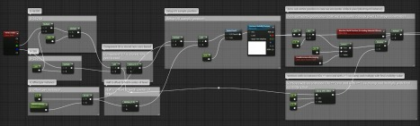

# 如何实现可破坏的 HLOD

## 来源与状态

- 原始 URL：https://dev.epicgames.com/community/learning/knowledge-base/bajv/unreal-engine-how-to-achieve-destructible-hlods

## 运行时分类

- 类型：图文教程
- 判断：API 未识别到核心视频信号，可整理正文约 3272 字符。

## 摘要

2020 年 10 月 24 日。知识最初由 Ryan B 编写。您可以通过在 HLOD 网格中使用顶点颜色来存储原始对象 ID 来实现此目的。使用充当“可见性缓冲区”的纹理，您可以...

## 中文整理

### 概览

2020 年 10 月 24 日。知识最初由 [Ryan B.](https://dev.epicgames.com/community/profile/23wL/RyanBickell) 编写。您可以通过在 HLOD 网格中使用顶点颜色来存储原始对象 ID 来实现此目的。使用充当“可见性缓冲区”的纹理，您可以从材质中隐藏网格的某些部分。 1. 将顶点颜色添加到合并网格 2. 创建可见性缓冲区、纹理和材质 3. 更新可见性缓冲区 4. 从材质中的可见性缓冲区读取 5. 代码示例 - 破坏网格合并扩展

### 将顶点颜色添加到合并的网格中

使用“网格合并扩展”可以很容易地完成此操作，该扩展在创建合并网格时将被调用。然后，您必须确保在编辑器启动/关闭时注册/取消注册此合并扩展。启动时：

```cpp
// Register the merge extension 
MergeExtension = new FDestructionMeshMergeExtension(); 
IMeshMergeModule& Module = FModuleManager::LoadModuleChecked<IMeshMergeModule>("MeshMergeUtilities"); 
Module.GetUtilities().RegisterExtension(MergeExtension);
```

关机时：

```cpp
// Unregister the merge extension 
IMeshMergeModule& Module = FModuleManager::LoadModuleChecked<IMeshMergeModule>("MeshMergeUtilities"); Module.GetUtilities().UnregisterExtension(MergeExtension);
```

### 创建可见性缓冲区、纹理和材质

```cpp
TArray<uint8> VisibilityBuffer;
UMaterialInstanceDynamic* VisibilityMaterial;
UTexture2DDynamic* VisibilityTexture;
int32 ActorCount = LODActor->SubActors.Num();
VisibilityBuffer.SetNumUninitialized(FMath::RoundUpToPowerOfTwo(ActorCount));
FMemory::Memset(LODActorData.VisibilityBuffer.GetData(), 0xff,
				LODActorData.VisibilityBuffer.Num());
				// Retrieve base HLOD material (always go to the static mesh, as this component may have a previous override) 
UMaterialInterface* HLODMaterial = LODActor->GetStaticMeshComponent()->GetStaticMesh()->GetMaterial(0);
// Retrieve number of instance stored inside of this LOD actor
```

### 更新可见性缓冲区

```cpp
int32 ActorIndex = 0; for(AActor* HLODSubActor : LODActor->SubActors)
{
	if(ADestructibleActor* DestructibleActor = Cast<ADestructibleActor>(HLODSubActor))
	{
// Set percentage health as uint8 in the visibility texture const uint8 HealthInt = DestructibleActor->GetHealthPercent() * 0xff; // Record destroyed state LODActorData.VisibilityBuffer[ActorIndex] = !(DestructibleActor->WasDestroyed() || DestructibleActor->IsPendingKill() || DestructibleActor->IsActorBeingDestroyed()) ? HealthInt : 0x0; 
	}
	else
	{
		LODActorData.VisibilityBuffer[ActorIndex] = (HLODSubActor != nullptr) ? 0xff : 0x00;
	} ActorIndex++;
```

### 从材质中的可见性缓冲区读取



### 代码示例 - 破坏网格合并扩展

```cpp
// Use vertex color attributes to store component indices 
// In the material, this allows us to mask destructed building parts 
class FDestructionMeshMergeExtension : public IMeshMergeExtension 
{ 
    public: 
        virtual void OnCreatedMergedRawMeshes(
                            const  TArray<UStaticMeshComponent*>& MergedComponents,  
                            const class FMeshMergeDataTracker& DataTracker, 
                            TArray<FMeshDescription>& MergedMeshLODs) override
        {
```
