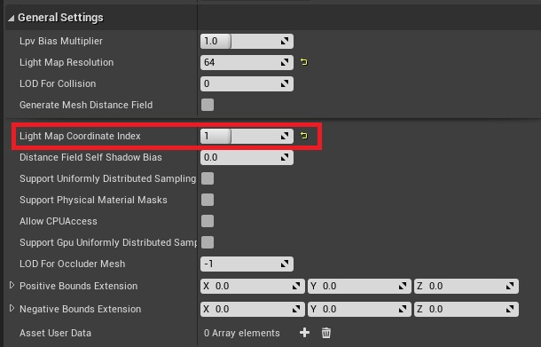
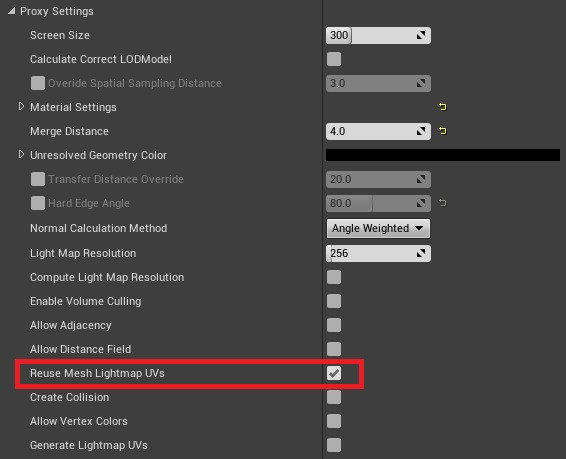

# 烘焙 HLOD 后漫反射纹理不正确

## 来源与状态

- 原始 URL：https://dev.epicgames.com/community/learning/knowledge-base/BL7Z/unreal-engine-incorrect-diffuse-textures-after-baking-hlod

## 运行时分类

- 类型：图文教程
- 判断：API 未识别到核心视频信号，可整理正文约 790 字符。

## 摘要

烘焙 HLOD 后的漫反射纹理不正确文章由 Ryan B 撰写。如果您在烘焙 HLOD 后遇到漫反射纹理出现粉红色伪影的问题，那么它很可能来自具有 emp 的网格……

## 中文整理

### 概览

*由 [Ryan B.](https://dev.epicgames.com/community/profile/23wL/RyanBickell) 撰写的文章* 如果您在烘焙 HLOD 后遇到漫反射纹理出现粉红色伪影的问题，那么它很可能来自使用空 UV 通道的网格。有几个快速解决方案可以解决此问题，其中任何一个都应该有效： 1. 在网格属性中将光照贴图坐标索引设置为 0。该属性用作光照贴图 UV 通道。

1. 在 HLOD 代理设置中禁用重用网格光照贴图 UV，该设置指定在烘焙 HLOD 材质时是否使用光照贴图 UV。

