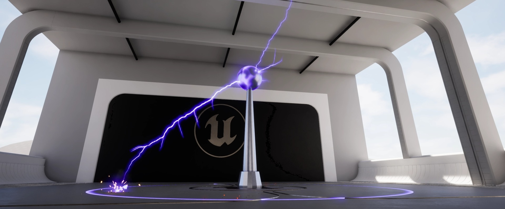
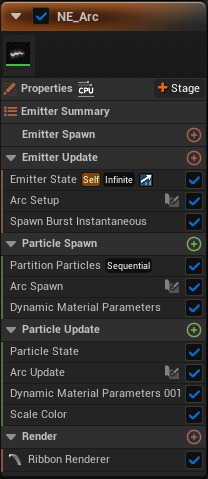
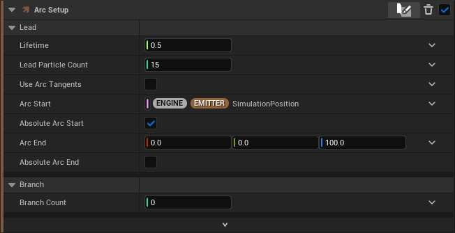
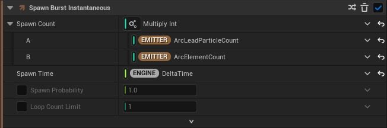
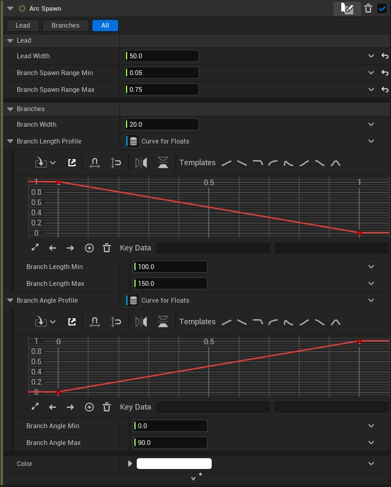
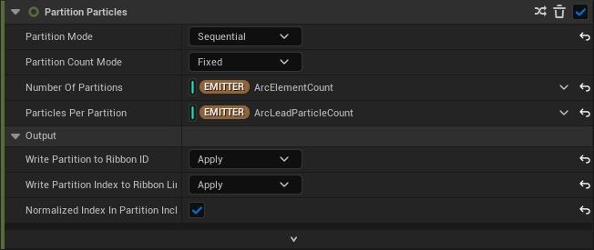
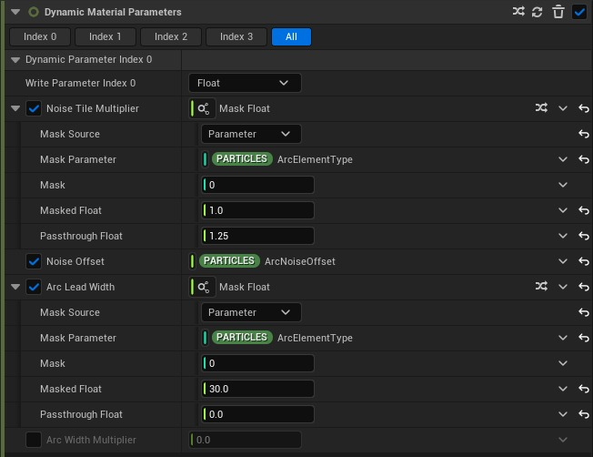
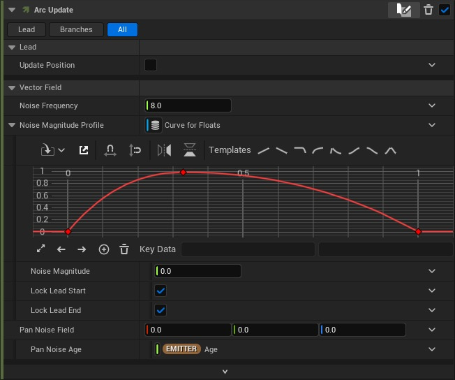
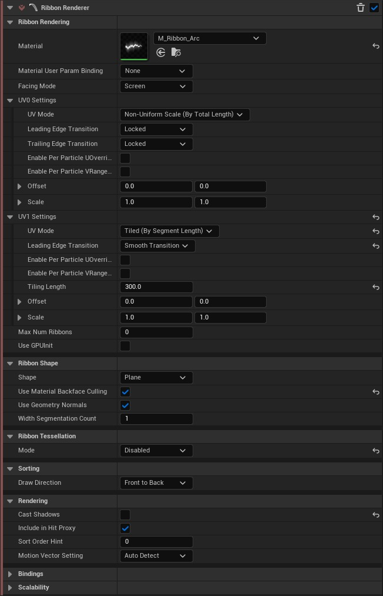
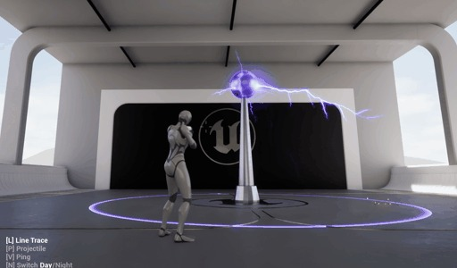

# Niagara 示例包：电弧发射器资源

## 来源与状态

- 原始 URL：https://dev.epicgames.com/community/learning/tutorials/op6d/unreal-engine-niagara-example-pack-arc-emitter-asset

## 运行时分类

- 类型：图文教程
- 判断：API 未识别到核心视频信号，可整理正文约 2566 字符。

## 摘要

如何使用我们的示例电弧发射器。

## 中文整理

### 概览

### 概述

弧形发射器 NE_Arc 是根据 Unreal 提供的原始光束发射器建模的，但具有一些额外的功能。它还包含 3 个主要模块：**Arc 设置**、**Arc Spawn** 和 **Arc 更新**。我们还提供了名为 **M_Ribbon_Arc** 的材质，以更好地支持该功能，它具有一些静态设置以及一些动态材质参数。

### 电弧设置

与光束发射器一样，该模块设置了电弧的必要条件。引线是弧的主要元素。我在本节中添加了“生命周期”和“粒子计数”，因为我们通常希望 Arc 具有整体生命周期，而不是为每个粒子设置它。您会注意到您还可以设置所需的分支数量。您可以设置单个值或随机范围。

在 Spawn Burst 模块中，我将 Arc Setup 的输出相乘，以获得 Arc 中所有元素的总体生成计数。

### 电弧生成

引线属性很小，使您可以控制带宽度以及沿引线可能出现分支的范围。这是从开始到结束的标准化范围 (0.0-1.0)。分支属性允许您设置单独的带宽度值，以及沿生成范围设置其长度和角度配置文件。轮廓曲线充当下面设置的最小值 (y=0.0) 和最大值 (y=1.0) 之间的线性插值。 x 轴是在 Lead 上设置的 Branch Spawn Range 的标准化值。

为了使分支正常工作，我依靠分区粒子模块对每个元素进行分组。

我们将动态材质参数输入到材质中以获得一些额外的控制。

### 电弧更新

更新位置，允许您将圆弧保留在其最后设置的位置，或让圆弧遵循其起点/终点。矢量场允许您向弧线添加噪声，从而为您提供漂亮的形状和运动。请小心这些值，因为如果您忘乎所以，丝带很容易断裂。

### 功能区渲染器

如您所见，我们已准备好 M_Ribbon_Arc 材质。 UV1 设置 - 平铺长度可以根据您的喜好进行调整。这控制材质平铺中的噪波纹理的方式。功能区形状设置为背面剔除，因为我们的功能区是面向相机的平面。我已禁用曲面细分以便手动控制细分。

### 结果：特斯拉线圈！

我们提供了一个有趣的示例，即最远房间中的特斯拉线圈对象。这包含了发射器的几个版本以及一些其他特殊逻辑。您可能还认识到我们在拾取示例中使用的材质叠加着色器。

