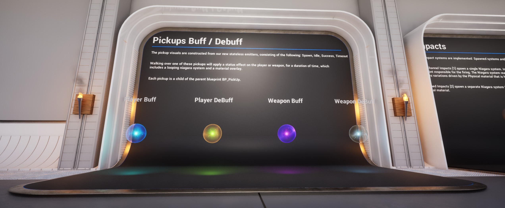
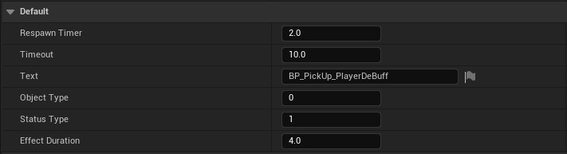
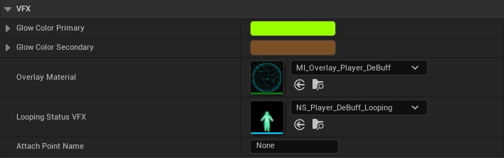
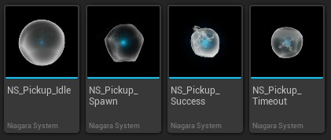
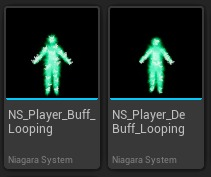
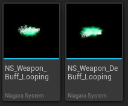
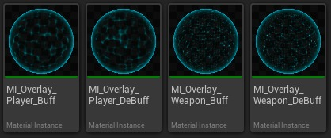
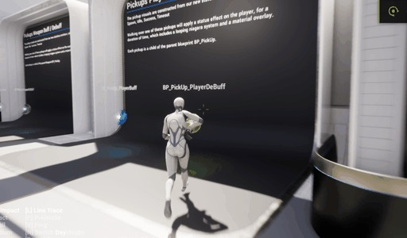
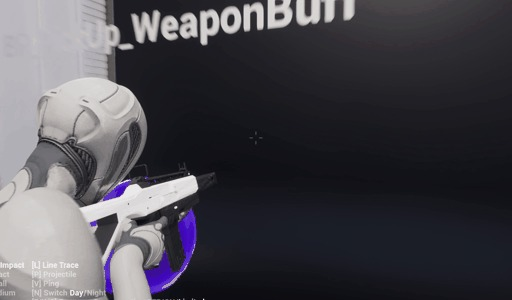

# Niagara 示例包 - 拾音器和玩家效果

## 来源与状态

- 原始 URL：https://dev.epicgames.com/community/learning/tutorials/ODw0/unreal-engine-niagara-example-pack-pickups-and-player-effects

## 运行时分类

- 类型：图文教程
- 判断：API 未识别到核心视频信号，可整理正文约 2383 字符。

## 摘要

这是 Niagara 示例包中拾音器和播放器效果如何工作的简要概述。

## 中文整理

### 概述

我们为 Pickup 风格的物品提供了一套基本的视觉特效，可以对与其碰撞的玩家应用状态效果。下面我将描述一些基线控制、资产和行为。

### 蓝图

在皮卡蓝图中，我们组合了一组资源和一些自定义参数，使您的皮卡感觉像真实的物品。目前，Pickup BP 充当其自己的生成器，具有一些高级设置。重生计时器：物品被拾取后重生的时间，或超时。 （0 = 禁用重生） 超时：物品生成后多长时间（以秒为单位）才能重新生成。对象类型：0 = 玩家，1 = 武器状态类型：0 = Buff，1 = De Buff 效果持续时间：状态效果将持续多长时间。

至于视觉效果，我们提供了原色和次要颜色、默认覆盖材质和循环状态 Niagara 系统。这两种资源都使用了颜色，赋予它们视觉上的凝聚力。

当您与拾取物重叠时，我们会对玩家或武器应用状态效果 (GE_Status_Parent)。

### 视觉特效：拾音球体

对于我们的皮卡，我们提供了 4 个轻量级 Niagara 系统供使用。每一项都涉及 Pickup 的状态和转换。

### 视觉特效：玩家 vs 武器

我们有两种玩家效果设置，一种用于 Buff 和 De Buff。它们很相似，但动作和时间不同。他们使用骨架网格体数据接口来生成粒子，并遵循角色动画。

我们还有两个武器。与玩家 VFX 相同，但经过简化，没有骨架网格体 DI。

### 材质：网状覆盖层

网格覆盖材质适用于玩家或武器，作为其原始材质之上的覆盖。它具有通过状态效果 (GE_Status_Parent) 初始化的内置转换输入/输出。我们为 4 个用例提供了 4 个材质实例。

### 结果：玩家 vs 武器

这是应用 de buff 的示例。注意所有元素聚集在一起。颜色传输到 MI_Overlay_Player_Buff 材质以及 NS_Player_DeBuff_Looping 系统中。我们甚至将它用于我们的足迹系统，将值发送到 NDC。

这是获得增益效果的武器。类似的行为，只是武器使用了不同的 Niagara 系统，并且我们已将颜色转移到武器的枪口闪光。

