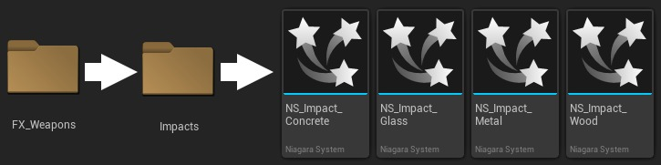
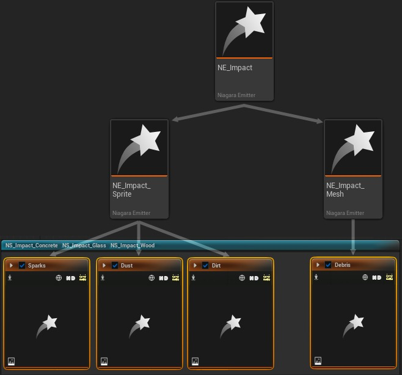
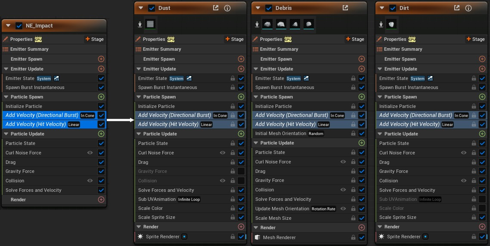
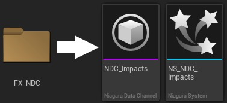
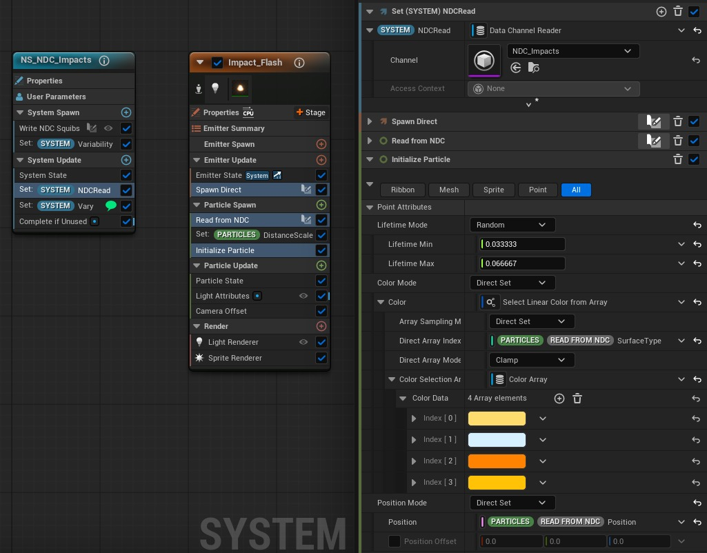
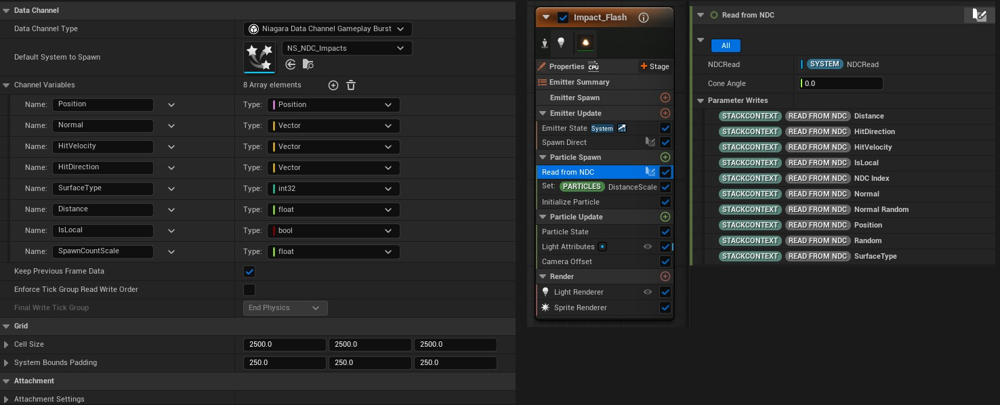
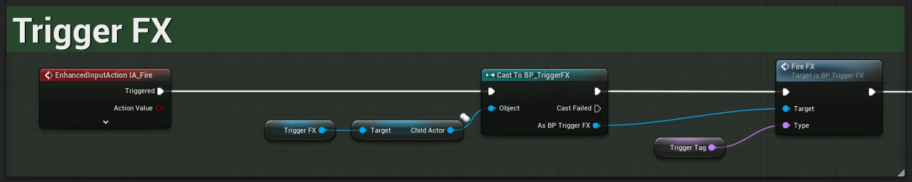
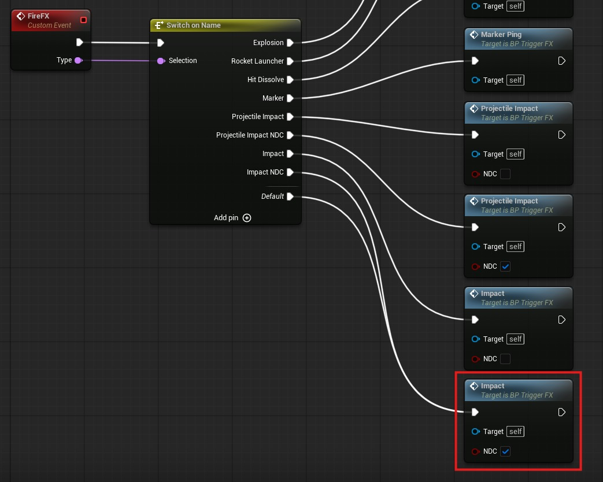
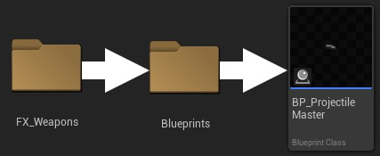
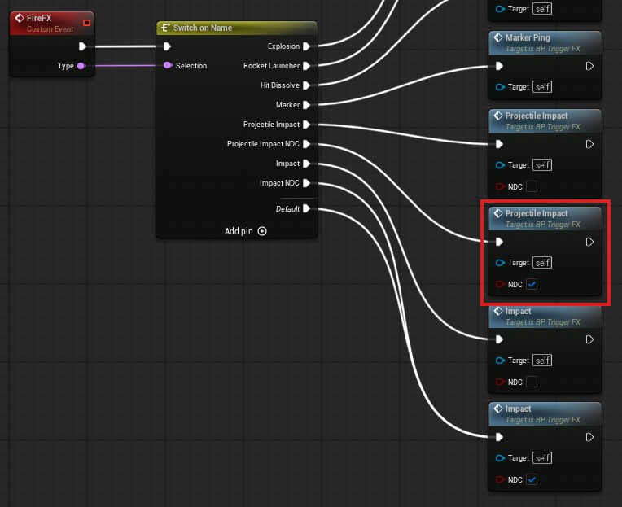

# Niagara 示例包：影响

## 来源与状态

- 原始 URL：https://dev.epicgames.com/community/learning/tutorials/YGJm/unreal-engine-niagara-examples-pack-impacts

## 运行时分类

- 类型：图文教程
- 判断：API 未识别到核心视频信号，可整理正文约 8337 字符。

## 摘要

本教程概述了 Niagara Examples Pack 中可用的影响系统。从 FAB 导入 Niagara Examples Pack 以进行后续操作。

## 中文整理

### 概览

包中演示了两种冲击生成方法：每次冲击生成一个系统，以及使用 Niagara 数据通道在单个系统内爆发冲击。 - 每次撞击的生成系统是处理武器系统的标准方法。对于静态和移动目标，该方法通常更容易设置。 - 为每个影响生成一个新的系统组件可能会成为一个性能问题，但这仅仅是因为需要评估的参与者数量。 - Niagara 数据通道用于将数据从发射系统（蓝图或 C++）传递到 Niagara 系统。一个尼亚加拉系统可以产生多种影响，从而导致世界上产生的尼亚加拉系统少得多。减少世界中的演员数量是一项非常有价值的优化。 - 虽然建议将 Niagara 数据通道用于武器射击系统，特别是快速射击场景，但它确实存在一些缺点，例如影响之间的半透明排序。

### 系统生成

该示例包附带 4 个冲击系统：混凝土、玻璃、金属和木材。他们之间的行为非常相似。变化是通过移除元素（例如金属冲击偏向于火花而不是碎片）、改变碎片网格（混凝土、木材、玻璃）以及改变颜色和尺寸来实现的。

### 遗产

由于系统之间的功能相似，继承已被用来演示如何一次性实现公共功能，然后由许多子发射器共享。

例如，所有发射器共享“添加速度”模块。因此，它们可以从 NE_Impact 发射器资源继承。如果需要在全局范围内调整修改，则可以在一处进行调整，并且所有子发射器和系统都会拾取它：

### 用户参数

冲击系统主要是通过蓝图产生的。为了提高效率，用户参数的数量保持较小： - **爆发量** - 控制系统产生的粒子数量。该数量不是硬粒子计数，而是不同发射器共享的一般数量。 - **可变性 **- 这是一个 0-1 值，指示触发时每个影响应出现的差异程度。如果可变性设置为零，则每个影响看起来都非常相似。值为 1 将导致每次命中产生的“伤害”的规模和数量不同。 - **基础颜色** - 影响灰尘、污垢和碎片元素的颜色。 - **命中速度**、**命中方向**和**命中法线**从线路跟踪命中结果结构传递，通常不手动设置。

### 系统参数

蓝色系统块上有几个参数，可用于调整整个系统的外观： - **突发方向** - 指定粒子将沿其移动的局部空间矢量。局部 X 轴是主轴。反射矢量也是根据从生成系统的蓝图传入的击中方向和击中法线来计算的。最终的方向是这两个方向的混合。 - **局部击中速度** - 被击中的表面的速度。在这种情况下，速度是从生成系统的蓝图传递的。可以直接从系统查询所有者速度，但在生成后的第一帧上它可能不可靠。该速度用于继承撞击表面的运动。 - **距离比例/发射比例** - 这些乘数使用 LOD 距离来补偿靠近摄像机或远离摄像机产生的影响。可以修改大小和生成速率等属性以提高可见性并减少粒子计数。默认比例和距离可以根据您的具体需求进行调整。 - 火花/烟雾/碎片/污垢百分比 - 这些属性控制每个元素爆发的粒子相对数量。例如，这些值在 0-1 范围内，可用于偏置与碎片计数相关的火花数量。

### Niagara 数据通道影响

两个资产定义了 Niagara 数据通道影响系统： - Niagara 数据通道资产 (**NDC_Impacts**) 定义了 NDC 的类型及其可以保存的数据。 - Niagara 系统 (**NS_NDC_Impacts**) 在每一帧上读取数据通道中的数据。如果数据存在，它将在数据通道中指定的位置产生冲击效果。 NS_NDC_Impacts 系统中有多个发射器，但它们都以相同的方式从数据通道读取。 - **数据通道读取器**在系统级别定义。系统中的每个发射器都可以访问该读取器。 - 在发射器更新中，粒子是根据当前帧数据通道内找到的条目数生成的。每次影响将有一个数据通道条目。 **Spawn Direct** 刮擦模块将为每次影响生成用户定义数量的粒子。 - 在粒子生成中，每个生成的粒子使用数据通道数据来初始化其数据。 **从 NDC 读取**暂存模块查询数据通道并将该数据复制到生成的粒子上的属性。随后的每个模块都可以使用这些数据来定义各种属性，例如位置和速度。 - 在下面的屏幕截图中，您可以看到粒子位置已初始化为 **PARTICLES.READ FROM NDC.Position**。这是直接从数据通道读取的。

Niagara 数据通道资产定义每个属性的名称和类型。通过**从 NDC 读取**暂存模块，系统中的每个粒子都可以使用该数据。双击堆栈中的模块（如下图蓝色所示）即可查看实现。

STACKCONTEXT 是一个方便的命名空间。查询时它将解析为当前上下文名称空间。例如：当从粒子生成堆栈链接时，位置属性可以作为 PARTICLES.READ FROM NDC.Position 链接到。 - [Niagara 数据通道概述](https://dev.epicgames.com/documentation/en-us/unreal-engine/niagara-data-channels-overview) - [查看内容示例中的 Niagara 数据通道地图](https://fab.com/listings/4d251261-d98c-48e2-baee-8f4e47c67091) 上述资产将数据定义为保存在数据通道和将使用该数据的系统中。现在我们需要在武器开火时将数据发送到数据通道。示例包使用蓝图来填充数据通道。

### 蓝图

在 Gallery/Blueprints 文件夹中，您将找到几个用于实现 GalleryLevel 地图中使用的影响系统的蓝图。 BP_Gallery_Character 蓝图接受用户的输入，并将触发器和事件发送到 BP_Trigger_FX 蓝图：

BP_TriggerFX 蓝图用于根据游戏的当前状态决定使用哪种武器。现在，我们假设我们正在使用 Niagara 数据通道 (NDC) 影响。

数据通道由 BP_TriggerImpact 蓝图填充。命中结果结构被传递到包含命中位置、命中正常等的蓝图。利用该信息，NDC 可以填充 Niagara 系统产生影响所需的所有数据。 BP_TriggerImpact 蓝图处理数据通道影响和生成系统影响。您可以从自己的逻辑调用相同的函数来运行冲击系统的第一个版本。

### 线迹或射弹

示例包中演示了两种发射类型：线迹冲击和基于射弹的冲击。 - 线迹冲击立即击中目标表面。 - 基于射弹的影响会产生从武器中发射的射弹并在碰撞时产生影响。它受重力影响，从武器到目标需要时间。使用线迹或射弹时，会以相同的方式产生影响。两种方法都会返回 **命中结果结构**。 - Line Trace By Channel 蓝图函数直接返回命中结果结构。 - 当射弹与表面碰撞时，**On Component Hit** 事件返回 Hit Result Structure。射弹的示例蓝图可以在 FX_Weapons 文件夹中找到。

子蓝图可以继承此主蓝图并覆盖**处理命中事件**函数以更改影响时的行为。发射射弹的示例可以在 BP_TriggerFX 蓝图中找到。

## 相关链接

- [Niagara Data Channels Overview](https://dev.epicgames.com/documentation/en-us/unreal-engine/niagara-data-channels-overview)
- [Check out the Niagara Data Channels map in Content Examples](https://fab.com/listings/4d251261-d98c-48e2-baee-8f4e47c67091)
