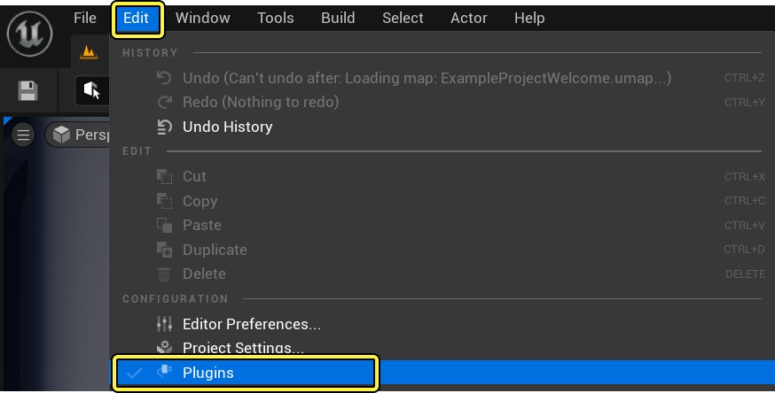
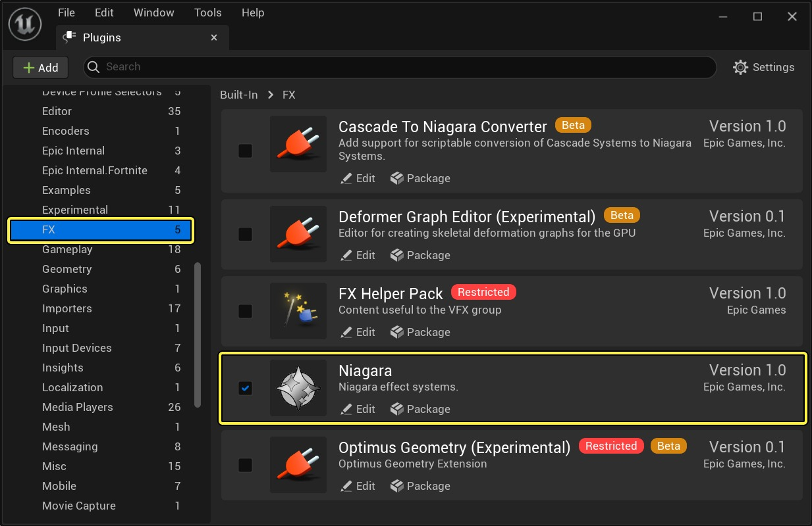
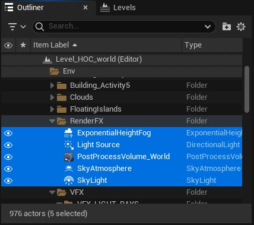
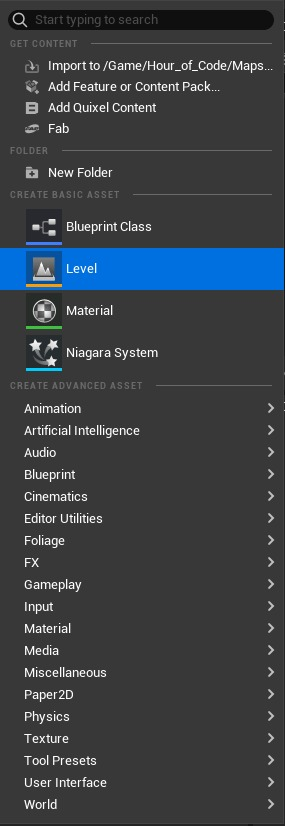
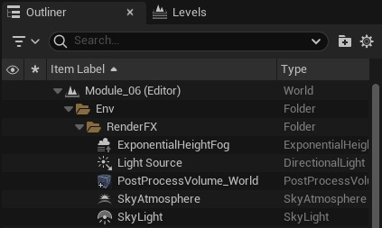
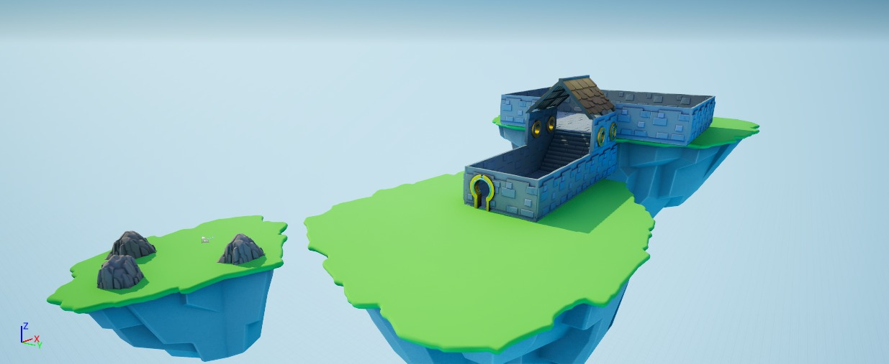
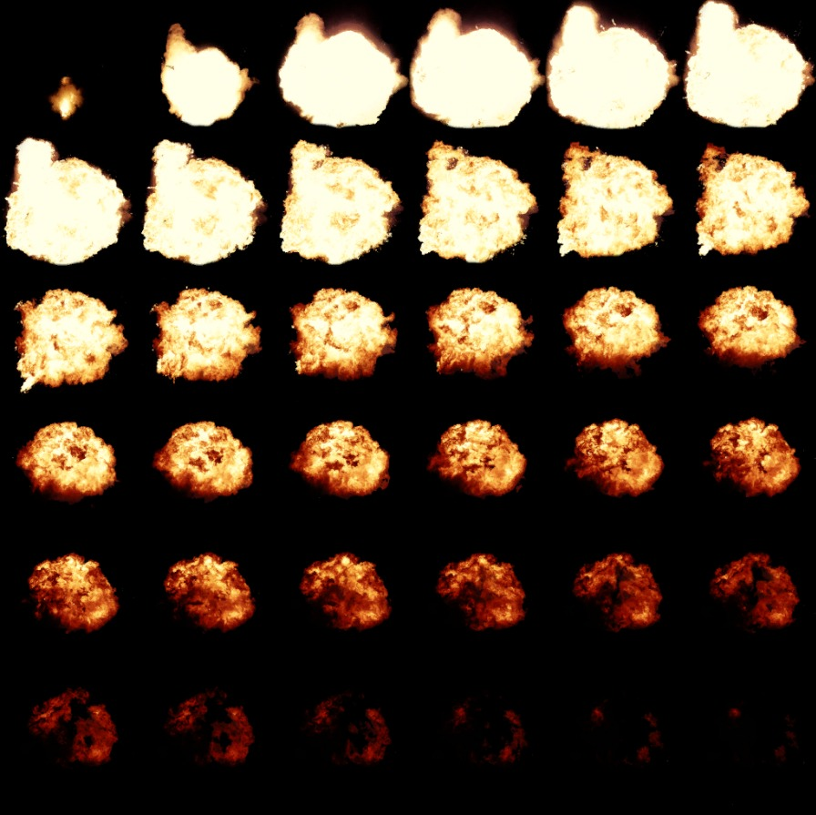
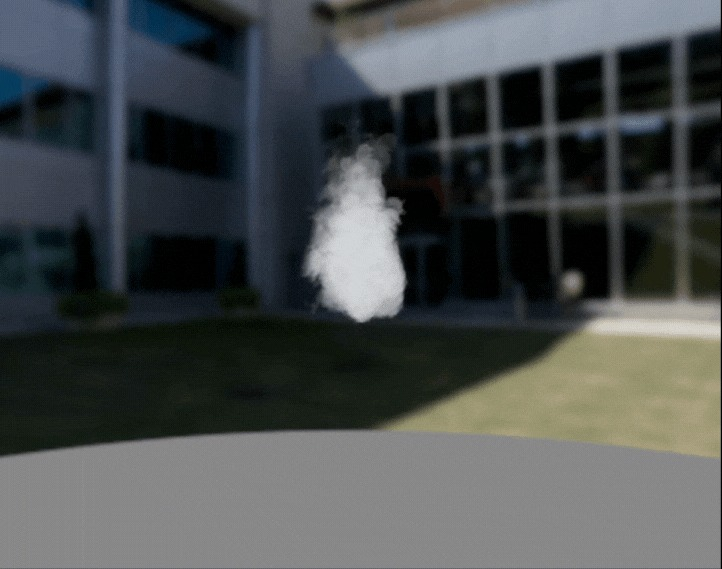
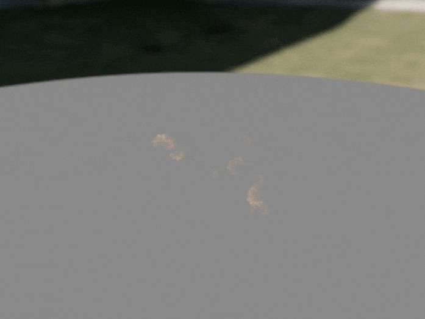
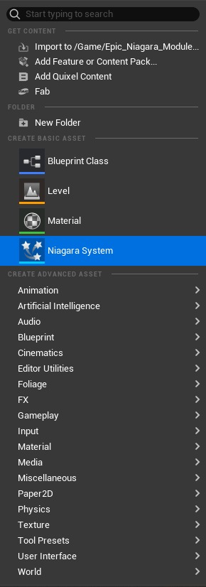

# 尼亚加拉模块：火灾爆炸

## 来源与状态

- 原始 URL：https://dev.epicgames.com/community/learning/tutorials/0zRx/unreal-engine-niagara-module-fire-explosion

## 运行时分类

- 类型：图文教程
- 判断：API 未识别到核心视频信号，可整理正文约 9626 字符。

## 摘要

在本模块中，您将学习如何使用 Niagara 制作火焰爆炸粒子效果。

## 中文整理

### 概览

- [编程一小时 - 构建您的第一个 3D 游戏：课程主页](https://dev.epicgames.com/community/learning/courses/kna/hour-of-code-unreal-engine-build-your-first-3d-game/0b8a/hour-of-code-unreal-engine-create-your-first-3d-game) - [学生指南：尼亚加拉系统火灾爆炸效果](https://cms-assets.unrealengine.com/AiKUh5PQCTaOFnmJDZJBfz/cmdov01bkfgtg07o26en6gbnh) 本教程的目的是指导您完成创建关卡的过程，其中玩家必须在布满爆炸性地雷的平台上进行操作。这些炸药首先会发出烟雾以表示即将发生爆炸，然后爆炸会在碰撞时消除玩家。本教程的范围包括学习如何创建烟雾效果以及火灾爆炸效果。消除玩家将需要使用蓝图，这将在以下模块中介绍。

### 先决条件

为了在虚幻引擎中使用 Niagara 粒子系统，需要启用 Niagara 插件。如果默认情况下未启用： 1. 转至编辑 > 插件，打开插件菜单。

2. 搜索 Niagara 并单击复选框以启用它。

3. You will get a prompt to restart the engine.继续这样做吧。当您重新登录时，该插件将已启用。该模块使用 [Hour of Code](https://www.fab.com/listings/1a2b1d97-bc88-4c3f-98b8-22369b5c3170) 项目的 **UE 5.4** 版本。

### 入门

1. 我们将从这个项目的空白关卡开始。这意味着将照明设置从 Level_HOC_world 关卡复制到您将要创建的新关卡，以保持新地图主题相似。 2. 当 **Level_HOC_world ** 关卡处于活动状态时，从大纲视图中选择并复制 (CTRL-C) 所需的五个主要照明元素，将光线带入关卡中。您可以在 Level_HOC_world > Env > RenderFX 下找到它们。当您将这些灯光角色粘贴到新关卡的大纲视图中时，文件夹层次结构将自动迁移。因此，无需手动创建新的子文件夹来将这些参与者粘贴到其中。

3. 在 Content 文件夹内的 Hour of Code 目录中，导航至 Content > Hour_of_Code > Maps 文件夹，您将在其中创建新地图。

4. 双击刚刚创建的关卡。在您刚刚创建的新关卡中，粘贴您在大纲视图中复制的文件。当您将灯光角色粘贴到大纲视图中时，引擎会自动创建 **Env > RenderFX** 文件夹。

现在，您的空关卡中应该有照明，完全准备好开始根据需要从 Hour of Code 资源目录中放置资源。请记住按照上一个模块中所示设置 Kill Z 值！探索项目文件并使用包含的资源，为您的关卡创建一个简单的场景！您将在“全部”>“内容”>“LearningKit_Game”>“资产”文件夹中找到许多资产。

### 尼亚加拉

Niagara 是虚幻引擎中使用的视觉特效系统，用于创建粒子效果和流体模拟，范围从烟雾和火焰到能量爆炸和魔法魅力。它提供了基于节点的工作流程，使用户能够灵活地控制粒子的行为。 Niagara 还允许游戏开发人员创建动态响应游戏玩法的实时效果。

### 基础知识：SubUV 动画

要完成本模块，您需要了解 Niagara 中使用的一种称为 SubUV 动画的技术。 SubUV 动画允许在 Niagara 中创建的单个粒子在不同纹理的精灵表中循环，假设随着时间的推移不同的纹理会产生动画效果的错觉。这对于**火焰、爆炸和能量脉冲**等效果特别有用，其中可以按顺序播放一系列 2D 图像来模拟动态运动。

### 视觉特效细分

我们将创建的粒子效果由两个连续的、独立的效果组成，它们将连续触发然后循环。在 Niagara 中，粒子效果是使用 **发射器** 构建的，发射器是负责生成和管理粒子的基本构建块。每个发射器都可以定义独特的行为，例如烟雾消散或火灾喷发。除其他属性外，这些粒子的可见性可以使用发射器节点进行控制。最终目标是切换烟雾效果的可见性，向玩家发出爆炸物存在的信号，然后将其关闭并立即打开火焰爆炸效果的可见性。这定义了将在此模块中实现的尼亚加拉效应的循环。

### 烟雾效果

### 火灾爆炸

### 火灾爆炸

### 步骤1

通过在内容浏览器中右键单击并选择 Niagara 系统来创建新的 Niagara 系统。您可以将此 Niagara 效果放置在名为 **Particles ** 或 **VFX** 的文件夹中，以保持项目整洁有序。

### 步骤2

在打开的弹出窗口中，搜索全向突发。该模板非常适合爆炸、冲击波等效果或任何需要粒子从中心点向各个方向发射的效果。

### 步骤3

点击右下角的“创建”，重命名 Niagara 资源后，双击打开文件。打开 Niagara 系统编辑器后，在左上角*的视口中，*您将看到全向突发模板在开始时的样子。它可能看起来不太像火灾爆炸，但这只是起点。您可以通过选择发射器节点并单击（一次）**全向突发**的位置来更改发射器的名称。给它一个适合您正在创建的发射器的名称，在本例中为“Fire”。

### 第四步：精灵渲染

Niagara 的默认粒子发射器使用基于精灵的粒子，这些粒子是始终面向相机的 2D 纹理。这样可以实现高效渲染，同时创建体积细节的错觉。现在，粒子的纹理是一个白色圆圈，但我们将对其进行自定义，使其呈现火的纹理。这就是 Sprite 渲染器的用武之地。Sprite 渲染器允许我们将材质驱动的 2D 纹理应用于这些粒子。为了能够使用此材料，您需要首先导入入门内容。您可以通过返回编辑器并单击 **添加** 按钮来完成此操作。在弹出菜单中，选择“**添加功能或内容包**”。在弹出菜单中的“内容”选项卡下，您可以选择“**入门内容**”图块，然后单击“**添加到项目**”按钮。现在，在内容浏览器的内容控制器下，您将看到 Starter Content 文件夹。导航至 StarterContent > 粒子 > 材质。在这里，您会发现一种名为 **M_explosion_subUV** 的材质。将此文件拖到您选择的文件夹中，您可以在其中组织其他此类资源。

### 第 5 步：编辑渲染器设置

1. 返回 Niagara 编辑器并选择名为 **Fire** 的发射器节点。选择底部的 **Sprite Renderer** 模块后，您可以指定 **M_explosion_subUV ** 材质来修改 Niagara 效果的外观。 2. 在 SubUV 下，将 Sub Image Size 更改为 6.0 x 6.0，然后选中显示 Sub UV Blending Enabled 的复选框。 2. 当您打开材质来检查其中使用的纹理时，您将看到精灵表（纹理）包含以 6x6 网格组织的 36 个图像。每个图像代表将在爆炸动画中播放的单个帧。 2. Sub UV Blending确保每帧之间的平滑插值。

### 第 6 步：发射器更新组设置

1. 选择 **Emitter State** 模块，然后在 **Details** 面板中找到 **Life Cycle** 部分。将 **循环行为** 设置为 **无限** 以无限循环火焰效果。 2. 单击 **Spawn Burst Instantaneous** 并将 Spawn Count 更改为 **25**。此设置控制生成的粒子数量。

### 第7步：粒子生成组设置

1. 单击“Initialize Particle”（初始化粒子）模块，将“Lifetime Min”（最小寿命）更改为 0.75，将“Lifetime Max”（最大寿命）更改为 1.0。这个范围决定了每个粒子在消失之前会存在多长时间。确保生命周期模式设置为 **随机**。 2. 在 Sprite Attributes 下，确保 **Sprite Size Mode** 设置为 **Random Uniform**。对于 **Uniform Sprite Size min**，将值设置为 **50.0* ***，并将 **Uniform Sprite Size Max** 设置为 **85.0**。您可能会猜到，范围决定了每个粒子大小的不同值。 ** ** 3. 在 **Shape Location** 模块中，在 **Shape ** 设置下，将 **Shape Primitive** 设置为 **Sphere **，半径为 **5.0**。 4. 在“添加速度”模块中，将速度模式设置为“锥内”。 4. 在 Velocity Speed 旁边，单击下拉箭头并查找 Random Range Float。将最小速度设置为 500.0，将最大速度设置为 800.0。 5. 对于 **Cone ** 设置，将 X 和 Y 设置为 **0.0**，将 Z 值设置为 **1.0**。将 Cone Angle 更改为 45.0。

### 步骤8：粒子更新组设置

1. 单击 **+ ** 图标并搜索 Sub UVAnimation。 2. 返回详细信息面板，您将在 Sprite Renderer 设置下看到一条警告。要解决此问题，请在“精灵渲染器”选项旁边的下拉列表中选择“精灵渲染器”。 3. 在“设置”设置下，选中 **开始帧范围** 和 **结束帧范围** 旁边的框。将值分别设置为 0 和 35。

### 结果

### 下一步 -> 烟雾效果

干得好！现在，您可以继续学习下一课程，了解如何使用 Niagara 创建烟雾效果。请点击下面的链接。 - [如何在虚幻引擎中创建烟雾效果](https://dev.epicgames.com/community/learning/courses/kna/hour-of-code-unreal-engine-build-your-first-3d-game/Zmdv/unreal-engine-niagara-module-smoke-effect)

## 相关链接

- [Hour of Code - Build Your First 3D Game: Course Home Page](https://dev.epicgames.com/community/learning/courses/kna/hour-of-code-unreal-engine-build-your-first-3d-game/0b8a/hour-of-code-unreal-engine-create-your-first-3d-game)
- [Student Guide: Niagara System Fire Explosion Effect](https://cms-assets.unrealengine.com/AiKUh5PQCTaOFnmJDZJBfz/cmdov01bkfgtg07o26en6gbnh)
- [How to Create a Smoke Effect in Unreal Engine](https://dev.epicgames.com/community/learning/courses/kna/hour-of-code-unreal-engine-build-your-first-3d-game/Zmdv/unreal-engine-niagara-module-smoke-effect)
