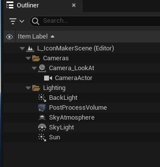
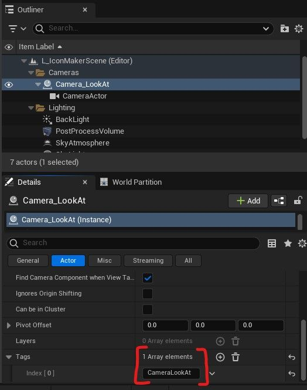
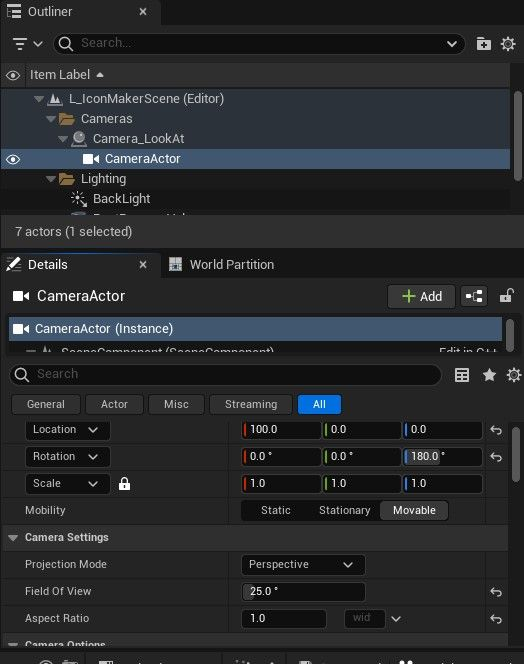
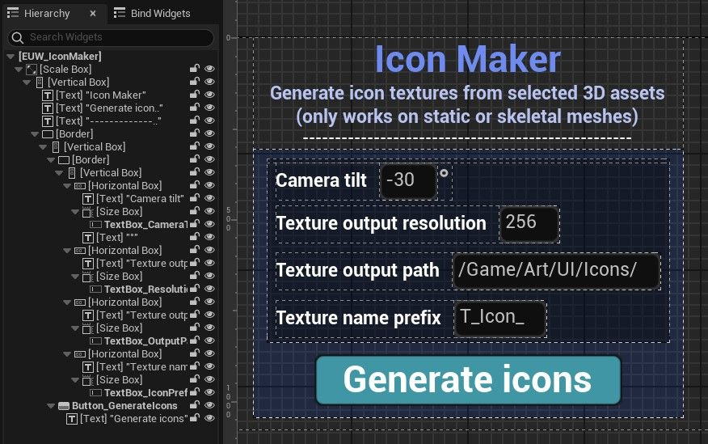
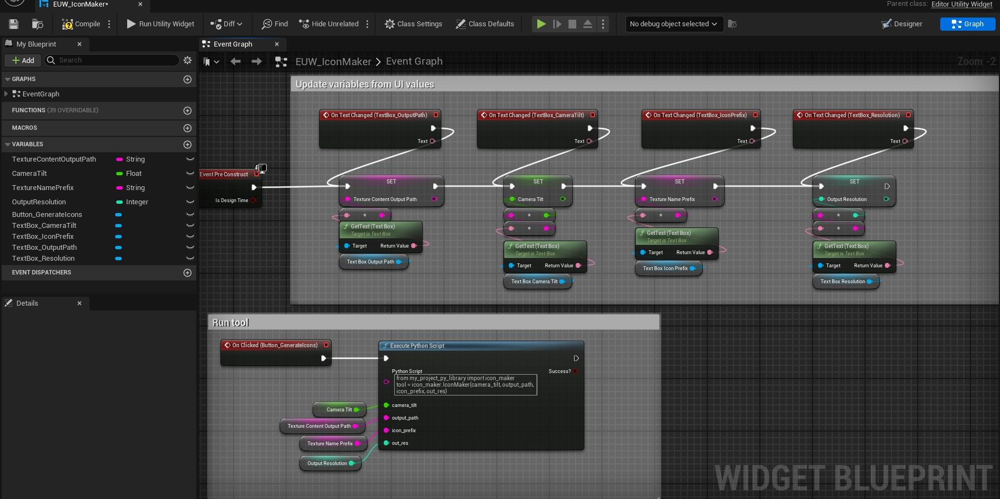
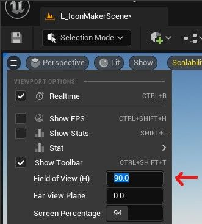

# 批量编辑器屏幕截图 - 图标生成工具

## 来源与状态

- 原始 URL：https://dev.epicgames.com/community/learning/tutorials/7yWD/unreal-engine-taking-batch-editor-screenshots-icon-generator-tool

## 运行时分类

- 类型：图文教程
- 判断：API 未识别到核心视频信号，可整理正文约 3996 字符。

## 摘要

该工具通过截取所选 3D 资源的屏幕截图来生成纹理。它分为 3 个部分，一个是简单的关卡设置，一个是编辑器实用程序小部件，它有一些选项和一个运行该工具的按钮，另一个是 python 模块，用于处理处理资源、调整相机和从屏幕截图创建纹理的所有逻辑。

## 中文整理

### ____________________________________

### 创建关卡

只需创建一个具有以下要求的新空关卡： - 一些**照明**。这可以是您想让资产看起来不错的任何内容。 - 分配有“**CameraLookAt**”标签的空 Actor。我将此 actor 称为“Camera_LookAt” - 附加到 Camera_LookAt actor 的 **Camera Actor**，具有以下属性： - Location = [any, 0, 0] - X 值并不重要，因为它是由代码控制的。 - Rotation = [0, 0, 180] - 180 Z 值使得设置其相对位置偏移变得更容易，并且不必在代码中处理负值。 - 视野 = [25.0] - 如果您希望相机镜头有不同的感觉，可以更改此值。 - 长宽比 = [1.0] - 这是为了使输出纹理成为正方形。您可以手动执行此操作，或将下面的代码复制粘贴到新的空关卡中以进行此设置。

**级别演员**

```
Begin Map
   Begin Level
      Begin Actor Class=/Script/Engine.Actor Name=Camera_LookAt Archetype=/Script/Engine.Actor'/Script/Engine.Default__Actor'
         Begin Object Class=/Script/Engine.SceneComponent Name="DefaultSceneRoot" ExportPath=/Script/Engine.SceneComponent'"/Game/EditorTools/IconMakerTool/L_IconMakerScene.L_IconMakerScene:PersistentLevel.Camera_LookAt.DefaultSceneRoot"'
         End Object
         Begin Object Name="DefaultSceneRoot" ExportPath=/Script/Engine.SceneComponent'"/Game/EditorTools/IconMakerTool/L_IconMakerScene.L_IconMakerScene:PersistentLevel.Camera_LookAt.DefaultSceneRoot"'
            RelativeRotation=(Pitch=10.000000,Yaw=90.000000,Roll=-30.000000)
            bVisualizeComponent=True
            CreationMethod=Instance
         End Object
```







### ____________________________________

### 创建编辑器小部件



- 创建一个新的编辑器实用程序小部件（添加 > 编辑器实用程序 > 编辑器实用程序小部件） - 从上面的屏幕截图手动重新创建小部件布局，或者 - 将下面的代码复制粘贴到新的空小部件中以复制我的布局

**编辑器实用程序小部件 - 布局**

```
Begin Object Class=/Script/UMG.ScaleBox Name="ScaleBox_175" ExportPath=/Script/UMG.ScaleBox'"/Game/EditorTools/IconMakerTool/EUW_IconMaker.EUW_IconMaker:WidgetTree.ScaleBox_175"'
   Begin Object Class=/Script/UMG.ScaleBoxSlot Name="ScaleBoxSlot_0" ExportPath=/Script/UMG.ScaleBoxSlot'"/Game/EditorTools/IconMakerTool/EUW_IconMaker.EUW_IconMaker:WidgetTree.ScaleBox_175.ScaleBoxSlot_0"'
   End Object
   Begin Object Name="ScaleBoxSlot_0" ExportPath=/Script/UMG.ScaleBoxSlot'"/Game/EditorTools/IconMakerTool/EUW_IconMaker.EUW_IconMaker:WidgetTree.ScaleBox_175.ScaleBoxSlot_0"'
      VerticalAlignment=VAlign_Top
      Parent=/Script/UMG.ScaleBox'"ScaleBox_175"'
      Content=/Script/UMG.VerticalBox'"VerticalBox_54"'
   End Object
   Slots(0)=/Script/UMG.ScaleBoxSlot'"ScaleBoxSlot_0"'
   bExpandedInDesigner=True
```

- 转到小部件事件图表 - 将下面的代码复制粘贴到事件图表中

**编辑器实用程序小部件 - 事件图代码**

```
Begin Object Class=/Script/BlueprintGraph.K2Node_VariableGet Name="K2Node_VariableGet_7" ExportPath=/Script/BlueprintGraph.K2Node_VariableGet'"/Game/EditorTools/IconMakerTool/EUW_IconMaker.EUW_IconMaker:EventGraph.K2Node_VariableGet_7"'
   VariableReference=(MemberName="TextBox_CameraTilt",bSelfContext=True)
   NodePosX=960
   NodePosY=-3840
   NodeGuid=B31DE03D451EF06001B5C6AEBB756406
   CustomProperties Pin (PinId=83DFA9AB4332DD050D163596027473D9,PinName="TextBox_CameraTilt",Direction="EGPD_Output",PinType.PinCategory="object",PinType.PinSubCategory="",PinType.PinSubCategoryObject=/Script/CoreUObject.Class'"/Script/UMG.EditableTextBox"',PinType.PinSubCategoryMemberReference=(),PinType.PinValueType=(),PinType.ContainerType=None,PinType.bIsReference=False,PinType.bIsConst=False,PinType.bIsWeakPointer=False,PinType.bIsUObjectWrapper=False,PinType.bSerializeAsSinglePrecisionFloat=False,LinkedTo=(K2Node_CallFunction_1 60B83DB041328E99C98085BB4E2CA4BD,),PersistentGuid=00000000000000000000000000000000,bHidden=False,bNotConnectable=False,bDefaultValueIsReadOnly=False,bDefaultValueIsIgnored=False,bAdvancedView=False,bOrphanedPin=False,)
   CustomProperties Pin (PinId=2E17DA774707A0A65AD6829275A44063,PinName="self",PinFriendlyName=NSLOCTEXT("K2Node", "Target", "Target"),PinType.PinCategory="object",PinType.PinSubCategory="",PinType.PinSubCategoryObject=/Script/UMG.WidgetBlueprintGeneratedClass'"/Game/EditorTools/IconMakerTool/EUW_IconMaker.EUW_IconMaker_C"',PinType.PinSubCategoryMemberReference=(),PinType.PinValueType=(),PinType.ContainerType=None,PinType.bIsReference=False,PinType.bIsConst=False,PinType.bIsWeakPointer=False,PinType.bIsUObjectWrapper=False,PinType.bSerializeAsSinglePrecisionFloat=False,PersistentGuid=00000000000000000000000000000000,bHidden=True,bNotConnectable=False,bDefaultValueIsReadOnly=False,bDefaultValueIsIgnored=False,bAdvancedView=False,bOrphanedPin=False,)
End Object
Begin Object Class=/Script/BlueprintGraph.K2Node_VariableGet Name="K2Node_VariableGet_8" ExportPath=/Script/BlueprintGraph.K2Node_VariableGet'"/Game/EditorTools/IconMakerTool/EUW_IconMaker.EUW_IconMaker:EventGraph.K2Node_VariableGet_8"'
   VariableReference=(MemberName="TextBox_OutputPath",bSelfContext=True)
```

- 手动重新创建图表 不要忘记使用您在 UI 中看到的默认值创建变量。然后... - 在“执行 python 脚本”节点中，将字符串“my_project_py_library”替换为您自己的字符串（您可以从项目设置中配置自定义 python 路径）或 - 替换为 python 代码以按照您想要的方式运行 icon_maker.py 脚本



### ____________________________________

### 创建 python 脚本

- 创建一个新文件“icon_maker.py”，并在保存项目 python 脚本时放置它（这将影响您需要在小部件中的“执行 python 脚本”节点中运行的代码） - 复制粘贴下面的代码 代码应该有很好的注释，因此请通读它并根据您的需要进行调整。 ⚠⚠⚠您会注意到代码：

```
from ueGear import textures
[....]
[....]textures.import_texture_asset()
```

这是取自 mgear 团队开发的 [ueGear 插件](https://github.com/mgear-dev/ueGear)。它包含执行许多不同操作的各种 python 模块。其中之一是导入资产的简单方法。您可以决定： - 下载这些模块并使用它们：[https://github.com/mgear-dev/ueGear/tree/main/Plugins/ueGear/Content/Python/ueGear](https://github.com/mgear-dev/ueGear/tree/main/Plugins/ueGear/Content/Python/ueGear) 问题是您将有一大堆 python 文件来完成这一件简单的事情，或者 - 重新实现您自己的纹理导入功能。

**icon_maker.py**

```
import os, stat
import math
import unreal
from ueGear import textures 


TEXTURES_TO_IMPORT = []
LEVEL_NAME = "L_IconMaker"  # The name of the IconMaker level which the tool needs to use to work correctly
SCREENSHOTS_PATH = unreal.Paths.convert_relative_path_to_full(
    f"{unreal.Paths.project_saved_dir()}Screenshots/WindowsEditor/"
```

### ----------------------------

### 已知问题

该工具的当前版本存在以下问题： - 运行该工具将更改您的编辑器相机视场角。您可以从此菜单将其更改回默认值 90：



❌ 有时运行该工具会触发Shader Compiling。这可能会导致该工具失败或截取空屏幕截图。如果发生这种情况，只需在相同的资产上重试即可，它应该可以工作。将来，我希望通过了解如何告诉工具等待着色器编译器完成后再进行屏幕截图来解决此问题。 ❌ 有时，在该工具失败并且您关闭编辑器后，UnrealEditor.exe 仍会在后台运行。在这种情况下，打开任务管理器，转到“详细信息”，找到 UnrealEditor.exe 并将其终止。我不知道是什么导致了这个问题，但我怀疑与注册/取消注册 slate_post_tick 回调有关
