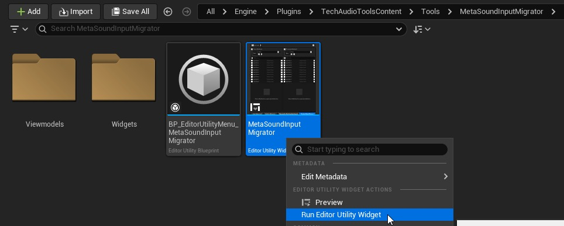
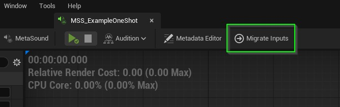
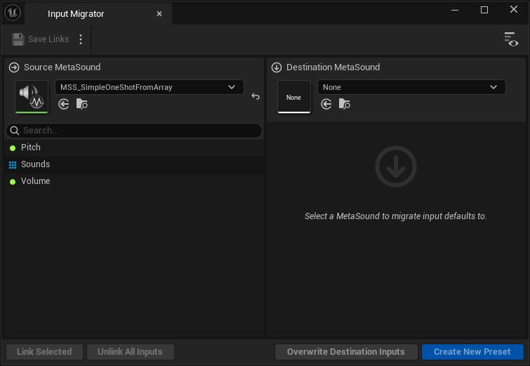
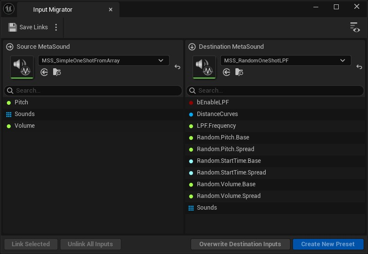
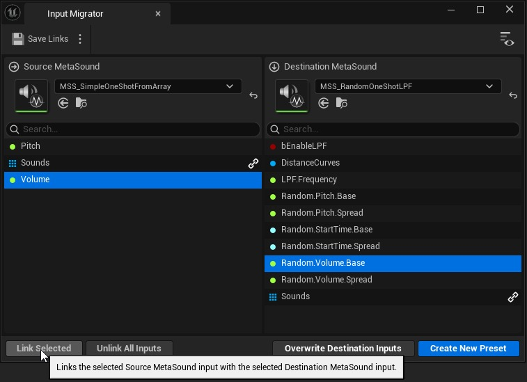
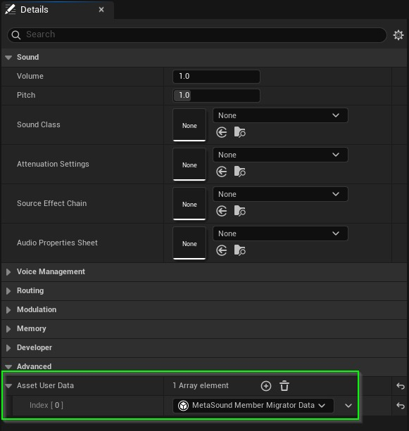

# [TechAudioTools 内容 5.7] 使用 MetaSound 输入迁移器

## 来源与状态

- 原始 URL：https://dev.epicgames.com/community/learning/tutorials/98Vn/unreal-engine-techaudiotools-content-5-7-using-the-metasound-input-migrator

## 运行时分类

- 类型：图文教程
- 判断：API 未识别到核心视频信号，可整理正文约 3915 字符。

## 摘要

在大规模使用 MetaSounds 时，有时您可能希望将输入默认值从一项资产迁移到另一项资产，无论是通过覆盖现有值还是创建新预设来完成。 MetaSound 输入迁移器促进了这两种操作，并允许用户存储两个资产之间的链接输入集，以后在迁移原始资产的预设时可以调用这些输入集。这意味着用户只需为每对资产设置一次链接输入。

## 中文整理

### 概览

[TechAudioTools 内容 5.7 文档](https://dev.epicgames.com/community/learning/tutorials/DE7d/unreal-engine-techaudiotools-content-5-7-documentation)

### 安装

**MetaSound 输入迁移器** 是一个编辑器实用程序小部件，包含在 **TechAudioTools Content** 插件中。 [该插件可在 Fab for Unreal Engine 5.7 上免费使用](https://www.fab.com/listings/d44cbd49-7691-4f82-abdb-6428c78508f6)。

### 用法

### 打开 MetaSound 输入迁移器

有多种方法可以打开 MetaSound 输入迁移器： - 从内容浏览器运行 MetaSoundInputMigrator 编辑器实用程序小部件。

- 或者，单击 MetaSound 编辑器工具栏上的“迁移输入”按钮。

### 选择源 MetaSound 资产

选择您想要从中迁移输入默认值的资产。这将被称为 Source MetaSound。从 MetaSound 编辑器内部打开时，源 MetaSound 资源将自动设置为在最近使用的内容浏览器中选择的 MetaSound。通常，这将是您刚刚打开的资产，但如果您在打开工具之前切换到不同的资产，则可能会有所不同。

切换工具右上角带有眼睛图标的按钮将显示所有输入的当前值。

### 选择目标 MetaSound 资产

选择您希望将输入默认值迁移到的资源，无论是通过覆盖默认值还是创建新预设。这将被称为目标 MetaSound。

### 在源输入和目标输入之间创建链接

首先将输入链接在一起，将值从源 MetaSound 传输到目标 MetaSound。要链接输入，请通过单击任一列表中的输入来选择输入，然后单击底部工具栏上的链接所选按钮。

链接后，输入将具有链接图标，指示它们已链接在一起。将鼠标悬停在链接图标上将显示链接输入的名称。可以通过选择链接的输入并单击底部工具栏上的取消链接所选按钮来取消链接。或者，您可以单击“取消链接所有输入”以完全删除所有当前链接。

### 迁移值

正确链接所有输入后，您可以选择覆盖目标输入或创建新预设。只需单击底部工具栏上的按钮即可执行您想要执行的操作。新创建的预设将添加到当前活动（或最近活动）的内容浏览器目录中。

### 保存数据

### 保存输入链接

为了避免需要重新链接类似资源的输入，您可以选择保存所做的链接，以便在源和目标 MetaSound 资源选择器中选择类似资源时可以自动调用它们。

保存的数据以仅限编辑器的资产用户数据的形式存储在目标 MetaSound 资产上，并且可以通过从目标 MetaSound 资产中清除资产用户数据属性来删除。对 MetaSound 输入进行更改（例如更改输入名称或数据类型）时，保存数据不会更新。可以通过重新链接修改的输入并单击“保存链接”按钮来覆盖保存的数据。

### 载入保存数据

当在目标 MetaSound 资产的资产用户数据中找到源 MetaSound 资产的链接时，会自动调用已保存的链接。还可以为源 MetaSound 资源的任何预设调用已保存的链接。

### 我们希望这个工具可以帮助您更有效地管理您的预设库！
