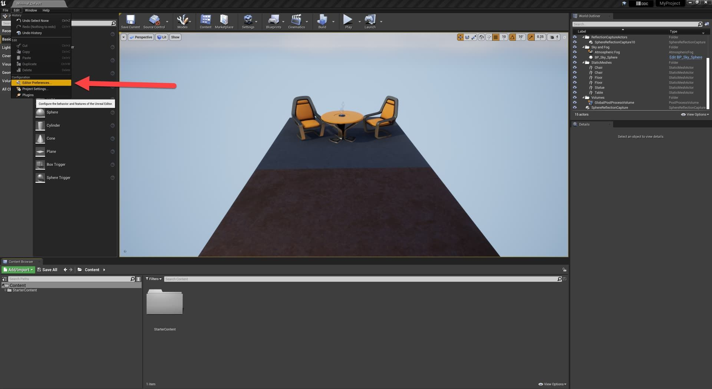
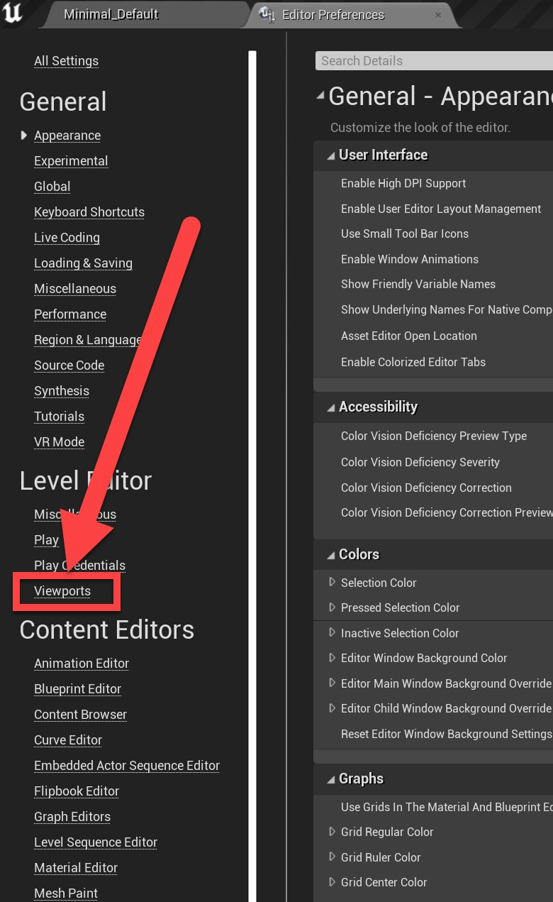
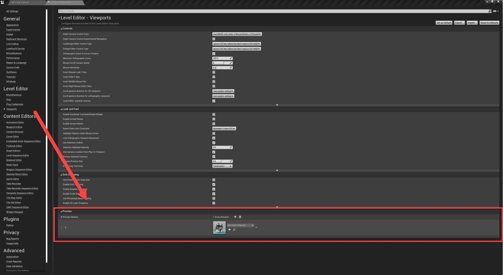
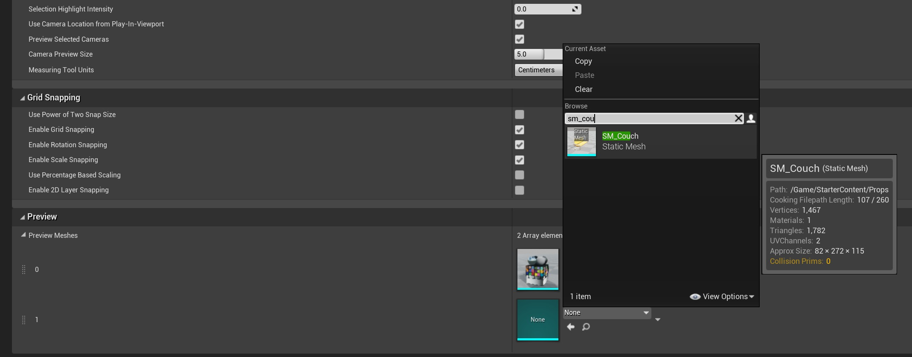

# 在视口中使用网格作为预览参考

## 来源与状态

- 原始 URL：https://dev.epicgames.com/community/learning/knowledge-base/q5Ol/unreal-engine-using-a-mesh-as-a-preview-reference-in-the-viewports

## 运行时分类

- 类型：图文教程
- 判断：API 未识别到核心视频信号，可整理正文约 1192 字符。

## 摘要

在 Epic Games 工作人员撰写的视口文章中使用网格作为预览参考 在开发关卡或布景时，您可能需要使用预览网格来判断您的创作规模。虚幻引擎有一个...

## 中文整理

### 在视口中使用网格作为预览参考

*由 Epic Games 工作人员撰写的文章* 在开发关卡或场景时，您可能需要使用预览网格来判断您的创作规模。虚幻引擎有一个内置工具和热键，可以在视口或任何网格中执行此操作。

### 设置预览网格

预览网格在编辑器首选项 - 编辑器首选项 > 关卡编辑器/视口 > 预览网格中设置

### 添加新的网格

默认情况下，您应该看到 SM_ColorCalibrator 作为预览网格。您可以使用下拉菜单更改此网格，或按其上方的 + 图标。这将添加一个额外的网格，您可以将其用作预览网格。

### 在视口中使用网格

在视口中，您可以点击 \（对于 QWERTY、EN 键盘）来显示预览网格。它将出现在您的光标悬停在其上的任何网格的表面上，并将在视口中跟随您的光标。通过按 Shift + \，您可以更改为阵列中的下一个预览网格。
