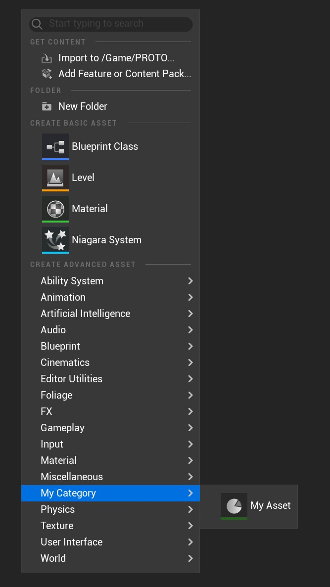

# 使用自定义资产：创建资产

## 来源与状态

- 原始 URL：https://dev.epicgames.com/community/learning/tutorials/m3Wq/unreal-engine-working-with-custom-assets-creating-the-asset

## 运行时分类

- 类型：图文教程
- 判断：API 未识别到核心视频信号，可整理正文约 4027 字符。

## 摘要

了解如何创建具有自定义类别、资产颜色、缩略图等的全新资产。

## 中文整理

### 介绍

在这个简短的教程中，我将向您展示如何从头开始创建具有以下功能的完全自定义资产。 1. 用于创建新资产的资产工厂（包括自定义类选择器） 2. 内容浏览器中资产颜色和类别的资产定义。 3. 创建自定义资产。

### 创建新资产

您要做的第一件事是用 C++ 创建实际的自定义资源。为此，从技术上讲，您可以从不同的类继承，但我建议选择默认的 UObject 或 UDataAsset/UPrimaryDataAsset。就我而言，我选择从 UPrimaryDataAsset 继承，但您可以使用您喜欢的任何内容。其代码可能如下所示：

**我的资产.h**

```cpp
// Copyright © 2024 MajorT. All rights reserved.

#pragma once

#include "CoreMinimal.h"
#include "Engine/DataAsset.h"
#include "MyAsset.generated.h"

/** My Custom Asset */
UPROPERTY(BlueprintType)
```

### 创建资产操作

以下类应该放入您的编辑器模块（如果有的话），因为它们仅适用于编辑器，不应该被烘焙。如果您没有编辑器模块，您应该创建一个编辑器模块，或者确保在类周围放置WITH_EDITOR宏，以使其仅用作编辑器。

### 资产定义

接下来要做的是资产定义。基本上，通过此类，您可以修改资产向编辑器已知/公开的方式。首先创建一个派生自 UAssetDefinitionDefault 的新类

**UAssetDefinition_MyAsset.h**

```cpp
// Copyright © 2024 MajorT. All rights reserved.

#pragma once

#include "CoreMinimal.h"
#include "AssetDefinitionDefault.h"
#include "AssetDefinition_MyAsset.generated.h"

UCLASS()
class UAssetDefinition_MyAsset: public UAssetDefinitionDefault
```

确保将“AssetDefinition”、“UnrealEd”依赖项添加到 Build.cs 文件中的 Private/PublicDependencyModuleNames 列表中。

**MyAssetEditorModule.Build.cs**

```cpp
[...]
PublicDependencyModuleNames.AddRange(new[]
{
    "AssetDefinition",
    "UnrealEd",
});
```

现在逐步介绍每个功能。 - 功能|实现 - **GetAssetDisplayName()** / 修改此资源的显示名称。 |就我而言，我将其称为“我的资产”/UAssetDefinition_MyAsset.cpp - **GetAssetDescription()** / 这是非常可选的，大多数本机引擎资产甚至不会为此烦恼。 |我不喜欢在这里对资产的描述进行硬编码，而是通常将资产中的字符串/文本变量链接到描述。 / UAssetDefinition_MyAsset.cpp - **GetAssetColor()** / 此函数需要一个 FLinearColor，这意味着您可以自由选择自己的颜色。 |在这个例子中，我选择了绿色色调。 / UAssetDefinition_MyAsset.cpp - **GetAssetClass()** / 在这里您可以指定您希望此资产定义使用哪个类。此步骤非常重要，因为如果没有指定资产，资产定义将无法正常工作。 |在我们的例子中，这将是 UMyAsset。 / UAssetDefinition_MyAsset.cpp - **GetAssetCategories()** / 这可以让您指定要在内容浏览器弹出窗口中显示的资产的（高级）类别 |创建一个名为“我的类别”的高级类别，您将执行类似的操作。 / 但当然这可以是你想要的任何东西。 /UAssetDefinition_MyAsset.cpp/ 您可能已经注意到“类别”是一个数组，这意味着您可以从技术上将您的资产公开到多个类别。 UAssetDefinitionDefault 取代了旧的 FAssetTypeActions，现在不再需要手动注册。意味着您不必费心注册和注销您的资产定义。

### 资产工厂

资产工厂负责创建我们的自定义资产。稍后我们可以在这里创建我们自己的类选择器和其他奇特的东西。但现在我们应该保持简单。首先创建一个派生自 theUFactory 的新类

**MyAssetFactory.h**

```cpp
// Copyright © 2024 MajorT. All rights reserved.

#pragma once

#include "CoreMinimal.h"
#include "Factories/Factory.h"
#include "MyAssetFactory.generated.h"

UCLASS(HideCategories = Object)
class UMyAssetFactory : public UFactory
```

并像这样实现构造函数。

**我的AssetFactory.cpp**

```cpp
UMyAssetFactory::UMyAssetFactory()
{
      // Specify the asset class this factory is supposed to create
      SupportedClass = UMyAsset::StaticClass();

      // Make sure to set this to true, otherwise it wont create the asset
      bCreateNew = true; 

      // Set this to true, if you want to immediately start editing the asset after creation
      bEditAfterNew = true;
```

如前所述，现在我们不会做任何花哨的事情，只是创建我们的新资产。我们通过实现 FactoryCreateNew() 函数来做到这一点。

**我的AssetFactory.cpp**

```cpp
UObject* UMyAssetFactory::FactoryCreateNew(
	UClass* InClass, UObject* InParent, FName InName, EObjectFlags Flags, UObject* Context, FFeedbackContext* Warn, FName CallingContext)
{
	check(InClass->IsChildOf(UMyAsset::StaticClass()));
	return NewObject<UMyAsset>(InParent, InClass, InName, Flags);
}
```

### 首先看看虚幻编辑器

现在，在编译并启动编辑器后，我们应该能够在我们指定的类别中看到我们的自定义资源。



### 创建缩略图渲染器

在下一个讲座中，我们将学习如何创建自己的缩略图渲染器以及如何渲染我们想要作为资源缩略图的任何纹理。
