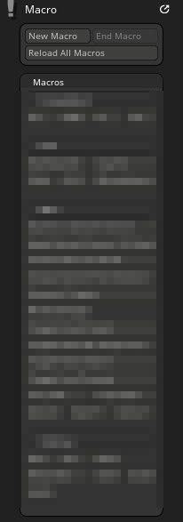
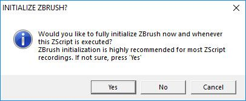
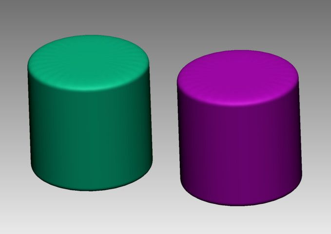
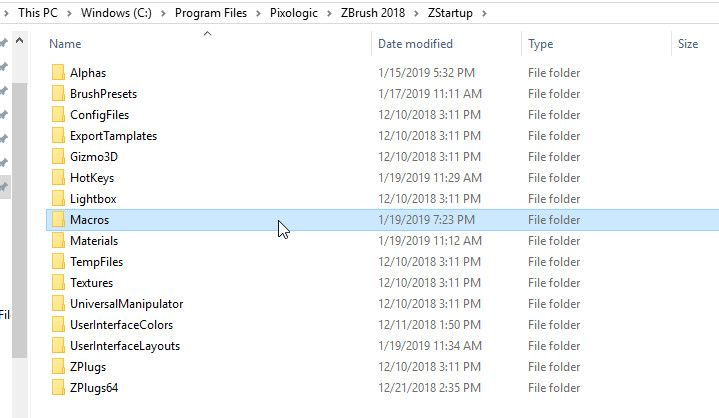
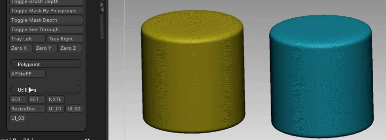
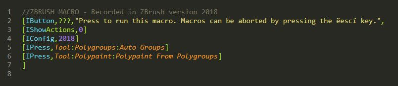
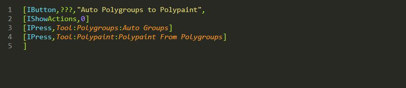
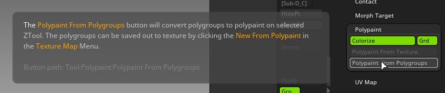
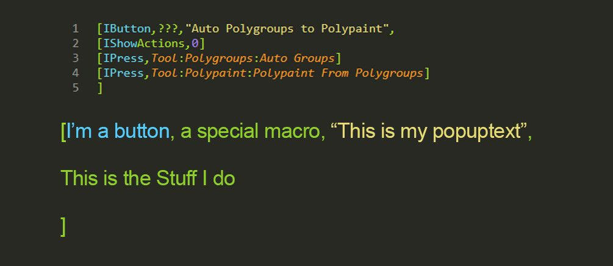

# Zbrush Zscript 02 - 宏

## 来源与状态

- 原始 URL：https://dev.epicgames.com/community/learning/tutorials/MZpe/unreal-engine-zbrush-zscript-02-macros

## 运行时分类

- 类型：图文教程
- 判断：API 未识别到核心视频信号，可整理正文约 2710 字符。

## 摘要

Zbrush Zscripting 02 - 如何使用 sublime text 在 zbrush 中记录和编辑简单的宏.

## 中文整理

### 概览

大多数人开始制作宏时都会在 Zbrush (ZB) 中记录操作，然后将宏吐出到startup/macros 文件夹中。让我们试试这个： 1. 将宏菜单停靠到侧面选项卡之一，然后按“新建宏”

将出现此选项 - 对于我不需要初始化的宏。我总是在开始录制之前单击“否”。您可能想要初始化的原因我稍后会介绍，但对于简单的宏，选择“否”就可以了。

之后会出现这个小状态文本 - 你需要小心，因为你在 zbrush 中所做的几乎所有事情现在都被记录下来： 2. 现在你准备好做一些你想要自动化的事情了：

非常简单，我有 2 个圆柱体，然后在 Zbrush 中执行以下序列： 序列 1：我按下 - Tools:Polygroups:Autogroups 序列 2：然后我按下 - Tools:Polypaint:Polypaint From Polygroups 序列最后：然后我按下 Macro:End Macro，然后出现一个保存对话框。我将宏保存在一个新的子文件夹中，并将其命名为“AGPtoPP.txt”。该文件夹和文件与所有其他宏一起保存在 ZB 安装中。示例： **“C:\Program Files\Maxon ZBrush 2025\ZStartup\Macros”**

3. 现在，您应该在宏菜单中看到一个可以正常工作的宏按钮：

是的，它一遍又一遍地执行这个确切的序列。您现在可以将此按钮复制到自定义 UI 或热键它。我们来看看制作的脚本：

以下是我通常立即修剪它的方法：

脚本主体解释如下： 第 1 行：IButton 是 ZB 将脚本识别为 UI 元素的方式，即“???”是一个特殊标签，告诉 ZB 脚本是一个宏，“文本”是当您将鼠标悬停在按钮上方时 ZB 中出现的内容。包含此行的宏保存在宏文件夹中，在宏菜单下显示为带有文件名的按钮。注意 - 通常在编写宏时您会破坏它们。它们将从宏菜单中消失，因为 Zbrush 无法将它们从 TXT 文件编译为 .zsc 的 ZB 格式。 第 2 行：IShowActions,0 “0”是“否”的代码，因此这一行告诉 zbrush 在宏执行其功能时隐藏操作。第 3 行和第 4 行：IPress，然后是要按下的 UI 项目的路径。在本例中，它是我之前录制的两个按下的按钮。注意 - zbrush 中的每个 ui 都有一个路径。如果按住 Control 并将鼠标悬停在按钮上，路径将显示在工具提示的底部。将此路径与上面第 4 行的路径相匹配，看看它是如何工作的。

用人类语言进行更多解释：

所以你现在应该知道如何记录、保存和编辑简单的宏，并更多地了解它们如何与 ZB 对话。如果您录制了任何很酷的歌曲，或者有一个您想要制作的想法，请告诉我。
