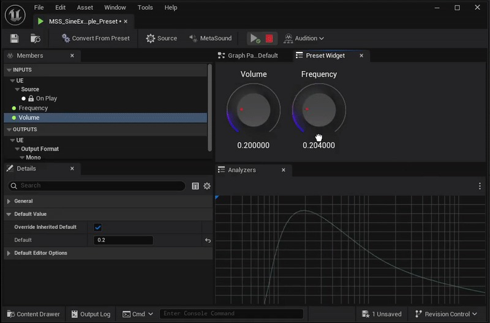
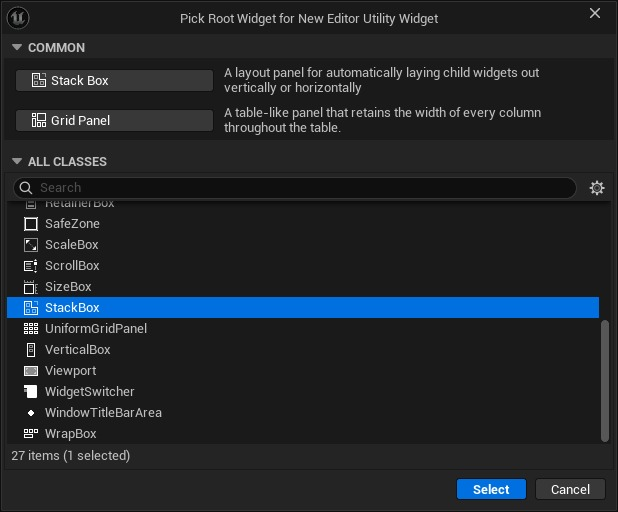
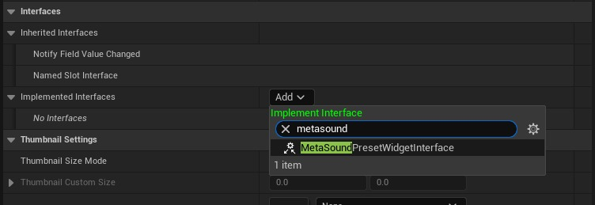
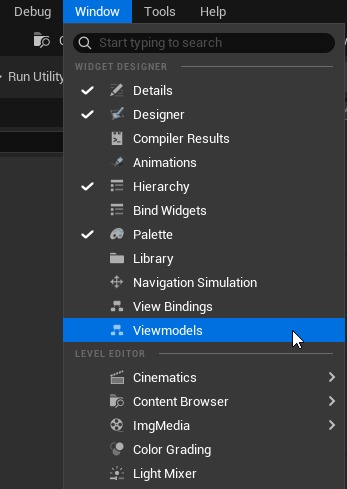
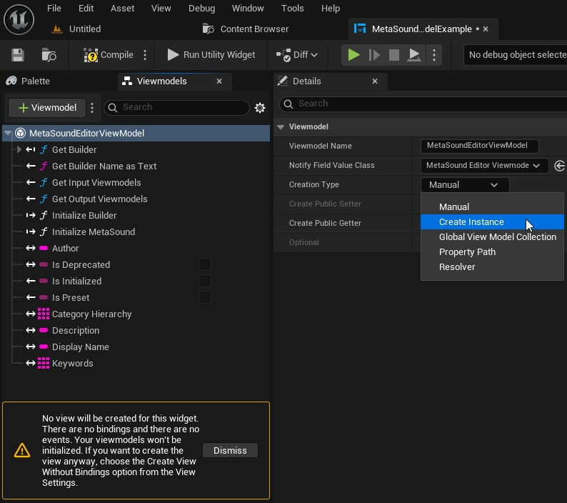
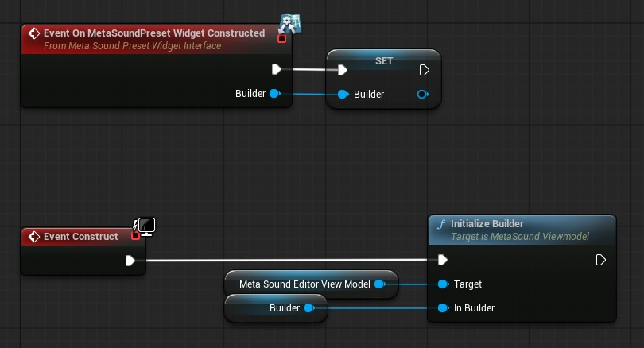
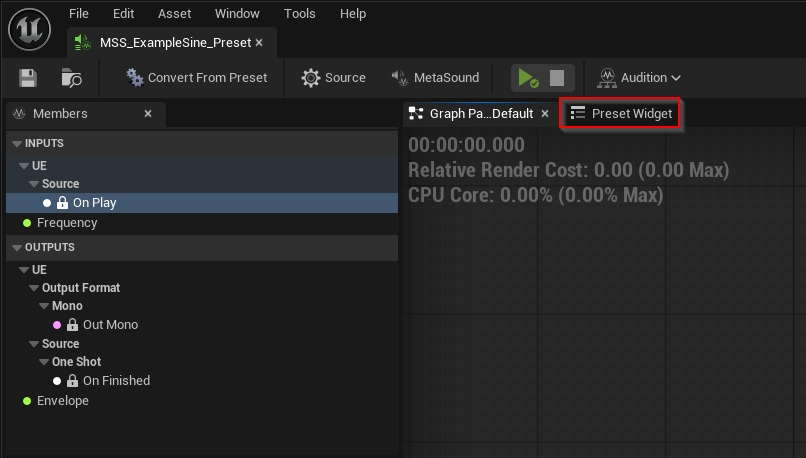
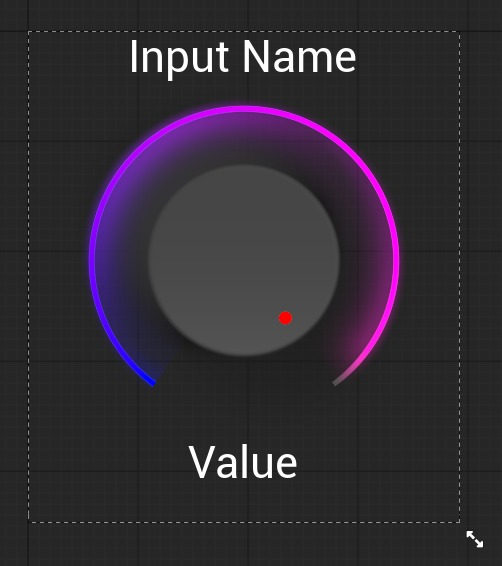

# 使用 MetaSound 视图模型创建 MetaSound 预设小部件 (UE 5.6) (Part 1/2)

Source file: `unreal-engine-creating-a-metasound-preset-widget-using-metasound-viewmodels-ue-5-6.origin.md`.

This document was split during ue-kb import to keep source chunks buildable.

## 来源与状态

- 原始 URL：https://dev.epicgames.com/community/learning/tutorials/d664/unreal-engine-creating-a-metasound-preset-widget-using-metasound-viewmodels-ue-5-6
## 运行时分类

- 类型：图文教程
- 判断：API 未识别到核心视频信号，可整理正文约 13514 字符。
## 摘要

了解如何创建用于编辑 MetaSound 预设的自定义用户界面。
## 中文整理
### 概览

如果您使用的是 UE 5.7，请查看 [TechAudioTools 内容插件](https://www.fab.com/listings/d44cbd49-7691-4f82-abdb-6428c78508f6)，该插件在 Fab 上免费提供！然后您可以按照本教程的更新版本[此处](https://dev.epicgames.com/community/learning/tutorials/qEjr/unreal-engine-techaudiotools-content-5-7-creating-a-metasound-preset-widget-using-metasound-viewmodels)。虚幻引擎 5.6 添加了新功能，允许自定义编辑器实用工具小部件显示在 MetaSound 预设编辑器窗口内。除了编辑预设输入值的传统方法之外，这还允许使用旋钮、滑块和其他 UI 元素修改预设输入。在本演练中，我将向您展示如何使用 **MetaSound Viewmodels** 创建 MetaSound 预设小部件。

### 所需插件

确保您的项目中启用了以下插件： 1. TechAudioTools 2. [UMG Viewmodel](https://dev.epicgames.com/documentation/en-us/unreal-engine/umg-viewmodel-for-unreal-engine)
### 创建一个新的编辑器实用程序小部件

右键单击内容浏览器并创建一个新的编辑器实用程序小部件资源。为了简单起见，我建议选择 StackBox 作为根小部件。

### 配置小部件的类设置

通过单击窗口右上角的“图形”按钮将编辑器窗口切换到图形编辑模式，然后单击“类设置”以在“详细信息”面板中查看它们。进行以下更改： - 首先，启用“可以在没有玩家上下文的情况下调用初始化”布尔值。 *必须*启用此设置，以便为编辑器实用程序小部件初始化视图模型。在解决问题时仔细检查此设置总是好的！ - 然后，将 MetaSound 预设小部件接口添加到已实现的接口中

- 此界面将为我们的编辑器实用程序小部件提供预设使用的 MetaSound Builder。我们将向 MetaSound Viewmodel 提供此构建器，以将我们的小部件双向绑定到输入值。
### 打开 Viewmodels 和 View Bindings 面板

单击窗口右上角的“设计器”按钮切换回小部件编辑模式。如果您的编辑器布局尚未显示 Viewmodels 和 View Bindings 面板，您可以从编辑器的 Window 菜单启用它们。

### 添加 MetaSound 编辑器视图模型

单击“视图模型”面板中的“添加视图模型”按钮。在这里您将看到项目中所有视图模型的列表。找到 MetaSound Editor Viewmodel 并单击 Select 按钮将视图模型添加到小部件。

### 将创建类型更改为创建实例

在“视图模型”面板中选择新添加的视图模型后，将“创建类型”更改为“创建实例”。有关这些选项的信息，请查看 [UMG Viewmodel 文档](https://dev.epicgames.com/documentation/en-us/unreal-engine/umg-viewmodel-for-unreal-engine#initialize-your-viewmodel)。

### 实现 MetaSound 预设小部件接口功能

**初始化 MetaSound Viewmodel** - 切换到 Graph 视图，双击 On MetaSoundPreset Widget Constructed 界面函数，将事件添加到事件图中。缓存此事件中的 Builder 引用。 - 然后，在构建时，我们可以使用缓存的构建器通过 Initialize Builder 函数来初始化我们的 MetaSound Editor Viewmodel。系统会自动为您创建 MetaSoundEditorViewModel 参考变量。

- 当调用 Initialize Builder 时，视图模型从提供的 MetaSound Builder 检索数据并绑定到各种委托，从而允许小部件立即反映 MetaSound 编辑器中所做的更改。 ** 指定 **** 小部件应与其一起使用的 MetaSound 图形 ** - 双击“获取支持的 MetaSounds”接口函数。 - 将 Included MetaSounds 数组引脚从函数的返回节点拖放到图表上，然后选择“升级为变量”。 - 使用您希望与小部件一起使用的 MetaSound 资源填充数组。

### 查看您的 MetaSound 预设

现在，您应该能够打开属于您在 Included MetaSounds 数组中指定的图形之一的 MetaSound Preset，并看到标有 Preset Widget 的选项卡。如果没有，请花点时间回顾一下前面的步骤，然后再继续。

目前您在选项卡中看不到任何内容，因为我们还没有完成小部件的设计，但一旦我们完成，它将显示在此处。现在关闭预设，我们稍后再回来。从 5.6 版本开始，有一个已知问题，如果当前正在运行任何具有绑定视图模型的编辑器实用程序小部件，该问题会导致编辑器在重新编译时崩溃。目前，请始终确保在重新编译之前小部件没有运行。
### 创建输入编辑器小部件

现在我们已经设置了主小部件，我们需要创建一些较小的小部件，用于编辑输入值。对于此示例，我将创建一个旋钮小部件，它可以修改浮点值，例如正弦音的音量或频率。

### 创建第二个编辑器实用程序小部件

创建另一个编辑器实用程序小部件以用作旋钮小部件。和以前一样，我们需要在类设置中启用可以在没有玩家上下文的情况下调用初始化布尔值，但我们不需要实现任何接口。 I’ve named my widget MetaSoundFloatEditorKnob.不要忘记在类设置中选中可以在没有玩家上下文的情况下调用初始化！
### 将 MetaSound 输入视图模型添加到小部件

Since this widget represents a single float input of our MetaSound asset, we’ll use the MetaSound Input Editor Viewmodel to bind to our widget.这次我们可以将创建类型设置为手动，因为我们将从主小部件手动设置视图模型实例。
### 添加音频材质旋钮小部件

从“调色板”选项卡中，找到“音频材质旋钮”小部件并将其添加到小部件层次结构中。这次，我有一个垂直框作为我的根小部件，它允许我在其中添加许多小部件。还有许多其他小部件也可用于编辑浮点值，包括引擎中包含的各种其他旋钮和滑块。编辑器实用工具旋转框小部件是另一个不错的选择。
### 添加文本小部件

我们还添加几个文本小部件。一个用于标记旋钮，以便我们知道它用于哪个输入，另一个用于显示浮点值。我将标签放在顶部，将值放在底部。
### 创建用于绑定旋钮和视图模型的函数

现在我们已经拥有了所需的所有基本视觉元素，是时候设置一些函数来让我们直接与 MetaSound 输入进行通信了。首先，我们将创建一个 SetViewmodel 函数，将 MetaSoundInputViewModel 转换为 MetaSoundInputEditorViewModel 类型，并手动设置小部件的视图模型实例。确保 Set Viewmodel 的输入参数是 MetaSoundInputViewModel 类型，以便它与我们稍后将使用的转换函数兼容。我们想要将非编辑器视图模型转换为编辑器视图模型。输入参数作为 MetaSound Literal 数据类型存储在 MetaSounds 中，我们需要将其转换为浮点数以便我们的旋钮进行操作。要将浮点数发送回 MetaSound，我们只需将其转换回 MetaSound Literal。以下两个函数将为我们完成此任务。 1. 创建一个名为 Set Knob Value 的新函数 1. 创建一个名为 Set Knob Value 的新函数并添加 MetaSound Literal 类型的输入。使用“从文字获取浮点值”函数将文字转换为浮点数，并将返回的浮点值传递到旋钮的设置值函数中。 2. **创建一个名为 Get Knob Value as Literal** 的新函数** 2. 现在我们需要进行相反的设置。创建一个名为 Get Knob Value as Literal 的新函数，并添加 MetaSound Literal 类型的输出。使用旋钮小部件参考中的“获取值”函数，然后将返回的浮点值传递到“创建 MetaSound 浮点文字”函数中。最后，将创建的文字值连接到函数的输出。 2. 在继续“获取旋钮值作为文字”函数之前，我们需要在“详细信息”窗格中配置一些函数设置。这将允许我们将这些函数绑定到我们的视图模型。 2. 要将小部件的函数绑定到视图模型，它必须被标记为 public、const、pure、field notification，并且只有一个输出参数。这可以使视图模型的数据与小部件中显示的信息保持同步。在函数首先满足其他要求之前，您将无法将其标记为“字段通知”。音频材质旋钮小部件具有从零到一的标准化范围。如果您需要将旋钮映射到非标准化范围，这些函数将是一个很好的选择。您还可以公开范围值以使小部件更易于重用，或映射父 MetaSound 图表内的范围。
