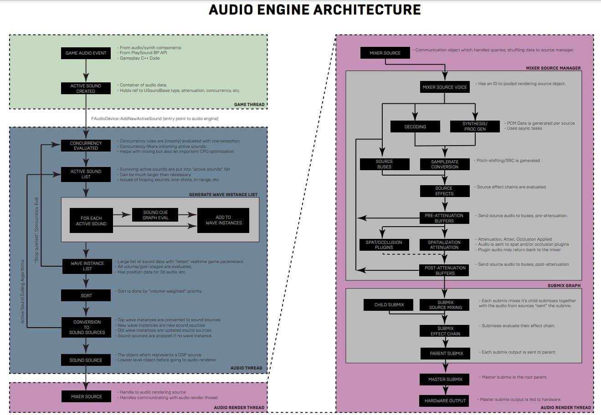

# 调试音频困难

## 来源与状态

- 原始 URL：https://dev.epicgames.com/community/learning/knowledge-base/n16E/unreal-engine-debugging-audio-difficulties

## 运行时分类

- 类型：图文教程
- 判断：API 未识别到核心视频信号，可整理正文约 10410 字符。

## 摘要

2021 年 9 月 23 日。Anna L 撰写的知识文章。本文适用于 UE4 中原生虚幻音频的调试问题。 （调试第三方插件请看下面的文章）入门...

## 中文整理

### 概览

2021 年 9 月 23 日。[Anna L.] 撰写的知识文章(https://dev.epicgames.com/community/profile/Ob2/lantz.anna) 本文适用于 UE4 中原生虚幻音频的调试问题。 （有关调试第三方插件，请参阅[以下文章](https://forums.unrealengine.com/docs?topic=498738)） **获取基本信息：** 在调试任何 Unreal 系统时，查看调试日志和一般性能统计数据总是很有帮助的。虽然归因于 LogAudio 系列日志类别的警告和错误是最容易注意到的，但日志的音频设置部分通常也包含对调试有用的信息。特别是，查看设置通常可以更轻松地整理其他人遇到的问题，或者突出显示预期设置与程序行为之间潜在的不匹配。日志的音频设置部分看起来有点像下面这样：

```cpp
[2021.06.04-02.11.26:504][  0]LogAudio: Display: Initializing Audio Device Manager...
[2021.06.04-02.11.26:521][  0]LogAudio: Display: Audio Device Manager Initialized
[2021.06.04-02.11.26:521][  0]LogAudio: Display: Creating Audio Device:                 Id: 1, Scope: Shared, Realtime: True
[2021.06.04-02.11.26:521][  0]LogAudioMixer: Display: Audio Mixer Platform Settings:
[2021.06.04-02.11.26:521][  0]LogAudioMixer: Display: 	Sample Rate: 48000
[2021.06.04-02.11.26:521][  0]LogAudioMixer: Display: 	Callback Buffer Frame Size Requested: 1024
[2021.06.04-02.11.26:521][  0]LogAudioMixer: Display: 	Callback Buffer Frame Size To Use: 1024
[2021.06.04-02.11.26:522][  0]LogAudioMixer: Display: 	Number of buffers to queue:	2
[2021.06.04-02.11.26:522][  0]LogAudioMixer: Display: 	Max Channels (voices): 1084
[2021.06.04-02.11.26:522][  0]LogAudioMixer: Display: 	Number of Async Source Workers:	0
```

一些值得研究的具体事项包括： - 音频混合器是否启用。我们较旧的音频引擎和较新的音频混合器是不同的音频引擎，因此包含不同类型的错误。特别是，较旧的音频引擎更可能在平台之间具有不一致的行为，并且一些较新的功能（例如子混合）仅适用于音频混合器。 - 请求的回调缓冲区帧大小是否与正在使用的回调缓冲区帧大小匹配。 - 最大通道数和音频设备最大源数是否是可接受的大数字。值得注意的是，在这种情况下，“通道”指的是可以同时使用的语音槽的数量。如果该值很小，或者如果您在“静音时播放”虚拟化模式下播放大量声音，则可能会导致语音窃取 - 您的输出设备的名称和通道设置正是您所期望的。这对于验证您是否在游戏过程中在设备之间交换，或者您是否在某些硬件设置上遇到问题但在其他硬件设置上没有问题尤其重要。 - 正在使用的特定音频或音频混合器模块，例如 FMixerPlatformXAudio2。它们控制音频的压缩和解码方式，并且通常是仅在某些平台上发生的故障的根源，而在其他平台上则不然。 （注意：如果您正在运行 PIE，您可能会在日志中看到此部分两次。这是因为需要多个音频设备实例才能预览来自客户端和服务器的音频。如果您正在调试并且只想查看一个音频设备的调试信息，您可以使用命令 SoloAudio 使当前视图窗口中的唯一活动音频设备）。此外，如果您知道哪个音频子系统是问题的根源（请参阅下一节），或者看到一个意外的警告或错误，但它并不提供足够的上下文进行调查，更改相关类别的 LogLevel 可能会很有用。您可以在[此处](https://docs.unrealengine.com/4.27/en-US/WorkingWithAudio/AudioConsoleCommands/)找到有关如何执行此操作的更多信息。在性能方面，虽然目前Unreal Insights中还没有专门针对音频的工具，但它仍然可以提供大量有价值的信息。引擎任何部分的故障通常都会导致音频失真，因此值得验证音频故障是否与 CPU 和 GPU 使用率的增加或帧速率的下降相对应（特别是如果您在调试日志中看到大量“等待音频线程……毫秒”消息）。同样，如果您在创建音频线程的模式下运行游戏（除 PIE 之外的任何模式，除非手动更改设置），您可以分析各种音频线程级别调用所花费的相对时间。 **缩小问题根源的范围：** 通常，您对故障发生位置越了解，修复起来就越容易。缩小其他问题中潜在问题来源的相同方法也适用于此，例如尝试在干净的构建上复制问题，并找到一致的重现条件。然而，在这些不足以找到源的情况下，考虑音频系统的操作顺序可能会很有用：



日志调试命令通常有助于缩小问题发生的范围。

例如，控制台命令 au.Debug.Soundwaves 1（或 stat soundwaves，在 4.26 之前的版本中）可用于验证声音是否处于活动状态。

因此，这可用于验证声波激活之前（例如在初始游戏事件中或并发解析期间）或之后（例如在源效果或空间化期间）是否发生问题。

游戏线程或音频线程级别的问题通常更容易调试，而音频渲染线程由于其严格的速度要求，用于收集调试信息的句柄较少。

也就是说，音频处理的大多数后期阶段都可以通过控制台命令打开和关闭，例如 au.DisableAttenuation 1、au.DisableOcclusion 1、au.DisableStreamCaching 1 和 au.DisableSourceEffects 1。

对于似乎源自 Submix 阶段或更高版本的问题，有时最好更改现有设置并查看问题是否仍然存在。

例如，可能值得： - 取消选中受影响声音上的“启用子混合发送”和“启用总线发送” - 从现有主子混合中删除任何效果 - 禁用外部空间化插件，例如 Oculus Audio 或 Resonance - 如果使用多个平台，则针对不同的硬件 - 将您正在使用的编解码器更改为已知可在多个平台上工作的编解码器（[请参阅以下](https://forums.unrealengine.com/t/how-to-get-your-project-to-target-ogg-vorbis/498742)) - 禁用关卡中的音频音量 - 在项目的音频设置中更改受影响平台上的缓冲区大小和/或异步工作人员的数量 - 如果使用流缓存，则启用高级流缓存调试 **外部音频分析：** 对于某些情况，请查看物理Unreal 的音频输出可以提供有关正在发生的事情的提示。

为此，您可以使用 Submix Record 功能获取整个游戏（通过 Master Submix）或特定 Submix 输出的波形文件，并将生成的波形放入外部程序（例如 Audacity）中。

这可以提供一些提示示例： - 有均匀间隔的声音区域，由间隙分隔，其中音量意外为零：这通常表明音频渲染线程运行得不够快，即每个渲染缓冲区之间存在间隙。

检查 Unreal Insights 是否存在可能出现的问题，启用流缓存（如果尚未启用），并考虑增加缓冲区大小和异步工作线程的数量。

- 使用频谱图可以发现物体上似乎存在意外的低通或高通滤波器：某处可能发生意外的处理。

尝试使用“au.Debug.SoundMixes”来验证是否存在预期数量的声音类混合（它们的频率效果堆栈），使用控制台命令禁用效果/衰减/遮挡等系统，并禁用外部空间化插件 - 声波具有长而平坦的峰和/或谷：您的声音可能会受到限制。

检查相关平台 ini 文件中的 AudioHeadroom 设置，使用“au.Debug.Sounds 1”验证每个声音仅存在预期数量的实例，并且音量乘数是否合理，禁用声音类混合/调制/效果，然后查看导入的波形资源的音量。

- 声波在几个位置有一些看似随机、意外的数据，并且每次运行游戏时看起来都不同：可能存在内存泄漏，从而损坏了声波数据。

尝试使用 -memstomp 运行您的程序，并特别仔细地查看您正在使用的任何程序声音源。

- 通过 Audacity 等工具播放时声波听起来正常，但在可执行文件中则不然：Submix 渲染和与音频硬件的通信之间可能出现问题。

尝试禁用硬件加速，禁用直接在硬件或耳机上发生的任何空间化处理，并更改通道设置等设置**如果问题不一致或难以重现：**此类错误可能是最难追踪的错误，很大程度上是因为它们的不一致。

此处适用标准的调试方法，例如使用 memstomp 运行、在涉及崩溃的情况下分析堆栈转储，以及在已知的可疑代码上设置断点以查看是否可能涉及竞争条件或更改的数据。

特别是对于音频来说，不一致错误的常见罪魁祸首是垃圾收集、设备交换和流缓存。

因此，有时通过控制台命令 gc.ForceCollectGarbageEveryFrame 1 使用每帧调用垃圾回收的技术会暴露出故障。

同样，有时可以通过有意触发设备交换来发现低速率错误，无论是通过蓝图函数 RequestDeviceSwap、在玩游戏时更改系统默认输出设备，还是通过连接和断开输出设备。

对于流缓存，它可能
