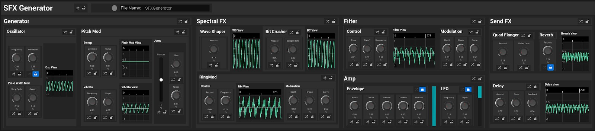
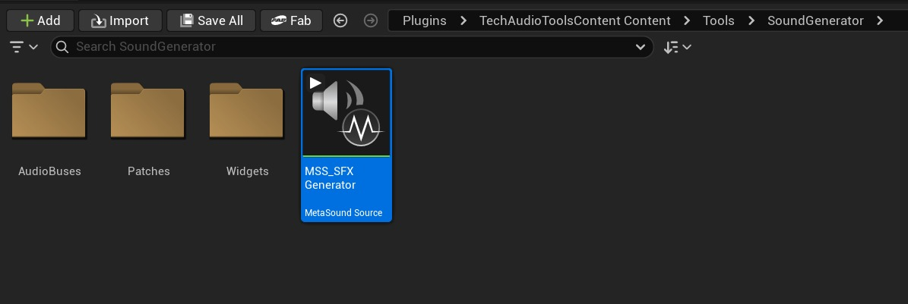
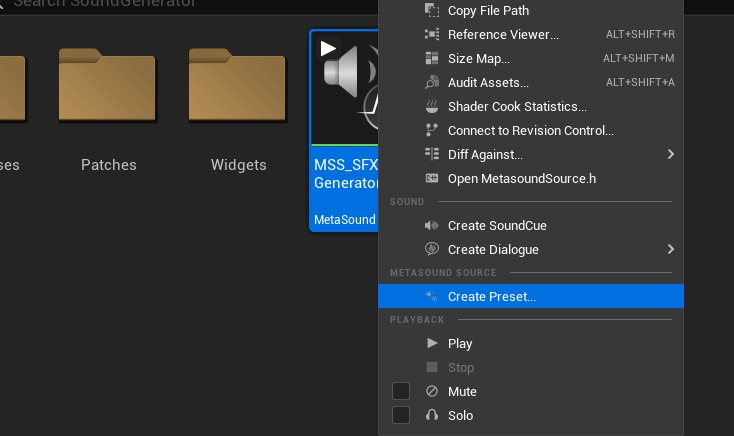
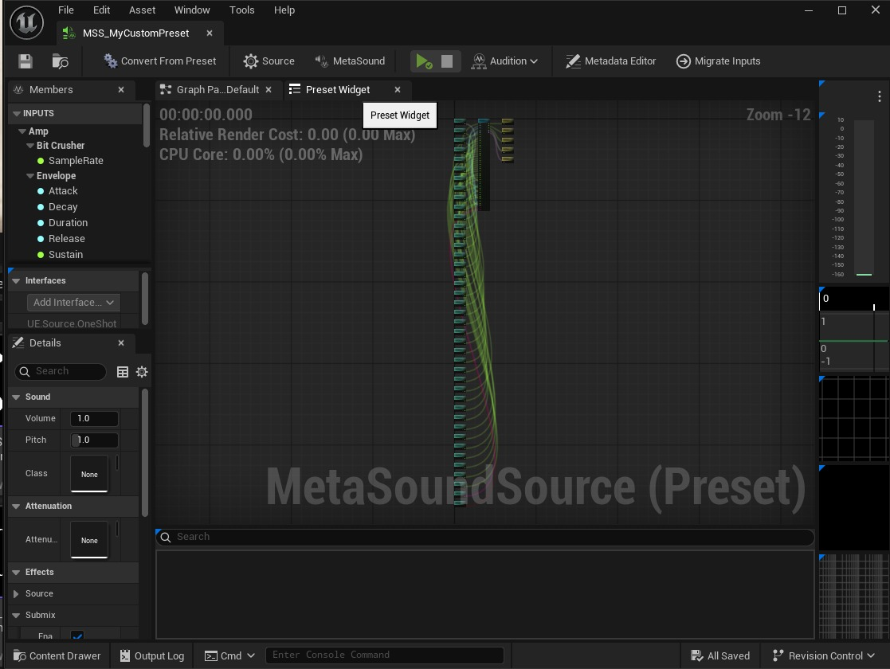
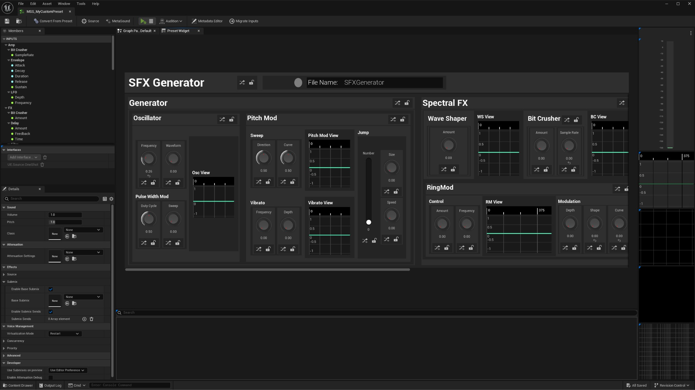
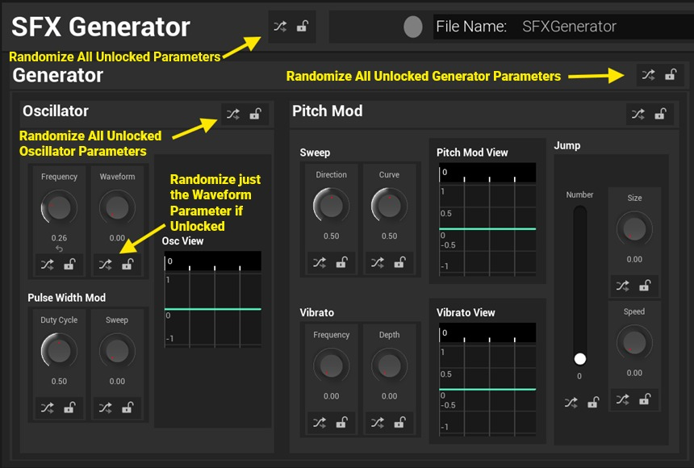
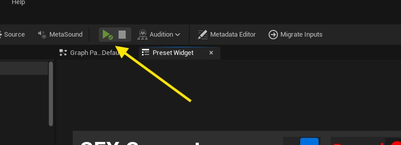
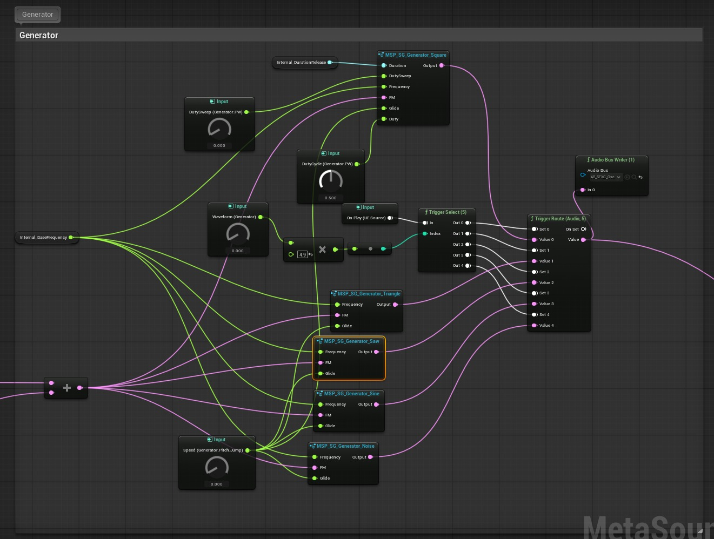
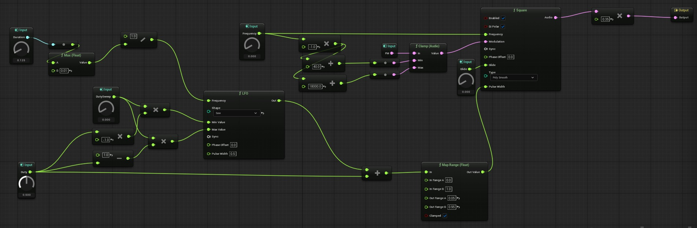
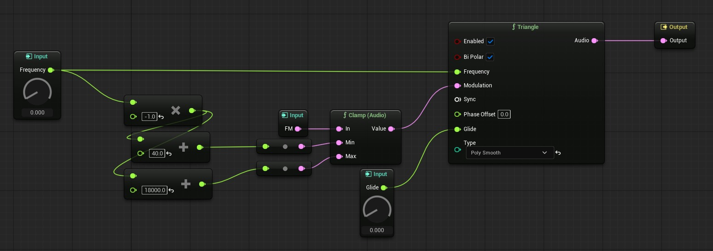

# 使用技术音频工具内容插件中的 SFX 生成器

## 来源与状态

- 原始 URL：https://dev.epicgames.com/community/learning/tutorials/L0d9/unreal-engine-fab-using-the-sfx-generator-in-the-tech-audio-tools-content-plugin

## 运行时分类

- 类型：图文教程
- 判断：API 未识别到核心视频信号，可整理正文约 10703 字符。

## 摘要

本教程作为如何使用 FAB 市场上的技术音频工具内容插件中的 SFX 生成器 MetaSound 的参考和说明。

## 中文整理

### 音效发生器

基于 MetaSound 的合成器，具有丰富的 UI 预设小部件

### 项目链接

您可以使用 Fab 上提供的 **TechAudioTools Content** 插件下载此内容！ [https://www.fab.com/listings/d44cbd49-7691-4f82-abdb-6428c78508f6](https://www.fab.com/listings/d44cbd49-7691-4f82-abdb-6428c78508f6)

### 生成 SFX 快速入门

### 创建预设

要创建新预设： - 在 [插件 > TechAudioToolsContent > 工具 > SoundGenerator > MSS_SFXGenerator] 中找到父 MetaSound 源 - 右键单击​​ MetaSound 源 [MSS_SFXGenerator]

- 在上下文菜单中，选择 MetaSound Source 资产操作部分下的 [创建预设...]。

- 在您的首选内容目录中命名并保存您的预设。 - 打开新的 MetaSound 预设并选择预设小部件选项卡。

- 您现在可以开始通过预设小部件编辑 MetaSound 输入：

### 随机化和锁定参数

参数、参数部分等将有一个随机化按钮以及一个配对的锁定切换按钮：当锁定时，随机化将在此范围内不起作用，并且不会将随机化调用传递到内部范围。通过这种方式，您可以保护单个参数、参数子部分、参数部分或所有参数的随机化。

### 录制 Wav 文件

为了将预设捕获为录制的 wav 文件： - 将文件名设置为首选文件名： - 启用录制功能： - 像平常一样播放 MetaSound Source。请注意，当录音已启用（启用波形写入器时）时，每次播放 MetaSound 时都会录制一个新文件。

- 在项目的子目录中的 [Saved > AudioCaptures] 下找到您的文件

### SFX 生成器 MetaSound 图表

SFX Generator 示例展示了 MetaSounds 广泛的声音设计潜力和预设小部件的 UX 可能性，同时呈现了一个有趣的声音制作玩具！展示以下内容： - MetaSound 预设小部件 - MetaSound 视图模型 - MetaSound 数据输出 - 用于实时波形分析的音频总线

### 合成器拓扑

SFX Generator MetaSound 是一款能够产生多种声音的单发生器合成器。

### 概述

我们从单个可切换波形发生器（振荡器、噪声发生器等）开始，它提供了多种声音潜力。频率/音调由基频输入以及提供频率移动和进一步声音潜力的潜在音频速率调制来设置。在发生器部分之后，我们通过频谱效果部分，使设计人员能够进一步扩展生成信号的谐波丰富度。在频谱效应部分之后，我们将信号通过状态变量滤波器，并在 LP、BP 和 HP 输出之间进行交叉淡入淡出，从而提供了塑造频谱以及随时间调制截止频率的机会。接下来，我们应用 ADSR 包络和单极 LFO 的幅度调制来塑造声音事件的动态。我们的信号最后被发送到几个时间效果（延迟、镶边、混响），这些效果并行处理并汇总在一起以获得最终输出。这个概念是为了展示一个可靠的、主力的合成器架构，无论是在有能力的合成器还是随意的随机发生器手中，它都提供规范和更有趣的设计。

### 发电机

主要音调生成来自图表的发生器部分，其中包含 5 个波形之间的切换： - 脉冲波

- 三角波

- 锯齿波 - 正弦波 - 噪声 每个都经过粗略调整，以平衡彼此感知的音量强度。输入包括基频和频率调制。噪声发生器包括一个带通滤波器以强调输入频率。

### 基频和基频调制

基频由从归一化输入到对数频率图的输入图设置。跳跃功能通过平滑滑音在声音持续时间内按某个给定间隔增加基频一定次数。

### 频率调制，包括颤音

有一个音高滑块与最高音频速率的颤音相加，充当振荡器的频率调制。

### 光谱效应

该部分包含一系列影响输入光谱的处理器。首先是波形整形器，其设计用于近似平衡音量输出，同时支持输入信号和软削波或圆角脉冲输出之间的平滑插值。使用 BitCrusher，但仅用于降低采样率，以创建刺耳的混叠频谱输出。最后，我们通过具有内置 AD 包络的环形调制器来调制调制器信号的频率。

### 筛选

接下来，我们通过交叉淡入淡出样式过滤器部分处理信号。滤波器类型允许在低通、带通和高通之间进行交叉渐变输出处理（类似于 DJ 滤波器）。其中包括一个内置 AD 包络，可帮助调制截止频率。

### 放大器和幅度调制

在滤波器之后，我们用一个简单的放大器处理信号。我们的放大器信号强度由包络和 AM LFO 进行调制。

### 时间/持续时间

时序图用于映射过程和效果的时序，包括放大器的包络生成器来对各个阶段进行排序。

### 时间效应

在放大器之后，信号被分割并并行发送到三个频谱效果中的每一个：延迟效果、多系列镶边和板混响效果。然后将它们混合回主信号中。

### 输出

混音后，最终信号被发送到主单声道输出，发送到波形编写器以记录输出文件，并通过包络跟随器确定声音是否已完成（特别是是否延迟信号或反馈信号的时间效果）。

### 分析总线

音频总线用于将中图音频率数据馈送到分析器小部件。有音频总线为以下图形部分提供中间图形输出数据： - Bit Crusher - 延迟 - 滤波器 - 发生器部分 - 弯音 - 混响 - 环形调制器 - 颤音 - 波形整形器

### 输出数据

除了音频总线处理的音频速率数据外，还输出块速率数据以供自定义小部件处理。包括： - 放大器包络输出 - 放大器 LFO 输出

### Wav 文件写入

Wave Writer 节点通过输入和表示文件名的字符串来启用和禁用，可以将 wav 资源序列化到项目的“已保存”文件夹中。

### SFX 生成器预设小部件

SFX 生成器预设小部件提供输入数据、输出数据和音频总线分析数据的可视化表达。

### 蓝图实施

### 事件预构建和构建

施工前设置样式和颜色。构造尝试初始化 SFX 生成器并初始化音频总线。

### 初始化

在初始化时，我们初始化 MetaSound Builder，然后循环输入文本并将它们传递到 MetaSound 编辑器视图模型中。如果由于某种原因 Builder 无效，这将失败。

### 关于 MetaSound 预设小部件的构建

构造 MetaSound Preset WIdget 时，我们会获得对 Builder 的引用。

### 关于 MetaSound 试镜

在试听时，我们缓存音频组件引用，绑定 MetaSound 输出监视委托并绑定音频播放状态更改委托。

### 音频组件播放状态

当播放状态更改为“已停止”时，如果 AC 仍然有效，我们将取消绑定输出监视，否则我们会重置 LFO 小部件可视化和包络小部件可视化，因为如果在通过 MetaSound 输出监视委托发送最终 0 值之前 AC 被破坏，小部件可能无法重置。

### 随机发生器

所有随机化器小部件都设置为根据随机化器小部件的范围递归随机化。

### 记录切换按钮状态更改

切换“录制”按钮时切换视觉颜色。

### 定制小部件

### 编辑器用户小部件

- EUW_MetaSoundBoolean_ToggleButton_SFXGen - EUW_MetaSoundFloat_Knob_SFXGen - 结合了随机化和锁定以及浮点输入的默认值和范围值。 - EUW_MetaSoundInteger_Slider_Vertical_SFXGen - 组合随机化和锁定以及整数输入的默认值和范围值。 - EUW_SFXGenerator_Randomizer - 组合了一个图标切换按钮和一个可以锁定随机化调用的图标按钮。 - EUW_ToggleButton_Icon_SFXGen - 在随机发生器中用于锁定切换。

### 小部件蓝图

- WBP_MetaSoundLiteralBoolPrimitive_ToggleButton_SFXGen - 定制以提供圆形记录按钮切换，包括状态更改时的事件委托 - WBP_MetaSoundLiteralStringPrimitive_EditableText_SFXGen - 定制以提供文本编辑框以绑定到字符串输入。 - WBP_SFXGeneratorContentPanel - 内容面板小部件的可重用、自定义版本，添加了随机小部件的插槽。

### 布局参考

### 头

管理顶部范围的随机化和锁定以及启用或禁用记录模式。文本输入允许设计者为保存的 wav 文件创建文件名。

### 发电机

具有音调调制/频率调制的振荡器或波形生成部分。振荡器部分允许设计人员定制基频、首选波形，并且在脉冲波的情况下，指定占空比和占空比调制。音调调制部分允许设计人员通过扫频和跳跃以及颤音为音调添加运动，以实现 FM 合成的音频速率。

### 光谱效应

光谱效果部分有三个串联的处理器，从波形整形器、比特粉碎器开始，到环形调制器结束。旋钮允许设计人员指示有多少信号是由处理后的信号和处理器的属性组成的。对于 Ring Mod，我们有一个调制部分来创建调制信号频率的运动。

### 筛选

交叉淡入淡出型滤波器，由低通、带通和高通滤波器以及截止和共振控制组成。此外，调制部分允许设计人员在截止频率中创建运动。

### 扩音器

放大器部分由两个调制器、一个 ADSR 包络发生器和一个用于幅度调制的单极 LFO 组成。除了典型的起音、衰减、延音和释放参数之外，第二个参数还包括一个持续时间值，允许更长或更短的包络形状，以及可用于在声音事件持续时间内进行调制的其他参数。

### 发送效果

所有发送效果均与原始信号并行处理，允许设计人员添加基于时间的处理信号。
