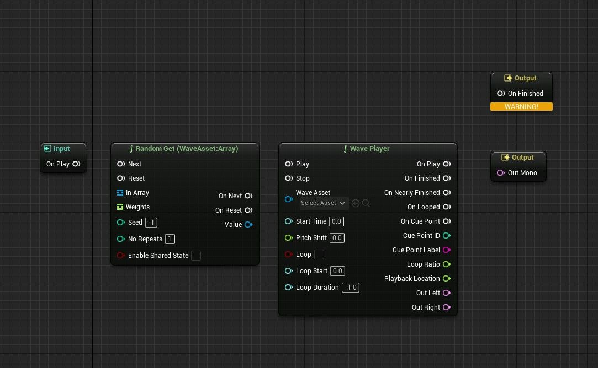
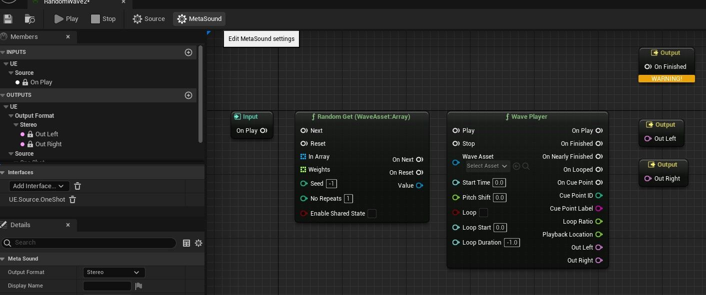
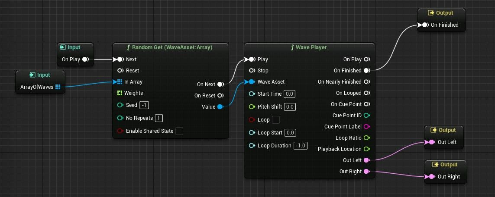

# 如何使用 MetaSound 预设

## 来源与状态

- 原始 URL：https://dev.epicgames.com/community/learning/tutorials/mXOv/unreal-engine-how-to-use-metasound-presets

## 运行时分类

- 类型：图文教程
- 判断：API 未识别到核心视频信号，可整理正文约 9419 字符。

## 摘要

本教程介绍如何使用 MetaSound 预设，以及何时需要使用它们。

## 中文整理

### 概览

本教程面向那些仍在习惯 MetaSound UX 并正在寻找加快工作流程和创建更具可扩展性的 MetaSound 系统的方法的人们。也就是说，在使用 MetaSounds 时，您可能会发现有时想要创建仅在输入参数值方面有所不同的 MetaSound 源。在蓝图中手动更改输入参数可能非常耗时，并且复制 MetaSound 可能会占用大量数据。解决这些工作流程挑战的主要方法之一是使用 MetaSound 预设。对 MetaSound 进行预设将创建一个新的 MetaSound，其中包含与原始图形相同的图表，但可以独立更改其默认输入值。通过示例可以更容易地理解这一点 - 让我们做一个预设！

### 制作我们的预设基地

预设的一个常见用例是当人们想要随机选择要播放的 Wave 资源时。例如，可以使用 MetaSound 图上的相同节点轻松创建简单的“随机选择碰撞波资产”MetaSound 和简单的“随机选择枪声波资产”MetaSound。两者之间的区别在于它们的输入——它们需要不同的波阵列可供选择。您可以做的不是制作一堆几乎相同的 MetaSound 源，而是制作一个具有“从数组中随机播放波形资源”行为的单个 MetaSound 源，并创建利用不同波形的预设。我们的第一步将是创建这个“从数组中随机播放波形资源”MetaSound Source。为此，我们需要几个不同的节点：用于播放声波资源的 Wave Player 节点，以及用于从数组中选择条目的 Random Get 节点。您可以通过右键单击 MetaSound 图表（即黑色网格）来添加这些节点。 Random Get 可以在“Functions->Array”选项卡下找到，或者通过名称搜索它 - 因为我们将从声波资源列表中随机选择，所以我们需要 Random Get (WaveAsset:Array) 变体。 Wave Player 节点位于“功能”选项卡底部附近。添加这两个节点后，我们的 MetaSound Source 应该看起来有点像这样：

此时预计会在“完成输出”下出现警告 - 如果没有任何内容连接到它，它会警告用户，但当我们完成 MetaSound Source 时，它​​就会建立连接。因为我们的 Wave Player 输出立体声音频（两个通道），所以我们可能也希望让 MetaSound Source 输出立体声音频。您可以在“MetaSound 设置”选项卡（左上角的右侧齿轮）中将“输出格式”更改为“立体声”，从而更改 MetaSound 源的输出格式。进行更改后，您应该看到两个音频输出节点：Out Left 和 Out Right，而不是 Out Mono 节点。

现在是时候连接我们的节点了！我们希望 Random Get 节点控制 Wave Player 使用哪个文件，因此我们将 Random Get 节点上的 **Value ** 输出引脚连接到 Wave Player 节点上的 **Wave Asset ** 输入引脚。两个节点都需要一个触发器才能真正开始运行。在我们的例子中，On Play 效果很好 - 只要您的 MetaSound Source 在音频组件上播放，此触发器就会熄灭。因此，您可以将 On Play 的输出引脚连接到 Random Get 节点上的 **Next** 输入引脚，并将 Random Get 节点上的 **On Next **输出引脚连接到 Wave Player 节点上的 **Play ** 输入引脚。我们要做的下一件事是连接到 MetaSound Source 的输出。我们希望在播放 MetaSound Source 时听到来自 Wave Player 节点的音频，因此将 Wave Player 上的 **Out Left ** 和 ** Out Right ** 输出引脚连接到 MetaSound 的同名输出节点。同样，如果我们希望音频组件能够在声音完成时自动停止，我们需要将某些内容连接到 On Finished 节点。声波资源结束时是考虑 MetaSound Source 播放完毕的好时机，因此将 Wave Player 上的 **On Finished** 引脚连接到同名的输出节点。而且，最重要的是，我们需要一个输入波数组。将“随机获取”节点上的 **In Array **输入引脚拖动到图形上的空白区域 - 您将在结果下拉菜单中看到的选项之一应该是“提升到图形输入”。这就是我们想要的。将 pin 升级为输入后，我们应该在“成员”选项卡的“输入”下看到一个新对象。如果单击它，您可以执行一些操作，例如在详细信息面板中为输入指定更有用的名称。最后，生成的 MetaSound Source 应如下所示：

您会注意到，如果您现在播放此 MetaSound Source，您实际上不会听到任何声音。这是预期的 - 您还没有向阵列添加任何波！如果您想测试 MetaSound Source，您现在可以在波形阵列输入的详细信息面板中将波形添加到阵列中。但我们还将在创建预设后添加波形，因此您也可以等到那时再添加声波资源。不管怎样，我们现在已经完成了用于创建预设的基础 MetaSound。

### 创建我们的预设

我们现在可以关闭 MetaSound Source。相反，返回到内容浏览器，然后右键单击新的 MetaSound Source。在“MetaSound 操作”下，您应该会看到一个标有“创建 MetaSound 源预设”的选项。单击该按钮，然后打开它创建的预设资源。您将看到一个 MetaSound，其图表上的节点呈灰色且不可移动。因为这是一个预设，所以我们不需要更改其图表上的任何内容（尽管如果您确实想要，可以按顶部的“从预设转换”按钮将其永久更改为标准 MetaSound 源，这将使图表再次可编辑）。我们将在“成员”面板中工作，而不是更改图表。单击您的波形阵列以显示其详细信息面板。在“默认值”下，您会注意到一个名为“覆盖继承默认值”的新参数。如果未选中此选项，您的预设将使用原始 MetaSound 源上的默认值，即使在创建预设后原始值发生了更改。但在这种情况下，我们确实希望预设具有与原始波形不同的波形阵列，因此请选中“覆盖继承默认值”按钮。现在您将能够向阵列添加波浪！单击默认旁边的小 + 按钮添加新的数组索引，然后从下拉菜单中选择声波资源。诚然，我没有可以分发给您的声波资源，但您可以使用虚幻中包含的任何资源或您创建的任何资源来测试这一点。我发现入门内容包中的崩溃和爆炸声波可以很好地解决此问题。不断向数组添加更多索引，直到您对可供选择的波浪池感到满意为止。现在我们终于可以玩我们的作品了！单击顶部的“播放”按钮，您应该会听到您的 Sound Wave 资源之一。再播放几次，您将开始从阵列中听到不同的声波。您可以像使用任何 MetaSound Source 一样使用此预设 - 将其直接放置在音频组件上以在游戏中听到它。您可以根据需要创建任意多个相同 MetaSound Source 的预设。请随意为您的 MetaSound Source 制作另一个预设，并用不同类别的声音填充其数组。不同的预设将完全相互独立，因此它们可以具有不同的值、同时一起播放等等。这意味着，您不必再次创建基础 MetaSound Source 图表来获取新的“从数组中随机选择波形”事件 - 只需从基础中创建另一个预设并插入您想要从中选择的波形即可。欢呼！

### 预设的力量

除了工作流程改进之外，预设还有另一个很大的优点 - 对基本 MetaSound 源的更改会传播到预设。 “覆盖继承的默认值”选项暗示了这一点，因为更改原始 MetaSound 源上的默认值也会影响未覆盖该设置的预设。但更重要的是，对基本 MetaSound **graph ** 的更改也将传播。这使得您可以更轻松地在您创建的 MetaSound 系统上进行编辑和构建，而无需更改大量单独的资源。例如，假设稍后您决定除了随机选择波形之外，还需要轻微的随机音高变化。如果您将其添加到原始 MetaSound Source 中，它会将轻微的随机音调变化添加到由此创建的所有预设中，无论是 5 个还是 5,000 个。如果您想添加衰减系统、过滤或连接随机选择的波形文件的多个实例，情况也是如此 - 向原始文件添加功能会将该功能添加到已创建的预设中。由于默认情况下预设不会覆盖原始设置的特定设置，因此您可以在原始预设上选择默认值，而无需对现有预设进行额外更改。因此，巧妙地使用预设可以让您在项目开发时快速迭代 MetaSounds 的完整系统，从而大大减少在新想法形成时更改大量单个资产的需要。
