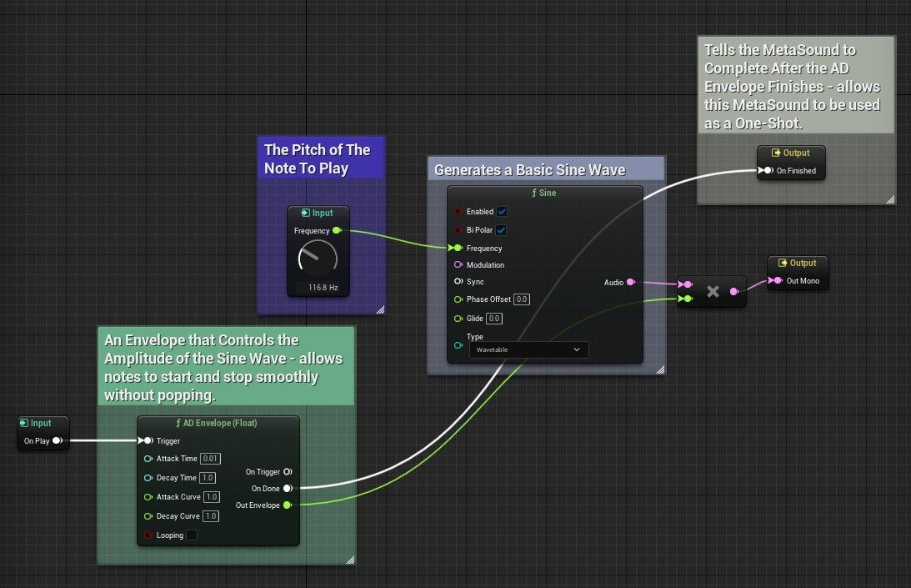
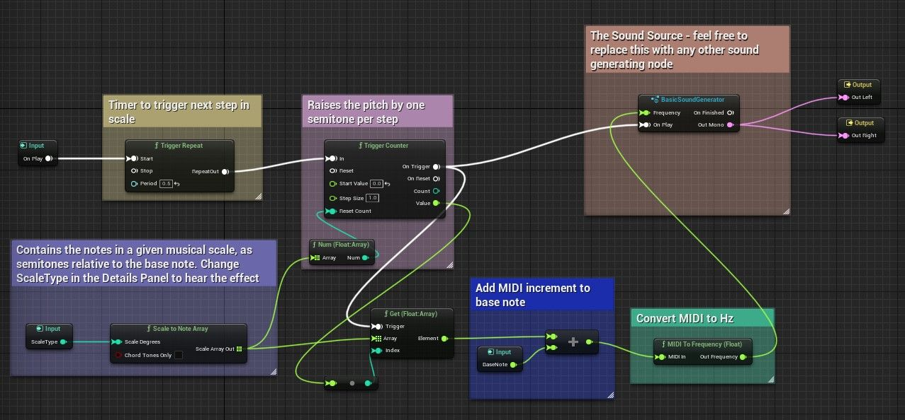
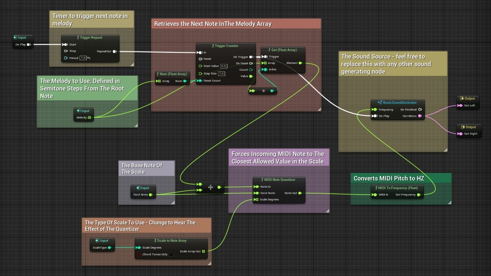

# Secondary split of unreal-engine-music-nodes-in-metasounds.part02.origin.md (1/2)

Source generated part: `unreal-engine-music-nodes-in-metasounds.part02.origin.md`.

# MetaSounds 中的音乐节点 (Part 2/3)

Source file: `unreal-engine-music-nodes-in-metasounds.origin.md`.

This document was split during ue-kb import to keep source chunks buildable.

### 概览

本教程旨在提供 MetaSounds 中“音乐”类别下的一些节点的可播放示例。具体来说，它重点关注 ScaleToNoteArray 和 MIDIQuantizer 节点的接口和用例。这些节点可以提供构建块，允许在 MetaSounds 中生成旋律和潜在的 MIDI 接口。重点将更多地放在这些特定 MetaSound 节点的行为方式上，而不是深入研究它们背后的音乐理论。也就是说，音乐理论非常值得学习，并且通常可以为构建 MetaSounds 的新方法提供灵感。有关 MIDI、音阶和音符量化的更多信息，请查看本文底部的有用链接部分。本教程还假设您了解 MetaSounds 的行为方式以及如何导航 MetaSound 编辑器。 （注意：目前，MetaSound 复制粘贴功能仍在开发中。因此，虽然复制 MetaSound 片段并将其粘贴到 MetaSound 图表中可以快速获取注释和大部分图表节点，但它不会保留输入节点，也不会保留与输出节点的连接，也不会保留对其他 MetaSound 图表的引用。换句话说，如果您想直接使用本教程中提到的 MetaSound 源，您需要自己构建输入节点，包括任何旋钮和滑块，以及对现有 MetaSound 图表的任何引用。如果您仍在习惯 MetaSound 输入小部件，那么在阅读本教程之前，可能值得查看[使用 MetaSound 旋钮和滑块教程](https://dev.epicgames.com/community/learning/tutorials/587X/unreal-engine-using-metasound-sliders-and-knobs)。） **基本声音生成器** 这MetaSound Source 将简单的 AD（Attack-Decay）包络应用于正弦波，并用于在音乐节点演示 MetaSounds 中播放音符。虽然它本身不使用音乐节点，但您将需要此 MetaSound Source 才能使其他演示正常工作。正如演示中提到的，复制和粘贴 MetaSound 片段当前不会保留输入节点，因此标有“频率”的旋钮可能会丢失。您可以通过将正弦节点上的“频率”引脚提升为输入并将其设置为值类型为“频率（对数）”的旋钮小部件来重新创建它。注意：如果您想听听音乐节点 MetaSounds 在不同声音下的声音，请随意更改此 MetaSound。例如，您可以将 Sine 节点替换为其他生成器节点之一，或者使用 MetaSounds 教程中生成器节点中的任何 MetaSound。



**基本声音发生器**

```
Begin Object Class=/Script/MetasoundEditor.MetasoundEditorGraphInputNode Name="MetasoundEditorGraphInputNode_0"
   Input=MetasoundEditorGraphInput'"MetasoundEditorGraphInput_0"'
   NodePosX=-464
   NodePosY=512
   ErrorType=4
   NodeGuid=E249C20A4FE716536D36D1AA72B26A30
   CustomProperties Pin (PinId=B428F8634E266417ED1E3CBF0E58673E,PinName="UE.Source.OnPlay",Direction="EGPD_Output",PinType.PinCategory="trigger",PinType.PinSubCategory="",PinType.PinSubCategoryObject=None,PinType.PinSubCategoryMemberReference=(),PinType.PinValueType=(),PinType.ContainerType=None,PinType.bIsReference=False,PinType.bIsConst=False,PinType.bIsWeakPointer=False,PinType.bIsUObjectWrapper=False,PinType.bSerializeAsSinglePrecisionFloat=False,LinkedTo=(MetasoundEditorGraphExternalNode_5 EAE7AEA4424D8A137F869F94DC70E988,),PersistentGuid=00000000000000000000000000000000,bHidden=False,bNotConnectable=False,bDefaultValueIsReadOnly=False,bDefaultValueIsIgnored=False,bAdvancedView=False,bOrphanedPin=False,)
End Object
Begin Object Class=/Script/MetasoundEditor.MetasoundEditorGraphOutputNode Name="MetasoundEditorGraphOutputNode_0"
   Output=MetasoundEditorGraphOutput'"MetasoundEditorGraphOutput_0"'
```

**Scale To Note Array** ScaleToNoteArray 节点用于在选择频率（例如大调和小调音阶）时帮助利用音阶。对于 Enum:MusicalScale 中的每种音阶类型，此节点将返回一个整数数组，以半步的形式表示给定音阶的八度音阶中允许的音符集。例如，“0”表示音阶的根音，“12”表示同一音符高八度，“2”表示根音以上的大二度（两个半音）。当选择“Chord Tones Only”时，ScaleToNoteArray 将仅返回相关和弦中包含的音符，例如 C 大调和弦。如果您以 MIDI 格式描述音高，则这通常非常有用，其中音高值增加 1 相当于将音高提高半音。这就是 MetaSound 使用 ScaleToNoteArray 的方式。触发中继器和触发计数器节点允许其遍历刻度阵列。对于数组中的每个条目，音程都会添加到基本 MIDI 音高中。然后，MIDIToFrequency 节点将生成的 MIDI 值转换为 Hz，用于以给定的音高演奏音符。换句话说，这个 MetaSound 将提升给定的音阶。由于音阶是根据音程定义的，因此您可以从任何音高开始音阶。例如，更改此 MetaSound 上的 BaseNote 输入将允许您将演奏音阶从 A 大调更改为 D 大调。 （如果您想将您熟悉的其他乐器的音高转换为 MIDI 音高值，有用链接部分中包含一个表格。）类似地，您可以通过在详细信息面板中编辑 ScaleType 节点的值来更改音阶类型 - Unreal 实现了相当多不同的音阶。 （与上面的 MetaSounds 一样，如果您希望 BaseNote 和 ScaleType 输入节点出现在图表上，则需要通过提升它们与输入的相关连接来创建它们。对于 BaseNote，合理的值是 20 到 127 之间的值。）请注意，此图表上看到的“Basic Sound Generator”不是内置函数 - 它是对我们上面构建的 MetaSound Source 的引用。因此，当您尝试复制并粘贴此 MetaSound 时，它可能不会出现。如果没有，您需要自己添加参考。为了做到这一点。右键单击 MetaSound 图表，转到图表，然后选择“基本声音生成器”（或者您在上面创建的 MetaSound 的任何名称，如果您为其指定了不同的名称）。



**缩放音符数组示例**

```
Begin Object Class=/Script/MetasoundEditor.MetasoundEditorGraphExternalNode Name="MetasoundEditorGraphExternalNode_0"
   ClassName=(Namespace="UE",Name="Musical Scale To Note Array",Variant="Audio")
   NodeID=356FA5DD431B2E29CD6D5BB5C64972EE
   NodePosX=-240
   NodePosY=448
   ErrorType=4
   NodeGuid=65BAA6804429AF5192F4B68136DC6158
   CustomProperties Pin (PinId=3F65915D419BA8DC16F7198DBFD85AEA,PinName="Scale Degrees",PinType.PinCategory="int",PinType.PinSubCategory="",PinType.PinSubCategoryObject=None,PinType.PinSubCategoryMemberReference=(),PinType.PinValueType=(),PinType.ContainerType=None,PinType.bIsReference=False,PinType.bIsConst=False,PinType.bIsWeakPointer=False,PinType.bIsUObjectWrapper=False,PinType.bSerializeAsSinglePrecisionFloat=False,LinkedTo=(MetasoundEditorGraphInputNode_1 296F9B904324E674950FAB84E5763FFF,),PersistentGuid=00000000000000000000000000000000,bHidden=False,bNotConnectable=False,bDefaultValueIsReadOnly=False,bDefaultValueIsIgnored=False,bAdvancedView=False,bOrphanedPin=False,)
   CustomProperties Pin (PinId=17ACD5574C9EFC444B27FBB4E2EC770D,PinName="Chord Tones Only",PinType.PinCategory="bool",PinType.PinSubCategory="",PinType.PinSubCategoryObject=None,PinType.PinSubCategoryMemberReference=(),PinType.PinValueType=(),PinType.ContainerType=None,PinType.bIsReference=False,PinType.bIsConst=False,PinType.bIsWeakPointer=False,PinType.bIsUObjectWrapper=False,PinType.bSerializeAsSinglePrecisionFloat=False,PersistentGuid=00000000000000000000000000000000,bHidden=False,bNotConnectable=False,bDefaultValueIsReadOnly=False,bDefaultValueIsIgnored=False,bAdvancedView=False,bOrphanedPin=False,)
   CustomProperties Pin (PinId=F65E242342CED4C14B4EA8AE3C3ADC1C,PinName="Scale Array Out",Direction="EGPD_Output",PinType.PinCategory="float",PinType.PinSubCategory="",PinType.PinSubCategoryObject=None,PinType.PinSubCategoryMemberReference=(),PinType.PinValueType=(),PinType.ContainerType=Array,PinType.bIsReference=False,PinType.bIsConst=False,PinType.bIsWeakPointer=False,PinType.bIsUObjectWrapper=False,PinType.bSerializeAsSinglePrecisionFloat=False,LinkedTo=(MetasoundEditorGraphExternalNode_9 2D8341A74CAD58FFA126C1973E7DB75C,MetasoundEditorGraphExternalNode_10 6B44B52A4E82D7018C5BD4B4E31B8F06,),PersistentGuid=00000000000000000000000000000000,bHidden=False,bNotConnectable=False,bDefaultValueIsReadOnly=False,bDefaultValueIsIgnored=False,bAdvancedView=False,bOrphanedPin=False,)
```

**MIDI 量化器节点** MIDI 量化器节点有点复杂。它的主要输入是 MIDI 音高，标记为“Note In”。此外，它还需要一个音阶度数组作为输入（通常由 ScaleToNoteArray 提供）以及一个 Root Note。该节点的作用是将“Note In”钳位到基于根音的给定音阶中最接近的允许音高。例如，如果根音是 C 并且给定了大调音阶数组，则 MIDI 量化器节点将仅输出 C 大调音阶中的值。如果给定的音符输入已经在 C 大调音阶上，则很容易 - 音符输出将简单地匹配音符输入。但是，如果给定的音符不在 C 大调音阶上，例如 A♭，则 MIDI 量化器节点将返回 C 大调音阶上最接近的音符（在本例中为 A）。当您处理随机生成的音高时，或者当您希望能够在不同音阶之间快速移调时，此节点非常有用。这个特殊的 MetaSound 处理后一种情况 - 它包含一个由一系列音程组成的旋律，然后可以通过改变根音和音阶类型将其移调到不同的调。



**MIDI 量化器示例**
