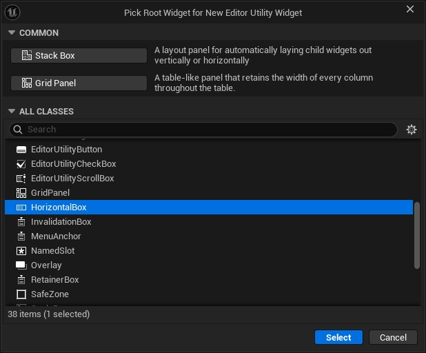
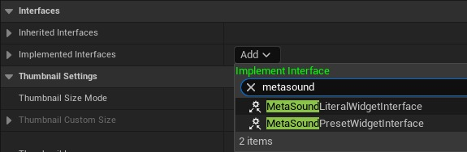
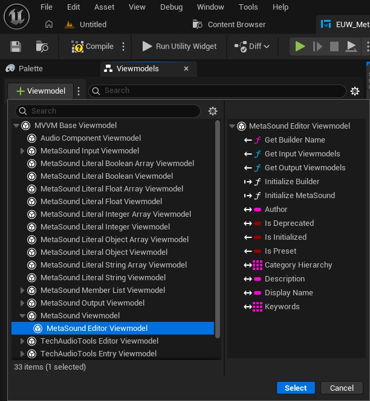
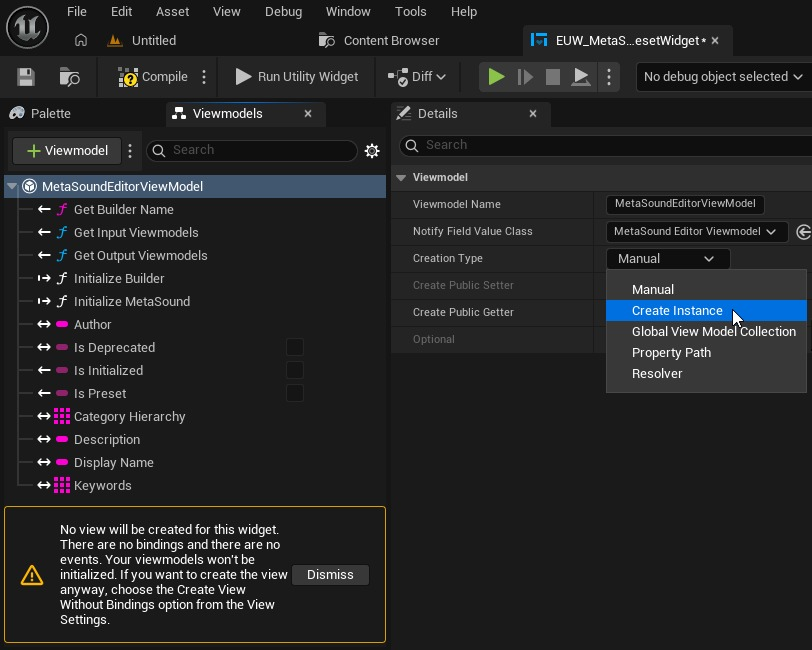
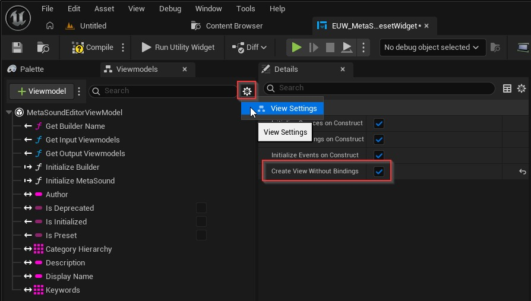
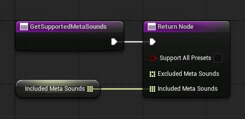
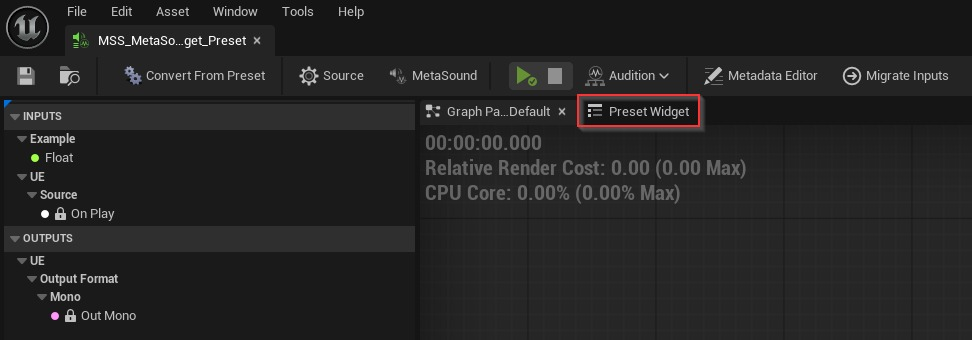
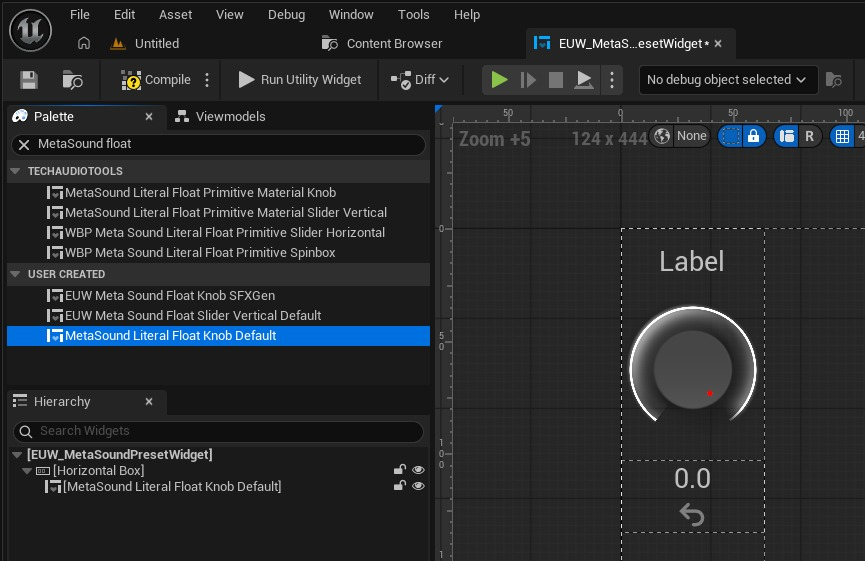

# [TechAudioTools 内容 5.7] 使用 MetaSound Viewmodel 创建 MetaSound 预设小部件

## 来源与状态

- 原始 URL：https://dev.epicgames.com/community/learning/tutorials/qEjr/unreal-engine-techaudiotools-content-5-7-creating-a-metasound-preset-widget-using-metasound-viewmodels

## 运行时分类

- 类型：图文教程
- 判断：API 未识别到核心视频信号，可整理正文约 8349 字符。

## 摘要

MetaSound 预设小部件界面允许您创建可托管在 MetaSound 编辑器内部的自定义用户界面。该界面提供了对预设的 Builder 对象的引用，通过它您可以充分利用 MetaSound Builder API 的功能。 MetaSound Viewmodels（在 UE 5.6 中作为 TechAudioTools 引擎插件发布）使用 UMG Viewmodel 框架来公开给定 MetaSound 的元数据、输入和输出属性，以便可以轻松地将它们绑定到 UMG 小部件并由 UMG 小部件控制。 TechAudioTools 内容插件（针对 FAB 上的 UE 5.7 发布）结合了这两个功能来创建可重用且可自定义的小部件，旨在编辑 MetaSound 预设输入和构建其他类型的 MetaSound 实用小部件。本教程介绍了使用 TechAudioTools 内容插件中的内容设置 MetaSound 预设小部件的基础知识。

## 中文整理

### 概览

这是为 UE 5.6 创建的[上一教程](https://dev.epicgames.com/community/learning/tutorials/d664/unreal-engine-creating-a-metasound-preset-widget-using-metasound-viewmodels)的更新版本。我们将使用 [Fab 上提供的 UE 5.7 TechAudioTools 内容插件](https://www.fab.com/listings/d44cbd49-7691-4f82-abdb-6428c78508f6) 中包含的 MetaSound Literal Widget，而不是创建我们自己的输入编辑器小部件。 [TechAudioTools 内容 5.7 文档](https://dev.epicgames.com/community/learning/tutorials/DE7d/unreal-engine-techaudiotools-content-5-7-documentation)

### 所需插件

确保您的项目中启用了以下插件： 1. TechAudioTools 2. TechAudioTools 内容（适用于 FAB 上的 UE 5.7） 3. [UMG Viewmodel](https://dev.epicgames.com/documentation/en-us/unreal-engine/umg-viewmodel-for-unreal-engine)

### 创建一个新的编辑器实用程序小部件

右键单击内容浏览器并创建一个新的编辑器实用程序小部件资源。为了简单起见，我建议选择 Horizo​​ntalBox 作为根小部件。

### 配置小部件的类设置

通过单击窗口右上角的“图形”按钮将编辑器窗口切换到图形编辑模式，然后单击“类设置”以在“详细信息”面板中查看它们。进行以下更改： - 首先，启用“可以在没有玩家上下文的情况下调用初始化”布尔值。 *必须*启用此设置，以便为编辑器实用程序小部件初始化视图模型。在解决问题时仔细检查此设置总是好的！ - 然后，将 MetaSound 预设小部件接口添加到已实现的接口中

- 此界面将为我们的编辑器实用程序小部件提供预设使用的 MetaSound Builder。我们将向 MetaSound Viewmodel 提供此构建器，以将我们的小部件双向绑定到输入值。

### 打开 Viewmodels 和 View Bindings 面板

单击窗口右上角的“设计器”按钮切换回小部件编辑模式。如果您的编辑器布局尚未显示 Viewmodels 和 View Bindings 面板，您可以从编辑器的 Window 菜单启用它们。

### 添加 MetaSound 编辑器视图模型

单击“视图模型”面板中的“添加视图模型”按钮。在这里您将看到项目中所有视图模型的列表。找到 MetaSound Editor Viewmodel 并单击 Select 按钮将视图模型添加到小部件。

### 将创建类型更改为创建实例

在“视图模型”面板中选择新添加的视图模型后，将“创建类型”更改为“创建实例”。有关这些选项的信息，请查看 [UMG Viewmodel 文档](https://dev.epicgames.com/documentation/en-us/unreal-engine/umg-viewmodel-for-unreal-engine#initialize-your-viewmodel)。

### 设置创建视图而不绑定

作为一项优化，UMG Viewmodel 不会为包含视图模型的小部件创建视图，除非至少设置了一个绑定。由于我们不会在本教程中创建任何视图模型绑定，因此我们需要覆盖此优化。如果您创建绑定，则无需执行此步骤。在 Viewmodels 面板的右上角，有一个小齿轮图标。在此菜单中，单击“查看设置”条目，该条目将在“详细信息”面板中显示切换列表。选中“创建不带绑定的视图”框。

如果您不创建绑定或执行此步骤，您的预设小部件将无法工作！

### 实现 MetaSound 预设小部件接口功能

**初始化 MetaSound Viewmodel** - 切换到 Graph 视图，双击 On MetaSoundPreset Widget Constructed 界面函数，将事件添加到事件图中。缓存此事件中的 Builder 引用。 - 然后，在构建时，我们可以使用缓存的构建器通过 Initialize Builder 函数来初始化我们的 MetaSound Editor Viewmodel。系统会自动为您创建 MetaSoundEditorViewModel 参考变量。

- 当调用 Initialize Builder 时，视图模型从提供的 MetaSound Builder 检索数据并绑定到各种委托，从而允许小部件立即反映 MetaSound 编辑器中所做的更改。 ** 指定 **** 小部件应与其一起使用的 MetaSound 图形 ** - 双击“获取支持的 MetaSounds”接口函数。 - 将 Included MetaSounds 数组引脚从函数的返回节点拖放到图表上，然后选择“升级为变量”。 - 使用您希望与小部件一起使用的 MetaSound 资源填充数组。

### 查看您的 MetaSound 预设

现在，您应该能够打开属于您在 Included MetaSounds 数组中指定的图形之一的 MetaSound Preset，并看到标有 Preset Widget 的选项卡。如果没有，请花点时间回顾一下前面的步骤，然后再继续。

目前您在选项卡中看不到任何内容，因为我们还没有完成小部件的设计，但一旦我们完成，它将显示在此处。现在关闭预设，我们稍后再回来。

### TechAudioTools 5.7 中的新增功能

在 UE 5.7 中，TechAudioTools 插件接收了各种新的 MetaSound Literal Viewmodel。这些视图模型可用于扩展 MetaSound 输入视图模型，提供附加功能和便利性，例如定义浮点和整数小部件的数值范围，以及应用修饰转换（例如线性增益到分贝）。 TechAudioTools Content FAB 插件包含各种利用新 MetaSound Literal Viewmodels 的小部件。查看创建 MetaSound Literal Widgets 教程，了解如何创建您自己的。本教程的其余部分将向您展示如何使用 TechAudioTools 内容插件中包含的现有小部件。

### 使用 MetaSound 文字小部件

让我们开始设计我们的小部件。返回到编辑器实用程序小部件的设计器，并筛选 MetaSound 浮动的调色板面板。找到 MetaSound Literal Float Knob Default 小部件并将其添加到您的布局中。

您还可以使用位于 Palette 面板的 TechAudioTools 类别中的 Primitive 小部件。这些是较小的小部件，具有较少的元素，旨在用于组成更大的复合小部件。原语已经连接了 MetaSound Viewmodel 绑定，但需要提供一个 viewmodel 实例。执行此操作的步骤与下面教程的其余部分相同。

### 配置浮动旋钮小部件

小部件的详细信息面板包含多个属性，您可以更改这些属性来自定义每个实例的行为和外观。您可以随意设置这些。还要确保选中详细信息面板最顶部的 Is Variable 框，以便我们可以在蓝图图表上获取对此小部件的引用。

### 设置浮动小部件视图模型

最后一步是在 MetaSound 浮动旋钮默认小部件上设置 MetaSound 输入编辑器视图模型实例。这可以通过多种方式完成，但一种推荐的可很好扩展的方法是使用静态 Set Literal Widget Viewmodels 节点并传入小部件引用以及对 MetaSound Editor Viewmodel 的引用。随着预设小部件中文字小部件数量的增加，您可以通过创建文字小部件引用数组并使用 For Each 循环迭代所有它们并调用设置文字小部件输入视图模型，轻松地在所有这些小部件上调用此函数。

### 享受使用新预设编辑器小部件的乐趣！

打开您的 MetaSound 预设并转到预设小部件选项卡。您的小部件现在应该能够控制默认输入参数值，并在通过输入的详细信息面板修改默认值时接收更新。
