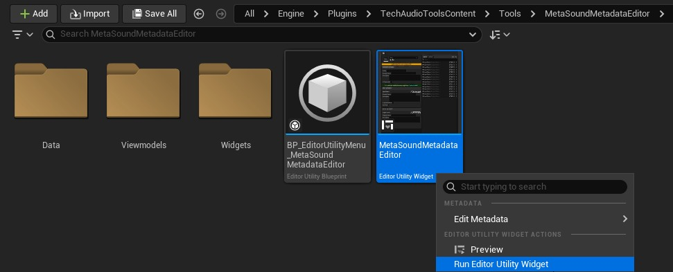
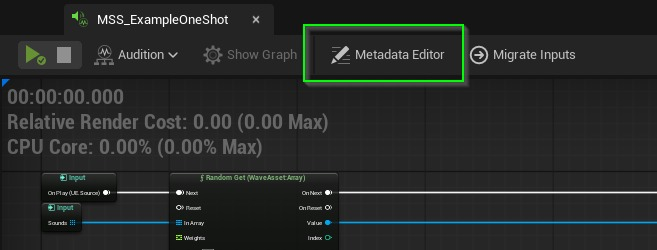
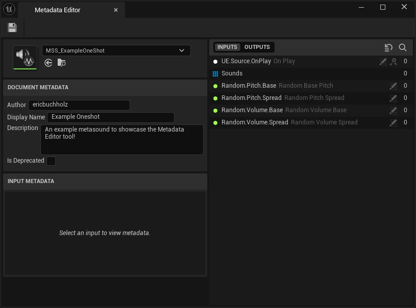
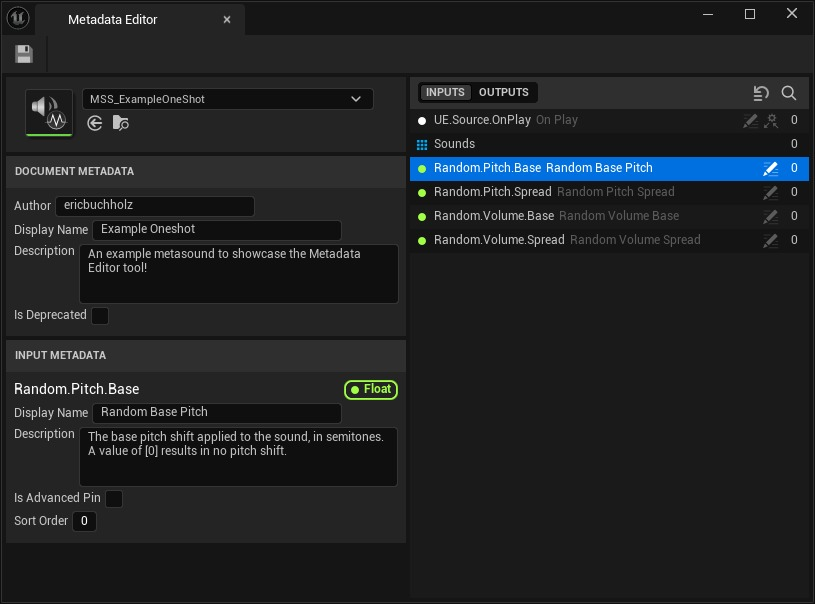
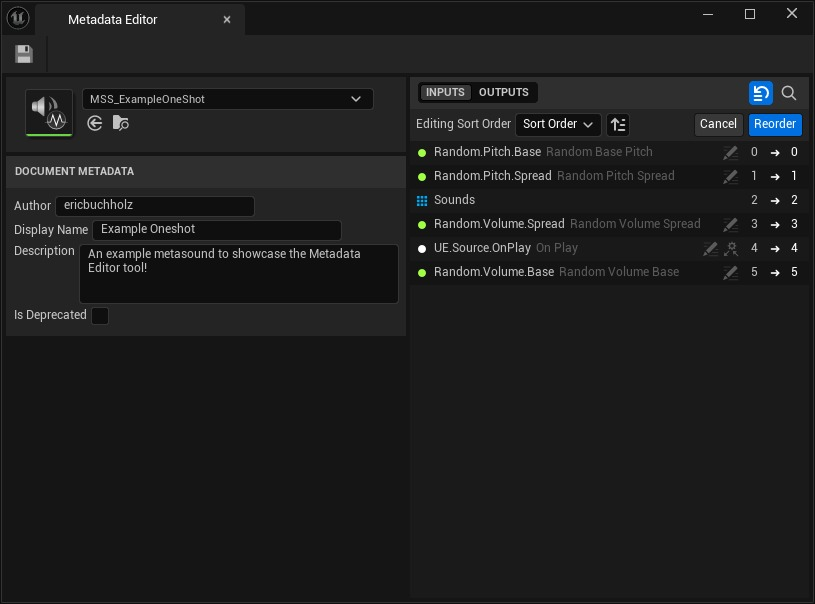
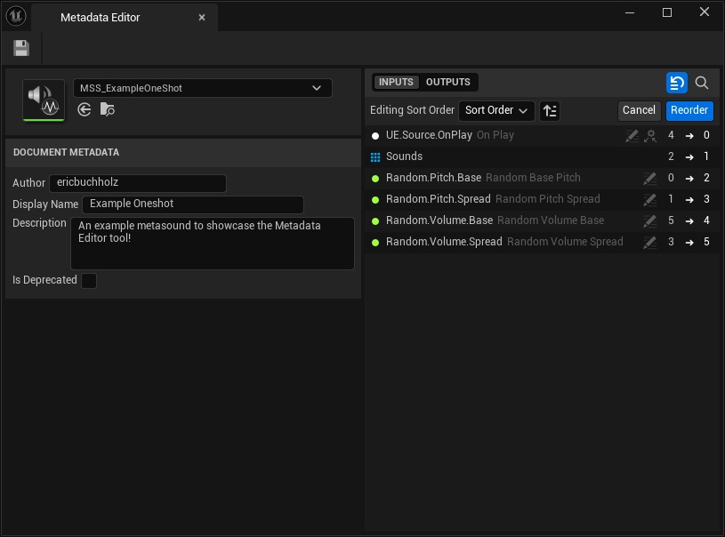

# [TechAudioTools 内容 5.7] 使用 MetaSound 元数据编辑器

## 来源与状态

- 原始 URL：https://dev.epicgames.com/community/learning/tutorials/l5E4/unreal-engine-techaudiotools-content-5-7-using-the-metasound-metadata-editor

## 运行时分类

- 类型：图文教程
- 判断：API 未识别到核心视频信号，可整理正文约 4008 字符。

## 摘要

MetaSound 元数据是构建文档的好方法。 MetaSound 元数据编辑器工具是一个编辑器实用程序小部件，为用户提供查看和编辑文档元数据和成员元数据的便捷方式。

## 中文整理

### 概览

[TechAudioTools 内容 5.7 文档](https://dev.epicgames.com/community/learning/tutorials/DE7d/unreal-engine-techaudiotools-content-5-7-documentation)

### 安装

**MetaSound 元数据编辑器** 是一个包含在 **TechAudioTools Content** 插件中的编辑器实用程序小部件。 [该插件可在 Fab for Unreal Engine 5.7 上免费使用](https://www.fab.com/listings/d44cbd49-7691-4f82-abdb-6428c78508f6)。

### 用法

以下是有关如何开始使用元数据编辑器的指南。

### 打开元数据编辑器

有多种方法可以打开 MetaSound 元数据编辑器： - 从内容浏览器运行 MetaSoundMetadataEditor 编辑器实用程序小部件。

- 单击位于 MetaSound 编辑器工具栏上的“元数据编辑器”按钮。

### 选择 MetaSound 资产

使用资产选择器，选择您想要修改其元数据的 MetaSound 资产。元数据编辑器支持编辑 **MetaSound Source** 和 **MetaSound Patch** 资产的文档元数据和成员（输入/输出）元数据。 MetaSound Source Presets 和 MetaSound Patch Presets 仅支持编辑文档元数据，不支持编辑成员元数据。选择后，该工具会加载所选资产中找到的所有输入和输出的文档元数据和成员元数据。

### 编辑文档元数据

选择 MetaSound 资产后，可以通过元数据编辑器左栏中显示的字段来编辑文档元数据。在工具中所做的更改会立即反映在资产中，但需要在完成编辑后保存。

### 编辑会员元数据

选择 MetaSound 资产后，可以通过从工具右列的成员列表中选择成员并编辑左列中显示的字段来编辑成员元数据。

### 编辑排序顺序

除了在“成员元数据”部分中编辑排序顺序之外，元数据编辑器还支持使用右侧列中的列表视图对成员进行拖放重新排序。要启用排序顺序编辑，请单击列表列标题上搜索图标旁边的编辑排序顺序切换按钮。

启用此模式后，您现在可以拖放列表中的成员以反映您所需的排序顺序。下拉菜单中还有一些选项可以自动按字母顺序、数据类型或添加顺序（即成员添加到 MetaSound 资产的顺序）对列表进行排序。每个列表项的右侧都有数字，指示每个成员之前的排序顺序值，并有一个箭头指向将应用的新排序顺序值。

完成对成员的排序后，单击“重新排序”按钮以​​提交更改。您现在应该会看到您的更改反映在成员元数据中。

### 元数据

元数据编辑器只能修改仅限编辑器的元数据。以下是不同领域的快速概述。

### 文档元数据

整个 MetaSound 资产的元数据。

### 作者

提供 MetaSound 资产创建者的归属。

### 显示名称

MetaSound 资产的面向用户的标签，旨在提高可读性。

### 描述

一个可选字段，用于记录 MetaSound 的用途、行为或其他使用说明。

### 已弃用

指示 MetaSound 资产已过时或被更新版本替换且不应再使用的标志。启用此功能不会删除或修改现有引用，但会警告不要创建新引用。

### 会员元数据

各个输入和输出的元数据。

### 显示名称

面向用户的标签，覆盖 MetaSound 节点引脚上显示的名称。

### 描述

将鼠标悬停在图形编辑器中的图钉上时显示的工具提示。

### 是高级引脚

将成员标记为“高级”，默认情况下将其隐藏在图节点上。

### 排序顺序

当在其他图表中使用时，控制 MetaSound 节点上引脚的顺序。较低的值显得较高，较高的值显得较低。
