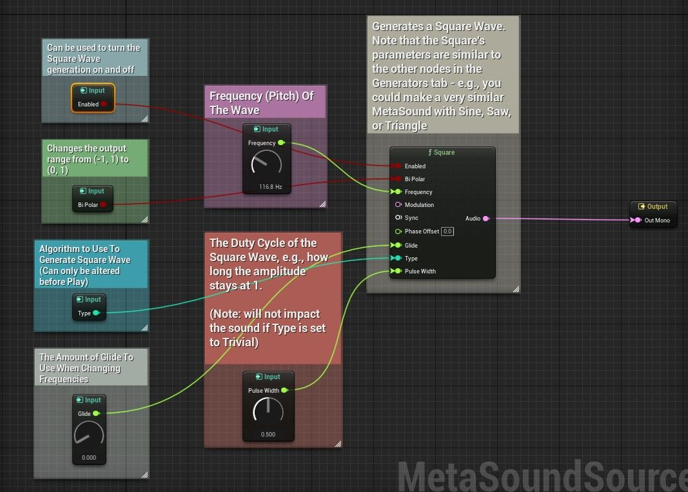
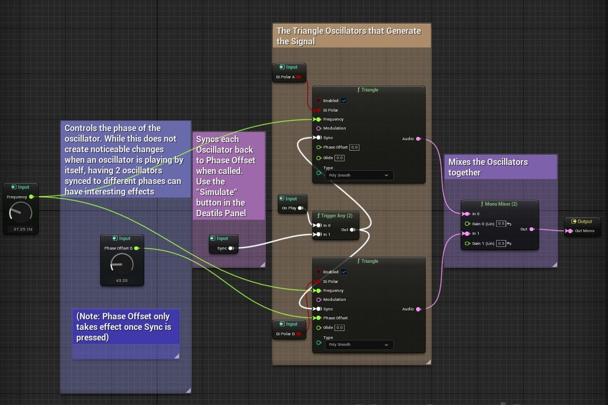
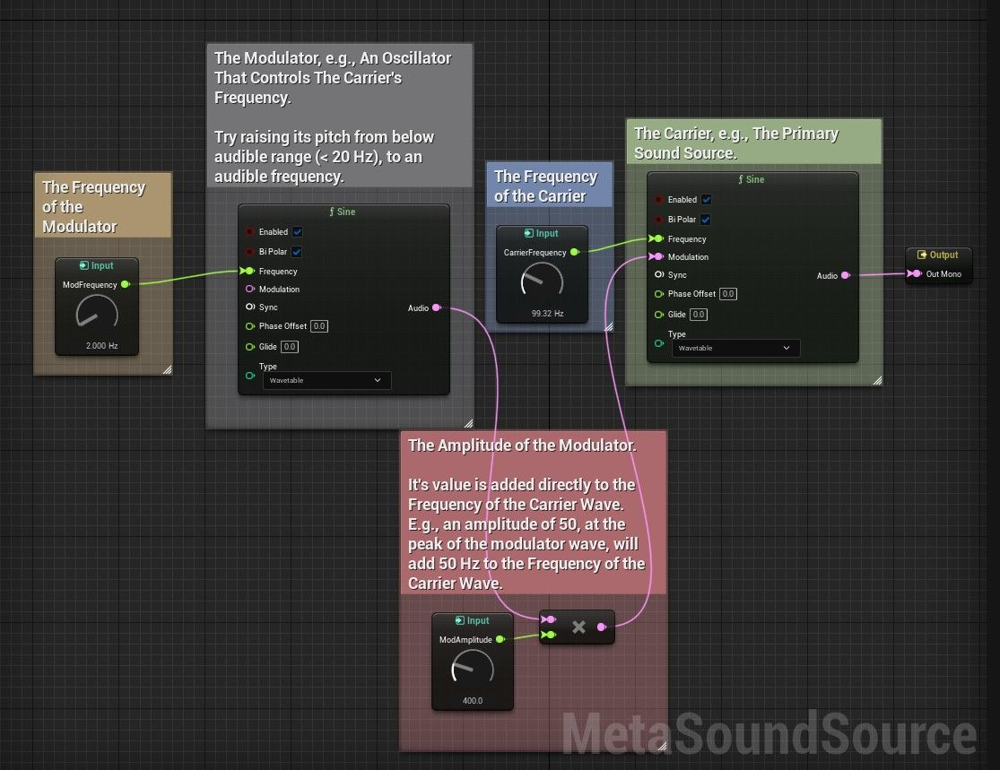

# Secondary split of unreal-engine-using-generator-nodes-in-metasounds.part02.origin.md (1/2)

Source generated part: `unreal-engine-using-generator-nodes-in-metasounds.part02.origin.md`.

# 在 MetaSounds 中使用生成器节点 (Part 2/3)

Source file: `unreal-engine-using-generator-nodes-in-metasounds.origin.md`.

This document was split during ue-kb import to keep source chunks buildable.

### 概览

在 MetaSounds 中，有一些节点通过简单波形生成音频信号，例如正弦波、方波、锯齿波和三角波。本教程提供了一些使用这些生成器节点的 MetaSounds 示例，以便让人们了解参数变化如何影响声音，并熟悉 MetaSounds 的语法。您可以复制 MetaSound 片段以直接在您的 Unreal 项目*中播放它们。这个特定的教程更关注如何在 MetaSounds 中使用生成器，而不是合成背后的一些核心音频概念。虽然深入研究声音合成的数学和机制超出了本教程的范围，但这些主题非常值得探索，并且可以为您可能想要创建的 MetaSounds 提供新的想法。如果您想了解有关波形、相位或频率调制数学的更多信息，请查看“有用链接”选项卡。 *（注意：此时，MetaSound 输入节点无法复制粘贴。因此，如果您想直接使用本教程中提到的 MetaSound 源，您需要自己构建输入节点，包括任何旋钮和滑块。如果您仍然习惯 MetaSound 输入小部件，可能值得查看[使用 MetaSound 旋钮和Sliders](https://dev.epicgames.com/community/learning/tutorials/587X/unreal-engine-using-metasound-sliders-and-knobs)教程，然后再进行本教程。） **基本参数用法** 这里的第一个 MetaSound 使用生成器节点上相对不太复杂的参数，例如频率、滑翔度和类型，通过在 Square 生成器节点上演示它们来实现。输入节点目前不会复制和粘贴，但您可以通过拖出 Square 节点上的同等名称的引脚并选择“升级到图形输入”来重新创建它们。对于“频率”旋钮，您可能还需要将“值类型”设置为“频率（对数）”。添加输入节点后，可以单击并拖动旋钮，单击布尔值和枚举输入将在详细信息面板中打开其页面，可以在其中更改其默认值。除非另有说明，所有这些输入值都可以在 MetaSound 播放时更改，让您实时听到它们的影响。您可能想使用此 MetaSound 尝试一些操作： - 尝试在 Glide 的低值和高值下改变频率 - 生成器节点都具有非常相似的参数集：尝试用 Sine 或 Saw 节点替换 Square 并重新连接引脚。您应该能够更改所有相同的参数，但脉冲宽度（特定于 Square 的参数）和类型除外，需要将其更改为“Enum::[Waveform]GenerationType”输入。您可能已经注意到，此 MetaSound 未连接调制、相位偏移和同步参数。这些参数都需要额外的解释，因此每个参数都会在后面的 MetaSounds 中进行介绍。



**生成器节点基本参数**

```
Begin Object Class=/Script/MetasoundEditor.MetasoundEditorGraphOutputNode Name="MetasoundEditorGraphOutputNode_1"
   Output=MetasoundEditorGraphOutput'"MetasoundEditorGraphOutput_1"'
   NodePosX=1040
   NodePosY=384
   ErrorType=4
   NodeGuid=AC2E47C94607538028F26181ADE73F31
   CustomProperties Pin (PinId=15EAC64546FF2D2E508426B3C02D31D6,PinName="UE.OutputFormat.Mono.Audio:0",PinType.PinCategory="audio",PinType.PinSubCategory="",PinType.PinSubCategoryObject=None,PinType.PinSubCategoryMemberReference=(),PinType.PinValueType=(),PinType.ContainerType=None,PinType.bIsReference=False,PinType.bIsConst=False,PinType.bIsWeakPointer=False,PinType.bIsUObjectWrapper=False,PinType.bSerializeAsSinglePrecisionFloat=False,LinkedTo=(MetasoundEditorGraphExternalNode_0 A73345E2477AC3D243853BB9093901BF,),PersistentGuid=00000000000000000000000000000000,bHidden=False,bNotConnectable=False,bDefaultValueIsReadOnly=False,bDefaultValueIsIgnored=False,bAdvancedView=False,bOrphanedPin=False,)
End Object
Begin Object Class=/Script/MetasoundEditor.MetasoundEditorGraphExternalNode Name="MetasoundEditorGraphExternalNode_0"
   ClassName=(Namespace="UE",Name="Square",Variant="Audio")
```

**相位偏移和同步** 此 MetaSound 演示了如何使用生成器节点上的相位偏移和同步参数。在本文中，相位偏移是指按下同步按钮时波形中开始的位置。例如，在三角波的情况下，相位偏移将是三角波在其峰值处或在零交叉点之一处开始之间的差异。在 MetaSounds 中，相位偏移以度为单位设置，并接受 0 到 360 之间的值 - 因此，值得验证您的相位输入参数的范围是 0 到 360。如果只是单独播放一个波形，以这种方式使用相位偏移不会产生任何听觉差异。然而，波形相对于其他波形的相位偏移可能会导致有趣的听觉变化。举个例子，这个 MetaSound 包含两个加在一起的三角形，其中一个具有可控的相位偏移。当两者在同一相位播放时，产生的声音与响亮的三角波无法区分。当其中一个三角波的相位设置为 180 度时，一个三角波的峰值将与另一个三角波的谷值重合，反之亦然，当两个三角波相加在一起时会导致静音。对于其他相位值，所得波的总和具有稍微不同的音色。值得您自己尝试几个不同的值，但请注意，与您之前见过的许多其他参数不同，只有在触发同步后才会考虑相位偏移。对于此 MetaSound，同步已转换为输入，因此您可以单击它并按其详细信息面板中的“模拟”按钮。



**发电机节点相位和同步**

```
Begin Object Class=/Script/MetasoundEditor.MetasoundEditorGraphInputNode Name="MetasoundEditorGraphInputNode_0"
   Input=MetasoundEditorGraphInput'"MetasoundEditorGraphInput_0"'
   NodePosX=336
   NodePosY=-48
   ErrorType=4
   NodeGuid=36F7826E4CF83766F313D9985CA65A63
   CustomProperties Pin (PinId=D174882345E6556251BDA6A252404765,PinName="UE.Source.OnPlay",Direction="EGPD_Output",PinType.PinCategory="trigger",PinType.PinSubCategory="",PinType.PinSubCategoryObject=None,PinType.PinSubCategoryMemberReference=(),PinType.PinValueType=(),PinType.ContainerType=None,PinType.bIsReference=False,PinType.bIsConst=False,PinType.bIsWeakPointer=False,PinType.bIsUObjectWrapper=False,PinType.bSerializeAsSinglePrecisionFloat=False,LinkedTo=(MetasoundEditorGraphExternalNode_4 6D7D0FCA4AE6482AD1D539AE70BCF3E2,),PersistentGuid=00000000000000000000000000000000,bHidden=False,bNotConnectable=False,bDefaultValueIsReadOnly=False,bDefaultValueIsIgnored=False,bAdvancedView=False,bOrphanedPin=False,)
End Object
Begin Object Class=/Script/MetasoundEditor.MetasoundEditorGraphExternalNode Name="MetasoundEditorGraphExternalNode_1"
   ClassName=(Namespace="UE",Name="Triangle",Variant="Audio")
```

**频率调制 - 基本设置** 下一个 MetaSound 演示如何使用调制输入引脚。如果您以前使用过 MetaSounds，您可能已经注意到生成器节点上的频率参数是绿色的，表示它采用 Float 参数。在 MetaSounds 中，Float 参数受到块速率更新速度的限制 - 换句话说，它们不能以可听速率进行更改。这就是调制参数的用武之地。调制也会影响节点的频率，但它需要音频缓冲区而不是浮点作为输入。这允许您快速任意更改发电机节点的频率。当您开始以可听频率（任何快于 20 Hz 左右的频率）改变声音频率时，声音就会发生巨大变化。因此，这个 MetaSound 实际上有两个生成器节点。一个正弦波（称为载波）用于生成您听到的主要信号，另一个正弦波用于控制载波频率。两个正弦波的频率都可以在 MetaSound 中实时更改。还可以修改频率调制的*深度*，即载波频率是±2 Hz还是±2000 Hz。在这个 MetaSound 上设置输入节点比前一个更复杂一些。 ModFrequency 和 CarrierFrequency 都受益于将其值类型设置为“频率（对数）”。对于调制幅度，您需要比默认值更大的最大值 - 我个人选择 2000。我强烈建议将调制器频率参数慢慢提高到可听频率以听到影响 - 很难将频率调制背后的数学转化为理解它的“声音”是什么样的。也就是说，公平警告，这个 MetaSound 优先考虑一个简单的设置来演示 FM 合成，因为它听起来并不好。随机选择频率调制值听起来很少好，因此它被称为最难学习的合成形式之一。相反，下面的 MetaSound 提供了一个用于选择更接近您在实践中看到的值的界面。



**发电机节点调频底座**
