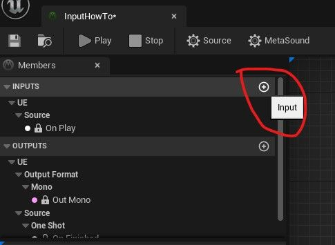
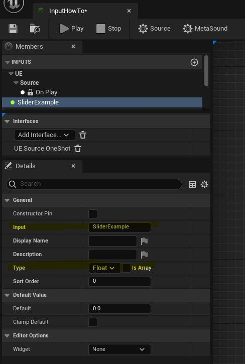
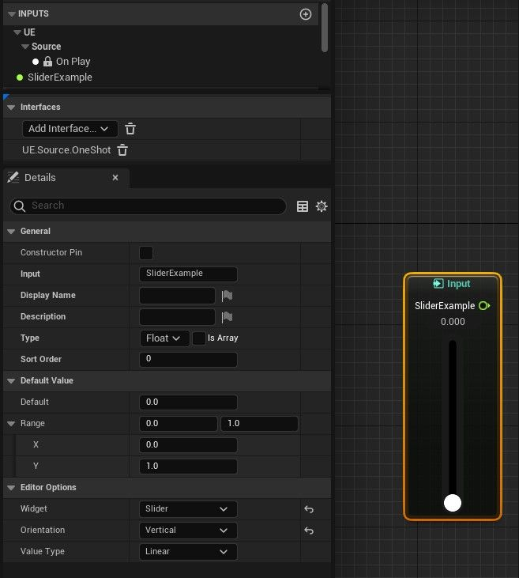
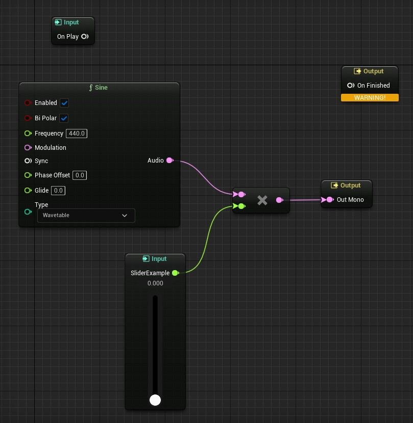
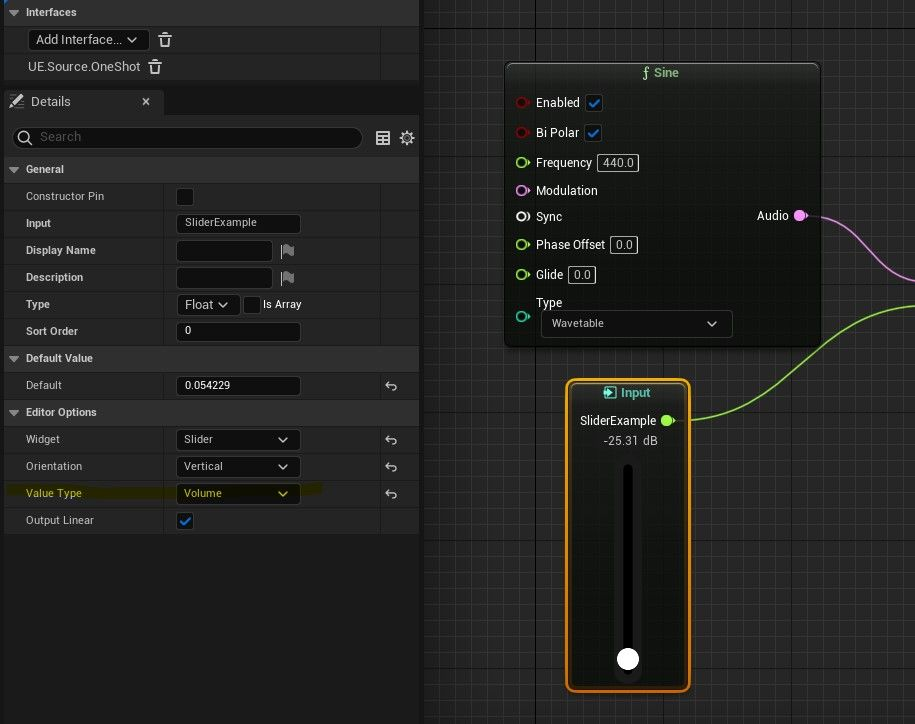
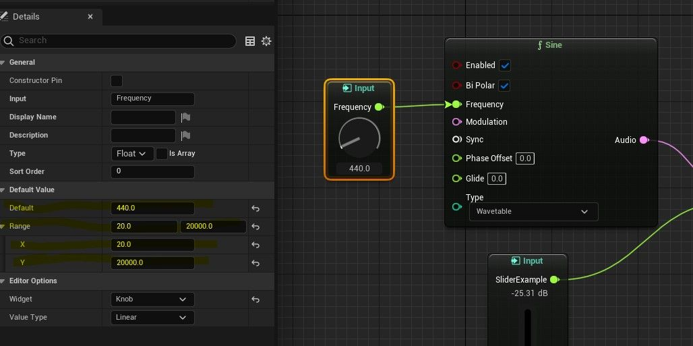
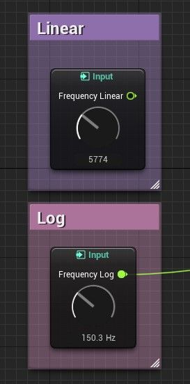

# 使用 MetaSound 滑块和旋钮

## 来源与状态

- 原始 URL：https://dev.epicgames.com/community/learning/tutorials/587X/unreal-engine-using-metasound-sliders-and-knobs

## 运行时分类

- 类型：图文教程
- 判断：API 未识别到核心视频信号，可整理正文约 9580 字符。

## 摘要

这是一个关于如何使用您可能在一些 MetaSound 演示和屏幕截图中看到的精美滑块和旋钮的教程。

## 中文整理

### 概览

旋钮和滑块可以为您的 MetaSounds 添加很多内容。它们可以帮助您在 MetaSound Source 播放时快速更改输入值，从而帮助高效地预览设置。他们可以通过以物理上有意义的方式放置参数并将其与颜色编码的注释配对，将视觉组织添加到您的参数控件中。也许它们只会让您的 MetaSound Source 环境感觉更像是模块化合成器或 DAW。无论具体原因如何，它们都是有用的！本教程介绍如何创建它们、自定义它们以及在 MetaSound 中使用它们。本教程面向 MetaSounds 新手，因此如果您仍在学习如何导航 MetaSound 编辑器，不用担心！我们将提供有关如何执行创建输入节点和使用详细信息面板等任务的说明和屏幕截图。如果您已经了解如何导航 MetaSound 编辑器并且只想让旋钮和滑块尽快工作，请随意跳到最后的回顾部分，其中包含 TL;DR 版本。

### 添加您的第一个滑块

旋钮和滑块小部件可用于 MetaSound 图表中的输入。然而，现在他们确实要求相关输入是浮点值或时间值。制作滑块的第一步是添加一个输入以供滑块控制。在 MetaSound Source 屏幕左侧，单击 **输入** 列旁边的 + 图标。这将为您的 MetaSound 添​​加新的输入。

之后，您应该在 **Inputs ** 列中看到一个新条目，默认情况下可能名为“Input”。单击该按钮可打开左下角的详细信息面板。当我们在“详细信息”面板中时，我们不妨为输入指定一个更有用的名称，因此让我们将“输入”字段编辑为“SliderExample”之类的名称。如上所述，滑块仅适用于浮动和时间，因此让我们将详细信息面板中的类型值更改为“浮动”。将类型更改为浮动后，您应该会看到详细信息面板中出现一个名为“编辑器选项”的新列 - 这将让我们创建滑块。如果您成功完成了所有操作，您的屏幕现在应该如下所示：

现在我们可以真正制作我们的滑块了！在编辑器选项->小部件下，单击下拉菜单中的“滑块”。然后，将 SliderExample 从 **Input ** 列拖到 MetaSound 图表上即可查看。您可以使用“方向”字段在垂直或水平滑块之间进行选择。制作旋钮的过程几乎相同 - 只需从下拉菜单中选择“旋钮”而不是“滑块”。

### 旋钮和滑块的实践

好的，现在您的图表上有了一个滑块 - 如何在 MetaSound 中使用它？归根结底，我们的滑块仍然是 MetaSound 上的输入，因此我们可以使用它的值来更改 MetaSound 图表。让我们以我们能听到的方式使用它。为此，我们需要制作一个稍微复杂一点的 MetaSound 图。首先要做的是添加我们可以听到的声音 - 正弦波是一个不错的选择。右键单击图形，然后转到“函数”->“生成器”->“正弦”。使用滑块的最简单方法可能是用它来控制正弦波的音量，我们可以使用乘法节点来做到这一点。从 Sine 节点中拖出“Audio”输出引脚，然后在出现的上下文菜单中，转到 Functions->Math->Multiply(Audio by Float)。然后，将 SliderExample 的输出引脚连接到新 Multiply 节点上的浮点输入引脚。最后，将 Multiply 节点的输出连接到 Out Mono 节点。生成的图表应如下所示：

此时，我们的 On Play 和 On Finished 节点预计会断开连接，因此不必担心它们。现在，我们的滑块会将正弦节点的信号乘以零，这将导致静音。因此，让我们将其设置为更高的值，例如 1.0。完成此操作后，当我们按下屏幕左上角附近的“播放”按钮时，我们应该听到正弦波！现在我们有机会测试我们的滑块 - 当正弦波仍在播放时，将滑块慢慢移回零。您应该听到正弦波变得更安静，直到最终变得安静。如果您缓慢向上拖动滑块，您也应该听到正弦波的音量增加。这就是滑块功能强大的一个重要原因 - 您可以尝试一系列设置并立即听到它们的影响，而无需停止或关闭 MetaSound。听此声音时，您可能会担心正弦波的音量变化并不像您预期​​的那样平滑。也就是说，在较低的值下，它似乎会更快地变得安静，而在 0.5 和 1.0 之间似乎几乎没有任何变化。这不是滑块的问题 - 这是人类感知体积的副作用！人类以对数尺度感知音量变化，通常以分贝为单位测量。为什么我们关心人类感知体积？ MetaSounds 中滑块和旋钮的其他功能之一是能够控制小部件使用的单位。如果您查看“值类型”条目，您会注意到随附下拉列表中的选项之一是“交易量” - 单击该选项。您的滑块现在应该在 -100 dB 到 0 dB 的范围内移动，而不是 0 到 1。播放您的 MetaSound，并在滑块上的最低值和最高值之间缓慢移动滑块。音量控制现在听起来应该更加平滑。

您可能已经注意到的另一个主要值类型条目是频率（对数）。正如您所期望的，这用于更平滑的频率转换。让我们尝试一下吧！我们将要为此创建一个新的小部件 - 从“正弦”节点上的“频率”引脚中拖出，然后在出现的菜单上选择“升级到图形输入”。您现在应该在 **输入 ** 列中看到一个标记为“频率”的条目。打开这个新条目的详细信息面板。这次我们尝试制作一个旋钮。从 EditorOptions->Widget 下拉菜单中选择“Knob”。因为我们从输入引脚提升了旋钮，所以它应该已经按照我们想要的方式连接到我们的正弦旋钮。但它的默认值改变了！正弦频率现在设置为“1.0”，而不是原来的“440”。这是因为默认情况下，旋钮和滑块的输出范围为 0 到 1。但是对于频率来说，这没有用，所以让我们将“默认值”列下的范围更改为 20 和 20000，即人类平均听力的范围。当我们在这里时，我们可能还想将默认值更改为 440，以便它回到原来的位置。

此时，您可以播放 MetaSound 并使用新旋钮来控制正弦波的频率。如果您在最小值和最大值之间缓慢移动，您会注意到与之前的音量滑块类似的问题 - 过渡听起来不平滑。和以前一样，这是人类听不到线性音阶、音量或音高这一事实的副作用。更具体地说，人类听到的八度跳跃是频率（以 Hz 为单位）的“加倍”或“减半”。换句话说，从 880 Hz 向下一个八度是 440 Hz，比 220 Hz，比 110 Hz 等等，这意味着相同的 Hz 差异将给您在较低频率下的感知音调带来更大的差异。因此，解决方案是将值类型设置为“频率”。再次播放 MetaSound。虽然输出范围仍然是 20 到 20000，但您会注意到相对于旋钮运动的 Hz 变化现在根据频率而变化。换句话说，将旋钮移动给定的量将始终导致相同的“感知”音高变化，通过对低频进行较小的 Hz 增量。从听觉上来说，这会导致节点听起来在音高上移动得更加顺畅。

### 额外的提示和技巧

- 您可以按住 Shift 键并拖动旋钮以进行更精细的比例调整。这使您可以对旋钮的值进行更细微的更改。 - 您不仅限于图表上的输入的一个实例。这意味着您可以在 MetaSound Graph 上拥有相同旋钮或滑块的多个副本，并连接到不同的节点。当旋钮/滑块的一份副本的值发生更改时，其余副本也会随之更改。这可以使复杂的 MetaSound 图表更加清晰。 - 您还可以通过直接在小部件的文本字段中输入旋钮/滑块的值来设置它。 - 旋钮/滑块可用作音频小部件插件中的 UMG 小部件，这意味着您可以自定义它们或在更多地方使用它们（如果您愿意）。

### 回顾

总之，将旋钮或滑块添加到 MetaSound 中的基本步骤是： - 创建输入 - 验证新输入的类型为“浮动”或“时间” - 在编辑器选项 -> 小部件字段中选择“旋钮”或“滑块” - 通过“默认值”和“编辑器选项”选项卡中的设置自定义新小部件的最小值、最大值和比例 - 将输入放在 MetaSound 图表上 - 将输入的输出引脚连接到图表中您希望其控制的任何内容

### 进一步学习

虽然本教程超出了详细介绍人类对响度和音调的感知的范围，但如果您对如何计算音量和频率（对数）类型值背后的数学和物理感到好奇，这里有大量的教育资源！查看“有用链接”选项卡以获取一些外部资源。 - [关于响度和分贝尺度的感知](https://modularwalls.com.au/wp-content/uploads/Human-perception-of-sound_April2016-WEB.pdf) - [关于相对音高的感知](https://dobrian.github.io/cmp/topics/physicals-of-sound/1.Frequency-and-pitch.html)

## 相关链接

- [On Perception Of Loudness and Decibel Scales](https://modularwalls.com.au/wp-content/uploads/Human-perception-of-sound_April2016-WEB.pdf)
- [On Perception of Relative Pitch](https://dobrian.github.io/cmp/topics/physics-of-sound/1.frequency-and-pitch.html)
