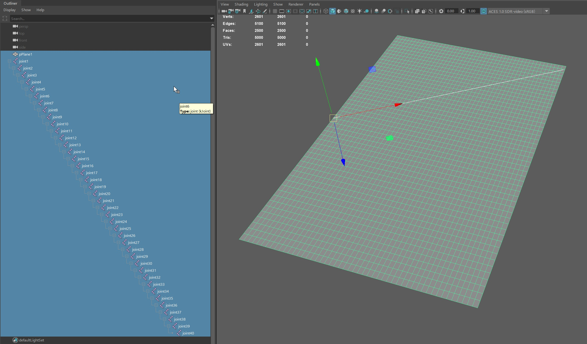
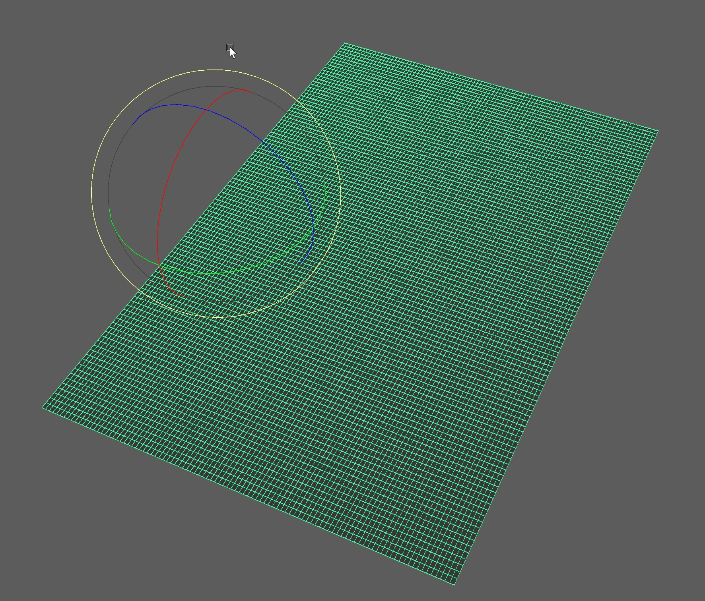
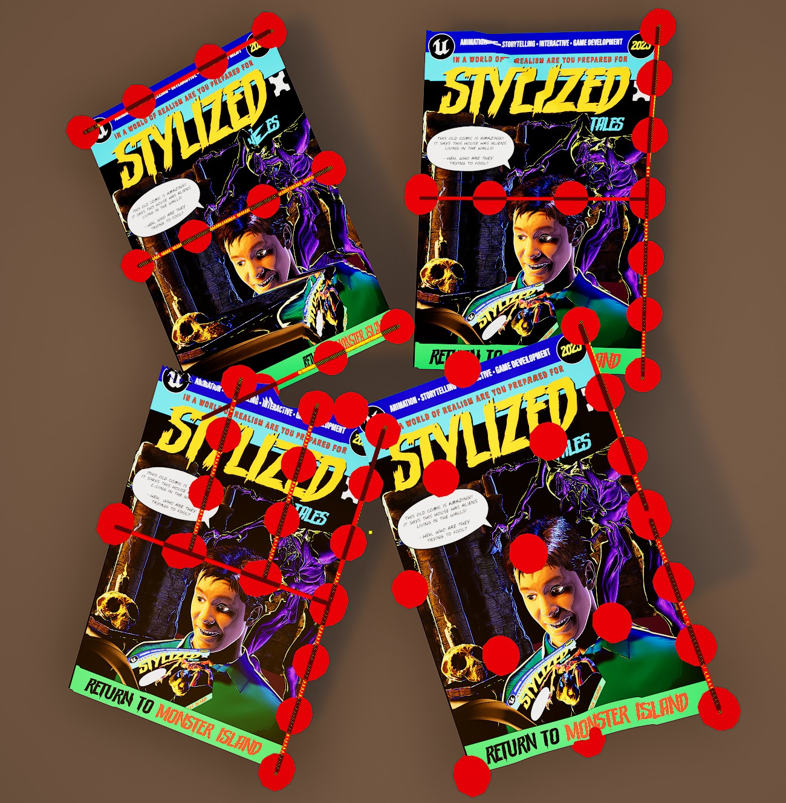
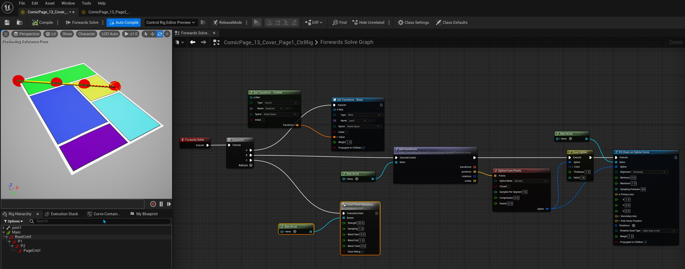
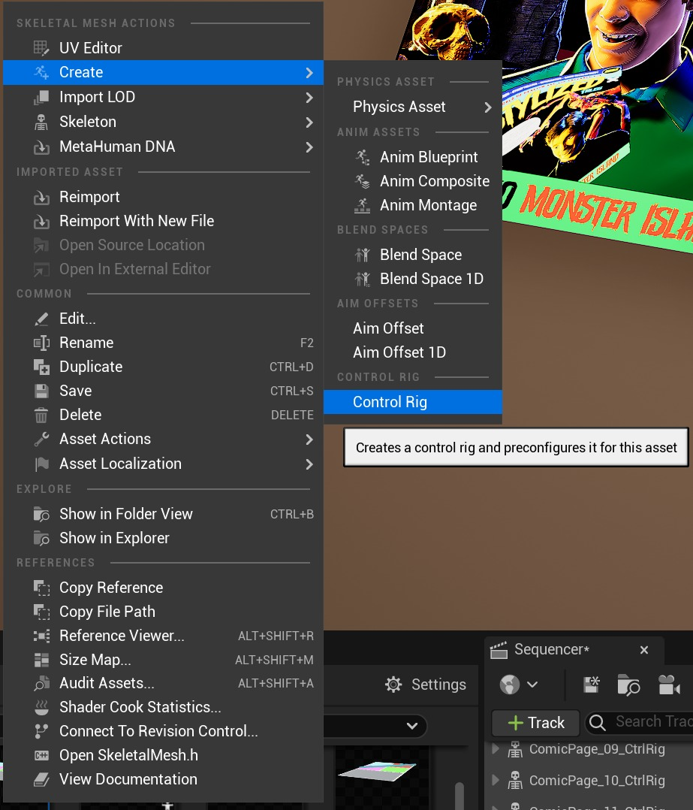
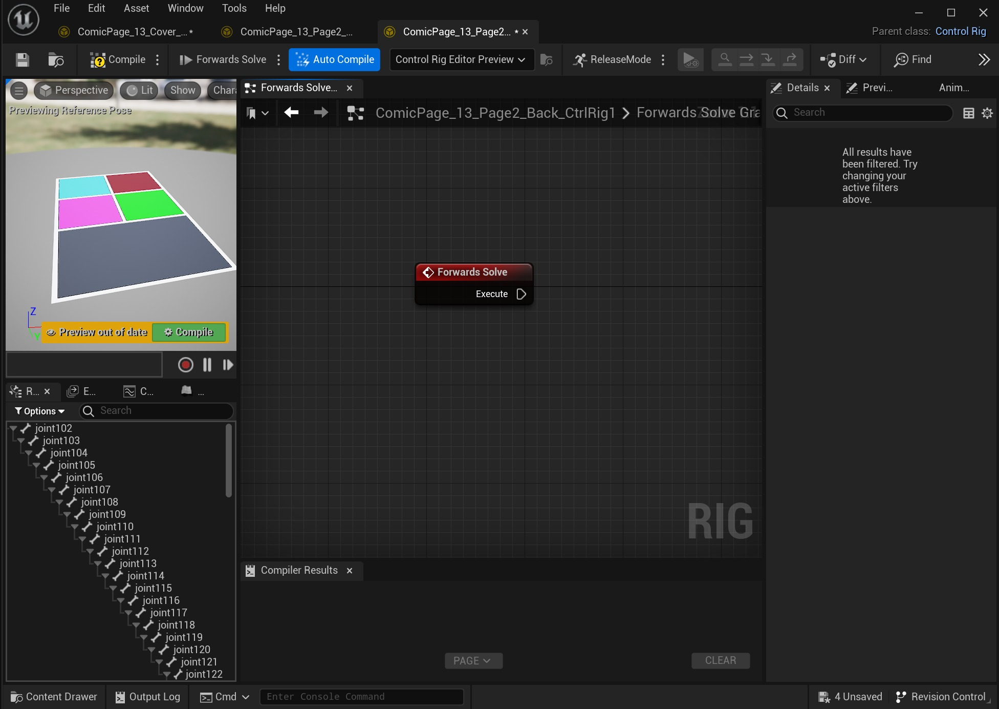
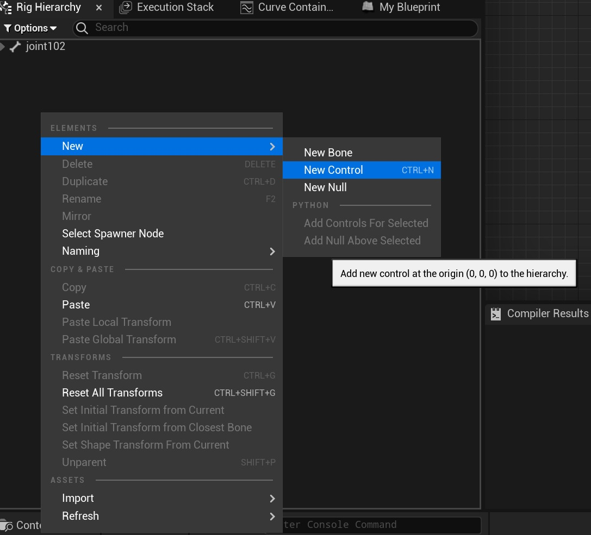
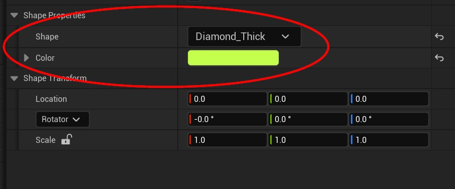
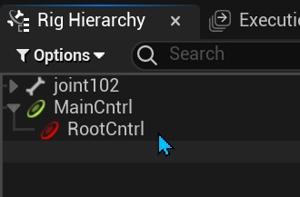
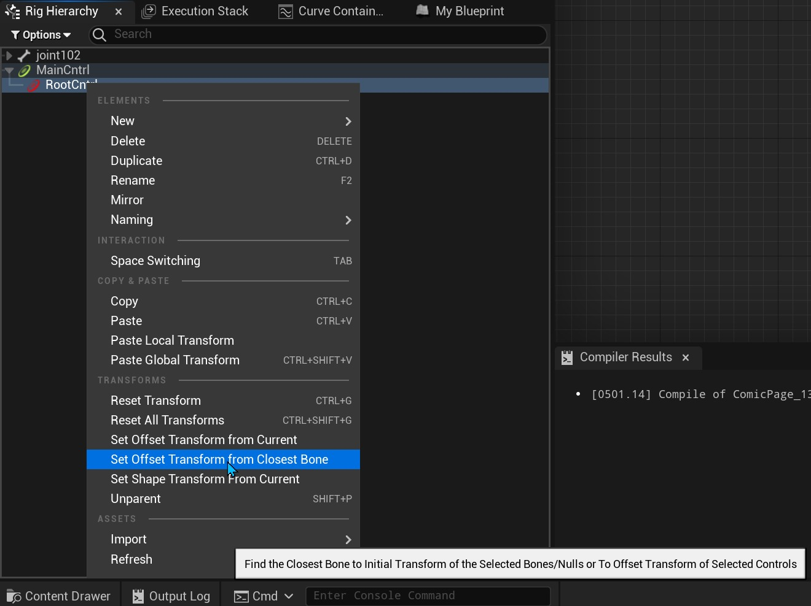

# 在虚幻引擎中控制漫画书的 13 种方法

## 来源与状态

- 原始 URL：https://dev.epicgames.com/community/learning/tutorials/Ovmo/13-ways-to-control-rig-a-comic-book-in-unreal-engine

## 运行时分类

- 类型：图文教程
- 判断：API 未识别到核心视频信号，可整理正文约 6926 字符。

## 摘要

这个快速教程介绍了如何使用 Control Rig 在虚幻引擎中为书籍设置“可翻转”页面。它实际上并没有经历我所经历的过程的全部 13 次迭代，但它确实以自己的方式强调了从多个角度解决问题的必要性，而 Unreal 非常擅长让艺术家做到这一点。

## 中文整理

### 介绍

这个快速教程介绍了如何使用 Control Rig 在虚幻引擎中为书籍设置“可翻转”页面。它实际上并没有经历我所经历的过程的全部 13 次迭代，但它确实以自己的方式强调了从多个角度解决问题的必要性，而 Unreal 非常擅长让艺术家做到这一点。

### 背景

多年来，我一直被要求以 3D 方式制作书籍或报纸的翻页动画，随之而来的是各种各样的解决方案。有些是为了更好，有些则不是那么好。事实证明，页面往往比上面的文字更复杂。我使用过晶格和其他非线性变形工具、混合形状或变形目标，以及具有样条 IK 设置的复杂骨骼系统。所有这些，在他们完成的时候，都是可行的，并且有些令人信服的解决方案，尽管它们都不完美。快进 20 多年了，虚幻引擎中实时动画和绑定工具的出现使这一过程成为一种更加愉快的体验。这就是我制作实时翻页器所做的事情！

### 漫画页面的建模和蒙皮

1. 首先，我模拟了一个相当高分辨率的平面，缩放到标准漫画书的大致大小。我制作的第一个版本是在一张纸上放置 2500 个多边形，并用 40 个骨骼进行装配。心想“这是一个好的开始”！该分辨率很重要，可以避免骨剥皮过于突然地将聚合物撕裂，从而导致边缘台阶或撕裂，并最终破坏效果。经过几次尝试后，我意识到平滑边缘和漂亮的无刻面卷曲的分辨率需要更高。最终结果落在页面的每一侧，大约有 40,000 个多边形。

2. 复制页面并反转法线。这将为我们提供第二页或背面。 3. 稍微分开几何图形，以便为每个几何图形留出一点空间，并且不要出现相互渗透的几何图形。可能不是完全必要，但这是一个很好的做法。 4. 组合几何体以制作一个 80,000 多边形网格，并将轴垂直移动到页面中间的边缘。

5. 将关节或骨骼添加到模型中。最初我选择了从中间到上角的对角线方法。这是制定更好解决方案的迭代过程开始的地方。 6. 在第一个示例中，使用了 40 个接头和 2500 个多边形。如上所述，页面的最佳多边形数量是每页 40,000 个，以及 100 个接头。每个迭代都必须在虚幻中进行装配并在 Sequencer 中进行动画处理才能进行正确的测试。虽然有些迭代确实比其他迭代效果更好，但我最喜欢的是我的第一个。从中心到对角线的方法使页角卷曲看起来很漂亮。我第二喜欢的是另一个单关节链，从中心直接穿过页面。简单但有效。

这个基于 Spline IK 的装备中有 5 个控件。我选择这种方法是因为样条 IK 设置提供了流体性质，就像它对绳索、链条等所做的那样，并且基本上提供了一种为我们的装备中的 101 个关节设置动画的平易近人的方法。创建装备的步骤如下： 1. 在内容浏览器中，选择导入的骨架网格物体 2. 右键单击​​并选择“创建->控制装备”

3. 双击打开新创建的资产。 Control Rig Editor 窗口将打开，显示包含所有关节/骨骼的 Rig Hierarchy 选项卡、骨架网格物体的缩略图视图以及带有默认 Forwards Solve 节点的 Control Rig 图表。

4. 因为我们的装备中有很多关节，所以关闭顶部关节的箭头选项卡以暂时隐藏层次结构。 5. 在 Rig Hierarchy 面板中右键单击，然后选择 New->New Control

这将为装备生成一个新的控件。将其命名为 Main，然后选择控件的形状和颜色。默认也可以。

6. 接下来，使用相同的步骤创建一个新的“RootCntrl”，并将其作为子项放置在 Rig Hierarchy 中的 Main Control 下。

7. 右键单击​​ RootCntrl 并选择“Set Offset Transform from Closest Bone”

这会将 RootCntrl 定向到第一个关节的方向。重复此过程，创建另外 3 个沿关节链等距分布的控件。最后一个控件应放置并定向在链的最后一个关节处。 8. 选择 RootCntrl 和层次结构中的其他控件，忽略主控件。将选定的控件拖到图形编辑器中，然后从弹出菜单中选择“创建项目数组”。我们很快就会在另一个步骤中使用它。 9. 在图形编辑器中单击并释放，然后按 TAB 键，在搜索栏中键入“Sequence”以获取 Sequence 节点。暂时不要将其连接到正向求解节点。我们将把这作为最后一步。 10. 在 Sequence 节点上，单击“Add pin”按钮以生成附加执行 pin 11. 单击并从 A pin 上拖出一条线，然后键入“Set Transform”，然后从列表中选择 Set Transform 节点 12. 向下转动 Item 箭头并选择链的第一个关节。就我而言，它是 joint102。还要确保类型设置为骨骼。 13. 选择 RootCntrl 并将其拖动到图形面板中，然后选择“获取控制” 14. 接下来将其变换连接到“设置变换”节点上的“值”输入 15. 接下来将 B 引脚拖出并键入“GetTransforms”，然后将我们之前创建的控制项数组连接到它。 16. 从 GetTransforms 节点上的 Positions 数组中拖出，输入 Spline From Points 并连接到 Points 输入。此外，您还可以添加“绘制样条线”节点，并将“从点样条线”节点的样条线输出引脚连接到该节点，以查看生成的样条线作为参考，尽管此步骤不是必需的。 17. 从样条线引脚上拖出，键入“在样条线曲线上拟合链”以获取此节点 18. 接下来，在“装备层次结构”面板中，选择所有关节，将它们拖动到图形面板，然后选择“创建项目数组”。然后，这将连接到来自样条线的拟合链，如上图所示。 19. 最后，从 C 引脚上拖出，我决定使用自定义链动力学解决方案自动为装备提供一些有趣的动画。还有其他动态节点鼓励您探索，但它们并不是为您的翻页动画所必需的。未来也希望在这个主题上有更多的改进，也许我会在未来用我令人兴奋的功能来刷新这篇文章。

### 概括

最后，如果您对控制设备感到好奇，您能做的最好的事情就是创建一个小项目，例如翻页设备或类似的有趣的东西，然后开始。开发社区和其他地方有大量资源，您只需开始即可。
