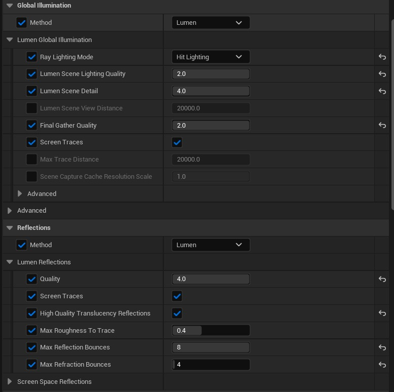

# 虚幻引擎中的 DLSS 工作流程：以生产为中心的综合指南

## 来源与状态

- 原始 URL：https://dev.epicgames.com/community/learning/tutorials/Kxxe/dlss-workflow-in-unreal-engine-production-focused-comprehensive-guide
- 原始文件：dlss-workflow-in-unreal-engine-production-focused-comprehensive-guide.origin.md
- 分段：第 1/3 段

## 运行时分类

- 类型：图文教程
- 判断：API 未识别到核心视频信号，可整理正文约 29337 字符。

## 摘要

本文介绍了在虚幻引擎中跨实时和渲染场景实施和使用 NVIDIA DLSS 的实用工作流程。它检查了编辑器视口、影片渲染队列和播放模式中的 DLSS 行为，将性能和视觉质量与 TSR AA 进行比较，同时概述了设置注意事项、观察到的限制以及制作工作流程的实用建议。

## 中文整理

### 简介和系统要求

现代实时制作越来越依赖于平衡性能和视觉保真度的技术。 NVIDIA DLSS（深度学习超级采样）就是这样一种基于 AI 的解决方案，旨在提高渲染效率，同时在要求苛刻的图形工作流程中保持高图像质量。通过利用 NVIDIA RTX 系列 GPU 中提供的 Tensor Core，DLSS 可实现智能升级，从而显着提高帧速率，而不会显着降低视觉效果。如今，该技术广泛应用于交互式游戏场景和最终场景渲染管道中。本研究分析了 NVIDIA DLSS 在使用虚幻引擎时对三个关键领域的影响。 - DLSS 对编辑器性能的影响，特别是在实时处理繁重场景时。 - DLSS 对通过电影渲染队列的最终视频渲染的质量和速度的影响。 - DLSS 对游戏体验的影响，特别是基于虚幻引擎的游戏的稳定性和流畅性。本研究的目的是评估 DLSS 在不同发动机场景中的有效性和适用性，并为其使用提供实用建议

### NVIDIA 技术简介

NVIDIA DLSS 超分辨率、光线重建、DLAA 和 NVIDIA 图像缩放是更广泛的 NVIDIA 技术生态系统的一部分，旨在提高性能和图像质量。

### NVIDIA DLSS 超分辨率 (DLSS-SR)

DLSS-SR 通过渲染更少的像素并使用 AI 将图像升级到更高分辨率来提高帧速率。它需要 NVIDIA RTX 显卡。简单来说，这是一种升级技术，可以提高 FPS，同时以较低的计算成本保持图像质量。

### NVIDIA DLSS 光线重建 (DLSS-RR)

DLSS-RR 使用人工智能通过在 NVIDIA 超级计算机上训练的神经网络取代手动调节的降噪器来提高光线追踪场景中的图像质量。它适用于所有 RTX GPU，并且需要启用超分辨率。当使用硬件加速光线追踪 (HWRT) 时，DLSS-RR 可以提供最大的优势。在实践中，它用人工智能增强的清晰度取代了传统的光线追踪模糊，以获得更清晰的结果。

### NVIDIA 深度学习抗锯齿 (DLAA)

DLAA 通过使用 AI 消除锯齿状边缘（锯齿）来提高图像质量。它需要 NVIDIA RTX GPU。与 DLSS-SR 不同，它不会提高性能，而纯粹专注于高质量抗锯齿。

### NVIDIA DLSS 4

DLSS 4 结合了多种 NVIDIA 技术，包括： - DLSS 多帧生成 - DLSS 帧生成 - DLSS 超分辨率 - DLSS 光线重建 - NVIDIA DLAA - NVIDIA Reflex 低延迟 这些系统共同提供更高的帧速率、改进的响应能力以及可超越原始分辨率的图像质量。从概念上讲，DLSS 4 代表了这些技术的统一套件。

### NVIDIA DLSS 帧生成 (DLSS-FG)

DLSS-FG 通过使用 AI 生成额外的帧来提高帧速率。它需要 GeForce RTX 40 系列 GPU。此功能主要用于游戏场景而不是离线渲染。

### NVIDIA DLSS 多帧生成 (DLSS-MFG)

DLSS-MFG 通过生成多达三个额外的 AI 生成帧来扩展帧生成，同时利用 NVIDIA Reflex 优化延迟。它可在 GeForce RTX 50 系列 GPU 上使用，代表着超越 DLSS-FG 的下一个演进。注意：DLSS-FG 和 DLSS-MFG 通过 NVIDIA Unreal Engine Streamline 插件提供。

### NVIDIA 图像缩放 (NIS)

NIS 为不支持 RTX 功能的 NVIDIA 和第三方 GPU 提供高质量的空间缩放和锐化。

### NVIDIA RTX 动态振动

RTX 动态振动通过动态调整颜色饱和度和对比度来增强感知图像清晰度。

### NVIDIA Reflex 低延迟

NVIDIA Reflex 通过同步 CPU 帧提交与 GPU 处理来降低系统延迟，从而实现更精确的帧计时。

### 快速激活指南

### 系统要求（Windows）

- Windows 10 64 位，版本 v1709 或更高版本 - 2022 年 3 月 3 日之后发布的 NVIDIA GeForce 驱动程序（例如 512.15） - 显卡：支持 DLSS 超分辨率的 NVIDIA RTX GPU（使用的示例：NVIDIA GeForce RTX 5090） - 采用 DX12 的 Unreal Engine 5.6

### 插件兼容性

这些插件与不匹配的引擎版本或使用非标准 EngineVersion 字段的自定义引擎不兼容。解决方案：使用自定义引擎构建时，删除 .uplugin 文件中的 EngineVersion 字段。

### 激活 DLSS-SR、DLAA 和 DLSS-RR

### 激活步骤

启用插件 - 在编辑器中，启用 NVIDIA DLSS 超分辨率/光线重建/DLAA 插件并重新启动编辑器。 - 如果需要 Movie Render Queue 支持，请启用 Movie Render Queue DLSS/DLAA 支持插件并重新启动。

### 在编辑器视口中启用 DLSS/DLAA

*导航至：* 项目设置 → 插件 → NVIDIA DLSS（或 NVIDIA DLSS 本地） *启用：* 在编辑器视口中启用 DLSS/DLAA（默认情况下禁用） 然后在视口选项菜单（左上）中，调整屏幕百分比： - DLSS-SR：推荐 50–67% - DLAA：100% - DLSS-RR：50–100%

### 在游戏或编辑器中启用 (PIE)

*转到：*编辑→编辑器首选项→性能*禁用：*使用PIE中的编辑器设置覆盖游戏屏幕百分比设置（默认启用）更改此设置后重新启动编辑器。使用控制台变量 (cvar) 或蓝图（推荐）。

### DLSS 预设（A、B、C…）

DLSS 插件提供基于字母的预设（A、B、C…），用于微调 DLSS-SR 和 DLSS-RR 行为。在大多数情况下，默认值就足够了。 - 可以在以下位置单独为 DLAA 和每个 DLSS 质量模式强制实施预设：编辑 → 项目设置 → NVIDIA DLSS → 常规设置 - DLSS-SR 和 DLSS-RR 的预设在项目设置和 cvar 中分开。 - 预设可能会随着新的 DLSS 版本或 OTA 更新而改变。如果需要，可以在插件设置中禁用 OTA 更新。总之： - NIS 使用明确命名的质量模式（超质量、平衡等）。 - DLSS 使用与屏幕百分比和基于字母的预设相关的质量模式。

### 通用控制台变量 (cvar)

### 适用于 DLSS / DLAA / DLSS-RR

r.NGX.启用 1 r.NGX.DLSS.启用 1

### 对于 DLSS-SR

设置：r.ScreenPercentage 66.7 要确定特定 DLSS 模式的最佳屏幕百分比，请使用蓝图函数 GetDlssModeInformation。使用蓝图功能启用 DLSS-SR（推荐而不是手动编辑 cvar）。

### DLSS 质量模式和屏幕百分比

- DLSS-SR：建议 50–67 - DLAA：设置为 100 - DLSS-RR：50–100 - 超性能模式：可以使用低于 50 的输入分辨率（例如 33）

### DLSS-RR 配置

使用光线追踪时，禁用内置降噪器： r.NGX.DLSS.denoisermode 1 r.Lumen.Reflections.BilingualFilter 0 r.Lumen.Reflections.ScreenSpaceReconstruction 0 r.Lumen.Reflections.Temporal 0 r.Shadow.Denoiser 0 注意：在 UE 5.2 和 5.3 中，在运行时更改 r.Lumen.Reflections.BilingualFilter 可能会导致崩溃。通过配置文件（例如 DefaultEngine.ini）进行设置。使用蓝图函数启用 DLSS-RR。

### 验证激活

- 检查日志中的：LogDLSS：支持 NVIDIA NGX DLSS 1 - 可以选择使用文件启用屏幕 DLSS 指示器：ngx_driver_onscreenindicator.reg（位于插件文件夹中）

### 激活 NVIDIA 图像缩放 (NIS)

### 启用插件

在编辑器中启用 NIS 插件并重新启动。

### NIS 升级（通过 cvar）

r.NIS.Enable 1 r.NIS.Upscaling 1 r.TemporalAA.Upsampling 0 r.TemporalAA.Upscaler 0 r.ScreenPercentage 50 建议的屏幕百分比值： - Ultra Quality：77 - Quality：66.667 - Balanced：59 - Performance：50 使用蓝图函数 SetNISMode（推荐）。

### NIS 锐化（独立）

r.NIS.Sharpness 0.5 在蓝图中使用 SetNISSharpness。

### 重要提示

锐化DLSS 锐化已弃用。 NVIDIA 建议使用 NIS 插件进行锐化。如果 DLSS 和 NIS 都处于活动状态，则 NIS 锐化优先。同时升标器可以启用多个空间升标器插件，但一次只能有一个处于活动状态。如果另一个空间升级器处于活动状态，NIS 会自动禁用自身。确保 UI 和游戏逻辑仅激活一个升级器以避免崩溃。 Panini 投影NIS 插件当前不支持 Panini 投影。

### 在编辑器中使用 DLSS：优化环境工作

目标：提高编辑器视口中的 FPS（尤其是在处理复杂场景时），并提高整体环境构建性能。测试环境包括： - 具有茂密植被和体积雾的大型森林场景 - 具有强烈反射和流明照明的场景 - Nanite 几何体和复杂资产 在全屏编辑器模式下使用五个预定义的相机位置进行评估。

### 测试的屏幕百分比值

使用以下屏幕百分比值： - 性能：50% - 平衡：59% - 质量：66.667% - 超质量：77% - 最大质量：100% 这些值源自官方 NIS 预设等级和质量定义。尽管 DLSS 在整个 50-100% 范围内运行，但这些点代表了常用的质量水平。

### 测量方法

无论是否启用 DLSS 系统，都会捕获每个视点的 FPS 和 GPU/Stat RHI 指标。测试配置 - 可扩展性：电影 - 材质/着色器质量：史诗 - 渲染引擎：Lumen HWRT - 渲染设置：最大化

### TSR AA 测试结果
