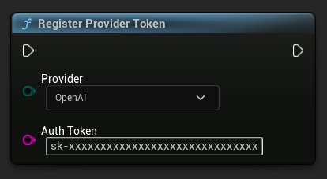
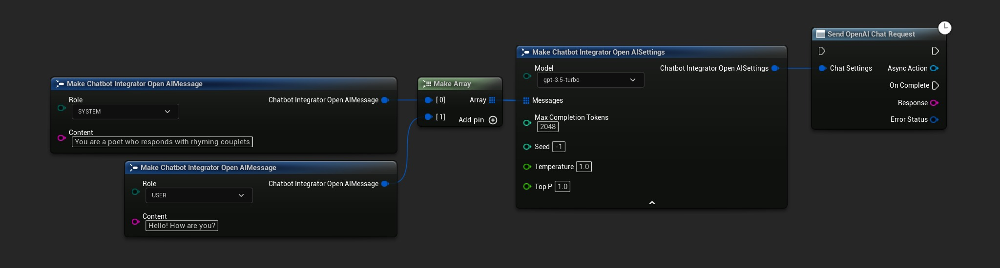
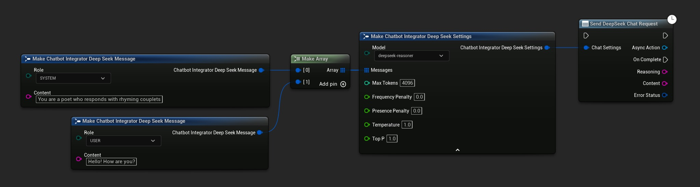
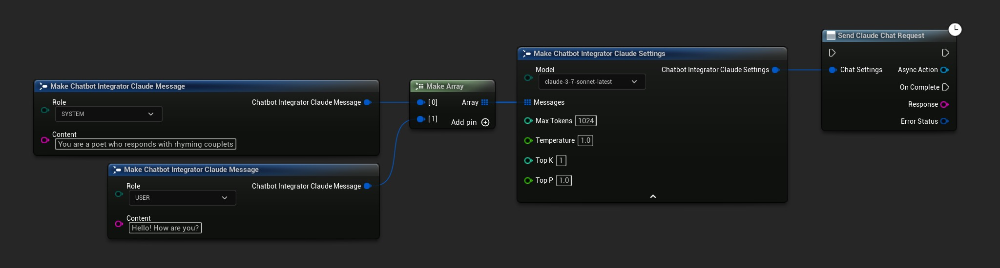
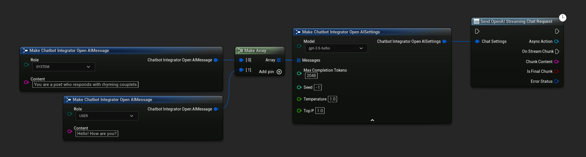
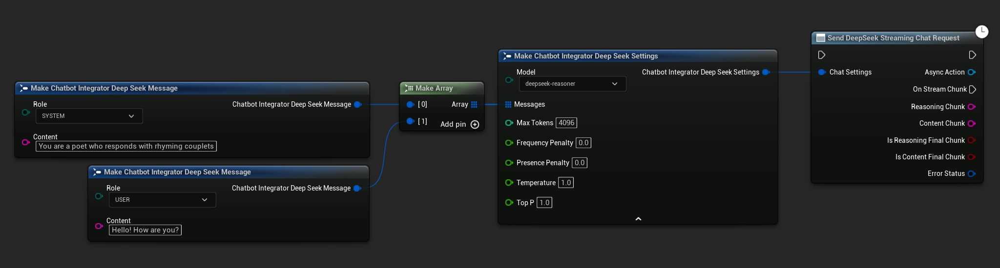
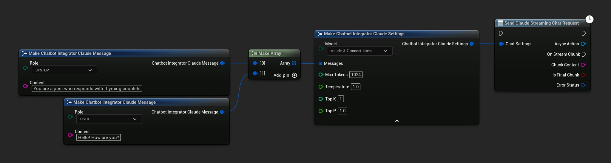
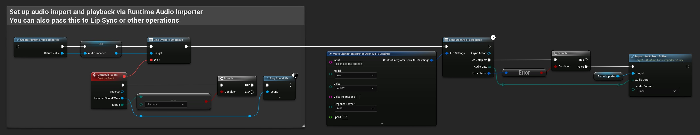
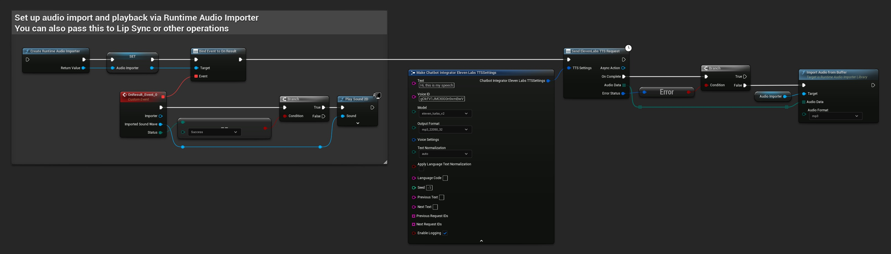
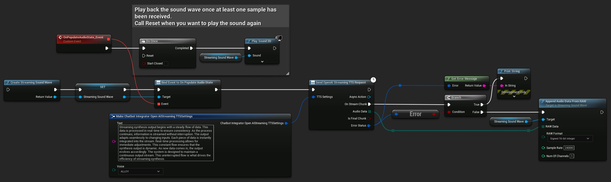

# 将虚幻引擎（ElevenLabs、OpenAI、DeepSeek、Claude）中的 AI 聊天机器人与 Cloud TTS 集成

## 来源与状态

- 原始 URL：https://dev.epicgames.com/community/learning/tutorials/vadb/fab-integrating-ai-chatbots-in-unreal-engine-elevenlabs-openai-deepseek-claude-with-cloud-tts

## 运行时分类

- 类型：图文教程
- 判断：API 未识别到核心视频信号，可整理正文约 3677 字符。

## 摘要

本教程提供了使用运行时 AI 聊天机器人集成器插件在虚幻引擎中实现 AI 驱动的对话的实用指南。了解如何连接到领先的 AI 提供商（OpenAI、Claude、DeepSeek）进行智能文本聊天，并使用 OpenAI 和 ElevenLabs TTS 实现听起来自然的语音。您将了解如何使用标准和流模式进行响应式交互、正确处理错误以及与唇形同步等其他系统集成。该教程涵盖了蓝图实现和真实示例，使您可以轻松地将对话式 AI 添加到游戏、模拟或交互式应用程序中，而无需编写代码。非常适合希望通过智能、具有语音功能的角色和助手来增强其项目的开发人员。

## 中文整理

### 介绍

**运行时 AI 聊天机器人集成器**插件使您能够将虚幻引擎项目连接到领先的 AI 平台，例如 **OpenAI**、**Claude** 和 **DeepSeek**，以及来自 **OpenAI** 和 **ElevenLabs** 的 **高质量文本转语音服务**。本教程将指导您设置插件并在项目中实现 **聊天** 和 **语音功能**。

### 先决条件

要学习本教程，您需要：

### 设置 API 凭证

在使用任何AI服务之前，您需要注册您的API凭证：

只需使用您选择的提供商和 API 密钥调用 RegisterProviderToken 函数即可。在提出任何请求之前，您需要在每个会话中执行一次此操作。

### 实现文本到文本聊天

该插件支持两种文本聊天模式：**标准响应**和**流式传输**。让我们看看这两种方法。

### 标准聊天请求

对于您可以立即收到完整回复的基本聊天功能：

这种方法非常适合较短的交互，在这种情况下等待完整的响应是可以接受的。

### 流式传输聊天请求

为了获得更动态的体验，流式传输实时提供响应块：

流式传输方法：

### 特定于提供商的功能

每个人工智能提供商都提供独特的功能：**OpenAI** **Claude** **DeepSeek**

### 添加文本转语音

使用文本转语音功能为您的聊天机器人提供语音功能，进一步推进您的 AI 集成。

### 标准 TTS 请求

对于基本的文本转语音，您将收到完整的音频文件：

### 流媒体 TTS

对于较长的语音或实时应用程序，流式 TTS 提供即时音频块：

使用流式 TTS：

### 提供商选项

**OpenAI TTS** **ElevenLabs TTS**

### 集成示例

### 创建一个会说话的 NPC

将文本聊天和 TTS 结合起来，创建可以进行智能对话的 NPC：

### 实时语音助手

构建一个可以回答玩家问题的游戏内助手：

### 与唇形同步的高级集成

为了获得更加身临其境的角色互动，请结合口型同步解决方案：

### 错误处理

始终在 AI 集成中实施正确的错误处理：检查所有回调中的 ErrorStatus 以处理潜在问题，例如：

### 取消请求

为了获得更好的用户体验，请实现取消正在进行的请求的功能：这对于以下情况特别有用：

### 结论

**[运行时 AI 聊天机器人集成器](https://www.fab.com/listings/d099709c-b984-4b79-8e17-a363fdbe68db)** 为向虚幻引擎项目添加高级 AI 功能提供了灵活的基础。通过将文本聊天与文本转语音功能相结合，您可以在游戏、模拟、培训应用程序等方面创建更加身临其境的交互式体验。对于更高级的用例，请浏览完整文档并考虑与其他插件集成，例如 **[Runtime MetaHuman Lip Sync](https://www.fab.com/listings/b514294e-e78b-4b8b-ad21-78ce51dc7e8c)** 以获得完整的角色动画。
